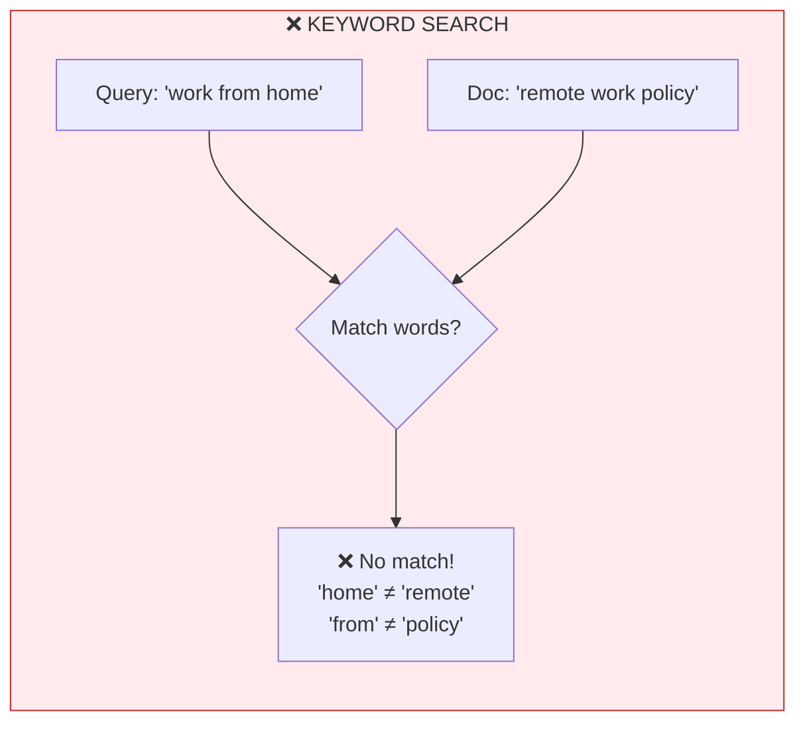
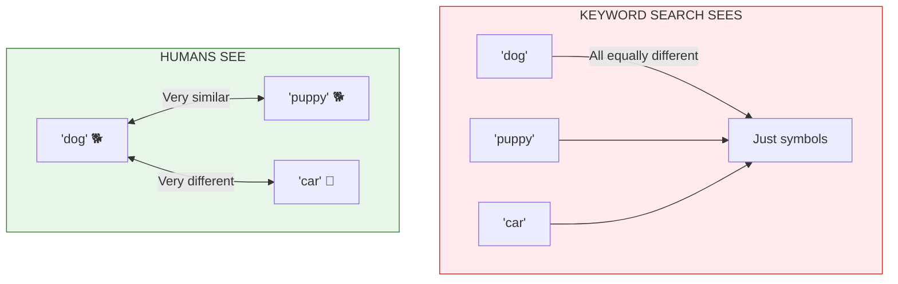
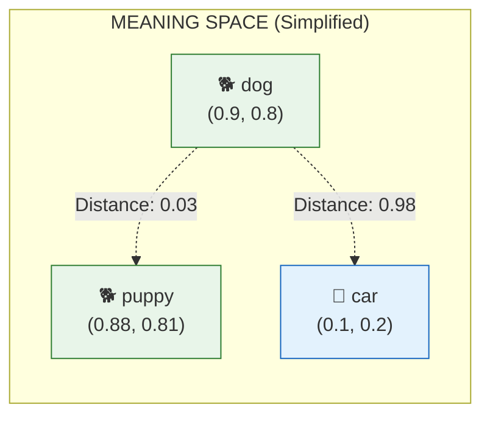

# Lesson 8.5: The Search Problem

> **Duration**: 5 min | **Section**: B - Embeddings (The Secret Sauce)

## 🎯 The Problem (3-5 min)

You're building a RAG system for your company's HR policies. User asks:

**"Can I work from home?"**

You search your documents for "work from home" and find... nothing.

But you KNOW the answer exists! Your policy document says:

> "Employees may engage in **remote work** up to 4 days per week with manager approval."

The problem: The user said **"work from home"**, but the document says **"remote work"**. They mean the same thing, but keyword search doesn't know that.

## 🔍 Under the Hood: Why Keyword Search Fails

### More Examples Where Keyword Search Fails

| User Searches For | Document Contains | Match? |
|-------------------|-------------------|--------|
| "PTO" | "vacation days" | ❌ No |
| "WFH" | "remote work" | ❌ No |
| "salary" | "compensation" | ❌ No |
| "fire someone" | "terminate employment" | ❌ No |
| "cancel subscription" | "end membership" | ❌ No |

**The words are different, but the MEANING is the same!**

## 💥 The Fundamental Limitation

Keyword search treats words as **arbitrary symbols**:
- "dog" and "puppy" → Different symbols, no connection
- "cancel" and "terminate" → Different symbols, no connection

But humans know these words are **semantically related**.

## ✅ The Solution Preview: Embeddings

What if we could convert words into **coordinates** that capture meaning?

- "dog" → a point in space
- "puppy" → nearby point (similar meaning!)
- "car" → far away point (different meaning)

Now search works on **meaning**:
- Query: "work from home" → (0.5, 0.7)
- Document: "remote work" → (0.52, 0.71)
- Distance is small → **Match found!**

**This is what embeddings do.** Next lesson, we'll dive deep.

## 🔑 Key Takeaways

- **Keyword search fails on synonyms** and paraphrases
- **Words are not just symbols** - they have meaning
- **Embeddings encode meaning as coordinates** in space
- **Similar meaning = nearby coordinates** = search match

---

## 📚 Further Reading

- [The Illustrated Word2Vec](https://jalammar.github.io/illustrated-word2vec/) - Visual introduction to embeddings
