# Lesson 8.6: What ARE Embeddings?

> **Duration**: 30 min | **Section**: B - Embeddings (The Secret Sauce)

## 🎯 The Problem (3-5 min)

We need a way to measure **how similar two pieces of text are** based on **meaning**, not just matching words.

The solution: Convert text into **numbers** that capture meaning. These numbers are called **embeddings**.

## 🧪 Try It: Your First Embedding

```python
from openai import OpenAI

client = OpenAI()

# Create an embedding for a word
response = client.embeddings.create(
    model="text-embedding-3-small",
    input="dog"
)

embedding = response.data[0].embedding

print(f"Word: 'dog'")
print(f"Dimensions: {len(embedding)}")
print(f"First 10 values: {embedding[:10]}")
```

**Output:**
```
Word: 'dog'
Dimensions: 1536
First 10 values: [0.023, -0.012, 0.089, -0.045, 0.067, ...]
```

**An embedding is a list of 1536 numbers** that represent the meaning of "dog".

## 🔍 Under the Hood: GPS for Meaning

Think of embeddings as **GPS coordinates for meaning**.

In GPS:
- Your location → (latitude, longitude)
- Nearby restaurants → nearby coordinates
- Distant cities → far coordinates

In embeddings:
- Your word → (dim1, dim2, dim3, ... dim1536)
- Similar words → nearby coordinates
- Different words → far coordinates

```mermaid
flowchart LR
    subgraph GPS["GPS ANALOGY"]
        Home["🏠 Home
        (37.7, -122.4)"]
        Coffee["☕ Coffee Shop
        (37.71, -122.41)"]
        Paris["🗼 Paris
        (48.8, 2.3)"]
        
        Home -.-> |"0.01 miles"| Coffee
        Home -.-> |"5,500 miles"| Paris
    end
    
    subgraph Embeddings["EMBEDDINGS"]
        Dog["🐕 dog
        [0.2, 0.8, -0.1, ...]"]
        Puppy["🐕 puppy
        [0.21, 0.79, -0.08, ...]"]
        Car["🚗 car
        [0.9, -0.2, 0.6, ...]"]
        
        Dog -.-> |"0.05 distance"| Puppy
        Dog -.-> |"0.89 distance"| Car
    end
    
    style Coffee fill:#E8F5E9,stroke:#2E7D32
    style Puppy fill:#E8F5E9,stroke:#2E7D32
    style Paris fill:#FFEBEE,stroke:#C62828
    style Car fill:#FFEBEE,stroke:#C62828
```



### Why 1536 Dimensions?

Meaning is complex. To capture all the nuances, we need many dimensions:

| Dimension | Might Capture... |
|-----------|------------------|
| dim_42 | Living vs non-living |
| dim_117 | Positive vs negative |
| dim_523 | Concrete vs abstract |
| dim_891 | Formal vs informal |
| ... | (We don't know exactly!) |

**1536 dimensions = 1536 different aspects of meaning.**

## 💡 The Magic: Vector Math Works on Meaning!

Famous example from the Word2Vec paper:

$$\text{king} - \text{man} + \text{woman} \approx \text{queen}$$

```python
import numpy as np
from openai import OpenAI

client = OpenAI()

def get_embedding(text):
    response = client.embeddings.create(
        model="text-embedding-3-small",
        input=text
    )
    return np.array(response.data[0].embedding)

# Get embeddings
king = get_embedding("king")
man = get_embedding("man")
woman = get_embedding("woman")

# Do vector math
result = king - man + woman

# Find what's closest to this result
queen = get_embedding("queen")
prince = get_embedding("prince")

# Calculate distances
def cosine_similarity(a, b):
    return np.dot(a, b) / (np.linalg.norm(a) * np.linalg.norm(b))

print(f"Result similarity to 'queen': {cosine_similarity(result, queen):.3f}")
print(f"Result similarity to 'prince': {cosine_similarity(result, prince):.3f}")
```

**Output:**
```
Result similarity to 'queen': 0.892
Result similarity to 'prince': 0.756
```

**The math captures the relationship between concepts!**

## 🔢 Embeddings for Sentences (Not Just Words)

Modern embedding models work on **entire sentences**:

```python
from openai import OpenAI

client = OpenAI()

texts = [
    "The dog is playing in the park",
    "A puppy runs around the garden",
    "The car is parked in the garage",
    "I need to renew my vehicle registration"
]

response = client.embeddings.create(
    model="text-embedding-3-small",
    input=texts
)

embeddings = [item.embedding for item in response.data]

# Calculate all pairwise similarities
import numpy as np

def cosine_similarity(a, b):
    return np.dot(a, b) / (np.linalg.norm(a) * np.linalg.norm(b))

print("Similarity Matrix:")
print("-" * 50)
for i, text_i in enumerate(texts):
    for j, text_j in enumerate(texts):
        sim = cosine_similarity(
            np.array(embeddings[i]),
            np.array(embeddings[j])
        )
        if i < j:  # Only show upper triangle
            print(f"'{text_i[:30]}...' vs")
            print(f"'{text_j[:30]}...'")
            print(f"Similarity: {sim:.3f}")
            print()
```

**Output:**
```
Similarity Matrix:
--------------------------------------------------
'The dog is playing in the pa...' vs
'A puppy runs around the garde...'
Similarity: 0.847  ← Very similar! (same topic)

'The dog is playing in the pa...' vs
'The car is parked in the gara...'
Similarity: 0.523  ← Less similar (different topic)

'The car is parked in the gara...' vs
'I need to renew my vehicle re...'
Similarity: 0.712  ← Somewhat similar (both about cars)
```

## 💥 Where Embeddings Can Struggle

```mermaid
flowchart TD
    subgraph Challenges["EMBEDDING CHALLENGES"]
        N["Negation:
        'I love this' vs 'I don't love this'
        ⚠️ Might be too similar!"]
        
        O["Out of domain:
        Trained on English, given Swahili
        ❌ Won't work well"]
        
        L["Long text:
        1-page document
        ⚠️ Loses nuance"]
    end
    
    style N fill:#FFF3E0,stroke:#EF6C00
    style O fill:#FFEBEE,stroke:#C62828
    style L fill:#FFF3E0,stroke:#EF6C00
```



| Challenge | Example | Impact |
|-----------|---------|--------|
| **Negation** | "I love this" ≈ "I don't love this" | Can retrieve opposite meaning |
| **Rare words** | Domain-specific jargon | Lower accuracy |
| **Long text** | Entire documents | Meaning gets averaged/diluted |

## ✅ Best Practices

```python
from openai import OpenAI

client = OpenAI()

# ✅ Good: Specific, focused text
good_input = "How do I configure remote work permissions?"

# ❌ Bad: Too long, multiple topics
bad_input = """
Chapter 1: Introduction to our company.
Our company was founded in 1995 by John Smith.
We have 500 employees across 10 offices.
Chapter 2: Remote Work Policy.
Employees may work remotely up to 4 days per week.
Chapter 3: Expense Policy.
...
"""  # Meaning gets diluted!

# ✅ Solution: Chunk long text before embedding
chunks = [
    "Our company was founded in 1995 by John Smith with 500 employees.",
    "Remote work: Employees may work remotely up to 4 days per week.",
    "Expense policy: Meals up to $50/day, hotels up to $200/night.",
]

# Embed each chunk separately
response = client.embeddings.create(
    model="text-embedding-3-small",
    input=chunks
)
```

## 🎯 Practice

Create embeddings and explore similarity:

```python
from openai import OpenAI
import numpy as np

client = OpenAI()

def get_embeddings(texts):
    response = client.embeddings.create(
        model="text-embedding-3-small",
        input=texts
    )
    return [np.array(item.embedding) for item in response.data]

def cosine_similarity(a, b):
    return np.dot(a, b) / (np.linalg.norm(a) * np.linalg.norm(b))

# Test with your own examples
texts = [
    "I want to cancel my subscription",
    "Please terminate my membership",
    "How do I end my account?",
    "What are your business hours?",
]

embeddings = get_embeddings(texts)

# Print similarity of each pair
for i in range(len(texts)):
    for j in range(i+1, len(texts)):
        sim = cosine_similarity(embeddings[i], embeddings[j])
        print(f"'{texts[i]}' vs")
        print(f"'{texts[j]}'")
        print(f"Similarity: {sim:.3f}\n")
```

**Try adding your own sentences and predict their similarities!**

## 🔑 Key Takeaways

- **Embeddings are coordinates for meaning** - 1536 numbers representing text
- **Similar meaning = nearby vectors** in embedding space
- **Vector math works on meaning** - king - man + woman ≈ queen
- **Works for sentences**, not just words
- **Chunk long text** - embedding entire documents dilutes meaning

## ❓ Common Questions

| Question | Answer |
|----------|--------|
| Why 1536 dimensions? | Model architecture choice. More dims = more nuance, but more storage. |
| Can I use fewer dimensions? | Yes! OpenAI allows reducing to 256/512 for faster search, some quality loss. |
| What's inside each dimension? | We don't know exactly! They emerge from training, not designed by humans. |
| Are embeddings language-agnostic? | Partially. Multilingual models exist, but quality varies by language. |

---

## 📚 Further Reading

- [OpenAI Embeddings Guide](https://platform.openai.com/docs/guides/embeddings) - Official documentation
- [The Illustrated Word2Vec](https://jalammar.github.io/illustrated-word2vec/) - Visual explanation
- [Understanding Embeddings](https://vickiboykis.com/what_are_embeddings/) - Deep dive blog post
