# Lesson 8.7: Creating Embeddings

> **Duration**: 25 min | **Section**: B - Embeddings (The Secret Sauce)

## 🎯 The Problem (3-5 min)

You understand what embeddings are. Now you need to actually create them for your RAG system.

Questions you'll answer:
- Which model should I use?
- How do I handle costs?
- What about batching?

## 🧪 Try It: OpenAI Embeddings API

```python
from openai import OpenAI

client = OpenAI()

# Single text
response = client.embeddings.create(
    model="text-embedding-3-small",
    input="How do I configure remote work settings?"
)

embedding = response.data[0].embedding
print(f"Dimensions: {len(embedding)}")
print(f"First 5 values: {embedding[:5]}")
print(f"Usage: {response.usage}")
```

**Output:**
```
Dimensions: 1536
First 5 values: [0.023, -0.045, 0.089, 0.012, -0.067]
Usage: Usage(prompt_tokens=8, total_tokens=8)
```

## 🔍 Under the Hood: Embedding Models Compared

```mermaid
flowchart TD
    subgraph Models["OPENAI EMBEDDING MODELS"]
        Small["text-embedding-3-small
        📏 1536 dims
        💰 $0.02/1M tokens
        ⚡ Fastest"]
        
        Large["text-embedding-3-large
        📏 3072 dims
        💰 $0.13/1M tokens
        🎯 Most accurate"]
        
        Ada["text-embedding-ada-002
        📏 1536 dims
        💰 $0.10/1M tokens
        📅 Legacy"]
    end
    
    style Small fill:#E8F5E9,stroke:#2E7D32
    style Large fill:#E3F2FD,stroke:#1565C0
    style Ada fill:#FFF3E0,stroke:#EF6C00
```



### Model Comparison

| Model | Dimensions | Price (per 1M tokens) | Best For |
|-------|-----------|----------------------|----------|
| `text-embedding-3-small` | 1536 | $0.02 | Most use cases ✓ |
| `text-embedding-3-large` | 3072 | $0.13 | Maximum accuracy |
| `text-embedding-ada-002` | 1536 | $0.10 | Legacy support |

**Recommendation**: Start with `text-embedding-3-small`. It's 5x cheaper and nearly as good.

## 📦 Batch Embedding (Multiple Texts)

```python
from openai import OpenAI

client = OpenAI()

# Embed multiple texts in one call (more efficient!)
documents = [
    "Remote Work Policy: Employees may work from home 4 days per week.",
    "Vacation Policy: All employees receive 20 days PTO per year.",
    "Expense Policy: Meals up to $50/day while traveling.",
    "Security Policy: Use VPN when accessing company resources remotely.",
    "Meeting Policy: All meetings should have an agenda shared 24 hours ahead.",
]

response = client.embeddings.create(
    model="text-embedding-3-small",
    input=documents
)

# Extract embeddings
embeddings = [item.embedding for item in response.data]

print(f"Embedded {len(embeddings)} documents")
print(f"Each has {len(embeddings[0])} dimensions")
print(f"Total tokens used: {response.usage.total_tokens}")
```

**Output:**
```
Embedded 5 documents
Each has 1536 dimensions
Total tokens used: 82
```

### Batch Limits

| Limit | Value |
|-------|-------|
| Max inputs per request | 2048 |
| Max tokens per request | 8191 per text |
| Recommended batch size | 100-500 for optimal throughput |

## 💰 Cost Optimization

```python
from openai import OpenAI
import tiktoken

client = OpenAI()

# Estimate cost BEFORE embedding
enc = tiktoken.encoding_for_model("text-embedding-3-small")

documents = [
    "Your document 1...",
    "Your document 2...",
    # ... potentially thousands
]

total_tokens = sum(len(enc.encode(doc)) for doc in documents)
cost_small = total_tokens * (0.02 / 1_000_000)
cost_large = total_tokens * (0.13 / 1_000_000)

print(f"Total tokens: {total_tokens:,}")
print(f"Cost (small): ${cost_small:.4f}")
print(f"Cost (large): ${cost_large:.4f}")
```

### Cost Examples

| Document Collection | Tokens | Small Model | Large Model |
|--------------------|--------|-------------|-------------|
| 100 short docs | ~10K | $0.0002 | $0.0013 |
| 1,000 pages | ~400K | $0.008 | $0.052 |
| 10,000 articles | ~4M | $0.08 | $0.52 |
| Full Wikipedia | ~4B | $80 | $520 |

## 🔄 Dimension Reduction

OpenAI's v3 models support **shortening** embeddings:

```python
from openai import OpenAI

client = OpenAI()

text = "What is the remote work policy?"

# Full dimensions (1536)
response_full = client.embeddings.create(
    model="text-embedding-3-small",
    input=text
)

# Reduced dimensions (256) - faster search, less storage
response_short = client.embeddings.create(
    model="text-embedding-3-small",
    input=text,
    dimensions=256  # Reduce from 1536!
)

print(f"Full: {len(response_full.data[0].embedding)} dimensions")
print(f"Short: {len(response_short.data[0].embedding)} dimensions")
print(f"Storage savings: {(1 - 256/1536)*100:.0f}%")
```

**Output:**
```
Full: 1536 dimensions
Short: 256 dimensions
Storage savings: 83%
```

### When to Reduce Dimensions

| Scenario | Recommended Dims | Tradeoff |
|----------|------------------|----------|
| Millions of docs | 256-512 | Faster search, some accuracy loss |
| Thousands of docs | 1536 (full) | Best accuracy |
| Real-time search | 256 | Speed critical |
| Legal/medical | 1536+ | Accuracy critical |

## 💥 Common Mistakes

```python
# ❌ MISTAKE 1: Not batching
for doc in documents:  # Slow! One API call per doc
    embedding = client.embeddings.create(
        model="text-embedding-3-small",
        input=doc
    )

# ✅ FIX: Batch requests
response = client.embeddings.create(
    model="text-embedding-3-small",
    input=documents  # All at once!
)

# ❌ MISTAKE 2: Embedding too-long text
huge_doc = "..." * 10000  # 40,000+ tokens
# This will fail! Max is 8191 tokens per text

# ✅ FIX: Chunk first
def chunk_text(text, max_tokens=500):
    words = text.split()
    chunks = []
    current = []
    for word in words:
        current.append(word)
        if len(' '.join(current)) > max_tokens * 4:  # Rough estimate
            chunks.append(' '.join(current))
            current = []
    if current:
        chunks.append(' '.join(current))
    return chunks

# ❌ MISTAKE 3: Not storing embeddings
# Recalculating on every query = expensive!

# ✅ FIX: Cache/persist embeddings
import json

def save_embeddings(embeddings, path):
    with open(path, 'w') as f:
        json.dump(embeddings, f)

def load_embeddings(path):
    with open(path, 'r') as f:
        return json.load(f)
```

## ✅ Complete Embedding Pipeline

```python
from openai import OpenAI
from typing import List, Dict
import json
import os

client = OpenAI()

class EmbeddingManager:
    def __init__(self, model: str = "text-embedding-3-small"):
        self.model = model
        self.cache_file = "embeddings_cache.json"
        self.cache = self._load_cache()
    
    def _load_cache(self) -> Dict:
        if os.path.exists(self.cache_file):
            with open(self.cache_file, 'r') as f:
                return json.load(f)
        return {}
    
    def _save_cache(self):
        with open(self.cache_file, 'w') as f:
            json.dump(self.cache, f)
    
    def embed(self, texts: List[str]) -> List[List[float]]:
        """Embed texts with caching"""
        # Check cache first
        new_texts = [t for t in texts if t not in self.cache]
        
        if new_texts:
            # Batch API call for uncached texts
            response = client.embeddings.create(
                model=self.model,
                input=new_texts
            )
            
            # Add to cache
            for text, item in zip(new_texts, response.data):
                self.cache[text] = item.embedding
            
            self._save_cache()
        
        # Return all embeddings (from cache)
        return [self.cache[t] for t in texts]

# Usage
manager = EmbeddingManager()

docs = [
    "Remote work policy document...",
    "Vacation policy document...",
]

embeddings = manager.embed(docs)  # First call: API
embeddings = manager.embed(docs)  # Second call: cache!
```

## 🎯 Practice

Create a complete embedding solution:

```python
from openai import OpenAI
import tiktoken

client = OpenAI()

# Your documents
documents = [
    "Policy 1: ...",
    "Policy 2: ...",
    # Add 5+ documents
]

# 1. Estimate cost
enc = tiktoken.encoding_for_model("text-embedding-3-small")
tokens = sum(len(enc.encode(d)) for d in documents)
print(f"Tokens: {tokens}, Cost: ${tokens * 0.00002:.6f}")

# 2. Create embeddings
response = client.embeddings.create(
    model="text-embedding-3-small",
    input=documents
)

# 3. Verify
for i, item in enumerate(response.data):
    print(f"Doc {i}: {len(item.embedding)} dims")

# 4. Save for later (don't re-embed!)
import json
with open("my_embeddings.json", "w") as f:
    json.dump({
        "documents": documents,
        "embeddings": [item.embedding for item in response.data]
    }, f)
```

## 🔑 Key Takeaways

- **Use `text-embedding-3-small`** for most use cases (cheap + good)
- **Batch your requests** - up to 2048 texts per API call
- **Cache embeddings** - never pay twice for the same text
- **Reduce dimensions** if you need speed over accuracy
- **Estimate costs** before embedding large collections

## ❓ Common Questions

| Question | Answer |
|----------|--------|
| How long do embeddings take? | ~100-500ms for batches of 100 texts |
| Can I embed images? | Not with OpenAI's text models. Use CLIP for multimodal. |
| Are embeddings deterministic? | Yes, same text → same embedding (for same model) |
| Should I normalize embeddings? | OpenAI's v3 models are already normalized |

---

## 📚 Further Reading

- [OpenAI Embeddings API](https://platform.openai.com/docs/guides/embeddings) - Official guide
- [tiktoken Cookbook](https://cookbook.openai.com/examples/how_to_count_tokens_with_tiktoken) - Token counting
- [Embedding Model Comparison](https://huggingface.co/blog/mteb) - MTEB leaderboard
