# Lesson 8.8: Similarity Search

> **Duration**: 30 min | **Section**: B - Embeddings (The Secret Sauce)

## 🎯 The Problem (3-5 min)

You've embedded all your documents. You've embedded the user's query. Now you need to find which documents are **most similar** to the query.

This is **similarity search** - the core of RAG retrieval.

## 🧪 Try It: Manual Similarity Search

```python
import numpy as np
from openai import OpenAI

client = OpenAI()

# Our document collection
documents = [
    "Remote work policy: Work from home up to 4 days per week.",
    "Vacation policy: 20 days PTO per year, 5 days rollover.",
    "Expense policy: Meals up to $50/day while traveling.",
    "Security policy: Use VPN when working remotely.",
    "Hiring policy: All candidates require 3 interview rounds.",
]

# Embed all documents
doc_response = client.embeddings.create(
    model="text-embedding-3-small",
    input=documents
)
doc_embeddings = [np.array(item.embedding) for item in doc_response.data]

# User's query
query = "Can I work from home?"

# Embed the query
query_response = client.embeddings.create(
    model="text-embedding-3-small",
    input=query
)
query_embedding = np.array(query_response.data[0].embedding)

# Calculate cosine similarity to each document
def cosine_similarity(a, b):
    return np.dot(a, b) / (np.linalg.norm(a) * np.linalg.norm(b))

# Find similarities
similarities = []
for i, doc_emb in enumerate(doc_embeddings):
    sim = cosine_similarity(query_embedding, doc_emb)
    similarities.append((i, documents[i], sim))

# Sort by similarity (highest first)
similarities.sort(key=lambda x: x[2], reverse=True)

# Show results
print(f"Query: '{query}'\n")
print("Results (by similarity):")
print("-" * 60)
for idx, doc, sim in similarities:
    print(f"{sim:.3f} | {doc[:50]}...")
```

**Output:**
```
Query: 'Can I work from home?'

Results (by similarity):
------------------------------------------------------------
0.892 | Remote work policy: Work from home up to 4 days...
0.734 | Security policy: Use VPN when working remotely...
0.521 | Vacation policy: 20 days PTO per year, 5 days r...
0.487 | Hiring policy: All candidates require 3 intervi...
0.465 | Expense policy: Meals up to $50/day while trave...
```

**The remote work policy is #1, security (which mentions "remotely") is #2.**

## 🔍 Under the Hood: What IS Cosine Similarity?


### The Math

For vectors $\vec{a}$ and $\vec{b}$:

$$\text{cosine\_similarity}(\vec{a}, \vec{b}) = \frac{\vec{a} \cdot \vec{b}}{||\vec{a}|| \times ||\vec{b}||}$$

Where:
- $\vec{a} \cdot \vec{b}$ = dot product (sum of element-wise multiplication)
- $||\vec{a}||$ = magnitude (length) of vector a

```python
import numpy as np

def cosine_similarity_explained(a, b):
    """Step by step cosine similarity"""
    # Step 1: Dot product
    dot_product = np.sum(a * b)  # or np.dot(a, b)
    
    # Step 2: Magnitudes
    magnitude_a = np.sqrt(np.sum(a ** 2))  # or np.linalg.norm(a)
    magnitude_b = np.sqrt(np.sum(b ** 2))
    
    # Step 3: Divide
    similarity = dot_product / (magnitude_a * magnitude_b)
    
    return similarity

# Example with simple vectors
a = np.array([1, 0])  # Points right
b = np.array([1, 0])  # Points right (same!)
c = np.array([0, 1])  # Points up (perpendicular)
d = np.array([-1, 0]) # Points left (opposite)

print(f"Same direction: {cosine_similarity_explained(a, b):.2f}")      # 1.0
print(f"Perpendicular: {cosine_similarity_explained(a, c):.2f}")       # 0.0
print(f"Opposite: {cosine_similarity_explained(a, d):.2f}")            # -1.0
```

### Why Cosine Instead of Distance?

| Metric | Formula | Problem for Embeddings |
|--------|---------|----------------------|
| Euclidean distance | $\sqrt{\sum(a_i - b_i)^2}$ | Sensitive to vector length |
| Cosine similarity | $\frac{\vec{a} \cdot \vec{b}}{\|\|a\|\| \|\|b\|\|}$ | ✅ Only cares about direction |

**Cosine ignores magnitude** - a long document and short query can still match if they point the same direction!

## 📊 Top-K Retrieval

```python
from typing import List, Tuple
import numpy as np

class SimpleVectorSearch:
    def __init__(self, documents: List[str], embeddings: List[np.ndarray]):
        self.documents = documents
        self.embeddings = np.array(embeddings)
    
    def search(self, query_embedding: np.ndarray, top_k: int = 3) -> List[Tuple[str, float]]:
        """Find top_k most similar documents"""
        # Calculate all similarities at once (vectorized)
        similarities = np.dot(self.embeddings, query_embedding)
        
        # Get indices of top_k highest scores
        top_indices = np.argsort(similarities)[-top_k:][::-1]
        
        # Return documents with scores
        results = [
            (self.documents[i], float(similarities[i]))
            for i in top_indices
        ]
        return results

# Usage
searcher = SimpleVectorSearch(documents, doc_embeddings)
results = searcher.search(query_embedding, top_k=3)

print("Top 3 results:")
for doc, score in results:
    print(f"[{score:.3f}] {doc}")
```

### Choosing Top-K

| top_k | Pros | Cons |
|-------|------|------|
| 1 | Fastest, least tokens | Might miss relevant info |
| 3-5 | Good balance | Standard choice |
| 10+ | High recall | More noise, more tokens |

```mermaid
flowchart LR
    subgraph Tradeoff["TOP-K TRADEOFF"]
        Low["k=1
        🎯 Very focused
        ⚠️ Might miss info"]
        
        Med["k=3-5
        ✅ Balanced
        📊 Standard choice"]
        
        High["k=10+
        📚 High coverage
        🗑️ More noise"]
    end
    
    style Med fill:#E8F5E9,stroke:#2E7D32
```



## 🚀 Optimized Search with NumPy

For larger collections, use vectorized operations:

```python
import numpy as np
from typing import List, Tuple

def fast_similarity_search(
    query_embedding: np.ndarray,
    document_embeddings: np.ndarray,
    documents: List[str],
    top_k: int = 5,
    threshold: float = 0.0
) -> List[Tuple[str, float]]:
    """
    Efficient similarity search using NumPy.
    
    Args:
        query_embedding: 1D array of query embedding
        document_embeddings: 2D array (n_docs x dims)
        documents: List of document texts
        top_k: Number of results to return
        threshold: Minimum similarity score
    """
    # Normalize query (if not already)
    query_norm = query_embedding / np.linalg.norm(query_embedding)
    
    # Calculate all similarities at once
    # For normalized vectors, dot product = cosine similarity
    similarities = np.dot(document_embeddings, query_norm)
    
    # Apply threshold
    valid_mask = similarities >= threshold
    valid_indices = np.where(valid_mask)[0]
    valid_similarities = similarities[valid_mask]
    
    # Get top_k from valid results
    if len(valid_indices) == 0:
        return []
    
    top_k = min(top_k, len(valid_indices))
    top_local_indices = np.argsort(valid_similarities)[-top_k:][::-1]
    top_indices = valid_indices[top_local_indices]
    
    return [
        (documents[i], float(similarities[i]))
        for i in top_indices
    ]

# Benchmark
import time

# Create fake large collection
n_docs = 10000
dims = 1536
fake_embeddings = np.random.randn(n_docs, dims)
fake_embeddings = fake_embeddings / np.linalg.norm(fake_embeddings, axis=1, keepdims=True)
fake_docs = [f"Document {i}" for i in range(n_docs)]
fake_query = np.random.randn(dims)

start = time.time()
for _ in range(100):
    results = fast_similarity_search(fake_query, fake_embeddings, fake_docs, top_k=5)
elapsed = time.time() - start

print(f"10,000 docs, 100 searches: {elapsed*1000:.1f}ms")
print(f"Per search: {elapsed*10:.2f}ms")
```

**Output:**
```
10,000 docs, 100 searches: 234.5ms
Per search: 2.34ms
```

**That's 2ms per search across 10,000 documents with pure NumPy!**

## 💥 Where It Breaks: Search Accuracy Issues


**Solutions (covered in later lessons):**
- Hybrid search (combine semantic + keyword)
- Reranking (second-stage scoring)
- Higher top_k with filtering

## 🎯 Practice

Build a complete search system:

```python
from openai import OpenAI
import numpy as np

client = OpenAI()

# Create your knowledge base
knowledge_base = [
    "How to reset your password: Go to Settings > Security > Reset Password",
    "Billing questions: Contact billing@company.com or call 1-800-BILLING",
    "Refund policy: Full refunds within 30 days, partial refunds within 60 days",
    "Technical support: Available 24/7 via chat or email support@company.com",
    "Account deletion: Submit request at company.com/delete-account",
]

# Embed all documents
response = client.embeddings.create(
    model="text-embedding-3-small",
    input=knowledge_base
)
kb_embeddings = np.array([item.embedding for item in response.data])

def search(query: str, top_k: int = 3):
    # Embed query
    q_response = client.embeddings.create(
        model="text-embedding-3-small",
        input=query
    )
    q_embedding = np.array(q_response.data[0].embedding)
    
    # Search
    similarities = np.dot(kb_embeddings, q_embedding)
    top_indices = np.argsort(similarities)[-top_k:][::-1]
    
    print(f"\nQuery: '{query}'")
    print("-" * 50)
    for i in top_indices:
        print(f"[{similarities[i]:.3f}] {knowledge_base[i]}")

# Test queries
search("I forgot my password")
search("How do I get my money back?")
search("Delete my account please")
```

## 🔑 Key Takeaways

- **Cosine similarity measures direction**, not magnitude
- **Higher score = more similar** (1.0 = identical, 0 = unrelated)
- **NumPy vectorization** makes search fast even for 10K+ docs
- **Top-k = 3-5** is a good starting point
- **Threshold filtering** removes irrelevant results

## ❓ Common Questions

| Question | Answer |
|----------|--------|
| Why not Euclidean distance? | Cosine is invariant to vector length, which matters for variable-length texts |
| What's a "good" similarity score? | Depends on use case. 0.7+ is usually strong, 0.5+ is moderate |
| How many docs can I search? | NumPy handles ~100K easily. Beyond that, use vector databases |
| Can I search in real-time? | Yes! 10K docs in ~2ms is fast enough for most apps |

---

## 📚 Further Reading

- [Cosine Similarity Explained](https://www.machinelearningplus.com/nlp/cosine-similarity/) - Mathematical deep dive
- [NumPy for Machine Learning](https://numpy.org/doc/stable/user/quickstart.html) - Vectorization basics
- [Vector Search at Scale](https://www.pinecone.io/learn/vector-search-basics/) - When you need more than NumPy
