# Lesson 8.9: Embeddings Q&A

> **Duration**: 10 min | **Section**: B - Embeddings (The Secret Sauce)

## 🎯 The Purpose

Before building RAG from scratch, let's solidify your understanding of embeddings with common questions.

## 🧠 Draw It From Memory

Before reading, sketch how similarity search works:

```
Query Text → ??? → ??? → Top-K Results
```

Check against this:


## ❓ Common Questions

### Q1: Why 1536 dimensions? What do they mean?


**Key insight**: Unlike hand-crafted features, embedding dimensions are **learned**. We can't interpret individual dimensions, but together they capture meaning.

---

### Q2: Can I visualize embeddings?

Yes, using dimensionality reduction:

```python
import numpy as np
from sklearn.manifold import TSNE
import matplotlib.pyplot as plt
from openai import OpenAI

client = OpenAI()

# Sample texts from different categories
texts = [
    # Tech
    "Python programming tutorial",
    "JavaScript framework comparison",
    "Database optimization tips",
    # Food
    "Best pizza recipes",
    "Italian cooking techniques",
    "Homemade pasta guide",
    # Sports
    "Basketball training drills",
    "Football game highlights",
    "Tennis serve technique",
]

# Get embeddings
response = client.embeddings.create(
    model="text-embedding-3-small",
    input=texts
)
embeddings = np.array([item.embedding for item in response.data])

# Reduce to 2D for visualization
tsne = TSNE(n_components=2, random_state=42, perplexity=3)
embeddings_2d = tsne.fit_transform(embeddings)

# Plot
plt.figure(figsize=(10, 8))
colors = ['blue']*3 + ['red']*3 + ['green']*3
for i, txt in enumerate(texts):
    plt.scatter(embeddings_2d[i, 0], embeddings_2d[i, 1], c=colors[i], s=100)
    plt.annotate(txt[:20], (embeddings_2d[i, 0], embeddings_2d[i, 1]))

plt.title("Embeddings Visualization (t-SNE)")
plt.show()
```

**You'll see clusters** - tech topics together, food together, sports together!

---

### Q3: Cosine vs Euclidean vs Dot Product?

| Metric | Formula | Best For |
|--------|---------|----------|
| **Cosine** | $\frac{a \cdot b}{\|a\| \|b\|}$ | Comparing meaning (ignores length) |
| **Euclidean** | $\sqrt{\sum(a_i - b_i)^2}$ | When magnitude matters |
| **Dot Product** | $a \cdot b$ | Already-normalized vectors |

```python
import numpy as np

a = np.array([1, 2, 3])
b = np.array([2, 4, 6])  # Same direction, 2x length

# Cosine: Same direction = 1.0
cosine = np.dot(a, b) / (np.linalg.norm(a) * np.linalg.norm(b))
print(f"Cosine: {cosine:.3f}")  # 1.0

# Euclidean: Different magnitudes = distance > 0
euclidean = np.linalg.norm(a - b)
print(f"Euclidean: {euclidean:.3f}")  # 3.74

# Dot product: Depends on magnitude
dot = np.dot(a, b)
print(f"Dot product: {dot}")  # 28
```

**For embeddings, use cosine** - OpenAI's embeddings are normalized, so dot product also works.

---

### Q4: What about multilingual text?

OpenAI's embedding models support **100+ languages**:

```python
from openai import OpenAI
import numpy as np

client = OpenAI()

texts = [
    "How do I reset my password?",     # English
    "Comment réinitialiser mon mot de passe?",  # French
    "¿Cómo restablezco mi contraseña?",  # Spanish
    "What's the weather today?",       # English (different topic)
]

response = client.embeddings.create(
    model="text-embedding-3-small",
    input=texts
)
embeddings = [np.array(item.embedding) for item in response.data]

def cosine_sim(a, b):
    return np.dot(a, b) / (np.linalg.norm(a) * np.linalg.norm(b))

print("Cross-lingual similarity:")
print(f"English-French (same meaning): {cosine_sim(embeddings[0], embeddings[1]):.3f}")
print(f"English-Spanish (same meaning): {cosine_sim(embeddings[0], embeddings[2]):.3f}")
print(f"English-English (different topic): {cosine_sim(embeddings[0], embeddings[3]):.3f}")
```

**Output:**
```
Cross-lingual similarity:
English-French (same meaning): 0.912
English-Spanish (same meaning): 0.908
English-English (different topic): 0.521
```

**Same meaning in different languages = high similarity!**

---

### Q5: When do embeddings fail?

```mermaid
flowchart TD
    subgraph Failures["EMBEDDING LIMITATIONS"]
        F1["Negation
        'I love this' ≈ 'I hate this'
        ⚠️ Context not captured well"]
        
        F2["Rare terminology
        Domain jargon may not embed well
        if rare in training data"]
        
        F3["Long text
        Embedding averages meaning
        ↳ Loses specific details"]
        
        F4["Temporal references
        'Latest version' doesn't know
        what's current"]
    end
    
    style F1 fill:#FFEBEE,stroke:#C62828
    style F2 fill:#FFF3E0,stroke:#EF6C00
    style F3 fill:#FFF3E0,stroke:#EF6C00
    style F4 fill:#FFF3E0,stroke:#EF6C00
```



**Mitigation strategies:**
- Use hybrid search (embeddings + keywords)
- Keep chunks small (~500 tokens)
- Add metadata for filtering

---

### Q6: How do I choose an embedding model?

| Model | Dims | Price | Quality | Use Case |
|-------|------|-------|---------|----------|
| **text-embedding-3-small** | 1536 | $0.02/1M | ★★★★☆ | Default choice |
| **text-embedding-3-large** | 3072 | $0.13/1M | ★★★★★ | Max accuracy |
| **Cohere embed-v3** | 1024 | $0.10/1M | ★★★★★ | Multilingual |
| **BGE (local)** | 1024 | Free | ★★★★☆ | Privacy-sensitive |
| **all-MiniLM (local)** | 384 | Free | ★★★☆☆ | Speed-critical |

**Decision tree:**


---

## 🎯 Practice: Mental Model Check

Answer without looking:

1. **What does cosine similarity measure?**
   <details>
   <summary>Answer</summary>
   The angle between two vectors (direction similarity), not magnitude.
   </details>

2. **Why 1536 dimensions?**
   <details>
   <summary>Answer</summary>
   Architecture choice. More dims = more nuance but more storage/compute.
   </details>

3. **Can embeddings understand "WFH" = "work from home"?**
   <details>
   <summary>Answer</summary>
   Yes! Semantic search finds meaning, not just exact words.
   </details>

4. **What's a "good" similarity score?**
   <details>
   <summary>Answer</summary>
   Depends on use case, but 0.7+ is usually strong, 0.5+ is moderate.
   </details>

5. **When should you NOT use embeddings?**
   <details>
   <summary>Answer</summary>
   - When exact keyword match is critical
   - For very rare/specialized terminology
   - When negation matters ("don't" vs "do")
   </details>

## � Common Pitfalls

| Pitfall | Why It Happens | Fix |
|---------|---------------|-----|
| Mixing embedding models | Using different models for indexing vs query | Always use the same embedding model for both |
| Ignoring negation | "I love this" ≈ "I don't love this" | Use hybrid search; keywords catch negation better |
| Chunks too long | Trying to preserve context | Keep chunks ~500 tokens; embedding averages lose detail |
| Not normalizing vectors | Assuming all models normalize | Check model docs; use cosine similarity to be safe |
| Expecting exact match | Semantic search for IDs/codes | Use keyword search for exact terms; hybrid for both |
| Expensive embeddings | Calling API for every query | Cache embeddings; batch similar queries |

## �🔑 Key Takeaways

- **Dimensions are learned**, not hand-designed - we can't interpret individual dims
- **Cosine similarity** is standard because it ignores magnitude
- **Multilingual works** - same meaning across languages = high similarity
- **Embeddings fail on** negation, rare terms, and very long text
- **Start with text-embedding-3-small** - upgrade if needed

---

## � What's Next?

**Lesson 10**: [The Manual Way](./Lesson-10-The-Manual-Way.md) - Build RAG from scratch before using frameworks.

---

## �📚 Further Reading

- [MTEB Leaderboard](https://huggingface.co/spaces/mteb/leaderboard) - Compare embedding models
- [t-SNE Explained](https://distill.pub/2016/misread-tsne/) - Visualization techniques
- [Multilingual Embeddings](https://www.sbert.net/examples/training/multilingual/README.html) - Cross-lingual search
