# Lesson 8.10: The Manual Way

> **Duration**: 5 min | **Section**: C - Build RAG From Scratch

## 🎯 The Problem (3-5 min)

You've learned the concepts:
- **Embeddings** convert text to vectors
- **Similarity search** finds relevant documents
- **RAG** injects context into prompts

Now we're going to build RAG **from scratch** - no LangChain, no vector databases, just Python + OpenAI.

## 🧪 Why Build It Manually First?

```mermaid
flowchart LR
    subgraph Skip["❌ IF YOU SKIP THIS"]
        L["Use LangChain"] --> M["It's magic!"]
        M --> B["Something breaks"]
        B --> C["No idea how to fix it"]
    end
    
    subgraph Manual["✅ IF YOU BUILD MANUALLY"]
        U["Understand each step"] --> F["Use LangChain"]
        F --> X["Something breaks"]
        X --> D["Debug with understanding"]
    end
    
    style Skip fill:#FFEBEE,stroke:#C62828
    style Manual fill:#E8F5E9,stroke:#2E7D32
```



**The goal**: After this section, you could build your own RAG framework if you wanted to.

## 📋 What We'll Build

Over the next 6 lessons, we'll implement:

| Lesson | What We Build | Without Frameworks |
|--------|--------------|-------------------|
| 8.11 | Document Loading | `open()`, PyPDF |
| 8.12 | Chunking | Custom text splitter |
| 8.13 | Embedding Chunks | OpenAI API |
| 8.14 | Similarity Search | NumPy |
| 8.15 | RAG Pipeline | Combine everything |
| 8.16 | Q&A | Reflect on what we learned |

## 🔍 The Architecture We're Building

```mermaid
flowchart TD
    subgraph Indexing["INDEXING (Lessons 8.11-8.13)"]
        F["📄 Files"]
        F --> L["Load"]
        L --> C["Chunk"]
        C --> E["Embed"]
        E --> S["Store (Python list!)"]
    end
    
    subgraph Query["QUERY (Lessons 8.14-8.15)"]
        Q["❓ Question"]
        Q --> QE["Embed"]
        QE --> Search["Search"]
        S --> Search
        Search --> R["Top-K Chunks"]
        R --> P["Build Prompt"]
        P --> LLM["LLM"]
        LLM --> A["📝 Answer"]
    end
    
    style S fill:#E8F5E9,stroke:#2E7D32
    style A fill:#E8F5E9,stroke:#2E7D32
```



## 💡 The Key Insight

**Vector databases like ChromaDB, Pinecone, pgvector are just optimized versions of what we're about to build.**

Under the hood, they all do:
1. Store embeddings (we'll use a Python list)
2. Calculate similarity (we'll use NumPy)
3. Return top-k results (we'll sort and slice)

By building manually, you'll understand:
- What "indexing" really means
- Why chunk size matters
- How retrieval actually works
- Where performance bottlenecks come from

## 🎯 Let's Start!

In the next lesson, we load documents into Python.

**What you'll need:**
- Python 3.9+
- OpenAI API key
- A few sample documents (PDFs or text files)

```python
# Quick check - do you have these?
from openai import OpenAI  # pip install openai
import numpy as np         # pip install numpy

client = OpenAI()  # Needs OPENAI_API_KEY env var

print("✅ Ready to build RAG from scratch!")
```

## 🔑 Key Takeaways

- **Build manually before using frameworks** - understand what's happening
- **RAG is just: Load → Chunk → Embed → Store → Search → Generate**
- **No magic** - vector DBs are optimized versions of simple operations
- **Debugging becomes possible** when you understand internals

---

## 📚 Further Reading

- [Build a RAG from Scratch (OpenAI Cookbook)](https://cookbook.openai.com/examples/rag_from_scratch) - Similar approach
