# Lesson 8.11: Document Loading

> **Duration**: 25 min | **Section**: C - Build RAG From Scratch

## 🎯 The Problem (3-5 min)

You have documents in various formats:
- `.txt` files
- `.pdf` files
- `.md` files
- Maybe even `.docx` or `.html`

Before you can embed them, you need to get the **text content** into Python.

## 🧪 Try It: Loading Text Files

```python
def load_text_file(file_path: str) -> str:
    """Load a plain text file."""
    with open(file_path, 'r', encoding='utf-8') as f:
        return f.read()

# Example
content = load_text_file('company_policy.txt')
print(f"Loaded {len(content)} characters")
print(f"Preview: {content[:200]}...")
```

**That's it for `.txt`!** Now let's handle PDFs.

## 🔍 Under the Hood: PDF Loading

PDFs are more complex - they contain:
- Formatted text (fonts, sizes)
- Images
- Tables
- Metadata

We need to **extract just the text**.


### Using PyPDF

```python
# pip install pypdf

from pypdf import PdfReader

def load_pdf(file_path: str) -> str:
    """Load a PDF file and extract text."""
    reader = PdfReader(file_path)
    
    text_parts = []
    for page_num, page in enumerate(reader.pages):
        text = page.extract_text()
        if text:
            text_parts.append(f"[Page {page_num + 1}]\n{text}")
    
    return "\n\n".join(text_parts)

# Example
content = load_pdf('employee_handbook.pdf')
print(f"Loaded {len(content)} characters from {len(PdfReader('employee_handbook.pdf').pages)} pages")
```

**Output:**
```
Loaded 45,234 characters from 50 pages
```

## 📁 Loading Multiple Files

Real RAG systems have many documents:

```python
import os
from pathlib import Path
from typing import List, Dict

def load_documents(directory: str) -> List[Dict]:
    """
    Load all supported documents from a directory.
    
    Returns:
        List of dicts with 'content', 'source', and 'metadata'
    """
    documents = []
    path = Path(directory)
    
    for file_path in path.rglob('*'):  # Recursive!
        if file_path.suffix.lower() == '.txt':
            content = load_text_file(str(file_path))
        elif file_path.suffix.lower() == '.pdf':
            content = load_pdf(str(file_path))
        elif file_path.suffix.lower() == '.md':
            content = load_text_file(str(file_path))  # Markdown is text
        else:
            continue  # Skip unsupported formats
        
        documents.append({
            'content': content,
            'source': str(file_path),
            'metadata': {
                'filename': file_path.name,
                'extension': file_path.suffix,
                'size_bytes': file_path.stat().st_size,
            }
        })
    
    return documents

# Usage
docs = load_documents('./company_docs/')
print(f"Loaded {len(docs)} documents")
for doc in docs:
    print(f"  - {doc['metadata']['filename']}: {len(doc['content'])} chars")
```

**Output:**
```
Loaded 5 documents
  - remote_policy.pdf: 12,345 chars
  - vacation_policy.txt: 3,456 chars
  - expense_guide.pdf: 8,901 chars
  - security_handbook.pdf: 15,678 chars
  - faq.md: 5,432 chars
```

## 💥 Where It Breaks: PDF Edge Cases

```mermaid
flowchart TD
    subgraph Issues["PDF LOADING ISSUES"]
        I1["Scanned PDFs
        (images, not text)
        → Need OCR"]
        
        I2["Tables
        Columns become jumbled
        → Need special handling"]
        
        I3["Multi-column layouts
        Reading order confused
        → Page structure matters"]
        
        I4["Encrypted PDFs
        Can't extract text
        → Need password"]
    end
    
    style I1 fill:#FFEBEE,stroke:#C62828
    style I2 fill:#FFF3E0,stroke:#EF6C00
    style I3 fill:#FFF3E0,stroke:#EF6C00
    style I4 fill:#FFEBEE,stroke:#C62828
```



### Handling Scanned PDFs (OCR)

```python
# pip install pytesseract pdf2image
# Also need: brew install tesseract (macOS) or apt install tesseract-ocr (Linux)

from pdf2image import convert_from_path
import pytesseract

def load_scanned_pdf(file_path: str) -> str:
    """Load a scanned PDF using OCR."""
    # Convert PDF pages to images
    images = convert_from_path(file_path)
    
    text_parts = []
    for i, image in enumerate(images):
        # OCR each page
        text = pytesseract.image_to_string(image)
        text_parts.append(f"[Page {i + 1}]\n{text}")
    
    return "\n\n".join(text_parts)

# Use regular extraction first, fall back to OCR if empty
def smart_load_pdf(file_path: str) -> str:
    """Try regular extraction, fall back to OCR."""
    content = load_pdf(file_path)
    
    if len(content.strip()) < 100:  # Probably scanned
        print(f"Low text content, trying OCR...")
        content = load_scanned_pdf(file_path)
    
    return content
```

## ✅ Complete Document Loader

```python
import os
from pathlib import Path
from typing import List, Dict, Optional
from dataclasses import dataclass
from pypdf import PdfReader

@dataclass
class Document:
    content: str
    source: str
    page_number: Optional[int] = None
    metadata: Dict = None
    
    def __post_init__(self):
        if self.metadata is None:
            self.metadata = {}

class DocumentLoader:
    """Load documents from various file formats."""
    
    def __init__(self, directory: str):
        self.directory = Path(directory)
        self.supported_extensions = {'.txt', '.pdf', '.md'}
    
    def load(self) -> List[Document]:
        """Load all documents from the directory."""
        documents = []
        
        for file_path in self.directory.rglob('*'):
            if file_path.suffix.lower() not in self.supported_extensions:
                continue
            
            if file_path.is_file():
                docs = self._load_file(file_path)
                documents.extend(docs)
        
        return documents
    
    def _load_file(self, file_path: Path) -> List[Document]:
        """Load a single file, returning documents (one per page for PDFs)."""
        ext = file_path.suffix.lower()
        
        if ext == '.pdf':
            return self._load_pdf(file_path)
        else:
            return [self._load_text(file_path)]
    
    def _load_text(self, file_path: Path) -> Document:
        """Load a text file."""
        with open(file_path, 'r', encoding='utf-8') as f:
            content = f.read()
        
        return Document(
            content=content,
            source=str(file_path),
            metadata={'filename': file_path.name}
        )
    
    def _load_pdf(self, file_path: Path) -> List[Document]:
        """Load a PDF, returning one document per page."""
        reader = PdfReader(str(file_path))
        documents = []
        
        for page_num, page in enumerate(reader.pages):
            text = page.extract_text()
            if text and text.strip():
                documents.append(Document(
                    content=text,
                    source=str(file_path),
                    page_number=page_num + 1,
                    metadata={
                        'filename': file_path.name,
                        'page': page_num + 1,
                        'total_pages': len(reader.pages)
                    }
                ))
        
        return documents

# Usage
loader = DocumentLoader('./company_docs/')
documents = loader.load()

print(f"Loaded {len(documents)} document chunks")
for doc in documents[:3]:
    print(f"  Source: {doc.source}")
    print(f"  Page: {doc.page_number}")
    print(f"  Content preview: {doc.content[:100]}...")
    print()
```

## 🎯 Practice

Create a document loader for your own files:

```python
# 1. Create a test directory with some files
import os
os.makedirs('test_docs', exist_ok=True)

# Create a sample text file
with open('test_docs/policy.txt', 'w') as f:
    f.write("""
    Remote Work Policy
    
    All employees may work from home up to 4 days per week.
    Core hours are 10am to 3pm local time.
    Manager approval is required for full-time remote work.
    """)

# Create another file
with open('test_docs/faq.md', 'w') as f:
    f.write("""
    # Frequently Asked Questions
    
    ## How do I request vacation?
    Submit a request through the HR portal at least 2 weeks in advance.
    
    ## What's the expense limit for meals?
    $50 per day while traveling on company business.
    """)

# 2. Load them
loader = DocumentLoader('test_docs')
docs = loader.load()

# 3. Verify
for doc in docs:
    print(f"Loaded: {doc.metadata['filename']}")
    print(f"Content length: {len(doc.content)} chars")
    print()
```

## 🔑 Key Takeaways

- **Text files are easy** - just `open()` and `read()`
- **PDFs need libraries** - PyPDF for text, OCR for scanned
- **Track metadata** - source file, page number, etc. (crucial for citations!)
- **Handle edge cases** - scanned PDFs, tables, encoding issues
- **One document per page** for PDFs gives better granularity

## ❓ Common Questions

| Question | Answer |
|----------|--------|
| What about Word docs? | Use `python-docx` library |
| What about HTML? | Use `BeautifulSoup` to extract text |
| Should I strip formatting? | Yes, embeddings only see plain text |
| What about very large files? | Load and chunk in streams (next lesson!) |

---

## 📚 Further Reading

- [PyPDF Documentation](https://pypdf.readthedocs.io/) - PDF handling
- [Tesseract OCR](https://github.com/tesseract-ocr/tesseract) - For scanned documents
- [python-docx](https://python-docx.readthedocs.io/) - Word document parsing
