# Lesson 8.12: Chunking

> **Duration**: 25 min | **Section**: C - Build RAG From Scratch

## 🎯 The Problem (3-5 min)

You've loaded a 50-page employee handbook into Python. Now what?

If you embed the entire document as one vector:
- ❌ The embedding will be a **vague average** of all topics
- ❌ When someone asks about "vacation policy", you retrieve the ENTIRE handbook
- ❌ Context window fills up with irrelevant pages

The solution: **Split documents into smaller chunks** that can be individually retrieved.

## 🧪 Try It: Naive Chunking

```python
def naive_chunk(text: str, chunk_size: int = 500) -> list[str]:
    """Split text every N characters."""
    chunks = []
    for i in range(0, len(text), chunk_size):
        chunks.append(text[i:i + chunk_size])
    return chunks

# Example
document = """
Chapter 1: Remote Work Policy

All employees may work from home up to 4 days per week. This policy
applies to all full-time employees who have completed their probationary
period. Managers must approve remote work arrangements in advance.

Chapter 2: Core Hours

Regardless of location, all employees must be available during core 
hours: 10am to 3pm local time. This ensures overlap for team meetings
and collaboration. Exceptions require VP-level approval.
"""

chunks = naive_chunk(document, chunk_size=200)
for i, chunk in enumerate(chunks):
    print(f"Chunk {i}: '{chunk[:50]}...'")
```

**Output:**
```
Chunk 0: 'Chapter 1: Remote Work Policy

All employees may...'
Chunk 1: 'probationary
period. Managers must approve remote...'
Chunk 2: 'Chapter 2: Core Hours

Regardless of location...'
```

**Problem**: Chunk 1 starts mid-sentence! The word "probationary" is split from its context.

## 🔍 Under the Hood: Why Chunking Matters

```mermaid
flowchart TD
    subgraph Bad["❌ BAD CHUNKING"]
        B1["Chunk 1: '...completed their proba'"]
        B2["Chunk 2: 'tionary period. Managers...'"]
        Note1["Word 'probationary' is split!"]
    end
    
    subgraph Good["✅ GOOD CHUNKING"]
        G1["Chunk 1: 'All employees may work from home up to 4 days per week.'"]
        G2["Chunk 2: 'This policy applies to all full-time employees...'"]
        Note2["Complete sentences, meaningful units"]
    end
    
    style Bad fill:#FFEBEE,stroke:#C62828
    style Good fill:#E8F5E9,stroke:#2E7D32
```



### Chunking Goals

| Goal | Why |
|------|-----|
| **Semantic coherence** | Each chunk should be a meaningful unit |
| **Optimal size** | Big enough for context, small enough to be specific |
| **Overlap** | Handle questions that span chunk boundaries |

## ✅ Better Chunking: Sentence-Aware

```python
import re

def sentence_aware_chunk(
    text: str, 
    chunk_size: int = 500,
    overlap: int = 50
) -> list[str]:
    """
    Split text at sentence boundaries with overlap.
    """
    # Split into sentences
    sentences = re.split(r'(?<=[.!?])\s+', text)
    
    chunks = []
    current_chunk = []
    current_length = 0
    
    for sentence in sentences:
        sentence_length = len(sentence)
        
        if current_length + sentence_length > chunk_size and current_chunk:
            # Save current chunk
            chunks.append(' '.join(current_chunk))
            
            # Start new chunk with overlap (keep last few sentences)
            overlap_text = ' '.join(current_chunk[-2:])  # Keep last 2 sentences
            if len(overlap_text) <= overlap:
                current_chunk = current_chunk[-2:]
                current_length = len(overlap_text)
            else:
                current_chunk = []
                current_length = 0
        
        current_chunk.append(sentence)
        current_length += sentence_length
    
    # Don't forget the last chunk
    if current_chunk:
        chunks.append(' '.join(current_chunk))
    
    return chunks

# Example
chunks = sentence_aware_chunk(document, chunk_size=300, overlap=50)
for i, chunk in enumerate(chunks):
    print(f"Chunk {i} ({len(chunk)} chars):")
    print(f"  {chunk[:80]}...")
    print()
```

**Now chunks break at sentence boundaries!**

## 📏 Recursive Character Text Splitter

This is the approach LangChain uses - split on multiple levels:

```python
from typing import List

class RecursiveTextSplitter:
    """
    Split text recursively using a hierarchy of separators.
    """
    
    def __init__(
        self,
        chunk_size: int = 500,
        chunk_overlap: int = 50,
        separators: List[str] = None
    ):
        self.chunk_size = chunk_size
        self.chunk_overlap = chunk_overlap
        self.separators = separators or [
            "\n\n",   # Paragraphs first
            "\n",     # Then lines
            ". ",     # Then sentences
            " ",      # Then words
            ""        # Finally characters
        ]
    
    def split(self, text: str) -> List[str]:
        """Split text into chunks."""
        return self._split_recursive(text, self.separators)
    
    def _split_recursive(self, text: str, separators: List[str]) -> List[str]:
        """Recursively split on separators."""
        if not separators:
            # Base case: just split by chunk_size
            return self._split_by_size(text)
        
        separator = separators[0]
        remaining_separators = separators[1:]
        
        if separator == "":
            # Character-level split
            return self._split_by_size(text)
        
        splits = text.split(separator)
        
        chunks = []
        current_chunk = []
        current_length = 0
        
        for split in splits:
            split_length = len(split) + len(separator)
            
            if current_length + split_length > self.chunk_size:
                if current_chunk:
                    chunk_text = separator.join(current_chunk)
                    if len(chunk_text) > self.chunk_size:
                        # Chunk too big, recurse with smaller separator
                        chunks.extend(self._split_recursive(chunk_text, remaining_separators))
                    else:
                        chunks.append(chunk_text)
                
                # Handle overlap
                current_chunk = []
                current_length = 0
                
                # Add overlap from previous chunk
                if chunks and self.chunk_overlap > 0:
                    overlap_words = chunks[-1].split()[-5:]  # Last 5 words
                    overlap_text = ' '.join(overlap_words)
                    if len(overlap_text) <= self.chunk_overlap:
                        current_chunk = [overlap_text]
                        current_length = len(overlap_text)
            
            current_chunk.append(split)
            current_length += split_length
        
        # Handle last chunk
        if current_chunk:
            chunk_text = separator.join(current_chunk)
            if len(chunk_text) > self.chunk_size:
                chunks.extend(self._split_recursive(chunk_text, remaining_separators))
            else:
                chunks.append(chunk_text)
        
        return chunks
    
    def _split_by_size(self, text: str) -> List[str]:
        """Split into fixed-size chunks."""
        chunks = []
        for i in range(0, len(text), self.chunk_size - self.chunk_overlap):
            chunks.append(text[i:i + self.chunk_size])
        return chunks

# Usage
splitter = RecursiveTextSplitter(chunk_size=300, chunk_overlap=30)
chunks = splitter.split(document)

print(f"Created {len(chunks)} chunks:")
for i, chunk in enumerate(chunks):
    print(f"\nChunk {i} ({len(chunk)} chars):")
    print(f"  '{chunk[:60]}...'")
```

## 💡 Chunk Size Guidelines

```mermaid
flowchart LR
    subgraph Small["SMALL CHUNKS (100-300)"]
        S1["✅ More precise retrieval"]
        S2["✅ Less noise"]
        S3["❌ May lose context"]
        S4["❌ More API calls"]
    end
    
    subgraph Large["LARGE CHUNKS (500-1000)"]
        L1["✅ More context"]
        L2["✅ Fewer chunks to embed"]
        L3["❌ Less precise"]
        L4["❌ More tokens per query"]
    end
```



### Recommended Sizes by Use Case

| Use Case | Chunk Size | Overlap | Why |
|----------|-----------|---------|-----|
| Q&A / FAQ | 200-400 | 20-50 | Precise answers |
| Documentation | 400-600 | 50-100 | Need context |
| Legal contracts | 500-800 | 100-150 | Can't lose clauses |
| Code | 100-300 | 20-50 | Functions are short |

## 💥 Common Chunking Mistakes

```python
# ❌ MISTAKE 1: No overlap
chunks = naive_chunk(text, chunk_size=500)  # Questions spanning chunks fail!

# ✅ FIX: Add overlap
chunks = chunk_with_overlap(text, chunk_size=500, overlap=50)

# ❌ MISTAKE 2: Fixed size regardless of content
chunks = [text[i:i+500] for i in range(0, len(text), 500)]  # Splits mid-word!

# ✅ FIX: Use semantic separators
splitter = RecursiveTextSplitter(chunk_size=500)
chunks = splitter.split(text)

# ❌ MISTAKE 3: Losing document structure
# "Chapter 1" ends up in one chunk, content in another

# ✅ FIX: Prepend context to each chunk
for i, chunk in enumerate(chunks):
    chunks[i] = f"From: Employee Handbook, Chapter 1\n\n{chunk}"
```

## 🎯 Practice

Create a chunking solution for your documents:

```python
# 1. Create a sample long document
long_document = """
# Employee Handbook

## Chapter 1: Remote Work Policy

All employees may work from home up to 4 days per week. This policy 
applies to all full-time employees who have completed their 90-day 
probationary period. To be eligible, employees must:

1. Have reliable internet connection (minimum 50 Mbps)
2. Have a dedicated workspace free from distractions
3. Be reachable during core hours (10am-3pm local time)

Manager approval is required for remote work arrangements. Requests 
should be submitted through the HR portal at least 2 weeks in advance.

## Chapter 2: Vacation Policy

All full-time employees receive 20 days of paid time off (PTO) per year.
This is accrued at a rate of 1.67 days per month. PTO can be used for:

- Vacation
- Personal days
- Sick leave (for self or family)

Unused PTO rolls over to the next year, up to a maximum of 5 days.
Any additional unused days will be forfeited on December 31st.

## Chapter 3: Expense Policy

When traveling for business, employees may expense:

- Meals: up to $50 per day
- Hotels: up to $200 per night
- Flights: economy class only, booked at least 2 weeks in advance
- Ground transportation: actual cost with receipts

All expenses must be submitted within 30 days of the trip. Late 
submissions may be denied.
"""

# 2. Chunk it
splitter = RecursiveTextSplitter(chunk_size=400, chunk_overlap=50)
chunks = splitter.split(long_document)

# 3. Analyze the results
print(f"Created {len(chunks)} chunks\n")
for i, chunk in enumerate(chunks):
    print(f"=== Chunk {i} ({len(chunk)} chars) ===")
    print(chunk[:150] + "..." if len(chunk) > 150 else chunk)
    print()
```

## 🔑 Key Takeaways

- **Chunk at semantic boundaries** - paragraphs > sentences > words > chars
- **Add overlap** - handle questions that span chunks
- **Size depends on use case** - 300-600 chars is common
- **Preserve context** - prepend headers/metadata to chunks
- **Test your chunking** - check that important info isn't split

## ❓ Common Questions

| Question | Answer |
|----------|--------|
| How do I choose chunk size? | Start with 500 chars, tune based on retrieval quality |
| Should chunks overlap? | Yes! 10-20% overlap helps with boundary questions |
| What about tables? | Tables need special handling (maybe keep as single chunk) |
| Token count vs char count? | Char count is fine for chunking; tokens matter for embedding limits |

---

## 📚 Further Reading

- [LangChain Text Splitters](https://python.langchain.com/docs/concepts/text_splitters/) - Various splitting strategies
- [Chunking Strategies](https://www.pinecone.io/learn/chunking-strategies/) - Deep dive on approaches
