# Lesson 8.13: Embedding Chunks

> **Duration**: 25 min | **Section**: C - Build RAG From Scratch

## 🎯 The Problem (3-5 min)

You've loaded documents and split them into chunks. Now you need to:
1. Convert each chunk into an embedding vector
2. Store those embeddings for later retrieval

This lesson connects chunking to the embedding API we learned earlier.

## 🧪 Try It: Embed All Chunks

```python
from openai import OpenAI
from typing import List
import numpy as np

client = OpenAI()

def embed_chunks(chunks: List[str], model: str = "text-embedding-3-small") -> List[np.ndarray]:
    """
    Embed a list of text chunks using OpenAI's API.
    
    Returns:
        List of embedding vectors as numpy arrays
    """
    # Batch API call (more efficient)
    response = client.embeddings.create(
        model=model,
        input=chunks
    )
    
    # Extract embeddings in order
    embeddings = [
        np.array(item.embedding)
        for item in response.data
    ]
    
    return embeddings

# Example
chunks = [
    "Remote work policy: Work from home up to 4 days per week.",
    "Vacation policy: 20 days PTO per year.",
    "Expense policy: Meals up to $50/day while traveling.",
]

embeddings = embed_chunks(chunks)

print(f"Embedded {len(embeddings)} chunks")
print(f"Each embedding has {len(embeddings[0])} dimensions")
print(f"First embedding preview: {embeddings[0][:5]}")
```

**Output:**
```
Embedded 3 chunks
Each embedding has 1536 dimensions
First embedding preview: [0.023, -0.045, 0.089, 0.012, -0.067]
```

## 🔍 Under the Hood: The Complete Indexing Pipeline

```mermaid
flowchart LR
    subgraph Input["INPUT"]
        D["📄 Documents"]
    end
    
    subgraph Processing["PROCESSING"]
        L["Load"] --> C["Chunk"]
        C --> E["Embed"]
    end
    
    subgraph Storage["STORAGE"]
        E --> V["Vector Store
        (chunks + embeddings)"]
    end
    
    D --> L
    
    style V fill:#E8F5E9,stroke:#2E7D32
```



## 📦 Storing Chunks + Embeddings Together

We need to store **both** the text and the embedding:

```python
from dataclasses import dataclass
from typing import List, Optional
import numpy as np
import json
import pickle

@dataclass
class ChunkWithEmbedding:
    text: str
    embedding: np.ndarray
    source: str
    chunk_id: int
    metadata: dict = None

class SimpleVectorStore:
    """A simple in-memory vector store."""
    
    def __init__(self):
        self.chunks: List[ChunkWithEmbedding] = []
    
    def add(self, text: str, embedding: np.ndarray, source: str, metadata: dict = None):
        """Add a chunk with its embedding."""
        chunk = ChunkWithEmbedding(
            text=text,
            embedding=embedding,
            source=source,
            chunk_id=len(self.chunks),
            metadata=metadata or {}
        )
        self.chunks.append(chunk)
    
    def add_batch(self, texts: List[str], embeddings: List[np.ndarray], source: str):
        """Add multiple chunks at once."""
        for i, (text, embedding) in enumerate(zip(texts, embeddings)):
            self.add(text, embedding, source, metadata={'chunk_index': i})
    
    def save(self, path: str):
        """Save to disk using pickle."""
        with open(path, 'wb') as f:
            pickle.dump(self.chunks, f)
    
    def load(self, path: str):
        """Load from disk."""
        with open(path, 'rb') as f:
            self.chunks = pickle.load(f)
    
    def __len__(self):
        return len(self.chunks)

# Usage
store = SimpleVectorStore()
store.add_batch(chunks, embeddings, source="company_policy.txt")

print(f"Store contains {len(store)} chunks")
print(f"First chunk: '{store.chunks[0].text[:50]}...'")
```

## 🔄 Complete Indexing Pipeline

Let's put it all together:

```python
from openai import OpenAI
from pathlib import Path
from typing import List
import numpy as np
import pickle
import re

client = OpenAI()

class RAGIndexer:
    """Index documents for RAG retrieval."""
    
    def __init__(
        self,
        embedding_model: str = "text-embedding-3-small",
        chunk_size: int = 500,
        chunk_overlap: int = 50
    ):
        self.embedding_model = embedding_model
        self.chunk_size = chunk_size
        self.chunk_overlap = chunk_overlap
        self.chunks: List[dict] = []
        self.embeddings: List[np.ndarray] = []
    
    def _load_file(self, file_path: Path) -> str:
        """Load a text file."""
        with open(file_path, 'r', encoding='utf-8') as f:
            return f.read()
    
    def _chunk_text(self, text: str) -> List[str]:
        """Split text into chunks."""
        # Simple sentence-aware chunking
        sentences = re.split(r'(?<=[.!?])\s+', text)
        
        chunks = []
        current_chunk = []
        current_length = 0
        
        for sentence in sentences:
            if current_length + len(sentence) > self.chunk_size and current_chunk:
                chunks.append(' '.join(current_chunk))
                # Overlap: keep last sentence
                current_chunk = current_chunk[-1:] if current_chunk else []
                current_length = len(' '.join(current_chunk))
            
            current_chunk.append(sentence)
            current_length += len(sentence)
        
        if current_chunk:
            chunks.append(' '.join(current_chunk))
        
        return chunks
    
    def _embed_chunks(self, chunks: List[str]) -> List[np.ndarray]:
        """Create embeddings for chunks."""
        # Batch in groups of 100 to avoid API limits
        all_embeddings = []
        batch_size = 100
        
        for i in range(0, len(chunks), batch_size):
            batch = chunks[i:i + batch_size]
            response = client.embeddings.create(
                model=self.embedding_model,
                input=batch
            )
            embeddings = [np.array(item.embedding) for item in response.data]
            all_embeddings.extend(embeddings)
        
        return all_embeddings
    
    def index_file(self, file_path: str):
        """Index a single file."""
        path = Path(file_path)
        
        # Load
        text = self._load_file(path)
        
        # Chunk
        text_chunks = self._chunk_text(text)
        
        # Embed
        chunk_embeddings = self._embed_chunks(text_chunks)
        
        # Store
        for i, (chunk, embedding) in enumerate(zip(text_chunks, chunk_embeddings)):
            self.chunks.append({
                'text': chunk,
                'source': str(path),
                'chunk_index': i,
            })
            self.embeddings.append(embedding)
        
        print(f"Indexed {len(text_chunks)} chunks from {path.name}")
    
    def index_directory(self, directory: str, extensions: List[str] = ['.txt', '.md']):
        """Index all files in a directory."""
        path = Path(directory)
        
        for file_path in path.rglob('*'):
            if file_path.suffix.lower() in extensions:
                self.index_file(str(file_path))
        
        print(f"\nTotal: {len(self.chunks)} chunks indexed")
    
    def save(self, path: str):
        """Save index to disk."""
        data = {
            'chunks': self.chunks,
            'embeddings': [e.tolist() for e in self.embeddings]
        }
        with open(path, 'wb') as f:
            pickle.dump(data, f)
        print(f"Saved index to {path}")
    
    def load(self, path: str):
        """Load index from disk."""
        with open(path, 'rb') as f:
            data = pickle.load(f)
        self.chunks = data['chunks']
        self.embeddings = [np.array(e) for e in data['embeddings']]
        print(f"Loaded {len(self.chunks)} chunks from {path}")

# Usage
indexer = RAGIndexer(chunk_size=400, chunk_overlap=50)

# Create sample documents
import os
os.makedirs('docs', exist_ok=True)

with open('docs/remote_policy.txt', 'w') as f:
    f.write("""
Remote Work Policy

All employees may work from home up to 4 days per week. This applies to 
all full-time employees who have completed their probationary period.

Requirements:
- Reliable internet connection
- Dedicated workspace
- Available during core hours (10am-3pm)

Manager approval is required for remote work arrangements.
""")

with open('docs/vacation_policy.txt', 'w') as f:
    f.write("""
Vacation Policy

All full-time employees receive 20 days of paid time off per year.
PTO accrues at 1.67 days per month.

PTO can be used for vacation, personal days, or sick leave.
Unused days roll over up to 5 days maximum.

Requests should be submitted 2 weeks in advance through the HR portal.
""")

# Index them
indexer.index_directory('docs')

# Save for later
indexer.save('my_index.pkl')
```

**Output:**
```
Indexed 2 chunks from remote_policy.txt
Indexed 2 chunks from vacation_policy.txt

Total: 4 chunks indexed
Saved index to my_index.pkl
```

## 💥 Handling Large Document Collections

For thousands of documents:

```python
import tiktoken

def estimate_embedding_cost(chunks: List[str], model: str = "text-embedding-3-small") -> dict:
    """Estimate API cost before embedding."""
    enc = tiktoken.encoding_for_model(model)
    
    total_tokens = sum(len(enc.encode(chunk)) for chunk in chunks)
    
    # Pricing (as of 2024)
    prices = {
        "text-embedding-3-small": 0.02 / 1_000_000,
        "text-embedding-3-large": 0.13 / 1_000_000,
    }
    
    cost = total_tokens * prices.get(model, 0.02 / 1_000_000)
    
    return {
        'total_chunks': len(chunks),
        'total_tokens': total_tokens,
        'estimated_cost': f"${cost:.4f}",
        'avg_tokens_per_chunk': total_tokens / len(chunks) if chunks else 0
    }

# Check before embedding!
estimate = estimate_embedding_cost(indexer.chunks)
print(f"Embedding estimate: {estimate}")
```

## 🎯 Practice

Build a complete indexing pipeline:

```python
# 1. Create test documents with different topics
docs = {
    'security.txt': """
Security Policy
All employees must use VPN when accessing company resources remotely.
Two-factor authentication is required for all accounts.
Passwords must be at least 12 characters with mixed case and numbers.
Report security incidents immediately to security@company.com.
""",
    'hiring.txt': """
Hiring Policy
All candidates must complete 3 interview rounds.
Background checks are required for all new hires.
Reference checks require 2 professional references.
Offer letters must be approved by HR and the hiring manager.
""",
}

# 2. Save documents
import os
os.makedirs('test_docs', exist_ok=True)
for name, content in docs.items():
    with open(f'test_docs/{name}', 'w') as f:
        f.write(content)

# 3. Index them
indexer = RAGIndexer(chunk_size=300, chunk_overlap=30)
indexer.index_directory('test_docs')

# 4. Verify
print(f"\nIndexed chunks:")
for i, chunk in enumerate(indexer.chunks):
    print(f"  {i}: [{chunk['source'].split('/')[-1]}] {chunk['text'][:50]}...")

# 5. Save
indexer.save('test_index.pkl')
```

## 🔑 Key Takeaways

- **Batch your embedding calls** - up to 100 chunks per API request
- **Store chunks WITH embeddings** - you need both for retrieval
- **Persist to disk** - don't re-embed every time
- **Estimate costs first** - embedding thousands of docs can add up
- **Track source metadata** - crucial for citations later

## ❓ Common Questions

| Question | Answer |
|----------|--------|
| How long does indexing take? | ~1-2 seconds per 100 chunks (API latency) |
| Can I update the index? | Yes, just add new chunks. Consider rebuilding periodically. |
| What about deletions? | Simple: rebuild. Production: use versioned vector DBs. |
| Memory for large indexes? | 1M chunks × 1536 dims × 4 bytes = ~6GB. Use mmap or vector DBs. |

---

## 📚 Further Reading

- [OpenAI Embeddings Cookbook](https://cookbook.openai.com/examples/get_embeddings) - Batching examples
- [Pickle vs JSON for embeddings](https://stackoverflow.com/questions/17043860/python-pickle-vs-json) - Storage considerations
