# Lesson 8.14: Similarity Search by Hand

> **Duration**: 30 min | **Section**: C - Build RAG From Scratch

## 🎯 The Problem (3-5 min)

You have an index with chunks and embeddings. A user asks a question. Now you need to:
1. Embed the user's question
2. Find the most similar chunks
3. Return them for use in the RAG prompt

This is the "retrieval" in Retrieval-Augmented Generation.

## 🧪 Try It: Basic Similarity Search

```python
from openai import OpenAI
import numpy as np
from typing import List, Tuple
import pickle

client = OpenAI()

# Load our index from previous lesson
def load_index(path: str) -> Tuple[List[dict], List[np.ndarray]]:
    with open(path, 'rb') as f:
        data = pickle.load(f)
    chunks = data['chunks']
    embeddings = [np.array(e) for e in data['embeddings']]
    return chunks, embeddings

# Simple similarity search
def search(
    query: str,
    chunks: List[dict],
    embeddings: List[np.ndarray],
    top_k: int = 3
) -> List[Tuple[dict, float]]:
    """
    Find the top_k most similar chunks to the query.
    
    Returns:
        List of (chunk, similarity_score) tuples
    """
    # 1. Embed the query
    response = client.embeddings.create(
        model="text-embedding-3-small",
        input=query
    )
    query_embedding = np.array(response.data[0].embedding)
    
    # 2. Calculate similarities
    similarities = []
    for i, doc_embedding in enumerate(embeddings):
        # Cosine similarity
        similarity = np.dot(query_embedding, doc_embedding) / (
            np.linalg.norm(query_embedding) * np.linalg.norm(doc_embedding)
        )
        similarities.append((chunks[i], similarity))
    
    # 3. Sort by similarity (highest first)
    similarities.sort(key=lambda x: x[1], reverse=True)
    
    # 4. Return top_k
    return similarities[:top_k]

# Try it!
chunks, embeddings = load_index('my_index.pkl')

results = search("Can I work from home?", chunks, embeddings)

print("Query: 'Can I work from home?'\n")
print("Results:")
print("-" * 60)
for chunk, score in results:
    print(f"[{score:.3f}] Source: {chunk['source']}")
    print(f"         {chunk['text'][:100]}...")
    print()
```

**Output:**
```
Query: 'Can I work from home?'

Results:
------------------------------------------------------------
[0.891] Source: docs/remote_policy.txt
         Remote Work Policy
         All employees may work from home up to 4 days per week...

[0.723] Source: docs/vacation_policy.txt
         Vacation Policy
         All full-time employees receive 20 days of paid time...
```

## 🔍 Under the Hood: Optimized Search

The basic approach calculates similarity one-by-one. With NumPy, we can vectorize:


```python
class VectorSearcher:
    """Optimized vector search using NumPy."""
    
    def __init__(self, chunks: List[dict], embeddings: List[np.ndarray]):
        self.chunks = chunks
        # Stack embeddings into a matrix (n_docs × dims)
        self.embedding_matrix = np.array(embeddings)
        # Pre-normalize for faster cosine similarity
        self.norms = np.linalg.norm(self.embedding_matrix, axis=1, keepdims=True)
        self.normalized_matrix = self.embedding_matrix / self.norms
    
    def search(
        self, 
        query_embedding: np.ndarray, 
        top_k: int = 3,
        threshold: float = 0.0
    ) -> List[Tuple[dict, float]]:
        """
        Find top_k most similar chunks.
        
        Args:
            query_embedding: The query vector
            top_k: Number of results to return
            threshold: Minimum similarity score
        """
        # Normalize query
        query_norm = query_embedding / np.linalg.norm(query_embedding)
        
        # Calculate all similarities at once (matrix-vector multiply)
        similarities = np.dot(self.normalized_matrix, query_norm)
        
        # Apply threshold
        valid_indices = np.where(similarities >= threshold)[0]
        valid_scores = similarities[valid_indices]
        
        if len(valid_indices) == 0:
            return []
        
        # Get top_k indices
        top_k = min(top_k, len(valid_indices))
        top_local_indices = np.argsort(valid_scores)[-top_k:][::-1]
        top_indices = valid_indices[top_local_indices]
        
        # Build results
        results = [
            (self.chunks[i], float(similarities[i]))
            for i in top_indices
        ]
        
        return results

# Usage
searcher = VectorSearcher(chunks, embeddings)

# Time comparison
import time

# Embed query once
response = client.embeddings.create(
    model="text-embedding-3-small",
    input="What are the remote work requirements?"
)
query_embedding = np.array(response.data[0].embedding)

# Fast search
start = time.time()
for _ in range(100):
    results = searcher.search(query_embedding, top_k=3)
elapsed = time.time() - start

print(f"100 searches in {elapsed*1000:.1f}ms ({elapsed*10:.2f}ms per search)")
```

**Output:**
```
100 searches in 2.3ms (0.023ms per search)
```

**That's 0.023ms per search!** Fast enough for real-time applications.

## 🔧 Adding Filters and Thresholds

Real applications need filtering:

```python
class FilteredSearcher:
    """Vector search with metadata filtering."""
    
    def __init__(self, chunks: List[dict], embeddings: List[np.ndarray]):
        self.chunks = chunks
        self.embedding_matrix = np.array(embeddings)
        norms = np.linalg.norm(self.embedding_matrix, axis=1, keepdims=True)
        self.normalized_matrix = self.embedding_matrix / norms
    
    def search(
        self,
        query_embedding: np.ndarray,
        top_k: int = 3,
        threshold: float = 0.5,
        source_filter: str = None,
        metadata_filter: dict = None
    ) -> List[Tuple[dict, float]]:
        """
        Search with optional filters.
        
        Args:
            query_embedding: The query vector
            top_k: Number of results
            threshold: Minimum similarity score
            source_filter: Only return chunks from this source
            metadata_filter: Filter by metadata key-value pairs
        """
        # Calculate similarities
        query_norm = query_embedding / np.linalg.norm(query_embedding)
        similarities = np.dot(self.normalized_matrix, query_norm)
        
        # Build results with filtering
        results = []
        for i, (chunk, score) in enumerate(zip(self.chunks, similarities)):
            # Apply threshold
            if score < threshold:
                continue
            
            # Apply source filter
            if source_filter and source_filter not in chunk.get('source', ''):
                continue
            
            # Apply metadata filter
            if metadata_filter:
                chunk_meta = chunk.get('metadata', {})
                if not all(chunk_meta.get(k) == v for k, v in metadata_filter.items()):
                    continue
            
            results.append((chunk, float(score)))
        
        # Sort and limit
        results.sort(key=lambda x: x[1], reverse=True)
        return results[:top_k]

# Usage with filters
searcher = FilteredSearcher(chunks, embeddings)

# Only search in remote policy documents
results = searcher.search(
    query_embedding,
    top_k=3,
    threshold=0.6,
    source_filter="remote_policy"
)

print("Filtered results (remote policy only):")
for chunk, score in results:
    print(f"[{score:.3f}] {chunk['text'][:60]}...")
```

## 💥 Edge Cases to Handle

```mermaid
flowchart TD
    subgraph Cases["SEARCH EDGE CASES"]
        C1["Empty results
        → Lower threshold or
        say 'no info found'"]
        
        C2["All low scores
        → Set minimum threshold
        → Warn user of uncertainty"]
        
        C3["Too many results
        → Increase threshold
        → Better ranking/reranking"]
        
        C4["Very short query
        → May get poor matches
        → Expand query?"]
    end
```



```python
def safe_search(
    query: str,
    searcher: VectorSearcher,
    min_threshold: float = 0.5,
    low_confidence_threshold: float = 0.7
) -> dict:
    """
    Search with confidence indicators.
    
    Returns:
        dict with 'results', 'confidence', and 'message'
    """
    # Embed query
    response = client.embeddings.create(
        model="text-embedding-3-small",
        input=query
    )
    query_embedding = np.array(response.data[0].embedding)
    
    # Search
    results = searcher.search(query_embedding, top_k=5, threshold=min_threshold)
    
    if not results:
        return {
            'results': [],
            'confidence': 'none',
            'message': "I couldn't find any relevant information in the knowledge base."
        }
    
    top_score = results[0][1]
    
    if top_score >= low_confidence_threshold:
        return {
            'results': results,
            'confidence': 'high',
            'message': None
        }
    else:
        return {
            'results': results,
            'confidence': 'low',
            'message': "I found some potentially relevant information, but I'm not very confident about it."
        }

# Usage
search_result = safe_search("What is the password policy?", searcher)
print(f"Confidence: {search_result['confidence']}")
if search_result['message']:
    print(f"Message: {search_result['message']}")
```

## 🎯 Practice

Build a complete search solution:

```python
from openai import OpenAI
import numpy as np
from typing import List, Tuple
import pickle

client = OpenAI()

# Create index with sample data
chunks = [
    {'text': 'Remote work: Up to 4 days per week with manager approval.', 'source': 'policy.txt'},
    {'text': 'Vacation: 20 days PTO per year, 5 days max rollover.', 'source': 'policy.txt'},
    {'text': 'Security: Use VPN and 2FA for all company access.', 'source': 'security.txt'},
    {'text': 'Expenses: $50/day meals, $200/night hotels.', 'source': 'expenses.txt'},
    {'text': 'Hiring: 3 rounds of interviews, background check required.', 'source': 'hiring.txt'},
]

# Embed chunks
response = client.embeddings.create(
    model="text-embedding-3-small",
    input=[c['text'] for c in chunks]
)
embeddings = [np.array(item.embedding) for item in response.data]

# Create searcher
searcher = VectorSearcher(chunks, embeddings)

# Test queries
test_queries = [
    "Can I work from home?",
    "How many vacation days do I get?",
    "What's the meal limit when traveling?",
    "How do I access company systems securely?",
]

for query in test_queries:
    # Embed query
    q_response = client.embeddings.create(
        model="text-embedding-3-small",
        input=query
    )
    q_embedding = np.array(q_response.data[0].embedding)
    
    # Search
    results = searcher.search(q_embedding, top_k=2)
    
    print(f"\nQ: {query}")
    for chunk, score in results:
        print(f"  [{score:.3f}] {chunk['text'][:50]}...")
```

## 🔑 Key Takeaways

- **Vectorize with NumPy** - matrix operations are 100x faster than loops
- **Pre-normalize embeddings** - speeds up cosine similarity
- **Set thresholds** - don't return irrelevant results
- **Add metadata filters** - search within specific sources
- **Handle edge cases** - empty results, low confidence

## ❓ Common Questions

| Question | Answer |
|----------|--------|
| How fast is vector search? | ~0.01-1ms for 10K docs with NumPy |
| When do I need a vector DB? | >100K docs, or need persistence, or concurrent access |
| What's a good threshold? | Start at 0.5, tune based on your data |
| Why pre-normalize? | Dot product of normalized vectors = cosine similarity (faster) |

---

## 📚 Further Reading

- [NumPy for ML](https://numpy.org/doc/stable/user/absolute_beginners.html) - Vectorization basics
- [Approximate Nearest Neighbors](https://www.pinecone.io/learn/approximate-nearest-neighbors/) - For scaling beyond NumPy
