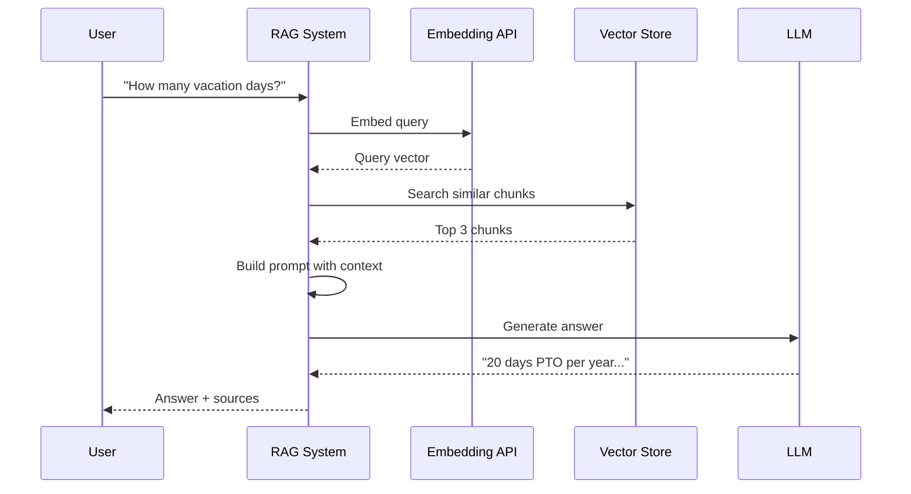
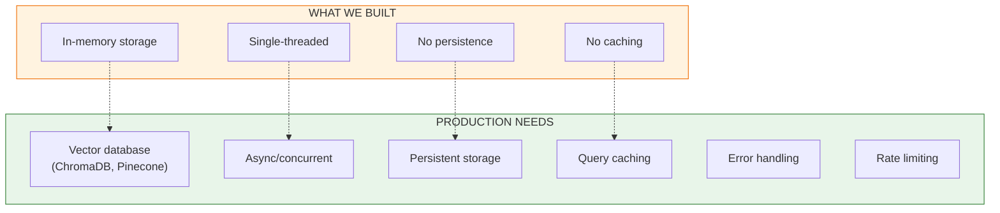

# Lesson 8.15: RAG Pipeline by Hand

> **Duration**: 30 min | **Section**: C - Build RAG From Scratch

## 🎯 The Problem (3-5 min)

You can now:
- ✅ Load documents
- ✅ Chunk them
- ✅ Create embeddings
- ✅ Search for similar chunks

Now it's time to **put it all together** into a complete RAG pipeline.

## 🧪 Try It: The Complete Pipeline

```python
from openai import OpenAI
import numpy as np
from typing import List, Tuple
import re

client = OpenAI()

class SimpleRAG:
    """A complete RAG system built from scratch."""
    
    def __init__(
        self,
        embedding_model: str = "text-embedding-3-small",
        chat_model: str = "gpt-4",
        chunk_size: int = 500,
        top_k: int = 3
    ):
        self.embedding_model = embedding_model
        self.chat_model = chat_model
        self.chunk_size = chunk_size
        self.top_k = top_k
        
        self.chunks: List[dict] = []
        self.embeddings: np.ndarray = None
    
    # ========== INDEXING PHASE ==========
    
    def add_document(self, text: str, source: str):
        """Add a document to the knowledge base."""
        # Chunk the document
        doc_chunks = self._chunk_text(text)
        
        # Embed all chunks
        chunk_embeddings = self._embed_texts([c['text'] for c in doc_chunks])
        
        # Store
        for chunk, embedding in zip(doc_chunks, chunk_embeddings):
            chunk['source'] = source
            self.chunks.append(chunk)
        
        if self.embeddings is None:
            self.embeddings = np.array(chunk_embeddings)
        else:
            self.embeddings = np.vstack([self.embeddings, chunk_embeddings])
        
        print(f"Added {len(doc_chunks)} chunks from '{source}'")
    
    def _chunk_text(self, text: str) -> List[dict]:
        """Split text into chunks at sentence boundaries."""
        sentences = re.split(r'(?<=[.!?])\s+', text.strip())
        
        chunks = []
        current_chunk = []
        current_length = 0
        
        for sentence in sentences:
            if current_length + len(sentence) > self.chunk_size and current_chunk:
                chunks.append({
                    'text': ' '.join(current_chunk),
                    'chunk_index': len(chunks)
                })
                current_chunk = []
                current_length = 0
            
            current_chunk.append(sentence)
            current_length += len(sentence)
        
        if current_chunk:
            chunks.append({
                'text': ' '.join(current_chunk),
                'chunk_index': len(chunks)
            })
        
        return chunks
    
    def _embed_texts(self, texts: List[str]) -> List[np.ndarray]:
        """Create embeddings for texts."""
        response = client.embeddings.create(
            model=self.embedding_model,
            input=texts
        )
        return [np.array(item.embedding) for item in response.data]
    
    # ========== RETRIEVAL PHASE ==========
    
    def _search(self, query: str) -> List[Tuple[dict, float]]:
        """Find relevant chunks for a query."""
        # Embed query
        query_embedding = self._embed_texts([query])[0]
        
        # Normalize for cosine similarity
        query_norm = query_embedding / np.linalg.norm(query_embedding)
        embeddings_norm = self.embeddings / np.linalg.norm(self.embeddings, axis=1, keepdims=True)
        
        # Calculate similarities
        similarities = np.dot(embeddings_norm, query_norm)
        
        # Get top_k
        top_indices = np.argsort(similarities)[-self.top_k:][::-1]
        
        results = [
            (self.chunks[i], float(similarities[i]))
            for i in top_indices
        ]
        
        return results
    
    # ========== GENERATION PHASE ==========
    
    def ask(self, question: str) -> dict:
        """
        Ask a question and get an answer based on the knowledge base.
        
        Returns:
            dict with 'answer', 'sources', and 'context'
        """
        # Retrieve relevant chunks
        retrieved = self._search(question)
        
        # Build context from retrieved chunks
        context_parts = []
        sources = []
        for chunk, score in retrieved:
            context_parts.append(f"[Source: {chunk['source']}]\n{chunk['text']}")
            sources.append({
                'source': chunk['source'],
                'score': score,
                'text': chunk['text'][:100] + '...'
            })
        
        context = "\n\n---\n\n".join(context_parts)
        
        # Generate answer
        response = client.chat.completions.create(
            model=self.chat_model,
            messages=[
                {
                    "role": "system",
                    "content": """You are a helpful assistant that answers questions based on the provided context.

RULES:
1. ONLY use information from the provided context
2. If the context doesn't contain the answer, say "I don't have that information in my knowledge base"
3. Always cite which source you're using
4. Be concise and direct"""
                },
                {
                    "role": "user",
                    "content": f"""Context:
{context}

Question: {question}

Answer based ONLY on the context above:"""
                }
            ],
            temperature=0  # Deterministic for factual answers
        )
        
        answer = response.choices[0].message.content
        
        return {
            'answer': answer,
            'sources': sources,
            'context': context
        }

# ========== TRY IT OUT ==========

# Create RAG instance
rag = SimpleRAG(chunk_size=400, top_k=3)

# Add documents
rag.add_document("""
Remote Work Policy (Updated 2024)

All full-time employees may work from home up to 4 days per week after 
completing their 90-day probationary period. Remote work requires:

1. Reliable internet connection (minimum 50 Mbps recommended)
2. A dedicated workspace free from distractions
3. Availability during core hours (10am to 3pm local time)

To request remote work arrangements, submit a request through the HR 
portal at least 2 weeks in advance. Your manager must approve all 
remote work arrangements. Remote work privileges may be revoked if 
performance or availability issues arise.
""", source="remote_policy.pdf")

rag.add_document("""
Vacation and PTO Policy

All full-time employees receive 20 days of paid time off (PTO) per year.
PTO accrues at a rate of 1.67 days per month. PTO may be used for:

- Vacation time
- Personal days
- Sick leave (for yourself or family members)

Unused PTO rolls over to the next calendar year, up to a maximum of 
5 days. Any days beyond 5 will be forfeited on December 31st.

To request PTO, submit your request through the HR portal at least 
2 weeks in advance. Emergency sick leave does not require advance notice.
""", source="vacation_policy.pdf")

rag.add_document("""
Expense Reimbursement Policy

When traveling for company business, employees may expense the following:

Meals: Up to $50 per day
Hotels: Up to $200 per night (standard rooms only)
Flights: Economy class only, book at least 2 weeks in advance
Ground transportation: Actual cost with receipts

All expense reports must be submitted within 30 days of the trip. 
Receipts are required for all expenses over $25. Late submissions 
may be denied. Contact finance@company.com with questions.
""", source="expense_policy.pdf")

# Ask questions
print("\n" + "="*60)
print("RAG Q&A SESSION")
print("="*60)

questions = [
    "How many days can I work from home?",
    "How many vacation days do I get per year?",
    "What's the per-day meal limit when traveling?",
    "What is the company's policy on stock options?",  # Not in docs!
]

for q in questions:
    print(f"\n❓ Question: {q}")
    result = rag.ask(q)
    print(f"\n💬 Answer: {result['answer']}")
    print(f"\n📚 Sources used:")
    for src in result['sources']:
        print(f"   - {src['source']} (similarity: {src['score']:.3f})")
    print("\n" + "-"*60)
```

**Output:**
```
Added 2 chunks from 'remote_policy.pdf'
Added 2 chunks from 'vacation_policy.pdf'
Added 2 chunks from 'expense_policy.pdf'

============================================================
RAG Q&A SESSION
============================================================

❓ Question: How many days can I work from home?

💬 Answer: According to the Remote Work Policy, employees may work 
from home up to 4 days per week after completing their 90-day 
probationary period.

📚 Sources used:
   - remote_policy.pdf (similarity: 0.891)
   - vacation_policy.pdf (similarity: 0.654)
   - expense_policy.pdf (similarity: 0.543)

------------------------------------------------------------

❓ Question: What is the company's policy on stock options?

💬 Answer: I don't have that information in my knowledge base. 
The provided context only contains information about remote work, 
vacation/PTO, and expense reimbursement policies.

📚 Sources used:
   - vacation_policy.pdf (similarity: 0.612)
   - expense_policy.pdf (similarity: 0.589)
   - remote_policy.pdf (similarity: 0.567)
```

## 🔍 Under the Hood: The Full Flow



## 🔧 Adding Streaming

For better UX, stream the response:

```python
def ask_streaming(self, question: str):
    """Ask a question with streaming response."""
    # Retrieve (same as before)
    retrieved = self._search(question)
    context_parts = [f"[Source: {c['source']}]\n{c['text']}" for c, _ in retrieved]
    context = "\n\n---\n\n".join(context_parts)
    
    # Stream generation
    stream = client.chat.completions.create(
        model=self.chat_model,
        messages=[
            {"role": "system", "content": "Answer based ONLY on the provided context."},
            {"role": "user", "content": f"Context:\n{context}\n\nQuestion: {question}"}
        ],
        stream=True
    )
    
    print("Answer: ", end="", flush=True)
    full_response = ""
    for chunk in stream:
        if chunk.choices[0].delta.content:
            content = chunk.choices[0].delta.content
            print(content, end="", flush=True)
            full_response += content
    print()
    
    return full_response
```

## 💥 Production Considerations



## 🎯 Practice

Extend the RAG system with these features:

```python
# 1. Add conversation memory
class RAGWithMemory(SimpleRAG):
    def __init__(self, *args, **kwargs):
        super().__init__(*args, **kwargs)
        self.conversation_history = []
    
    def ask(self, question: str) -> dict:
        # Include conversation history in the prompt
        history_text = "\n".join([
            f"Q: {h['question']}\nA: {h['answer']}"
            for h in self.conversation_history[-3:]  # Last 3 turns
        ])
        
        # ... rest of ask method, but include history in prompt
        
        # Save to history
        result = super().ask(question)
        self.conversation_history.append({
            'question': question,
            'answer': result['answer']
        })
        return result

# 2. Add source citations in the answer
# Modify the system prompt to require inline citations:
system_prompt = """
Answer based ONLY on the provided context.
Include inline citations like [Source: filename.pdf] when using information.
"""

# 3. Add confidence scoring
def ask_with_confidence(self, question: str) -> dict:
    result = self.ask(question)
    
    # Calculate confidence based on top similarity score
    top_score = result['sources'][0]['score'] if result['sources'] else 0
    
    if top_score > 0.8:
        confidence = "high"
    elif top_score > 0.6:
        confidence = "medium"
    else:
        confidence = "low"
    
    result['confidence'] = confidence
    return result
```

## 🔑 Key Takeaways

- **RAG = Retrieve + Augment + Generate** - we built each step from scratch
- **System prompts are crucial** - they control whether LLM uses context
- **Always return sources** - for verification and trust
- **Handle "not found" gracefully** - better than hallucinating
- **This is what LangChain automates** - now you understand what's underneath

## ❓ Common Questions

| Question | Answer |
|----------|--------|
| Why set temperature=0? | For factual Q&A, we want deterministic answers |
| How do I improve accuracy? | Better chunking, more context, reranking, hybrid search |
| Can I use other LLMs? | Yes! Just change the chat_model parameter |
| What about multi-turn conversations? | Add conversation history to the prompt (see Practice) |

---

## 📚 Further Reading

- [OpenAI RAG Cookbook](https://cookbook.openai.com/examples/rag_from_scratch) - Official guide
- [LangChain RAG Tutorial](https://python.langchain.com/docs/tutorials/rag/) - Framework approach
