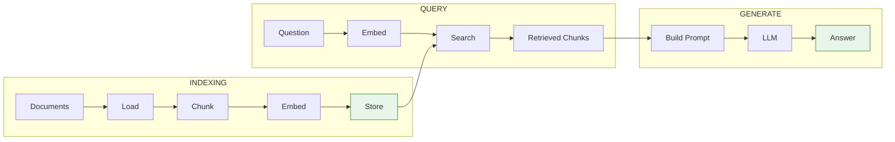
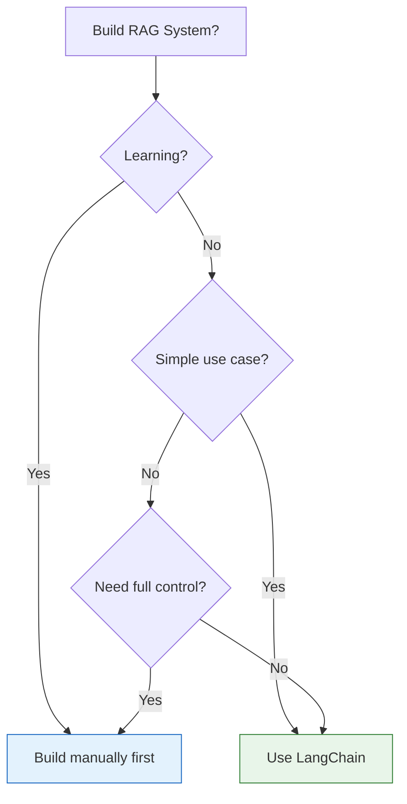

# Lesson 8.16: Manual RAG Q&A

> **Duration**: 10 min | **Section**: C - Build RAG From Scratch

## 🎯 The Purpose

You just built RAG **from scratch**. No LangChain. No vector databases. Just Python, NumPy, and OpenAI.

Let's reflect on what you learned and prepare for the next section where we use frameworks.

## 🧠 Draw It From Memory

Before reading, try to draw the complete RAG pipeline:

```
Document → ??? → ??? → ??? → Storage
Question → ??? → ??? → ??? → Answer
```

Check against this:



## ❓ Common Questions

### Q1: What was the hardest part?

**Common answers:**

| Challenge | Why It's Hard | Solution |
|-----------|--------------|----------|
| Chunking | Finding the right size/boundaries | Experiment with 300-600 chars, sentence boundaries |
| Embedding costs | Millions of tokens add up | Batch, cache, use smaller model |
| Search quality | Wrong chunks retrieved | Tune threshold, add hybrid search |
| LLM ignoring context | Falls back to training data | Stronger system prompt, lower temperature |

---

### Q2: Why not just use LangChain from the start?

```mermaid
flowchart TD
    subgraph Without["WITHOUT MANUAL UNDERSTANDING"]
        W1["LangChain example"] --> W2["It works!"]
        W2 --> W3["Something breaks"]
        W3 --> W4["No idea where to look"]
        W4 --> W5["Copy more examples"]
    end
    
    subgraph With["WITH MANUAL UNDERSTANDING"]
        M1["Built from scratch"] --> M2["Use LangChain"]
        M2 --> M3["Something breaks"]
        M3 --> M4["Know exactly which step failed"]
        M4 --> M5["Fix it or work around it"]
    end
    
    style Without fill:#FFEBEE,stroke:#C62828
    style With fill:#E8F5E9,stroke:#2E7D32
```



**Benefits of manual implementation:**
- Debug any RAG system (even framework-based)
- Understand performance bottlenecks
- Customize beyond what frameworks offer
- Interview confidently about RAG

---

### Q3: What does LangChain actually do for me?

Everything you just built, but:

| Feature | Your Code | LangChain |
|---------|-----------|-----------|
| Document loading | PyPDF, open() | 50+ loaders built-in |
| Chunking | Custom splitter | RecursiveCharacterTextSplitter |
| Vector storage | NumPy arrays | ChromaDB, Pinecone, pgvector |
| Retrieval | Manual search | .as_retriever() |
| Chaining | Custom pipeline | LCEL pipe operator |
| Streaming | Manual iteration | Built-in streaming |
| Memory | Manual history | ConversationBufferMemory |

**LangChain = convenience, not magic.**

---

### Q4: When should I use the manual approach?



**Use manual when:**
- Learning (like now!)
- Need extreme optimization
- Framework doesn't support your use case
- Minimizing dependencies

**Use frameworks when:**
- Rapid prototyping
- Standard RAG patterns
- Team familiarity
- Production features (async, streaming, etc.)

---

### Q5: What's missing from our implementation?

Production RAG systems also need:

| Feature | Why | How |
|---------|-----|-----|
| **Persistence** | Survive restarts | Save to disk/DB |
| **Concurrent access** | Multiple users | Async, connection pools |
| **Hybrid search** | Better retrieval | BM25 + vector |
| **Reranking** | Improve top results | Cross-encoder models |
| **Caching** | Speed + cost | Cache embeddings, responses |
| **Evaluation** | Know if it works | Metrics, A/B testing |
| **Monitoring** | Track issues | Logging, observability |

We'll cover these in upcoming sections!

---

## 🎯 Self-Assessment

Rate yourself (1-5) on each component:

| Component | Skill | Your Rating |
|-----------|-------|-------------|
| **Loading** | "I can load PDFs and text files into Python" | ⬜ |
| **Chunking** | "I can split documents at semantic boundaries" | ⬜ |
| **Embedding** | "I understand what embeddings are and how to create them" | ⬜ |
| **Search** | "I can implement cosine similarity search with NumPy" | ⬜ |
| **Generation** | "I can build prompts that ground LLM answers in context" | ⬜ |
| **Full Pipeline** | "I can connect all pieces into a working RAG system" | ⬜ |

**If any < 3**: Go back and re-read that lesson. Practice the code.

**If all ≥ 3**: You're ready for LangChain! 🎉

---

## � Common Pitfalls

| Pitfall | Why It Happens | Fix |
|---------|---------------|-----|
| Not persisting embeddings | Prototype mentality | Save to disk/DB; re-embedding is expensive |
| Chunk boundaries mid-sentence | Fixed character splits | Use sentence boundaries or recursive splitters |
| LLM ignoring retrieved context | Weak system prompt | Explicitly instruct: "Answer ONLY from the context provided" |
| No overlap between chunks | Trying to save tokens | Add 10-20% overlap to preserve context across boundaries |
| Hardcoding chunk size | "500 works for everyone" | Tune based on your content; code needs smaller, prose larger |
| Skipping manual implementation | "LangChain is easier" | Understanding internals is crucial for debugging production issues |

## �🔑 Key Takeaways

- **You built RAG from scratch** - that's a real skill
- **Frameworks automate, not replace** your understanding
- **Debugging is easier** when you know the internals
- **Next**: Use frameworks efficiently because you understand what they do

---

## 📚 Further Reading

- [Build LLM Apps from Scratch](https://www.manning.com/books/build-a-large-language-model-from-scratch) - Deep dive book
- [RAG Survey Paper](https://arxiv.org/abs/2312.10997) - Academic overview
- [LangChain Concepts](https://python.langchain.com/docs/concepts/) - Ready for the next section
