# Lesson 8.17: What IS LangChain?

> **Duration**: 20 min | **Section**: D - LangChain Fundamentals

## 🎯 The Problem (3-5 min)

You just built RAG from scratch. It works! But your code has:
- 200+ lines for a basic implementation
- No standardization (every project different)
- Missing production features (async, streaming, error handling)
- No abstraction over different LLMs

**LangChain** is a framework that solves these problems.

## 🧪 Try It: LangChain Hello World

```python
# pip install langchain langchain-openai

from langchain_openai import ChatOpenAI

# Create an LLM
llm = ChatOpenAI(model="gpt-4")

# Use it!
response = llm.invoke("What is 2+2?")
print(response.content)
```

**Output:**
```
2 + 2 equals 4.
```

That's it! One line to create the LLM, one line to use it.

## 🔍 Under the Hood: What LangChain Provides


### Key Packages

| Package | Purpose | Install |
|---------|---------|---------|
| `langchain` | Core framework | `pip install langchain` |
| `langchain-openai` | OpenAI integration | `pip install langchain-openai` |
| `langchain-community` | Third-party integrations | `pip install langchain-community` |
| `langchain-chroma` | ChromaDB vector store | `pip install langchain-chroma` |

## 📦 Core Concepts

### 1. LLM Wrappers

```python
from langchain_openai import ChatOpenAI
from langchain_anthropic import ChatAnthropic  # pip install langchain-anthropic

# Same interface, different providers
openai_llm = ChatOpenAI(model="gpt-4", temperature=0)
anthropic_llm = ChatAnthropic(model="claude-3-opus-20240229")

# Use the same code with either!
response = openai_llm.invoke("Hello!")
response = anthropic_llm.invoke("Hello!")
```

### 2. Messages

```python
from langchain_core.messages import SystemMessage, HumanMessage, AIMessage

messages = [
    SystemMessage(content="You are a helpful assistant."),
    HumanMessage(content="What's the capital of France?"),
]

response = llm.invoke(messages)
print(response.content)  # "The capital of France is Paris."
```

### 3. Chains (LCEL)

LangChain Expression Language lets you compose components:

```python
from langchain_openai import ChatOpenAI
from langchain_core.prompts import ChatPromptTemplate
from langchain_core.output_parsers import StrOutputParser

# Define components
prompt = ChatPromptTemplate.from_template("Tell me a joke about {topic}")
llm = ChatOpenAI(model="gpt-4")
parser = StrOutputParser()

# Chain them together with | (pipe operator)
chain = prompt | llm | parser

# Use the chain
result = chain.invoke({"topic": "programming"})
print(result)
```

**Output:**
```
Why do programmers prefer dark mode? 
Because light attracts bugs!
```

## 💡 The Power of Abstraction

Compare your manual code to LangChain:

```python
# ========== YOUR MANUAL CODE (50+ lines) ==========
from openai import OpenAI

client = OpenAI()

def ask(question: str) -> str:
    response = client.chat.completions.create(
        model="gpt-4",
        messages=[
            {"role": "system", "content": "You are helpful."},
            {"role": "user", "content": question}
        ]
    )
    return response.choices[0].message.content

# ========== LANGCHAIN (5 lines) ==========
from langchain_openai import ChatOpenAI
from langchain_core.prompts import ChatPromptTemplate

chain = (
    ChatPromptTemplate.from_messages([
        ("system", "You are helpful."),
        ("human", "{question}")
    ])
    | ChatOpenAI(model="gpt-4")
)

result = chain.invoke({"question": "Hello!"})
```

**Same result, but LangChain gives you:**
- Streaming for free
- Async for free
- Tracing/debugging
- Easy model swapping
- Standardized patterns

## 💥 LangChain Criticism and When NOT to Use It

```mermaid
flowchart TD
    subgraph Pros["✅ LANGCHAIN PROS"]
        P1["Rapid prototyping"]
        P2["Many integrations"]
        P3["Standardized patterns"]
        P4["Active community"]
    end
    
    subgraph Cons["❌ LANGCHAIN CONS"]
        C1["Abstraction overhead"]
        C2["Can hide what's happening"]
        C3["Breaking changes between versions"]
        C4["Sometimes too complex"]
    end
```



**Use LangChain when:**
- Building standard RAG/agent patterns
- Need many integrations quickly
- Team benefits from standardization
- Prototyping and iterating

**Consider alternatives when:**
- Need maximum performance
- Simple use case (just API calls)
- Want full control
- Production system with specific needs

## 🎯 Practice

Set up LangChain and try the basics:

```python
# 1. Install
# pip install langchain langchain-openai

# 2. Basic LLM usage
from langchain_openai import ChatOpenAI

llm = ChatOpenAI(model="gpt-4", temperature=0)

# Direct invoke
print(llm.invoke("What is Python?").content)

# 3. With messages
from langchain_core.messages import SystemMessage, HumanMessage

messages = [
    SystemMessage(content="You are a pirate. Respond in pirate speak."),
    HumanMessage(content="What is the weather like?"),
]
print(llm.invoke(messages).content)

# 4. Simple chain
from langchain_core.prompts import ChatPromptTemplate
from langchain_core.output_parsers import StrOutputParser

chain = (
    ChatPromptTemplate.from_template("Explain {concept} in one sentence")
    | llm
    | StrOutputParser()
)

print(chain.invoke({"concept": "recursion"}))
```

## 🔑 Key Takeaways

- **LangChain = abstractions for LLM apps** - LLMs, prompts, chains, RAG
- **Same interface, different providers** - swap OpenAI for Anthropic easily
- **LCEL pipe operator** - compose components with `|`
- **Know when NOT to use it** - simple apps might not need the overhead
- **You understand the internals** - from Section C, so debugging is easy

## ❓ Common Questions

| Question | Answer |
|----------|--------|
| Is LangChain required for RAG? | No! You built RAG without it. But it speeds development. |
| LangChain vs LlamaIndex? | LangChain = general LLM apps. LlamaIndex = focused on RAG/data. |
| What about version stability? | LangChain iterates fast. Pin versions in production. |
| Should I learn raw APIs first? | Yes! (You did.) Now LangChain will make more sense. |

---

## 📚 Further Reading

- [LangChain Documentation](https://python.langchain.com/docs/introduction/) - Official docs
- [LangChain Expression Language](https://python.langchain.com/docs/concepts/lcel/) - LCEL guide
- [LangChain vs Alternatives](https://www.datacamp.com/blog/langchain-vs-llamaindex-vs-gpt-index) - Comparison
