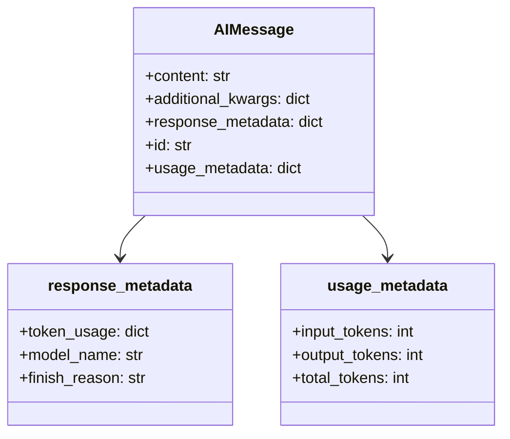
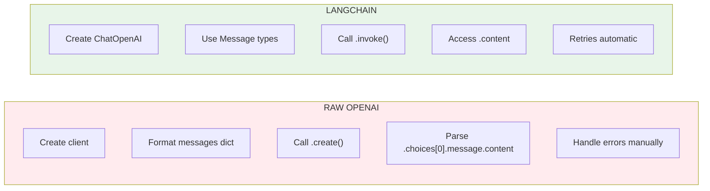

# Lesson 8.18: ChatOpenAI Wrapper

> **Duration**: 20 min | **Section**: D - LangChain Fundamentals

## 🎯 The Problem (3-5 min)

The raw OpenAI client works, but:

```python
from openai import OpenAI

client = OpenAI()
response = client.chat.completions.create(
    model="gpt-4",
    messages=[{"role": "user", "content": "Hello"}],
    temperature=0.7,
)
text = response.choices[0].message.content  # Deep nesting!
```

Every time you want different behavior (streaming, async, retry), you write more code.

**LangChain's ChatOpenAI wrapper handles this for you.**

## 🧪 Try It: ChatOpenAI Basics

```python
from langchain_openai import ChatOpenAI

# Create the wrapper
llm = ChatOpenAI(
    model="gpt-4",
    temperature=0,
    max_tokens=100,
)

# Simple invoke
response = llm.invoke("What is the capital of Japan?")
print(type(response))  # <class 'langchain_core.messages.ai.AIMessage'>
print(response.content)  # "The capital of Japan is Tokyo."
```

## 🔍 Under the Hood: AIMessage Structure



```python
from langchain_openai import ChatOpenAI

llm = ChatOpenAI(model="gpt-4", temperature=0)
response = llm.invoke("Hello!")

# Explore the response
print(f"Content: {response.content}")
print(f"Type: {type(response).__name__}")
print(f"Response Metadata: {response.response_metadata}")
print(f"Usage: {response.usage_metadata}")
```

**Output:**
```
Content: Hello! How can I assist you today?
Type: AIMessage
Response Metadata: {'token_usage': {'completion_tokens': 9, 'prompt_tokens': 8, 'total_tokens': 17}, 'model_name': 'gpt-4', ...}
Usage: {'input_tokens': 8, 'output_tokens': 9, 'total_tokens': 17}
```

## 📨 Message Types

LangChain uses typed messages:

```python
from langchain_core.messages import (
    SystemMessage,
    HumanMessage,
    AIMessage,
)
from langchain_openai import ChatOpenAI

llm = ChatOpenAI(model="gpt-4", temperature=0)

# Build a conversation
messages = [
    SystemMessage(content="You are a helpful math tutor."),
    HumanMessage(content="What is the Pythagorean theorem?"),
]

response = llm.invoke(messages)
print(response.content)
```

### Message Type Comparison

| LangChain Message | OpenAI Role | Purpose |
|-------------------|-------------|---------|
| `SystemMessage` | `"system"` | Set behavior/persona |
| `HumanMessage` | `"user"` | User input |
| `AIMessage` | `"assistant"` | Model response |

## ⚙️ Configuration Options

```python
from langchain_openai import ChatOpenAI

llm = ChatOpenAI(
    # Model selection
    model="gpt-4",  # or "gpt-3.5-turbo", "gpt-4-turbo", etc.
    
    # Generation parameters
    temperature=0.7,       # 0-2, creativity level
    max_tokens=500,        # Maximum response length
    top_p=1.0,             # Nucleus sampling
    frequency_penalty=0,   # Reduce repetition
    presence_penalty=0,    # Encourage new topics
    
    # API configuration
    timeout=30,            # Request timeout in seconds
    max_retries=2,         # Retry on failure
    
    # Optional: different API key
    # api_key="sk-...",
    
    # Optional: Azure OpenAI
    # azure_endpoint="https://...",
)
```

## 🌊 Streaming Responses

Get responses as they generate:

```python
from langchain_openai import ChatOpenAI

llm = ChatOpenAI(model="gpt-4", temperature=0)

# Streaming with .stream()
for chunk in llm.stream("Write a haiku about coding"):
    print(chunk.content, end="", flush=True)
print()  # Newline at end
```

**Output (appears gradually):**
```
Lines of logic flow,
Bugs hide in the syntax deep,
Debug, repeat, grow.
```

## ⚡ Async Support

For concurrent requests:

```python
import asyncio
from langchain_openai import ChatOpenAI

llm = ChatOpenAI(model="gpt-4", temperature=0)

async def ask_questions():
    # Run multiple questions concurrently
    questions = [
        "What is Python?",
        "What is JavaScript?",
        "What is Rust?",
    ]
    
    # Concurrent execution
    tasks = [llm.ainvoke(q) for q in questions]
    responses = await asyncio.gather(*tasks)
    
    for q, r in zip(questions, responses):
        print(f"Q: {q}")
        print(f"A: {r.content[:100]}...\n")

# Run
asyncio.run(ask_questions())
```

## 📦 Batch Processing

Process multiple inputs efficiently:

```python
from langchain_openai import ChatOpenAI
from langchain_core.messages import HumanMessage

llm = ChatOpenAI(model="gpt-4", temperature=0)

# Batch invoke
messages = [
    [HumanMessage(content="What is 2+2?")],
    [HumanMessage(content="What is 3+3?")],
    [HumanMessage(content="What is 4+4?")],
]

responses = llm.batch(messages)
for r in responses:
    print(r.content)
```

**Output:**
```
2+2 equals 4.
3+3 equals 6.
4+4 equals 8.
```

## 💥 Where It Breaks: Error Handling

```python
from langchain_openai import ChatOpenAI
from openai import RateLimitError, APIError

llm = ChatOpenAI(model="gpt-4", max_retries=3)

try:
    response = llm.invoke("Hello!")
except RateLimitError:
    print("Hit rate limit, backing off...")
except APIError as e:
    print(f"API error: {e}")
```

LangChain handles retries automatically via `max_retries`.

## 🔁 Comparison: Raw OpenAI vs LangChain



```python
# ========== RAW OPENAI ==========
from openai import OpenAI

client = OpenAI()
response = client.chat.completions.create(
    model="gpt-4",
    messages=[
        {"role": "system", "content": "You are helpful."},
        {"role": "user", "content": "Hello!"},
    ],
)
text = response.choices[0].message.content

# ========== LANGCHAIN ==========
from langchain_openai import ChatOpenAI
from langchain_core.messages import SystemMessage, HumanMessage

llm = ChatOpenAI(model="gpt-4")
response = llm.invoke([
    SystemMessage(content="You are helpful."),
    HumanMessage(content="Hello!"),
])
text = response.content
```

**Both work!** LangChain adds:
- Streaming via `.stream()`
- Async via `.ainvoke()`
- Batch via `.batch()`
- Automatic retries

## 🎯 Practice

Try all the invocation patterns:

```python
import asyncio
from langchain_openai import ChatOpenAI
from langchain_core.messages import SystemMessage, HumanMessage

llm = ChatOpenAI(model="gpt-4", temperature=0)

# 1. Simple invoke
print("=== Simple Invoke ===")
response = llm.invoke("What is 2+2?")
print(response.content)
print(f"Tokens used: {response.usage_metadata['total_tokens']}")

# 2. With messages
print("\n=== With Messages ===")
messages = [
    SystemMessage(content="Respond with only numbers."),
    HumanMessage(content="What is 5+5?"),
]
response = llm.invoke(messages)
print(response.content)

# 3. Streaming
print("\n=== Streaming ===")
for chunk in llm.stream("Count from 1 to 5"):
    print(chunk.content, end="", flush=True)
print()

# 4. Batch
print("\n=== Batch ===")
results = llm.batch([
    [HumanMessage(content="1+1=?")],
    [HumanMessage(content="2+2=?")],
])
for r in results:
    print(r.content)

# 5. Async
print("\n=== Async ===")
async def async_demo():
    response = await llm.ainvoke("What is 3+3?")
    print(response.content)

asyncio.run(async_demo())
```

## 🔑 Key Takeaways

- **ChatOpenAI wraps the OpenAI client** - cleaner interface
- **Typed messages** - SystemMessage, HumanMessage, AIMessage
- **AIMessage has metadata** - tokens, model name, finish reason
- **Multiple invocation patterns** - invoke, stream, batch, ainvoke
- **Automatic retries** - via max_retries parameter

## ❓ Common Questions

| Question | Answer |
|----------|--------|
| Can I use my own API key? | Yes: `ChatOpenAI(api_key="sk-...")` |
| Does it work with Azure? | Yes: Use `AzureChatOpenAI` from `langchain_openai` |
| Cost tracking? | Access via `response.usage_metadata` |
| Can I mix with raw OpenAI? | Yes, they're separate. Use whichever fits. |

---

## 📚 Further Reading

- [LangChain ChatOpenAI](https://python.langchain.com/docs/integrations/chat/openai/) - Official docs
- [LangChain Messages](https://python.langchain.com/docs/concepts/messages/) - Message types
- [Streaming in LangChain](https://python.langchain.com/docs/how_to/streaming/) - Streaming guide
