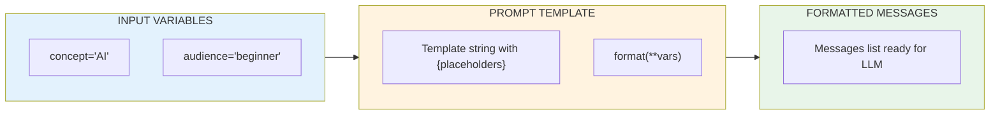
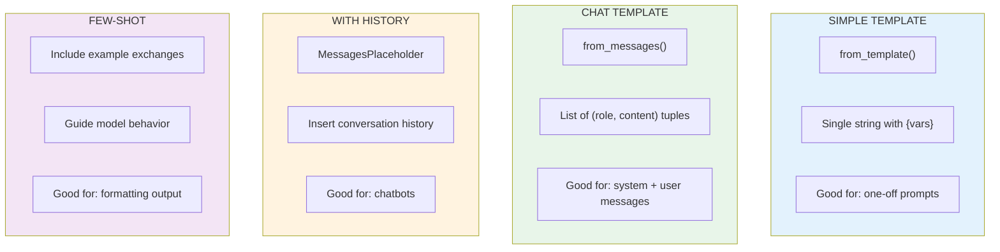

# Lesson 8.19: Prompt Templates

> **Duration**: 25 min | **Section**: D - LangChain Fundamentals

## 🎯 The Problem (3-5 min)

String formatting gets messy fast:

```python
# Manual string formatting
def build_prompt(topic, style, length):
    return f"""You are a {style} writer.
Write a {length} article about {topic}.
Include examples and be engaging."""

# What if you need to validate inputs?
# What if you need chat history?
# What if you need to compose prompts?
```

**Prompt templates** solve this with structured, reusable prompts.

## 🧪 Try It: Basic Templates

```python
from langchain_core.prompts import ChatPromptTemplate
from langchain_openai import ChatOpenAI

# Create a template
prompt = ChatPromptTemplate.from_template(
    "Explain {concept} in simple terms for a {audience}."
)

# See what it produces
print(prompt.format(concept="recursion", audience="5-year-old"))
```

**Output:**
```
Explain recursion in simple terms for a 5-year-old.
```

### Use with LLM

```python
from langchain_openai import ChatOpenAI
from langchain_core.prompts import ChatPromptTemplate

llm = ChatOpenAI(model="gpt-4", temperature=0)
prompt = ChatPromptTemplate.from_template(
    "Explain {concept} in simple terms for a {audience}."
)

# Chain them
chain = prompt | llm

response = chain.invoke({
    "concept": "photosynthesis",
    "audience": "middle schooler"
})
print(response.content)
```

## 🔍 Under the Hood: Template Structure



## 📨 Chat Prompt Templates

For multi-message conversations:

```python
from langchain_core.prompts import ChatPromptTemplate

# Method 1: From messages list
prompt = ChatPromptTemplate.from_messages([
    ("system", "You are a helpful {profession}."),
    ("human", "{question}"),
])

# Format it
messages = prompt.format_messages(
    profession="math tutor",
    question="What is the quadratic formula?"
)

for msg in messages:
    print(f"{msg.type}: {msg.content}")
```

**Output:**
```
system: You are a helpful math tutor.
human: What is the quadratic formula?
```

### Method 2: Using Message Classes

```python
from langchain_core.prompts import ChatPromptTemplate
from langchain_core.prompts import SystemMessagePromptTemplate, HumanMessagePromptTemplate

prompt = ChatPromptTemplate.from_messages([
    SystemMessagePromptTemplate.from_template(
        "You are a {style} assistant. Always respond in {language}."
    ),
    HumanMessagePromptTemplate.from_template(
        "{user_input}"
    ),
])

messages = prompt.format_messages(
    style="friendly",
    language="French",
    user_input="Hello, how are you?"
)

# Use with LLM
from langchain_openai import ChatOpenAI
llm = ChatOpenAI(model="gpt-4")
response = llm.invoke(messages)
print(response.content)  # Response in French!
```

## 🔧 Template Variables

Check what variables a template needs:

```python
from langchain_core.prompts import ChatPromptTemplate

prompt = ChatPromptTemplate.from_template(
    "Write a {length} story about {topic} in the style of {author}."
)

# See required variables
print(prompt.input_variables)
# ['author', 'length', 'topic']
```

## 💬 Including Chat History

For conversations with memory:

```python
from langchain_core.prompts import ChatPromptTemplate, MessagesPlaceholder
from langchain_core.messages import HumanMessage, AIMessage

prompt = ChatPromptTemplate.from_messages([
    ("system", "You are a helpful assistant."),
    MessagesPlaceholder(variable_name="chat_history"),
    ("human", "{input}"),
])

# Simulate a conversation
chat_history = [
    HumanMessage(content="Hi, my name is Alice."),
    AIMessage(content="Hello Alice! How can I help you today?"),
]

messages = prompt.format_messages(
    chat_history=chat_history,
    input="What's my name?"
)

# The LLM will see the full history
for msg in messages:
    print(f"{msg.type}: {msg.content}")
```

**Output:**
```
system: You are a helpful assistant.
human: Hi, my name is Alice.
ai: Hello Alice! How can I help you today?
human: What's my name?
```

## 🧩 Composing Templates

Build complex prompts from parts:

```python
from langchain_core.prompts import ChatPromptTemplate

# Base template
base = ChatPromptTemplate.from_messages([
    ("system", "You are an expert {role}."),
])

# Add more messages
full = base + [
    ("human", "Please help me with: {task}"),
]

print(full.input_variables)  # ['role', 'task']

messages = full.format_messages(
    role="Python developer",
    task="write a factorial function"
)
```

## 📝 Few-Shot Prompting

Include examples in your template:

```python
from langchain_core.prompts import ChatPromptTemplate

# Few-shot prompt with examples
prompt = ChatPromptTemplate.from_messages([
    ("system", "You are a translation assistant. Translate to French."),
    ("human", "Hello"),
    ("ai", "Bonjour"),
    ("human", "Goodbye"),
    ("ai", "Au revoir"),
    ("human", "{text}"),
])

from langchain_openai import ChatOpenAI
llm = ChatOpenAI(model="gpt-4", temperature=0)
chain = prompt | llm

response = chain.invoke({"text": "Good morning"})
print(response.content)  # "Bonjour" or "Bon matin"
```

## 💥 Where It Breaks: Missing Variables

```python
from langchain_core.prompts import ChatPromptTemplate

prompt = ChatPromptTemplate.from_template(
    "Explain {concept} for {audience}."
)

# This will raise an error!
try:
    prompt.format(concept="AI")  # Missing 'audience'
except KeyError as e:
    print(f"Error: Missing variable {e}")
```

**Solution: Always provide all variables or use defaults:**

```python
from langchain_core.prompts import ChatPromptTemplate

# Use partial to set defaults
prompt = ChatPromptTemplate.from_template(
    "Explain {concept} for {audience}."
).partial(audience="a general audience")

# Now 'audience' is optional
result = prompt.format(concept="machine learning")
print(result)
# "Explain machine learning for a general audience."
```

## 🔁 Template Patterns Comparison



## 🎯 Practice

Create templates for different use cases:

```python
from langchain_core.prompts import ChatPromptTemplate, MessagesPlaceholder
from langchain_core.messages import HumanMessage, AIMessage
from langchain_openai import ChatOpenAI

llm = ChatOpenAI(model="gpt-4", temperature=0)

# 1. Simple template
print("=== Simple Template ===")
simple = ChatPromptTemplate.from_template(
    "Give me 3 {adjective} names for a {animal}."
)
chain = simple | llm
print(chain.invoke({"adjective": "funny", "animal": "cat"}).content)

# 2. System + Human
print("\n=== System + Human ===")
chat = ChatPromptTemplate.from_messages([
    ("system", "You are a {language} teacher. Be encouraging."),
    ("human", "How do I say '{phrase}'?"),
])
chain = chat | llm
print(chain.invoke({
    "language": "Spanish",
    "phrase": "Hello, how are you?"
}).content)

# 3. With history
print("\n=== With History ===")
memory_prompt = ChatPromptTemplate.from_messages([
    ("system", "You are a helpful assistant with memory."),
    MessagesPlaceholder("history"),
    ("human", "{question}"),
])

history = [
    HumanMessage(content="My favorite color is blue."),
    AIMessage(content="Blue is a great color! It's calming and peaceful."),
]

chain = memory_prompt | llm
print(chain.invoke({
    "history": history,
    "question": "What's my favorite color?"
}).content)

# 4. Check variables
print("\n=== Template Variables ===")
print(f"Simple needs: {simple.input_variables}")
print(f"Chat needs: {chat.input_variables}")
```

## 🔑 Key Takeaways

- **ChatPromptTemplate** - structured, reusable prompts
- **from_template()** - simple string templates
- **from_messages()** - multi-message chat templates
- **MessagesPlaceholder** - insert conversation history
- **input_variables** - check what a template needs
- **partial()** - set default values for variables

## ❓ Common Questions

| Question | Answer |
|----------|--------|
| Can I nest templates? | Yes, compose with `+` or use multiple placeholders. |
| How do I escape curly braces? | Use double braces: `{{not a variable}}` |
| Validate user input? | Check variables are provided, use try/except. |
| Best practice for system prompts? | Keep them focused, use separate templates for different tasks. |

---

## 📚 Further Reading

- [LangChain Prompt Templates](https://python.langchain.com/docs/concepts/prompt_templates/) - Concepts
- [How to Use ChatPromptTemplate](https://python.langchain.com/docs/how_to/prompts_composition/) - Composition
- [Few-Shot Prompting](https://python.langchain.com/docs/how_to/few_shot_examples/) - Examples
