# Lesson 8.20: LCEL Chains

> **Duration**: 30 min | **Section**: D - LangChain Fundamentals

## 🎯 The Problem (3-5 min)

You have components: prompts, LLMs, parsers. How do you combine them?

**Old way (Legacy Chains):**
```python
# Don't do this anymore
from langchain.chains import LLMChain  # Deprecated
chain = LLMChain(llm=llm, prompt=prompt)  # Rigid
```

**New way: LangChain Expression Language (LCEL)**
```python
chain = prompt | llm | parser  # Clean, composable
```

LCEL uses the **pipe operator `|`** to chain components together.

## 🧪 Try It: Your First Chain

```python
from langchain_openai import ChatOpenAI
from langchain_core.prompts import ChatPromptTemplate
from langchain_core.output_parsers import StrOutputParser

# Components
prompt = ChatPromptTemplate.from_template("Tell me a joke about {topic}")
llm = ChatOpenAI(model="gpt-4", temperature=0.7)
parser = StrOutputParser()

# Chain them with |
chain = prompt | llm | parser

# Use it
result = chain.invoke({"topic": "programming"})
print(result)
```

**Output:**
```
Why do programmers prefer dark mode?
Because light attracts bugs!
```

## 🔍 Under the Hood: How LCEL Works


**Each component in the chain:**
1. Takes input from the previous step
2. Transforms it
3. Passes output to the next step

## 📜 The Runnable Protocol

All LCEL components implement the `Runnable` interface:

| Method | Purpose | Sync/Async |
|--------|---------|------------|
| `invoke()` | Single input → output | Sync |
| `ainvoke()` | Same, but async | Async |
| `batch()` | Multiple inputs | Sync |
| `abatch()` | Multiple inputs async | Async |
| `stream()` | Stream output | Sync |
| `astream()` | Stream async | Async |

```python
# All chains get these for free!
chain = prompt | llm | parser

# Invoke
result = chain.invoke({"topic": "cats"})

# Batch
results = chain.batch([
    {"topic": "cats"},
    {"topic": "dogs"},
    {"topic": "birds"},
])

# Stream
for chunk in chain.stream({"topic": "cats"}):
    print(chunk, end="", flush=True)
```

## 🔧 Common LCEL Components

### 1. StrOutputParser

Extracts `.content` from AIMessage:

```python
from langchain_core.output_parsers import StrOutputParser

chain = prompt | llm | StrOutputParser()
result = chain.invoke({"topic": "Python"})
print(type(result))  # str
```

### 2. RunnablePassthrough

Passes input through unchanged:

```python
from langchain_core.runnables import RunnablePassthrough

# Pass data through to next step
chain = RunnablePassthrough() | llm
```

### 3. RunnableLambda

Wrap any function as a Runnable:

```python
from langchain_core.runnables import RunnableLambda

def uppercase(text: str) -> str:
    return text.upper()

chain = prompt | llm | StrOutputParser() | RunnableLambda(uppercase)
result = chain.invoke({"topic": "whisper"})
print(result)  # "WHY DID THE WHISPER GO TO SCHOOL?..."
```

### 4. RunnableParallel

Run multiple chains in parallel:

```python
from langchain_core.runnables import RunnableParallel

# Run two chains at once
parallel = RunnableParallel(
    joke=joke_chain,
    fact=fact_chain,
)

result = parallel.invoke({"topic": "cats"})
print(result["joke"])  # A joke about cats
print(result["fact"])  # A fact about cats
```

## 📊 Combining Chains

### Sequential Chains

```python
from langchain_openai import ChatOpenAI
from langchain_core.prompts import ChatPromptTemplate
from langchain_core.output_parsers import StrOutputParser

llm = ChatOpenAI(model="gpt-4", temperature=0)

# Chain 1: Generate a topic
topic_chain = (
    ChatPromptTemplate.from_template("Give me a random programming topic in one word:")
    | llm
    | StrOutputParser()
)

# Chain 2: Write about the topic
writing_chain = (
    ChatPromptTemplate.from_template("Write a haiku about {topic}")
    | llm
    | StrOutputParser()
)

# Combine: Chain 1 output → Chain 2 input
combined = topic_chain | (lambda topic: {"topic": topic}) | writing_chain

result = combined.invoke({})
print(result)
```

### Parallel Execution


```python
from langchain_core.runnables import RunnableParallel
from langchain_core.output_parsers import StrOutputParser

llm = ChatOpenAI(model="gpt-4", temperature=0.7)

# Three different prompts
joke_chain = (
    ChatPromptTemplate.from_template("Tell a short joke about {topic}")
    | llm | StrOutputParser()
)

fact_chain = (
    ChatPromptTemplate.from_template("Give one interesting fact about {topic}")
    | llm | StrOutputParser()
)

poem_chain = (
    ChatPromptTemplate.from_template("Write a two-line poem about {topic}")
    | llm | StrOutputParser()
)

# Run all in parallel
parallel = RunnableParallel(
    joke=joke_chain,
    fact=fact_chain,
    poem=poem_chain,
)

result = parallel.invoke({"topic": "coffee"})
print("Joke:", result["joke"])
print("Fact:", result["fact"])
print("Poem:", result["poem"])
```

## 🔀 Conditional Routing

Route to different chains based on input:

```python
from langchain_core.runnables import RunnableBranch

# Different prompts for different categories
math_chain = (
    ChatPromptTemplate.from_template("Solve this math problem: {question}")
    | llm | StrOutputParser()
)

general_chain = (
    ChatPromptTemplate.from_template("Answer this question: {question}")
    | llm | StrOutputParser()
)

# Route based on content
def is_math(x):
    return any(op in x["question"] for op in ["+", "-", "*", "/", "="])

branch = RunnableBranch(
    (is_math, math_chain),
    general_chain,  # Default
)

print(branch.invoke({"question": "What is 5 + 3?"}))  # Uses math_chain
print(branch.invoke({"question": "What is Python?"}))  # Uses general_chain
```

## 💥 Where It Breaks: Type Mismatches

```python
# This breaks!
chain = prompt | StrOutputParser()  # ❌ Parser expects AIMessage, gets PromptValue

# Fix: Always have LLM in the middle
chain = prompt | llm | StrOutputParser()  # ✅
```



```mermaid
flowchart LR
    subgraph Wrong["❌ WRONG"]
        P1["Prompt"] -->|"PromptValue"| Par1["StrOutputParser"]
    end
    
    subgraph Right["✅ RIGHT"]
        P2["Prompt"] -->|"PromptValue"| L["LLM"] -->|"AIMessage"| Par2["StrOutputParser"]
    end
    
    style Wrong fill:#FFEBEE
    style Right fill:#E8F5E9
```

## 🔧 Debugging Chains

Use `.invoke()` at each step:

```python
from langchain_openai import ChatOpenAI
from langchain_core.prompts import ChatPromptTemplate
from langchain_core.output_parsers import StrOutputParser

llm = ChatOpenAI(model="gpt-4", temperature=0)
prompt = ChatPromptTemplate.from_template("Tell me about {topic}")
parser = StrOutputParser()

# Debug step by step
input_data = {"topic": "Python"}

step1 = prompt.invoke(input_data)
print("After prompt:", type(step1), step1)

step2 = llm.invoke(step1)
print("After LLM:", type(step2), step2)

step3 = parser.invoke(step2)
print("After parser:", type(step3), step3)
```

## 🎯 Practice

Build chains with different patterns:

```python
from langchain_openai import ChatOpenAI
from langchain_core.prompts import ChatPromptTemplate
from langchain_core.output_parsers import StrOutputParser
from langchain_core.runnables import RunnableParallel, RunnableLambda

llm = ChatOpenAI(model="gpt-4", temperature=0.7)

# 1. Basic chain
print("=== Basic Chain ===")
basic = (
    ChatPromptTemplate.from_template("What is {concept}?")
    | llm
    | StrOutputParser()
)
print(basic.invoke({"concept": "LCEL"}))

# 2. Chain with transformation
print("\n=== With Transform ===")
transform_chain = (
    ChatPromptTemplate.from_template("Say '{word}' in French")
    | llm
    | StrOutputParser()
    | RunnableLambda(str.upper)
)
print(transform_chain.invoke({"word": "hello"}))

# 3. Parallel chains
print("\n=== Parallel ===")
parallel = RunnableParallel(
    french=(
        ChatPromptTemplate.from_template("Say '{word}' in French")
        | llm | StrOutputParser()
    ),
    spanish=(
        ChatPromptTemplate.from_template("Say '{word}' in Spanish")
        | llm | StrOutputParser()
    ),
)
print(parallel.invoke({"word": "goodbye"}))

# 4. Streaming
print("\n=== Streaming ===")
stream_chain = (
    ChatPromptTemplate.from_template("Count from 1 to {n}")
    | llm
    | StrOutputParser()
)
for chunk in stream_chain.stream({"n": 5}):
    print(chunk, end="", flush=True)
print()

# 5. Batch
print("\n=== Batch ===")
results = basic.batch([
    {"concept": "Python"},
    {"concept": "JavaScript"},
])
for r in results:
    print(r[:50] + "...")
```

## 🔑 Key Takeaways

- **LCEL uses `|` operator** - chain components left to right
- **All chains are Runnables** - get invoke, batch, stream for free
- **RunnablePassthrough** - pass data unchanged
- **RunnableLambda** - wrap custom functions
- **RunnableParallel** - run multiple chains concurrently
- **RunnableBranch** - conditional routing
- **Always include LLM** - parsers need AIMessage input

## ❓ Common Questions

| Question | Answer |
|----------|--------|
| Legacy chains vs LCEL? | LCEL is the future. Migrate legacy chains. |
| Performance of parallel? | True concurrent execution, faster than sequential. |
| Can I mix sync and async? | Yes, but prefer async for parallelism. |
| How to debug? | Invoke each step separately, check types. |

---

## 📚 Further Reading

- [LCEL Conceptual Guide](https://python.langchain.com/docs/concepts/lcel/) - Core concepts
- [Runnable Interface](https://python.langchain.com/docs/concepts/runnables/) - Runnable protocol
- [How to Chain Runnables](https://python.langchain.com/docs/how_to/sequence/) - Chaining guide
- [Parallel Execution](https://python.langchain.com/docs/how_to/parallel/) - Parallelism guide
