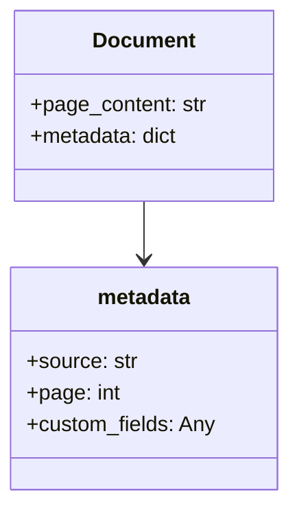
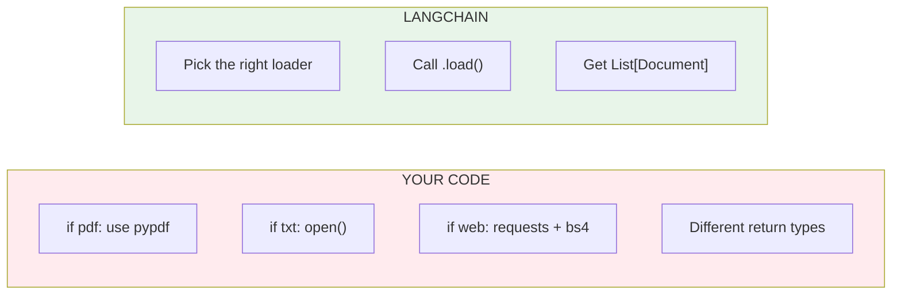

# Lesson 8.21: Document Loaders

> **Duration**: 25 min | **Section**: E - LangChain RAG Pipeline

## 🎯 The Problem (3-5 min)

You built document loading from scratch in Section C. But you wrote:
- Different code for PDFs vs text files
- No handling for Word, HTML, Markdown
- No web scraping support

**LangChain Document Loaders** unify all data sources with one interface.

## 🧪 Try It: Loading a PDF

```python
# pip install langchain langchain-community pypdf

from langchain_community.document_loaders import PyPDFLoader

loader = PyPDFLoader("company_handbook.pdf")
documents = loader.load()

print(f"Loaded {len(documents)} pages")
print(f"Page 1 content: {documents[0].page_content[:200]}...")
print(f"Metadata: {documents[0].metadata}")
```

**Output:**
```
Loaded 45 pages
Page 1 content: Company Handbook 2024...
Metadata: {'source': 'company_handbook.pdf', 'page': 0}
```

## 🔍 Under the Hood: Document Structure



Every loader produces `Document` objects with:
- `page_content`: The actual text
- `metadata`: Source file, page number, etc.

## 📂 Common Document Loaders

### Text Files

```python
from langchain_community.document_loaders import TextLoader

loader = TextLoader("notes.txt")
docs = loader.load()
print(docs[0].page_content)
```

### CSV Files

```python
from langchain_community.document_loaders import CSVLoader

loader = CSVLoader("data.csv")
docs = loader.load()

# Each row becomes a Document
for doc in docs[:3]:
    print(doc.page_content)
    print(doc.metadata)
    print("---")
```

### Web Pages

```python
# pip install beautifulsoup4

from langchain_community.document_loaders import WebBaseLoader

loader = WebBaseLoader("https://example.com/article")
docs = loader.load()
print(docs[0].page_content[:500])
```

### Markdown Files

```python
from langchain_community.document_loaders import UnstructuredMarkdownLoader

loader = UnstructuredMarkdownLoader("README.md")
docs = loader.load()
print(docs[0].page_content)
```

### Directory of Files

```python
from langchain_community.document_loaders import DirectoryLoader

# Load all PDFs from a folder
loader = DirectoryLoader(
    "documents/",
    glob="**/*.pdf",
    loader_cls=PyPDFLoader,
)
docs = loader.load()
print(f"Loaded {len(docs)} documents from directory")
```

## 📊 Loader Comparison

| Loader | Use Case | Install |
|--------|----------|---------|
| `PyPDFLoader` | PDF files | `pypdf` |
| `TextLoader` | Plain text | Built-in |
| `CSVLoader` | CSV data | Built-in |
| `JSONLoader` | JSON files | Built-in |
| `WebBaseLoader` | Web pages | `beautifulsoup4` |
| `UnstructuredMarkdownLoader` | Markdown | `unstructured` |
| `Docx2txtLoader` | Word docs | `docx2txt` |
| `DirectoryLoader` | Multiple files | Depends on file type |

## 🔧 Metadata Enrichment

Add custom metadata:

```python
from langchain_community.document_loaders import PyPDFLoader
from datetime import datetime

loader = PyPDFLoader("report.pdf")
docs = loader.load()

# Add custom metadata to each document
for doc in docs:
    doc.metadata["loaded_at"] = datetime.now().isoformat()
    doc.metadata["category"] = "financial"
    doc.metadata["confidential"] = True

print(docs[0].metadata)
# {'source': 'report.pdf', 'page': 0, 'loaded_at': '2024-...', 'category': 'financial', 'confidential': True}
```

## ⚡ Lazy Loading

For large file sets, use lazy loading:

```python
from langchain_community.document_loaders import PyPDFLoader

loader = PyPDFLoader("huge_document.pdf")

# Lazy: yields one document at a time
for doc in loader.lazy_load():
    process(doc)  # Process without loading all into memory
```

## 🌐 Web Scraping Multiple Pages

```python
from langchain_community.document_loaders import WebBaseLoader

# Load multiple URLs at once
urls = [
    "https://example.com/page1",
    "https://example.com/page2",
    "https://example.com/page3",
]

loader = WebBaseLoader(urls)
docs = loader.load()

for doc in docs:
    print(f"Source: {doc.metadata['source']}")
    print(f"Length: {len(doc.page_content)} chars\n")
```

## 💥 Where It Breaks: Encoding Issues

```python
from langchain_community.document_loaders import TextLoader

# Files with non-UTF-8 encoding
try:
    loader = TextLoader("legacy_file.txt")
    docs = loader.load()
except Exception as e:
    print(f"Error: {e}")

# Fix: Specify encoding
loader = TextLoader("legacy_file.txt", encoding="latin-1")
docs = loader.load()
```

## 🔁 Your Manual Code vs LangChain



```python
# ========== MANUAL (per file type) ==========
import pypdf

def load_pdf(path):
    reader = pypdf.PdfReader(path)
    pages = []
    for i, page in enumerate(reader.pages):
        pages.append({
            "content": page.extract_text(),
            "metadata": {"page": i, "source": path}
        })
    return pages

# ========== LANGCHAIN (unified) ==========
from langchain_community.document_loaders import PyPDFLoader

docs = PyPDFLoader("file.pdf").load()  # Same interface for all!
```

## 🎯 Practice

Load documents from different sources:

```python
from langchain_community.document_loaders import (
    TextLoader,
    PyPDFLoader,
    DirectoryLoader,
)

# 1. Create a sample text file
with open("sample.txt", "w") as f:
    f.write("This is a sample document.\n")
    f.write("It has multiple lines.\n")
    f.write("LangChain will load it easily.")

# 2. Load text file
print("=== Text File ===")
loader = TextLoader("sample.txt")
docs = loader.load()
print(f"Content: {docs[0].page_content}")
print(f"Metadata: {docs[0].metadata}")

# 3. Explore Document structure
print("\n=== Document Structure ===")
doc = docs[0]
print(f"Type: {type(doc)}")
print(f"page_content type: {type(doc.page_content)}")
print(f"metadata type: {type(doc.metadata)}")

# 4. Add custom metadata
print("\n=== Custom Metadata ===")
doc.metadata["custom_field"] = "my_value"
doc.metadata["processed"] = True
print(doc.metadata)

# 5. Load directory (if you have PDFs)
print("\n=== Directory Loading ===")
# Create another sample file
with open("sample2.txt", "w") as f:
    f.write("Second sample document.")

loader = DirectoryLoader(
    ".",
    glob="*.txt",
    loader_cls=TextLoader,
)
all_docs = loader.load()
print(f"Loaded {len(all_docs)} text files")
for doc in all_docs:
    print(f"  - {doc.metadata['source']}: {len(doc.page_content)} chars")

# Cleanup
import os
os.remove("sample.txt")
os.remove("sample2.txt")
```

## 🔑 Key Takeaways

- **Document Loaders unify data sources** - same interface for PDF, text, web
- **Documents have page_content + metadata** - standardized structure
- **Use DirectoryLoader for multiple files** - glob patterns for filtering
- **lazy_load() for large files** - memory efficient iteration
- **Add custom metadata** - enrich documents for filtering later

## ❓ Common Questions

| Question | Answer |
|----------|--------|
| Which loader for my file type? | Check [LangChain integrations](https://python.langchain.com/docs/integrations/document_loaders/) |
| Can I create custom loaders? | Yes, extend `BaseLoader` class |
| How to handle large PDFs? | Use `lazy_load()` or process page by page |
| Web scraping rate limits? | Add delays or use async loaders carefully |

---

## 📚 Further Reading

- [Document Loaders](https://python.langchain.com/docs/concepts/document_loaders/) - Concepts
- [All Document Loaders](https://python.langchain.com/docs/integrations/document_loaders/) - Full list
- [Custom Loaders](https://python.langchain.com/docs/how_to/document_loader_custom/) - Build your own
