# Lesson 8.22: Text Splitters

> **Duration**: 25 min | **Section**: E - LangChain RAG Pipeline

## 🎯 The Problem (3-5 min)

You built chunking from scratch. But you had to:
- Implement recursive splitting manually
- Handle overlap calculations
- Manage different separators

**LangChain Text Splitters** provide battle-tested chunking strategies.

## 🧪 Try It: RecursiveCharacterTextSplitter

```python
from langchain_text_splitters import RecursiveCharacterTextSplitter

text = """
Machine learning is a subset of artificial intelligence.
It allows computers to learn from data without being explicitly programmed.

There are three main types of machine learning:
1. Supervised learning - learning from labeled data
2. Unsupervised learning - finding patterns in unlabeled data
3. Reinforcement learning - learning through trial and error
"""

splitter = RecursiveCharacterTextSplitter(
    chunk_size=100,
    chunk_overlap=20,
)

chunks = splitter.split_text(text)

for i, chunk in enumerate(chunks):
    print(f"Chunk {i}: ({len(chunk)} chars)")
    print(chunk)
    print("---")
```

## 🔍 Under the Hood: How RecursiveCharacterTextSplitter Works

```mermaid
flowchart TD
    Text["Original Text"]
    
    subgraph Hierarchy["SEPARATOR HIERARCHY"]
        S1["1. Try \\n\\n (paragraphs)"]
        S2["2. Try \\n (lines)"]
        S3["3. Try ' ' (words)"]
        S4["4. Try '' (characters)"]
    end
    
    Check{"Chunk ≤ max size?"}
    
    Done["Final Chunks"]
    
    Text --> S1
    S1 --> Check
    Check -->|No| S2
    S2 --> Check
    Check -->|No| S3
    S3 --> Check
    Check -->|No| S4
    Check -->|Yes| Done
    
    style Hierarchy fill:#E3F2FD
    style Done fill:#E8F5E9
```



**Default separators (in order):**
```python
separators = ["\n\n", "\n", " ", ""]
```

It tries to split by paragraphs first, then lines, then words, then characters.

## 📦 Splitting Documents (Not Just Text)

```python
from langchain_community.document_loaders import PyPDFLoader
from langchain_text_splitters import RecursiveCharacterTextSplitter

# Load documents
loader = PyPDFLoader("handbook.pdf")
documents = loader.load()

# Split documents
splitter = RecursiveCharacterTextSplitter(
    chunk_size=1000,
    chunk_overlap=200,
)

chunks = splitter.split_documents(documents)

print(f"Original: {len(documents)} documents")
print(f"After split: {len(chunks)} chunks")

# Metadata is preserved!
print(chunks[0].metadata)
# {'source': 'handbook.pdf', 'page': 0}
```

## 🔢 Token-Based Splitting

For precise token counts:

```python
# pip install tiktoken

from langchain_text_splitters import RecursiveCharacterTextSplitter

# Use token counting instead of character counting
splitter = RecursiveCharacterTextSplitter.from_tiktoken_encoder(
    encoding_name="cl100k_base",  # OpenAI's tokenizer
    chunk_size=500,  # 500 tokens
    chunk_overlap=50,  # 50 token overlap
)

chunks = splitter.split_text(long_text)
```

## 📊 Splitter Comparison

| Splitter | Best For | Key Feature |
|----------|----------|-------------|
| `RecursiveCharacterTextSplitter` | General text | Hierarchy of separators |
| `CharacterTextSplitter` | Simple splits | Single separator |
| `TokenTextSplitter` | Token precision | Counts tokens |
| `MarkdownTextSplitter` | Markdown | Respects headers |
| `PythonCodeTextSplitter` | Python code | Respects syntax |
| `HTMLSectionSplitter` | HTML | Respects tags |

## 🐍 Code-Aware Splitting

```python
from langchain_text_splitters import PythonCodeTextSplitter

code = """
def hello():
    print("Hello!")

def goodbye():
    print("Goodbye!")

class Greeter:
    def greet(self, name):
        return f"Hello, {name}!"
    
    def farewell(self, name):
        return f"Goodbye, {name}!"
"""

splitter = PythonCodeTextSplitter(
    chunk_size=100,
    chunk_overlap=0,
)

chunks = splitter.split_text(code)

for i, chunk in enumerate(chunks):
    print(f"=== Chunk {i} ===")
    print(chunk)
```

## 📝 Markdown-Aware Splitting

```python
from langchain_text_splitters import MarkdownTextSplitter

markdown = """
# Chapter 1

This is the introduction.

## Section 1.1

Some detailed content here.

## Section 1.2

More content in this section.

# Chapter 2

Another chapter begins.
"""

splitter = MarkdownTextSplitter(
    chunk_size=100,
    chunk_overlap=0,
)

chunks = splitter.split_text(markdown)

for chunk in chunks:
    print(chunk)
    print("---")
```

## ⚙️ Custom Separators

```python
from langchain_text_splitters import RecursiveCharacterTextSplitter

# Custom separators for legal documents
legal_splitter = RecursiveCharacterTextSplitter(
    separators=[
        "\n\nARTICLE",  # Major sections
        "\n\nSection",  # Sub-sections
        "\n\n",         # Paragraphs
        "\n",           # Lines
        " ",            # Words
    ],
    chunk_size=1000,
    chunk_overlap=100,
)

# Custom for dialogue
dialogue_splitter = RecursiveCharacterTextSplitter(
    separators=[
        "\n\n",         # Scene breaks
        "\n",           # Speaker changes
        ": ",           # Dialogue parts
        " ",            # Words
    ],
    chunk_size=500,
    chunk_overlap=50,
)
```

## 💥 Where It Breaks: Wrong Chunk Size

```mermaid
flowchart LR
    subgraph TooSmall["❌ TOO SMALL (50 chars)"]
        S1["Fragments"]
        S2["Lost context"]
        S3["More embeddings $$$"]
    end
    
    subgraph TooLarge["❌ TOO LARGE (10000 chars)"]
        L1["Mixed topics"]
        L2["Poor relevance"]
        L3["Noise in retrieval"]
    end
    
    subgraph JustRight["✅ GOOD (500-2000 chars)"]
        G1["Complete thoughts"]
        G2["Focused topics"]
        G3["Good retrieval"]
    end
    
    style TooSmall fill:#FFEBEE
    style TooLarge fill:#FFEBEE
    style JustRight fill:#E8F5E9
```



**Guidelines:**
- **300-500 tokens** for dense technical content
- **500-1000 tokens** for general text
- **100-300 tokens** for Q&A pairs

## 🔧 Measuring Chunk Quality

```python
from langchain_text_splitters import RecursiveCharacterTextSplitter
import tiktoken

text = """Your long document here..."""

splitter = RecursiveCharacterTextSplitter(
    chunk_size=500,
    chunk_overlap=50,
)

chunks = splitter.split_text(text)

# Analyze chunks
enc = tiktoken.get_encoding("cl100k_base")

for i, chunk in enumerate(chunks[:5]):
    tokens = len(enc.encode(chunk))
    chars = len(chunk)
    print(f"Chunk {i}: {chars} chars, {tokens} tokens")
```

## 🔁 Your Manual Code vs LangChain

```python
# ========== YOUR MANUAL CODE ==========
def recursive_split(text, separators, chunk_size, overlap):
    if not separators:
        return [text[i:i+chunk_size] for i in range(0, len(text), chunk_size-overlap)]
    
    sep = separators[0]
    parts = text.split(sep)
    
    chunks = []
    for part in parts:
        if len(part) <= chunk_size:
            chunks.append(part)
        else:
            chunks.extend(recursive_split(part, separators[1:], chunk_size, overlap))
    return chunks

# ========== LANGCHAIN ==========
from langchain_text_splitters import RecursiveCharacterTextSplitter

splitter = RecursiveCharacterTextSplitter(chunk_size=500, chunk_overlap=50)
chunks = splitter.split_text(text)  # Done!
```

## 🎯 Practice

Experiment with different splitters:

```python
from langchain_text_splitters import (
    RecursiveCharacterTextSplitter,
    CharacterTextSplitter,
)

# Sample text
text = """
Python is a programming language.
It was created by Guido van Rossum in 1991.

Python is known for its simplicity.
The syntax is clean and readable.
Many beginners start with Python.

Python is used in many fields:
- Web development with Django and Flask
- Data science with Pandas and NumPy
- Machine learning with TensorFlow and PyTorch
- Automation and scripting
"""

# 1. RecursiveCharacterTextSplitter
print("=== Recursive ===")
recursive = RecursiveCharacterTextSplitter(
    chunk_size=100,
    chunk_overlap=20,
)
for i, chunk in enumerate(recursive.split_text(text)):
    print(f"{i}: {chunk[:50]}... ({len(chunk)} chars)")

# 2. CharacterTextSplitter (simple)
print("\n=== Character (by paragraph) ===")
character = CharacterTextSplitter(
    separator="\n\n",
    chunk_size=200,
    chunk_overlap=0,
)
for i, chunk in enumerate(character.split_text(text)):
    print(f"{i}: {chunk[:50]}... ({len(chunk)} chars)")

# 3. Compare chunk counts
print("\n=== Comparison ===")
sizes = [50, 100, 200, 500]
for size in sizes:
    splitter = RecursiveCharacterTextSplitter(
        chunk_size=size,
        chunk_overlap=size // 5,  # 20% overlap
    )
    chunks = splitter.split_text(text)
    print(f"Size {size}: {len(chunks)} chunks")
```

## 🔑 Key Takeaways

- **RecursiveCharacterTextSplitter** is the default choice - hierarchical splitting
- **split_documents()** preserves metadata - source, page, etc.
- **Token-based splitting** for precise context management
- **Code/Markdown splitters** respect syntax - better results
- **Chunk size matters** - balance between context and focus

## ❓ Common Questions

| Question | Answer |
|----------|--------|
| Best chunk size? | 500-1000 chars for general text, experiment for your use case |
| Why overlap? | Ensures context isn't lost at chunk boundaries |
| When to use token splitting? | When hitting context limits or paying per token |
| Custom file formats? | Create custom splitter by extending base class |

---

## 📚 Further Reading

- [Text Splitters Concepts](https://python.langchain.com/docs/concepts/text_splitters/) - Overview
- [All Text Splitters](https://python.langchain.com/docs/how_to/#text-splitters) - Full list
- [Chunking Best Practices](https://www.pinecone.io/learn/chunking-strategies/) - Deep dive
