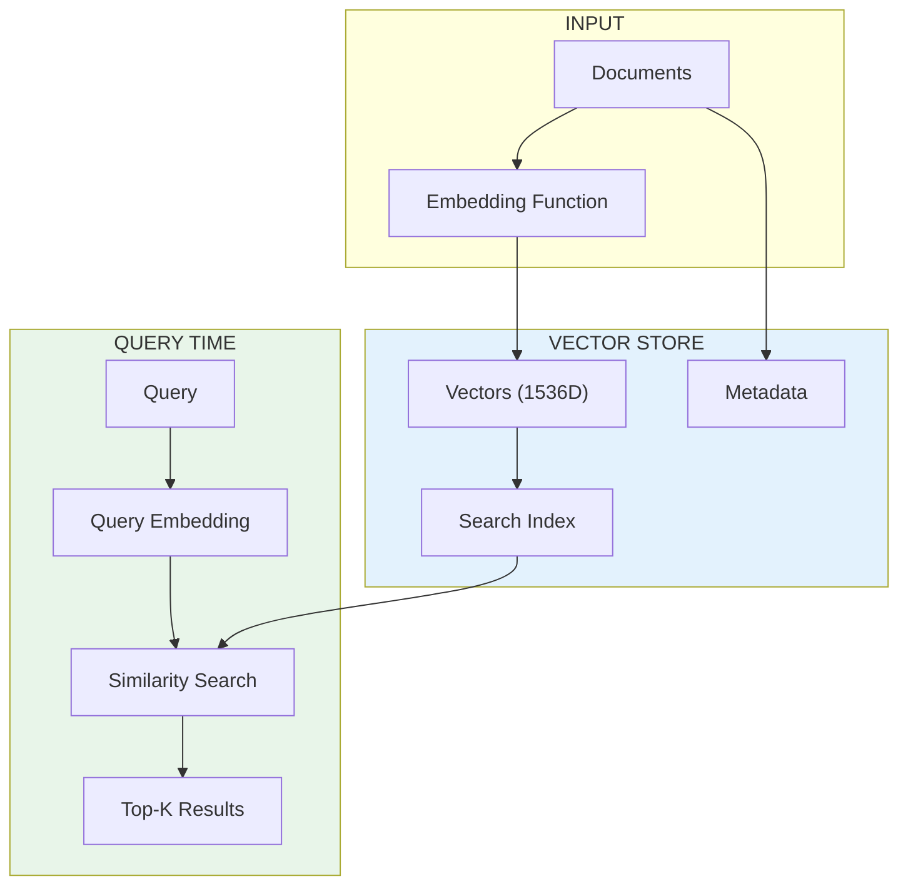
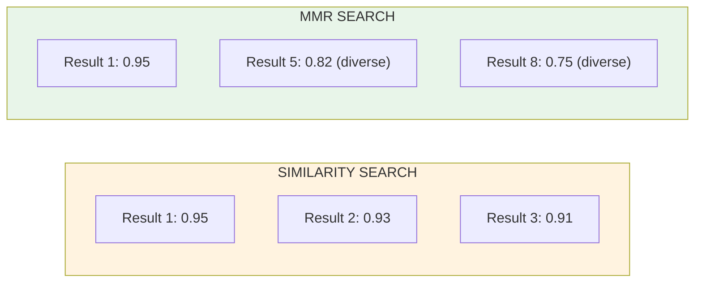

# Lesson 8.23: Vector Stores

> **Duration**: 30 min | **Section**: E - LangChain RAG Pipeline

## 🎯 The Problem (3-5 min)

You built vector search with NumPy in Section C. But:
- All vectors in memory (crashes with millions)
- No persistence (reload every restart)
- No filtering by metadata
- Slow linear search

**Vector stores** solve these with specialized databases for embeddings.

## 🧪 Try It: ChromaDB

```python
# pip install langchain-chroma chromadb

from langchain_chroma import Chroma
from langchain_openai import OpenAIEmbeddings

# Create embedding function
embeddings = OpenAIEmbeddings(model="text-embedding-3-small")

# Create vector store
vectorstore = Chroma(
    collection_name="my_collection",
    embedding_function=embeddings,
    persist_directory="./chroma_db",  # Persist to disk
)

# Add documents
texts = [
    "Python is a programming language",
    "JavaScript runs in browsers",
    "Rust is known for memory safety",
]

vectorstore.add_texts(texts)
print("Added 3 documents!")
```

## 🔍 Under the Hood: Vector Store Architecture



## 🔎 Searching the Vector Store

```python
from langchain_chroma import Chroma
from langchain_openai import OpenAIEmbeddings

embeddings = OpenAIEmbeddings(model="text-embedding-3-small")

# Assume vectorstore is already populated
vectorstore = Chroma(
    collection_name="my_collection",
    embedding_function=embeddings,
    persist_directory="./chroma_db",
)

# Simple similarity search
results = vectorstore.similarity_search(
    query="What language is good for web?",
    k=2,  # Top 2 results
)

for doc in results:
    print(f"Content: {doc.page_content}")
    print(f"Metadata: {doc.metadata}\n")
```

## 📊 Search with Scores

```python
# Get similarity scores along with results
results_with_scores = vectorstore.similarity_search_with_score(
    query="memory safe language",
    k=3,
)

for doc, score in results_with_scores:
    print(f"Score: {score:.4f}")
    print(f"Content: {doc.page_content}\n")
```

**Note:** Lower scores = more similar (distance-based). Some stores use higher = more similar (similarity-based).

## 📦 Adding Documents with Metadata

```python
from langchain_core.documents import Document
from langchain_chroma import Chroma
from langchain_openai import OpenAIEmbeddings

embeddings = OpenAIEmbeddings(model="text-embedding-3-small")

# Create documents with metadata
documents = [
    Document(
        page_content="Python is great for data science",
        metadata={"source": "intro.pdf", "page": 1, "topic": "python"}
    ),
    Document(
        page_content="JavaScript powers the web",
        metadata={"source": "web.pdf", "page": 1, "topic": "javascript"}
    ),
    Document(
        page_content="Rust prevents memory bugs",
        metadata={"source": "systems.pdf", "page": 1, "topic": "rust"}
    ),
]

vectorstore = Chroma.from_documents(
    documents=documents,
    embedding=embeddings,
    persist_directory="./chroma_db",
)
```

## 🎯 Filtering by Metadata

```python
# Search only in Python-related documents
results = vectorstore.similarity_search(
    query="What is it used for?",
    k=2,
    filter={"topic": "python"},  # Metadata filter!
)

for doc in results:
    print(f"Topic: {doc.metadata['topic']}")
    print(f"Content: {doc.page_content}\n")
```

## 🗄️ Vector Store Options

| Store | Type | Best For |
|-------|------|----------|
| **Chroma** | Local/Embedded | Prototyping, small-medium data |
| **FAISS** | Local | Fast search, larger datasets |
| **Pinecone** | Cloud | Production, managed service |
| **Weaviate** | Self-hosted/Cloud | Complex filtering, hybrid search |
| **Qdrant** | Self-hosted/Cloud | High performance, filtering |
| **Milvus** | Self-hosted | Massive scale |

### FAISS Example

```python
# pip install faiss-cpu  (or faiss-gpu)

from langchain_community.vectorstores import FAISS
from langchain_openai import OpenAIEmbeddings

embeddings = OpenAIEmbeddings(model="text-embedding-3-small")

texts = ["Python is great", "JavaScript is popular", "Rust is fast"]

# Create FAISS vectorstore
vectorstore = FAISS.from_texts(texts, embeddings)

# Save to disk
vectorstore.save_local("faiss_index")

# Load from disk
loaded_vectorstore = FAISS.load_local(
    "faiss_index",
    embeddings,
    allow_dangerous_deserialization=True,
)
```

## 🔧 Creating a Retriever

Vector stores can become retrievers for chains:

```python
from langchain_chroma import Chroma
from langchain_openai import OpenAIEmbeddings

embeddings = OpenAIEmbeddings(model="text-embedding-3-small")
vectorstore = Chroma(
    collection_name="my_docs",
    embedding_function=embeddings,
    persist_directory="./chroma_db",
)

# Convert to retriever
retriever = vectorstore.as_retriever(
    search_type="similarity",  # or "mmr" for diversity
    search_kwargs={"k": 4},    # Top 4 results
)

# Use in a chain
docs = retriever.invoke("What is Python?")
for doc in docs:
    print(doc.page_content)
```

## 📈 MMR: Maximum Marginal Relevance

Avoid getting redundant results:

```python
# MMR balances relevance with diversity
retriever = vectorstore.as_retriever(
    search_type="mmr",
    search_kwargs={
        "k": 4,              # Final number of results
        "fetch_k": 20,       # Candidates to consider
        "lambda_mult": 0.5,  # 0 = max diversity, 1 = max relevance
    },
)
```



## 💥 Where It Breaks: Embedding Mismatch

```python
# ❌ WRONG: Different embedding dimensions
embeddings_small = OpenAIEmbeddings(model="text-embedding-3-small")  # 1536D
embeddings_large = OpenAIEmbeddings(model="text-embedding-3-large")  # 3072D

# Created with small
vectorstore = Chroma.from_texts(texts, embeddings_small)

# Querying with large - FAILS!
# vectorstore = Chroma(embedding_function=embeddings_large)

# ✅ CORRECT: Same embedding model for indexing and querying
vectorstore = Chroma(
    collection_name="my_collection",
    embedding_function=embeddings_small,  # Same model!
)
```

## 🔁 Your Manual Code vs LangChain

```python
# ========== YOUR MANUAL CODE ==========
import numpy as np
from openai import OpenAI

client = OpenAI()

class ManualVectorStore:
    def __init__(self):
        self.texts = []
        self.embeddings = []
    
    def add(self, texts):
        for text in texts:
            response = client.embeddings.create(
                model="text-embedding-3-small",
                input=text
            )
            self.texts.append(text)
            self.embeddings.append(response.data[0].embedding)
    
    def search(self, query, k=3):
        query_emb = client.embeddings.create(
            model="text-embedding-3-small",
            input=query
        ).data[0].embedding
        
        similarities = [
            np.dot(query_emb, emb) / (np.linalg.norm(query_emb) * np.linalg.norm(emb))
            for emb in self.embeddings
        ]
        # ... sort and return top k

# ========== LANGCHAIN ==========
from langchain_chroma import Chroma
from langchain_openai import OpenAIEmbeddings

vectorstore = Chroma.from_texts(texts, OpenAIEmbeddings())
results = vectorstore.similarity_search(query, k=3)  # Done!
```

## 🎯 Practice

Build a complete vector store workflow:

```python
from langchain_chroma import Chroma
from langchain_openai import OpenAIEmbeddings
from langchain_core.documents import Document

# 1. Create embeddings function
embeddings = OpenAIEmbeddings(model="text-embedding-3-small")

# 2. Create documents with metadata
documents = [
    Document(
        page_content="Machine learning uses algorithms to learn from data.",
        metadata={"category": "ml", "difficulty": "beginner"}
    ),
    Document(
        page_content="Deep learning uses neural networks with many layers.",
        metadata={"category": "ml", "difficulty": "intermediate"}
    ),
    Document(
        page_content="Python is the most popular language for ML.",
        metadata={"category": "programming", "difficulty": "beginner"}
    ),
    Document(
        page_content="TensorFlow and PyTorch are deep learning frameworks.",
        metadata={"category": "ml", "difficulty": "intermediate"}
    ),
    Document(
        page_content="Scikit-learn is great for traditional ML algorithms.",
        metadata={"category": "ml", "difficulty": "beginner"}
    ),
]

# 3. Create vector store
print("=== Creating Vector Store ===")
vectorstore = Chroma.from_documents(
    documents=documents,
    embedding=embeddings,
    collection_name="ml_docs",
)
print(f"Created store with {len(documents)} documents")

# 4. Simple search
print("\n=== Simple Search ===")
results = vectorstore.similarity_search("What framework should I use?", k=2)
for doc in results:
    print(f"  - {doc.page_content}")

# 5. Search with scores
print("\n=== Search with Scores ===")
results = vectorstore.similarity_search_with_score("neural networks", k=2)
for doc, score in results:
    print(f"  Score: {score:.4f} - {doc.page_content[:50]}...")

# 6. Filtered search
print("\n=== Filtered Search (beginner only) ===")
results = vectorstore.similarity_search(
    "machine learning",
    k=3,
    filter={"difficulty": "beginner"}
)
for doc in results:
    print(f"  [{doc.metadata['difficulty']}] {doc.page_content}")

# 7. Create retriever
print("\n=== Retriever ===")
retriever = vectorstore.as_retriever(search_kwargs={"k": 2})
docs = retriever.invoke("deep learning")
for doc in docs:
    print(f"  - {doc.page_content[:60]}...")
```

## 🔑 Key Takeaways

- **Vector stores = databases for embeddings** - persist, search, filter
- **Chroma** - easy local development, good for prototyping
- **FAISS** - fast, good for medium-scale local deployments
- **Cloud options** - Pinecone, Weaviate for production scale
- **as_retriever()** - converts to LangChain retriever interface
- **MMR** - balances relevance with diversity

## ❓ Common Questions

| Question | Answer |
|----------|--------|
| Which vector store for production? | Pinecone (managed) or Qdrant (self-hosted) |
| How many vectors can Chroma handle? | Millions, but query speed degrades |
| Can I update documents? | Delete and re-add. Some stores support updates. |
| How to handle changing embeddings? | Rebuild index with new embedding model |

---

## 📚 Further Reading

- [Vector Stores Concepts](https://python.langchain.com/docs/concepts/vectorstores/) - Overview
- [All Vector Stores](https://python.langchain.com/docs/integrations/vectorstores/) - Full list
- [Chroma Guide](https://python.langchain.com/docs/integrations/vectorstores/chroma/) - ChromaDB
- [FAISS Guide](https://python.langchain.com/docs/integrations/vectorstores/faiss/) - Facebook AI
