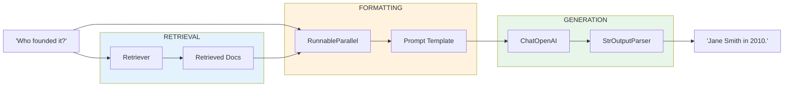
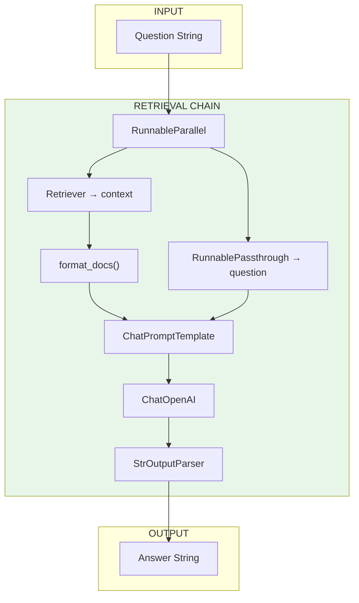

# Lesson 8.24: Retrieval Chain

> **Duration**: 30 min | **Section**: E - LangChain RAG Pipeline

## 🎯 The Problem (3-5 min)

You have:
- Vector store with documents ✅
- Retriever that finds relevant chunks ✅
- LLM that can generate answers ✅

But how do you connect them into a **question-answering chain**?

```
User Question → Retrieve Context → Format Prompt → Generate Answer
```

## 🧪 Try It: Basic Retrieval Chain

```python
from langchain_openai import ChatOpenAI, OpenAIEmbeddings
from langchain_chroma import Chroma
from langchain_core.prompts import ChatPromptTemplate
from langchain_core.runnables import RunnablePassthrough
from langchain_core.output_parsers import StrOutputParser

# 1. Set up vector store
embeddings = OpenAIEmbeddings(model="text-embedding-3-small")

texts = [
    "The company was founded in 2010 by Jane Smith.",
    "Our headquarters is in San Francisco, California.",
    "We have 500 employees across 3 offices.",
    "The CEO is John Doe, who joined in 2015.",
    "Our main product is an AI-powered analytics platform.",
]

vectorstore = Chroma.from_texts(texts, embeddings)
retriever = vectorstore.as_retriever(search_kwargs={"k": 2})

# 2. Create prompt template
template = """Answer the question based only on the following context:

Context:
{context}

Question: {question}

Answer:"""

prompt = ChatPromptTemplate.from_template(template)

# 3. Create LLM
llm = ChatOpenAI(model="gpt-4", temperature=0)

# 4. Build the chain
chain = (
    {"context": retriever, "question": RunnablePassthrough()}
    | prompt
    | llm
    | StrOutputParser()
)

# 5. Use it!
answer = chain.invoke("Who founded the company?")
print(answer)
```

**Output:**
```
The company was founded by Jane Smith in 2010.
```

## 🔍 Under the Hood: Chain Data Flow



## 📦 The Key Pattern: RunnableParallel

```python
# This creates parallel branches
{
    "context": retriever,           # Branch 1: retrieve docs
    "question": RunnablePassthrough()  # Branch 2: pass question through
}
```

When you invoke with `"Who founded the company?"`:
- `context` → runs retriever → gets documents
- `question` → passes through → `"Who founded the company?"`

Both results feed into the prompt template!

## 🔧 Formatting Retrieved Documents

The retriever returns `List[Document]`. Format them nicely:

```python
from langchain_core.documents import Document

def format_docs(docs: list[Document]) -> str:
    """Format documents into a single string."""
    return "\n\n".join(doc.page_content for doc in docs)

# Updated chain with formatting
chain = (
    {"context": retriever | format_docs, "question": RunnablePassthrough()}
    | prompt
    | llm
    | StrOutputParser()
)
```

Now the context is a clean string instead of a list.

## 📋 Including Source Citations

Track which documents were used:

```python
from langchain_core.runnables import RunnableParallel

# Chain that returns both answer and sources
def get_sources(docs: list) -> list[str]:
    return [doc.metadata.get("source", "unknown") for doc in docs]

rag_chain = RunnableParallel(
    answer=(
        {"context": retriever | format_docs, "question": RunnablePassthrough()}
        | prompt
        | llm
        | StrOutputParser()
    ),
    sources=retriever | get_sources,
)

result = rag_chain.invoke("Who is the CEO?")
print(f"Answer: {result['answer']}")
print(f"Sources: {result['sources']}")
```

## 🌊 Streaming Responses

```python
# The chain already supports streaming!
for chunk in chain.stream("Where is the headquarters?"):
    print(chunk, end="", flush=True)
print()
```

## 💬 Conversational RAG

Add chat history for follow-up questions:

```python
from langchain_core.prompts import ChatPromptTemplate, MessagesPlaceholder
from langchain_core.messages import HumanMessage, AIMessage

# Prompt with history
conversational_prompt = ChatPromptTemplate.from_messages([
    ("system", "Answer based on the context. If you don't know, say so."),
    MessagesPlaceholder(variable_name="chat_history"),
    ("human", """Context:
{context}

Question: {question}"""),
])

# Build chain
conversational_chain = (
    {
        "context": retriever | format_docs,
        "question": lambda x: x["question"],
        "chat_history": lambda x: x["chat_history"],
    }
    | conversational_prompt
    | llm
    | StrOutputParser()
)

# Use with history
chat_history = []

# First question
answer1 = conversational_chain.invoke({
    "question": "Who is the CEO?",
    "chat_history": chat_history,
})
print(f"Q: Who is the CEO?\nA: {answer1}\n")

# Update history
chat_history.extend([
    HumanMessage(content="Who is the CEO?"),
    AIMessage(content=answer1),
])

# Follow-up question
answer2 = conversational_chain.invoke({
    "question": "When did they join?",
    "chat_history": chat_history,
})
print(f"Q: When did they join?\nA: {answer2}")
```

## 💥 Where It Breaks: No Relevant Context

```python
# Question not in documents
answer = chain.invoke("What's the stock price?")
print(answer)
# "I don't have information about the stock price in the provided context."
```

**The prompt matters!** Include instructions for handling missing info:

```python
template = """Answer based only on the following context.
If the information is not in the context, say "I don't know based on the available information."

Context:
{context}

Question: {question}

Answer:"""
```

## 📊 Chain Components Summary



## 🎯 Practice

Build a complete retrieval chain:

```python
from langchain_openai import ChatOpenAI, OpenAIEmbeddings
from langchain_chroma import Chroma
from langchain_core.prompts import ChatPromptTemplate
from langchain_core.runnables import RunnablePassthrough, RunnableParallel
from langchain_core.output_parsers import StrOutputParser
from langchain_core.documents import Document

# 1. Create knowledge base
print("=== Building Knowledge Base ===")
embeddings = OpenAIEmbeddings(model="text-embedding-3-small")

documents = [
    Document(
        page_content="Python was created by Guido van Rossum and released in 1991.",
        metadata={"source": "python_history.txt"}
    ),
    Document(
        page_content="Python emphasizes code readability with its notable use of whitespace.",
        metadata={"source": "python_design.txt"}
    ),
    Document(
        page_content="Popular Python frameworks include Django for web and PyTorch for ML.",
        metadata={"source": "python_frameworks.txt"}
    ),
    Document(
        page_content="Python 3.12 was released in October 2023 with performance improvements.",
        metadata={"source": "python_versions.txt"}
    ),
]

vectorstore = Chroma.from_documents(documents, embeddings)
retriever = vectorstore.as_retriever(search_kwargs={"k": 2})
print(f"Created vector store with {len(documents)} documents")

# 2. Format function
def format_docs(docs):
    return "\n\n".join(
        f"[{doc.metadata['source']}]: {doc.page_content}"
        for doc in docs
    )

# 3. Create prompt
prompt = ChatPromptTemplate.from_template("""Answer based on this context:

{context}

Question: {question}

Answer concisely:""")

# 4. Create chain
llm = ChatOpenAI(model="gpt-4", temperature=0)

chain = (
    {"context": retriever | format_docs, "question": RunnablePassthrough()}
    | prompt
    | llm
    | StrOutputParser()
)

# 5. Test questions
print("\n=== Testing Questions ===")
questions = [
    "Who created Python?",
    "What is Python known for?",
    "What's the latest Python version?",
    "What is the capital of France?",  # Not in context
]

for q in questions:
    print(f"\nQ: {q}")
    answer = chain.invoke(q)
    print(f"A: {answer}")

# 6. With sources
print("\n=== With Sources ===")
def get_sources(docs):
    return [doc.metadata["source"] for doc in docs]

chain_with_sources = RunnableParallel(
    answer=chain,
    sources=retriever | get_sources,
)

result = chain_with_sources.invoke("What frameworks use Python?")
print(f"Answer: {result['answer']}")
print(f"Sources: {result['sources']}")

# 7. Streaming
print("\n=== Streaming ===")
print("Q: Tell me about Python's history")
print("A: ", end="")
for chunk in chain.stream("Tell me about Python's history"):
    print(chunk, end="", flush=True)
print()
```

## 🔑 Key Takeaways

- **RunnableParallel** branches input to retriever AND passthrough
- **format_docs()** converts document list to string
- **Chain composition** with `|` makes it readable
- **Streaming works automatically** on the chain
- **Add sources** by running retriever in parallel

## ❓ Common Questions

| Question | Answer |
|----------|--------|
| How many documents to retrieve? | Start with 3-5, tune based on context window and quality |
| What if retrieved docs are irrelevant? | Add relevance threshold, improve chunking/embeddings |
| Can I use different LLMs? | Yes, swap ChatOpenAI for any LangChain chat model |
| Memory across sessions? | Store chat history externally (Redis, DB) |

---

## 📚 Further Reading

- [RAG Tutorial](https://python.langchain.com/docs/tutorials/rag/) - Official guide
- [Retrieval Concepts](https://python.langchain.com/docs/concepts/retrieval/) - Deep dive
- [How to Stream](https://python.langchain.com/docs/how_to/streaming/) - Streaming guide
