# Lesson 8.25: Full RAG Chain

> **Duration**: 35 min | **Section**: E - LangChain RAG Pipeline

## 🎯 The Problem (3-5 min)

You've learned individual components:
- Document loaders ✅
- Text splitters ✅
- Vector stores ✅
- Retrieval chains ✅

Now let's build a **complete, production-ready RAG pipeline** from raw documents to answers.

## 🧪 Try It: Complete RAG Pipeline

```python
from langchain_openai import ChatOpenAI, OpenAIEmbeddings
from langchain_chroma import Chroma
from langchain_community.document_loaders import PyPDFLoader
from langchain_text_splitters import RecursiveCharacterTextSplitter
from langchain_core.prompts import ChatPromptTemplate
from langchain_core.runnables import RunnablePassthrough
from langchain_core.output_parsers import StrOutputParser

# ============ INDEXING PHASE ============

# 1. Load documents
loader = PyPDFLoader("company_handbook.pdf")
documents = loader.load()
print(f"Loaded {len(documents)} pages")

# 2. Split into chunks
splitter = RecursiveCharacterTextSplitter(
    chunk_size=1000,
    chunk_overlap=200,
)
chunks = splitter.split_documents(documents)
print(f"Split into {len(chunks)} chunks")

# 3. Create embeddings and store
embeddings = OpenAIEmbeddings(model="text-embedding-3-small")
vectorstore = Chroma.from_documents(
    documents=chunks,
    embedding=embeddings,
    persist_directory="./rag_db",
)
print("Created vector store")

# ============ QUERY PHASE ============

# 4. Create retriever
retriever = vectorstore.as_retriever(search_kwargs={"k": 4})

# 5. Create prompt
prompt = ChatPromptTemplate.from_template("""You are a helpful assistant that answers questions about our company.
Use only the provided context. If you don't know, say "I don't have that information."

Context:
{context}

Question: {question}

Answer:""")

# 6. Create LLM
llm = ChatOpenAI(model="gpt-4", temperature=0)

# 7. Build chain
def format_docs(docs):
    return "\n\n---\n\n".join(doc.page_content for doc in docs)

rag_chain = (
    {"context": retriever | format_docs, "question": RunnablePassthrough()}
    | prompt
    | llm
    | StrOutputParser()
)

# 8. Query!
answer = rag_chain.invoke("What is the vacation policy?")
print(f"\nAnswer: {answer}")
```

## 🔍 Under the Hood: Complete Pipeline

```mermaid
flowchart TD
    subgraph Indexing["📥 INDEXING (One-time)"]
        PDF["PDF Files"]
        Load["Document Loader"]
        Split["Text Splitter"]
        Embed["Embeddings"]
        Store["Vector Store"]
        
        PDF --> Load --> Split --> Embed --> Store
    end
    
    subgraph Query["🔍 QUERY (Per question)"]
        Q["Question"]
        QEmbed["Embed Query"]
        Search["Vector Search"]
        Context["Top-K Context"]
        Prompt["Format Prompt"]
        LLM["LLM Generate"]
        Answer["Answer"]
        
        Q --> QEmbed --> Search --> Context --> Prompt --> LLM --> Answer
    end
    
    Store -.-> Search
    
    style Indexing fill:#E3F2FD
    style Query fill:#E8F5E9
```



## 📦 Modular RAG Class

Wrap it in a reusable class:

```python
from langchain_openai import ChatOpenAI, OpenAIEmbeddings
from langchain_chroma import Chroma
from langchain_text_splitters import RecursiveCharacterTextSplitter
from langchain_core.prompts import ChatPromptTemplate
from langchain_core.runnables import RunnablePassthrough
from langchain_core.output_parsers import StrOutputParser
from langchain_core.documents import Document


class RAGPipeline:
    """A complete RAG pipeline with LangChain."""
    
    def __init__(
        self,
        persist_directory: str = "./rag_db",
        collection_name: str = "documents",
        chunk_size: int = 1000,
        chunk_overlap: int = 200,
        k: int = 4,
    ):
        self.embeddings = OpenAIEmbeddings(model="text-embedding-3-small")
        self.splitter = RecursiveCharacterTextSplitter(
            chunk_size=chunk_size,
            chunk_overlap=chunk_overlap,
        )
        self.llm = ChatOpenAI(model="gpt-4", temperature=0)
        
        self.vectorstore = Chroma(
            collection_name=collection_name,
            embedding_function=self.embeddings,
            persist_directory=persist_directory,
        )
        
        self.k = k
        self._chain = None
    
    def add_documents(self, documents: list[Document]):
        """Add documents to the vector store."""
        chunks = self.splitter.split_documents(documents)
        self.vectorstore.add_documents(chunks)
        self._chain = None  # Reset chain
        return len(chunks)
    
    def add_texts(self, texts: list[str], metadata: dict = None):
        """Add raw texts to the vector store."""
        if metadata is None:
            metadata = {}
        documents = [
            Document(page_content=text, metadata=metadata)
            for text in texts
        ]
        return self.add_documents(documents)
    
    @property
    def chain(self):
        """Lazy-build the RAG chain."""
        if self._chain is None:
            retriever = self.vectorstore.as_retriever(
                search_kwargs={"k": self.k}
            )
            
            prompt = ChatPromptTemplate.from_template(
                """Answer based on this context:

{context}

Question: {question}

Answer:"""
            )
            
            def format_docs(docs):
                return "\n\n".join(doc.page_content for doc in docs)
            
            self._chain = (
                {"context": retriever | format_docs, "question": RunnablePassthrough()}
                | prompt
                | self.llm
                | StrOutputParser()
            )
        
        return self._chain
    
    def query(self, question: str) -> str:
        """Query the RAG system."""
        return self.chain.invoke(question)
    
    def stream(self, question: str):
        """Stream the response."""
        for chunk in self.chain.stream(question):
            yield chunk


# Usage
rag = RAGPipeline()

# Add some knowledge
rag.add_texts([
    "Our company offers 20 days of paid vacation per year.",
    "Remote work is allowed 3 days per week.",
    "Health insurance covers dental and vision.",
])

# Query
print(rag.query("How many vacation days do I get?"))
```

## 🔧 Advanced: Custom Prompt per Query

```python
from langchain_core.prompts import ChatPromptTemplate

def create_custom_chain(retriever, llm, system_prompt: str):
    """Create a chain with a custom system prompt."""
    
    prompt = ChatPromptTemplate.from_messages([
        ("system", system_prompt),
        ("human", """Context:
{context}

Question: {question}"""),
    ])
    
    def format_docs(docs):
        return "\n\n".join(doc.page_content for doc in docs)
    
    return (
        {"context": retriever | format_docs, "question": RunnablePassthrough()}
        | prompt
        | llm
        | StrOutputParser()
    )

# Create different chains for different purposes
hr_chain = create_custom_chain(
    retriever,
    llm,
    "You are an HR assistant. Be professional and cite specific policies."
)

casual_chain = create_custom_chain(
    retriever,
    llm,
    "You are a friendly coworker. Be casual and helpful."
)

# Same question, different styles
print("HR Style:", hr_chain.invoke("vacation policy?"))
print("Casual Style:", casual_chain.invoke("vacation policy?"))
```

## 📊 Adding Metadata Filtering

```python
# Add documents with metadata
documents = [
    Document(
        page_content="Engineering team uses Python and JavaScript.",
        metadata={"department": "engineering", "year": 2024}
    ),
    Document(
        page_content="Sales team uses Salesforce CRM.",
        metadata={"department": "sales", "year": 2024}
    ),
    Document(
        page_content="Engineering budget for 2024 is $2M.",
        metadata={"department": "engineering", "year": 2024}
    ),
]

vectorstore = Chroma.from_documents(documents, embeddings)

# Filter by department
retriever = vectorstore.as_retriever(
    search_kwargs={
        "k": 2,
        "filter": {"department": "engineering"}
    }
)

# Only searches engineering docs!
```

## 🌊 Full Streaming Example

```python
import sys

def stream_answer(rag_chain, question: str):
    """Stream answer with nice formatting."""
    print(f"\n❓ {question}")
    print("💬 ", end="")
    
    for chunk in rag_chain.stream(question):
        print(chunk, end="", flush=True)
    
    print("\n")

# Usage
stream_answer(rag_chain, "What are the work from home policies?")
```

## 💥 Where It Breaks: Common Issues

### 1. Empty Results

```python
# Check if retriever returns anything
docs = retriever.invoke("my question")
if not docs:
    print("No documents found!")
```

### 2. Irrelevant Results

```python
# Use similarity_search_with_score to debug
results = vectorstore.similarity_search_with_score("query", k=5)
for doc, score in results:
    print(f"Score: {score:.4f}")
    print(f"Content: {doc.page_content[:100]}...")
```

### 3. Context Too Long

```python
# Limit context size
def format_docs_limited(docs, max_chars=4000):
    formatted = []
    total = 0
    for doc in docs:
        if total + len(doc.page_content) > max_chars:
            break
        formatted.append(doc.page_content)
        total += len(doc.page_content)
    return "\n\n".join(formatted)
```

## 🔁 Compare: Manual vs LangChain RAG


**LangChain adds:**
- Streaming for free
- Async for free
- Easy model swapping
- Persistence built-in
- Metadata filtering

## 🎯 Practice

Build a complete RAG system:

```python
from langchain_openai import ChatOpenAI, OpenAIEmbeddings
from langchain_chroma import Chroma
from langchain_text_splitters import RecursiveCharacterTextSplitter
from langchain_core.prompts import ChatPromptTemplate
from langchain_core.runnables import RunnablePassthrough, RunnableParallel
from langchain_core.output_parsers import StrOutputParser
from langchain_core.documents import Document

# 1. Create knowledge base
print("=== Creating Knowledge Base ===")

knowledge = [
    Document(
        page_content="Python was created by Guido van Rossum in 1991. It was named after Monty Python.",
        metadata={"topic": "history", "language": "python"}
    ),
    Document(
        page_content="Python uses indentation for code blocks instead of braces. This enforces readable code.",
        metadata={"topic": "syntax", "language": "python"}
    ),
    Document(
        page_content="Popular Python libraries include NumPy for numerics, Pandas for data, and Django for web.",
        metadata={"topic": "libraries", "language": "python"}
    ),
    Document(
        page_content="JavaScript was created by Brendan Eich in 1995 in just 10 days at Netscape.",
        metadata={"topic": "history", "language": "javascript"}
    ),
    Document(
        page_content="JavaScript runs in browsers and with Node.js on servers. It's the language of the web.",
        metadata={"topic": "usage", "language": "javascript"}
    ),
]

embeddings = OpenAIEmbeddings(model="text-embedding-3-small")
splitter = RecursiveCharacterTextSplitter(chunk_size=200, chunk_overlap=20)

chunks = splitter.split_documents(knowledge)
print(f"Created {len(chunks)} chunks")

vectorstore = Chroma.from_documents(chunks, embeddings)
print("Vector store ready!")

# 2. Create retriever
retriever = vectorstore.as_retriever(search_kwargs={"k": 2})

# 3. Create chain
def format_docs(docs):
    return "\n\n".join(f"[{doc.metadata['topic']}] {doc.page_content}" for doc in docs)

def get_sources(docs):
    return list(set(doc.metadata.get("topic", "unknown") for doc in docs))

prompt = ChatPromptTemplate.from_template("""Answer the question based on this context:

{context}

Question: {question}

Provide a concise answer:""")

llm = ChatOpenAI(model="gpt-4", temperature=0)

# Main chain
rag_chain = (
    {"context": retriever | format_docs, "question": RunnablePassthrough()}
    | prompt
    | llm
    | StrOutputParser()
)

# Chain with sources
rag_with_sources = RunnableParallel(
    answer=rag_chain,
    sources=retriever | get_sources,
)

# 4. Test it!
print("\n=== Testing RAG ===")

questions = [
    "Who created Python?",
    "What's special about Python syntax?",
    "How was JavaScript created?",
    "What can you use JavaScript for?",
]

for q in questions:
    print(f"\n❓ {q}")
    result = rag_with_sources.invoke(q)
    print(f"💬 {result['answer']}")
    print(f"📚 Sources: {result['sources']}")

# 5. Filtered search
print("\n=== Filtered Search (Python only) ===")
python_retriever = vectorstore.as_retriever(
    search_kwargs={"k": 2, "filter": {"language": "python"}}
)

# Even asking about JavaScript, only Python docs returned
docs = python_retriever.invoke("What programming language was created in the 90s?")
for doc in docs:
    print(f"  [{doc.metadata['language']}] {doc.page_content[:50]}...")

# 6. Streaming
print("\n=== Streaming Response ===")
print("Q: Tell me about Python")
print("A: ", end="")
for chunk in rag_chain.stream("Tell me about Python"):
    print(chunk, end="", flush=True)
print()
```

## 🔑 Key Takeaways

- **Full pipeline** = Load → Split → Embed → Store → Retrieve → Generate
- **Indexing is one-time**, querying is per-request
- **Wrap in a class** for reusability
- **Add metadata** for filtering and citations
- **Stream responses** for better UX

## ❓ Common Questions

| Question | Answer |
|----------|--------|
| How to update documents? | Delete and re-add, or use `upsert` if supported |
| Best chunk size? | 500-1000 chars, experiment for your content |
| How many docs to retrieve? | 3-5 for most cases, tune based on quality |
| When to rebuild index? | When source docs change significantly |

---

## 📚 Further Reading

- [RAG Tutorial](https://python.langchain.com/docs/tutorials/rag/) - Complete walkthrough
- [Q&A with RAG](https://python.langchain.com/docs/tutorials/qa_chat_history/) - With chat history
- [Advanced RAG](https://python.langchain.com/docs/how_to/#qa-with-rag) - Techniques
