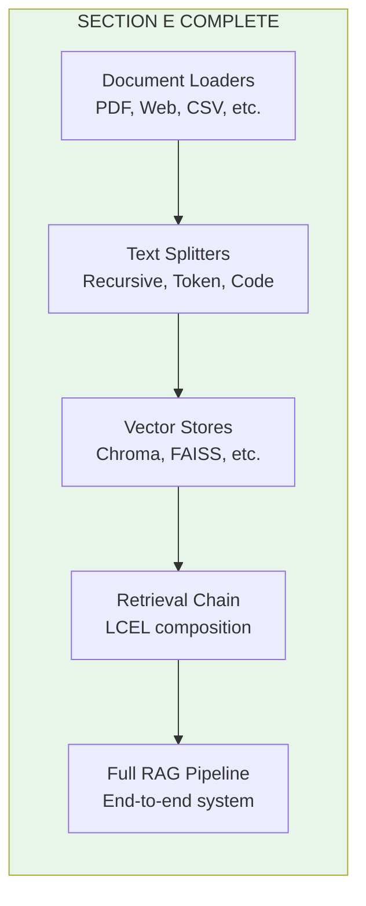

# Lesson 8.26: LangChain RAG Q&A

> **Duration**: 20 min | **Section**: E - LangChain RAG Pipeline

## 🎯 Section E Recap

You've learned to build RAG pipelines with LangChain:



## 📊 Component Summary

| Component | LangChain Class | Key Methods |
|-----------|-----------------|-------------|
| **Load** | `PyPDFLoader`, `WebBaseLoader` | `.load()`, `.lazy_load()` |
| **Split** | `RecursiveCharacterTextSplitter` | `.split_documents()` |
| **Embed** | `OpenAIEmbeddings` | Auto via vector store |
| **Store** | `Chroma`, `FAISS` | `.from_documents()`, `.as_retriever()` |
| **Retrieve** | Retriever | `.invoke(query)` |
| **Generate** | `ChatOpenAI` | Via LCEL chain |

## 🔁 LangChain vs Manual RAG

```python
# ========== MANUAL (Section C) ==========
# ~200 lines of code
# - PyPDF for PDF parsing
# - Custom chunking logic
# - OpenAI embeddings API directly
# - NumPy for similarity search
# - Custom prompt formatting

# ========== LANGCHAIN (Section E) ==========
# ~50 lines of code
from langchain_community.document_loaders import PyPDFLoader
from langchain_text_splitters import RecursiveCharacterTextSplitter
from langchain_chroma import Chroma
from langchain_openai import ChatOpenAI, OpenAIEmbeddings
from langchain_core.prompts import ChatPromptTemplate
from langchain_core.runnables import RunnablePassthrough
from langchain_core.output_parsers import StrOutputParser

# Load → Split → Store
docs = PyPDFLoader("file.pdf").load()
chunks = RecursiveCharacterTextSplitter(chunk_size=1000).split_documents(docs)
vectorstore = Chroma.from_documents(chunks, OpenAIEmbeddings())

# Chain
chain = (
    {"context": vectorstore.as_retriever() | format_docs, "question": RunnablePassthrough()}
    | ChatPromptTemplate.from_template("Context: {context}\n\nQ: {question}")
    | ChatOpenAI(model="gpt-4")
    | StrOutputParser()
)

# Query
answer = chain.invoke("What is X?")
```

## ❓ Self-Assessment Questions

### Knowledge Check

| Question | Can You Answer? |
|----------|----------------|
| What does `Document` contain? | `page_content` + `metadata` |
| How to persist ChromaDB? | `persist_directory` parameter |
| What does `RunnablePassthrough` do? | Passes input unchanged |
| How to get similarity scores? | `similarity_search_with_score()` |
| What's MMR retrieval? | Maximum Marginal Relevance - adds diversity |

### Code Check

Can you:
- [ ] Load a PDF into Documents?
- [ ] Split documents with overlap?
- [ ] Create and query a vector store?
- [ ] Build a retrieval chain with LCEL?
- [ ] Add metadata filtering?
- [ ] Stream responses?

## 🧩 Common Patterns

### Pattern 1: Basic RAG

```python
chain = (
    {"context": retriever | format_docs, "question": RunnablePassthrough()}
    | prompt
    | llm
    | StrOutputParser()
)
```

### Pattern 2: RAG with Sources

```python
from langchain_core.runnables import RunnableParallel

chain_with_sources = RunnableParallel(
    answer=rag_chain,
    sources=retriever | (lambda docs: [d.metadata["source"] for d in docs]),
)
```

### Pattern 3: Conversational RAG

```python
from langchain_core.prompts import MessagesPlaceholder

prompt = ChatPromptTemplate.from_messages([
    ("system", "Use context to answer."),
    MessagesPlaceholder("chat_history"),
    ("human", "Context: {context}\n\nQuestion: {question}"),
])
```

### Pattern 4: Filtered Search

```python
retriever = vectorstore.as_retriever(
    search_kwargs={
        "k": 4,
        "filter": {"department": "engineering"}
    }
)
```

## 💥 Common Pitfalls

| Pitfall | Solution |
|---------|----------|
| Empty retrieval results | Check if documents were added, verify query relevance |
| Wrong embedding model | Use same model for indexing and querying |
| Context too long | Reduce chunk size or number of retrieved docs |
| No persistence | Add `persist_directory` to Chroma |
| Missing dependencies | `pip install langchain-chroma chromadb` |

## 🔧 Debugging Tips

```python
# 1. Check what's in the vector store
print(f"Collection size: {vectorstore._collection.count()}")

# 2. Test retriever directly
docs = retriever.invoke("test query")
print(f"Retrieved {len(docs)} documents")
for doc in docs:
    print(f"  - {doc.page_content[:50]}...")

# 3. Check similarity scores
results = vectorstore.similarity_search_with_score("query", k=5)
for doc, score in results:
    print(f"  Score: {score:.4f}")

# 4. Test each chain step
formatted = prompt.format(context="test", question="test")
print(formatted)
```

## 🚀 What's Next?

You've built RAG with LangChain. But there are limitations:

1. **Keyword search fails** - "Show me the CEO's email" won't match if email isn't near "CEO"
2. **Top-K misses** - Best document might be #5 but you only get #1-4
3. **Irrelevant results** - High similarity ≠ actually useful

**Section F** covers advanced retrieval techniques:
- Hybrid search (keywords + semantic)
- Reranking with cross-encoders
- Query processing and expansion

## 🎯 Practice: Complete RAG System

Build a documentation Q&A bot:

```python
from langchain_openai import ChatOpenAI, OpenAIEmbeddings
from langchain_chroma import Chroma
from langchain_text_splitters import RecursiveCharacterTextSplitter
from langchain_core.prompts import ChatPromptTemplate
from langchain_core.runnables import RunnablePassthrough, RunnableParallel
from langchain_core.output_parsers import StrOutputParser
from langchain_core.documents import Document

# Create a documentation knowledge base
docs = [
    Document(
        page_content="""
# Getting Started

To install our library, run:
```
pip install awesome-lib
```

Create your first script:
```python
from awesome_lib import Client

client = Client(api_key="your-key")
result = client.process("hello")
print(result)
```
        """,
        metadata={"section": "quickstart", "page": 1}
    ),
    Document(
        page_content="""
# API Reference

## Client Class

The main entry point for the library.

### Methods

- `process(text: str) -> str`: Process text and return result
- `batch(texts: list) -> list`: Process multiple texts
- `stream(text: str) -> Iterator`: Stream results
        """,
        metadata={"section": "api", "page": 2}
    ),
    Document(
        page_content="""
# Configuration

## Environment Variables

- `AWESOME_API_KEY`: Your API key
- `AWESOME_TIMEOUT`: Request timeout in seconds (default: 30)
- `AWESOME_RETRIES`: Number of retries (default: 3)

## Logging

Enable debug logging:
```python
import logging
logging.getLogger("awesome_lib").setLevel(logging.DEBUG)
```
        """,
        metadata={"section": "config", "page": 3}
    ),
]

# Build RAG system
embeddings = OpenAIEmbeddings(model="text-embedding-3-small")
splitter = RecursiveCharacterTextSplitter(chunk_size=500, chunk_overlap=50)
chunks = splitter.split_documents(docs)

vectorstore = Chroma.from_documents(chunks, embeddings)
retriever = vectorstore.as_retriever(search_kwargs={"k": 2})

def format_docs(docs):
    return "\n\n---\n\n".join(
        f"[{doc.metadata['section']}] {doc.page_content}"
        for doc in docs
    )

prompt = ChatPromptTemplate.from_template("""You are a helpful documentation assistant.
Answer questions based on the documentation context below.
If you don't know, say "I couldn't find that in the documentation."

Documentation:
{context}

Question: {question}

Answer:""")

llm = ChatOpenAI(model="gpt-4", temperature=0)

rag_chain = (
    {"context": retriever | format_docs, "question": RunnablePassthrough()}
    | prompt
    | llm
    | StrOutputParser()
)

# Test it
print("=== Documentation Q&A Bot ===\n")

questions = [
    "How do I install the library?",
    "What methods does the Client class have?",
    "How do I enable debug logging?",
    "What's the default timeout?",
    "Does it support Python 2?",  # Not in docs
]

for q in questions:
    print(f"Q: {q}")
    answer = rag_chain.invoke(q)
    print(f"A: {answer}\n")
```

## 🔑 Key Takeaways

- **LangChain simplifies RAG** - 50 lines vs 200 manual
- **LCEL chains are composable** - mix and match components
- **Metadata enables filtering** - narrow search by category
- **Streaming improves UX** - responses feel faster
- **Understanding internals helps** - debug with raw components

## 📚 Further Reading

- [LangChain RAG Tutorial](https://python.langchain.com/docs/tutorials/rag/) - Official
- [Q&A with Chat History](https://python.langchain.com/docs/tutorials/qa_chat_history/) - Conversations
- [Advanced Retrieval](https://python.langchain.com/docs/how_to/#qa-with-rag) - Techniques

---

**Next: Section F - Advanced Retrieval** 🚀
