# Lesson 8.27: BM25 Keyword Search

> **Duration**: 25 min | **Section**: F - Advanced Retrieval

## 🎯 The Problem (3-5 min)

Semantic search is amazing, but it has blind spots:

```python
# User searches for:
"Show me John Smith's email address"

# Your documents contain:
"Contact information for John Smith: jsmith@company.com"

# Semantic search might return:
"Our company email policy states that all employees..."  # Wrong!
```

**Why?** "Email address" and "email policy" are semantically similar.
But the user wants **exact keyword matches** for "John Smith".

## 🧪 Try It: BM25 Search

```python
# pip install rank-bm25

from rank_bm25 import BM25Okapi
import re

# Documents
documents = [
    "Python is a programming language created by Guido van Rossum.",
    "JavaScript was created by Brendan Eich at Netscape.",
    "Guido van Rossum started Python in 1991.",
    "The Python programming language emphasizes readability.",
]

# Tokenize (simple word splitting)
def tokenize(text: str) -> list[str]:
    return re.findall(r'\w+', text.lower())

tokenized_docs = [tokenize(doc) for doc in documents]

# Create BM25 index
bm25 = BM25Okapi(tokenized_docs)

# Search!
query = "Guido van Rossum"
tokenized_query = tokenize(query)

scores = bm25.get_scores(tokenized_query)

# Rank results
ranked = sorted(zip(documents, scores), key=lambda x: -x[1])
for doc, score in ranked[:3]:
    print(f"Score: {score:.2f}")
    print(f"Doc: {doc}\n")
```

**Output:**
```
Score: 1.89
Doc: Python is a programming language created by Guido van Rossum.

Score: 1.89
Doc: Guido van Rossum started Python in 1991.

Score: 0.00
Doc: JavaScript was created by Brendan Eich at Netscape.
```

Exact name matches get high scores!

## 🔍 Under the Hood: How BM25 Works


**BM25 formula components:**
- **TF (Term Frequency)**: Words appearing more in a document → higher score
- **IDF (Inverse Document Frequency)**: Rare words → higher weight
- **Document length normalization**: Long documents don't dominate

## 📊 Semantic vs Keyword Search

```mermaid
flowchart LR
    subgraph Semantic["SEMANTIC (Embeddings)"]
        S1["'car' matches 'automobile' ✅"]
        S2["'happy' matches 'joyful' ✅"]
        S3["'email' matches 'email policy' ⚠️"]
    end
    
    subgraph Keyword["KEYWORD (BM25)"]
        K1["'car' matches 'car' ✅"]
        K2["'John Smith' exact match ✅"]
        K3["'automobile' ≠ 'car' ❌"]
    end
    
    style Semantic fill:#E3F2FD
    style Keyword fill:#FFF3E0
```



| Aspect | Semantic Search | BM25 Keyword |
|--------|----------------|--------------|
| **Synonyms** | ✅ Handles well | ❌ Misses |
| **Exact terms** | ⚠️ May miss | ✅ Excels |
| **Names/IDs** | ⚠️ Unreliable | ✅ Precise |
| **Typos** | ✅ Somewhat robust | ❌ Sensitive |
| **Speed** | Slower (vectors) | Faster (inverted index) |

## 🔧 LangChain BM25 Retriever

```python
# pip install langchain-community rank-bm25

from langchain_community.retrievers import BM25Retriever
from langchain_core.documents import Document

# Create documents
documents = [
    Document(page_content="Python was created by Guido van Rossum.", metadata={"topic": "python"}),
    Document(page_content="JavaScript was created by Brendan Eich.", metadata={"topic": "javascript"}),
    Document(page_content="Guido van Rossum also created ABC before Python.", metadata={"topic": "python"}),
]

# Create BM25 retriever
bm25_retriever = BM25Retriever.from_documents(documents, k=2)

# Search
results = bm25_retriever.invoke("Guido van Rossum")
for doc in results:
    print(f"[{doc.metadata['topic']}] {doc.page_content}")
```

## 💡 When to Use BM25

✅ **Use BM25 when:**
- Searching for **names**, **IDs**, **codes**
- Users search with **exact phrases**
- Domain has **specific terminology**
- Need **fast** search on large collections

❌ **Don't rely only on BM25 when:**
- Users describe concepts in their own words
- Synonyms and paraphrasing matter
- Semantic understanding needed

## 🔧 Customizing BM25

```python
from rank_bm25 import BM25Okapi, BM25Plus, BM25L

# Different BM25 variants
bm25_okapi = BM25Okapi(tokenized_docs)  # Standard, most common
bm25_plus = BM25Plus(tokenized_docs)     # Better for longer documents
bm25_l = BM25L(tokenized_docs)           # Alternative normalization

# Custom tokenization (better for code/technical content)
import re

def technical_tokenize(text: str) -> list[str]:
    # Keep underscores, handle camelCase
    text = re.sub(r'([a-z])([A-Z])', r'\1 \2', text)  # camelCase → camel Case
    return re.findall(r'\w+', text.lower())

# With stopword removal
from typing import Set

STOPWORDS: Set[str] = {"the", "a", "an", "is", "are", "was", "were", "in", "on", "at"}

def tokenize_no_stopwords(text: str) -> list[str]:
    tokens = re.findall(r'\w+', text.lower())
    return [t for t in tokens if t not in STOPWORDS]
```

## 💥 Where BM25 Breaks

```python
# Query: "automobile manufacturers"
# Document: "Car makers in Detroit..."

# BM25 gives score of 0!
# No word overlap despite same meaning

# Also breaks with:
# - Typos: "Pytohn" won't match "Python"
# - Abbreviations: "ML" won't match "machine learning"
```

**Solution:** Combine with semantic search → **Hybrid Search** (next lesson!)

## 🎯 Practice

Build a BM25 search system:

```python
from rank_bm25 import BM25Okapi
from langchain_community.retrievers import BM25Retriever
from langchain_core.documents import Document
import re

# 1. Raw BM25 search
print("=== Raw BM25 ===")

docs_text = [
    "The quick brown fox jumps over the lazy dog.",
    "A fast auburn fox leaps over a sleepy hound.",
    "Python programming is fun and productive.",
    "Guido van Rossum created the Python language.",
    "Contact John Smith at jsmith@company.com for support.",
    "Email our support team for technical assistance.",
]

def tokenize(text):
    return re.findall(r'\w+', text.lower())

tokenized = [tokenize(doc) for doc in docs_text]
bm25 = BM25Okapi(tokenized)

# Test queries
queries = ["John Smith", "fox", "Python programming"]

for query in queries:
    print(f"\nQuery: '{query}'")
    scores = bm25.get_scores(tokenize(query))
    for doc, score in sorted(zip(docs_text, scores), key=lambda x: -x[1])[:2]:
        if score > 0:
            print(f"  {score:.2f}: {doc[:50]}...")

# 2. LangChain BM25 Retriever
print("\n\n=== LangChain BM25 ===")

documents = [
    Document(page_content=text, metadata={"index": i})
    for i, text in enumerate(docs_text)
]

retriever = BM25Retriever.from_documents(documents, k=2)

# Test
for query in ["John Smith email", "quick fox"]:
    print(f"\nQuery: '{query}'")
    results = retriever.invoke(query)
    for doc in results:
        print(f"  [{doc.metadata['index']}] {doc.page_content[:50]}...")

# 3. Compare semantic vs keyword
print("\n\n=== Semantic Limitation ===")
print("Query: 'automobile manufacturers'")
print("BM25 on 'Car makers in Detroit' → 0 (no word overlap)")
print("Semantic search would find it!")

# 4. BM25 strength
print("\n=== BM25 Strength ===")
print("Query: 'jsmith@company.com'")
exact_scores = bm25.get_scores(tokenize("jsmith@company.com"))
for doc, score in sorted(zip(docs_text, exact_scores), key=lambda x: -x[1])[:1]:
    print(f"  {score:.2f}: {doc}")
```

## 🔑 Key Takeaways

- **BM25 = keyword matching** with TF-IDF-style scoring
- **Exact matches excel** - names, IDs, specific terms
- **No semantic understanding** - "car" ≠ "automobile"
- **Fast and interpretable** - know why something matched
- **Best combined with semantic** - hybrid search

## ❓ Common Questions

| Question | Answer |
|----------|--------|
| BM25 vs TF-IDF? | BM25 adds saturation and length normalization |
| Which BM25 variant? | BM25Okapi is standard, try others if needed |
| Stemming/lemmatization? | Can improve recall, add to tokenizer |
| Case sensitive? | Usually lowercase everything |

---

## 📚 Further Reading

- [BM25 Wikipedia](https://en.wikipedia.org/wiki/Okapi_BM25) - Algorithm details
- [rank-bm25 Library](https://github.com/dorianbrown/rank_bm25) - Python implementation
- [LangChain BM25](https://python.langchain.com/docs/integrations/retrievers/bm25/) - Integration
