# Lesson 8.28: Hybrid Search

> **Duration**: 30 min | **Section**: F - Advanced Retrieval

## 🎯 The Problem (3-5 min)

You've seen both search methods fail:

| Query | Semantic Search | BM25 Keyword |
|-------|-----------------|--------------|
| "automobile makers" | ✅ Finds "car manufacturers" | ❌ No word match |
| "jsmith@company.com" | ❌ Finds "email policies" | ✅ Exact match |
| "CEO email" | ⚠️ Mixed results | ⚠️ Mixed results |

**Hybrid Search** combines both for the best of both worlds!

## 🧪 Try It: Basic Hybrid Search

```python
from langchain_openai import OpenAIEmbeddings
from langchain_chroma import Chroma
from langchain_community.retrievers import BM25Retriever
from langchain_core.documents import Document

# Create documents
documents = [
    Document(page_content="Contact John Smith at jsmith@company.com", metadata={"id": 1}),
    Document(page_content="Our email policy requires professional communication", metadata={"id": 2}),
    Document(page_content="The automobile industry is evolving rapidly", metadata={"id": 3}),
    Document(page_content="Car manufacturers are investing in electric vehicles", metadata={"id": 4}),
]

# Create both retrievers
embeddings = OpenAIEmbeddings(model="text-embedding-3-small")
vectorstore = Chroma.from_documents(documents, embeddings)
semantic_retriever = vectorstore.as_retriever(search_kwargs={"k": 4})

bm25_retriever = BM25Retriever.from_documents(documents, k=4)

# Manual hybrid: get results from both
query = "John Smith email"

semantic_results = semantic_retriever.invoke(query)
bm25_results = bm25_retriever.invoke(query)

print("Semantic results:")
for doc in semantic_results[:2]:
    print(f"  {doc.page_content[:50]}...")

print("\nBM25 results:")
for doc in bm25_results[:2]:
    print(f"  {doc.page_content[:50]}...")
```

## 🔍 Under the Hood: Hybrid Fusion


## 🔧 Reciprocal Rank Fusion (RRF)

RRF combines rankings from multiple retrievers:

```python
def reciprocal_rank_fusion(
    results_lists: list[list[Document]],
    k: int = 60,  # Constant to prevent high scores for top ranks
) -> list[Document]:
    """Combine multiple ranked lists using RRF."""
    
    # Track scores for each document
    doc_scores: dict[str, float] = {}
    doc_map: dict[str, Document] = {}
    
    for results in results_lists:
        for rank, doc in enumerate(results):
            doc_id = doc.page_content  # Use content as ID (or use metadata)
            
            # RRF formula: 1 / (k + rank)
            score = 1.0 / (k + rank + 1)
            
            if doc_id in doc_scores:
                doc_scores[doc_id] += score
            else:
                doc_scores[doc_id] = score
                doc_map[doc_id] = doc
    
    # Sort by combined score
    sorted_docs = sorted(
        doc_scores.items(),
        key=lambda x: -x[1]
    )
    
    return [doc_map[doc_id] for doc_id, _ in sorted_docs]

# Use it
hybrid_results = reciprocal_rank_fusion([
    semantic_results,
    bm25_results,
])

print("Hybrid results:")
for doc in hybrid_results[:3]:
    print(f"  {doc.page_content[:50]}...")
```

## 📦 LangChain EnsembleRetriever

LangChain provides a built-in solution:

```python
from langchain.retrievers import EnsembleRetriever
from langchain_openai import OpenAIEmbeddings
from langchain_chroma import Chroma
from langchain_community.retrievers import BM25Retriever
from langchain_core.documents import Document

# Create documents
documents = [
    Document(page_content="Python was created by Guido van Rossum in 1991."),
    Document(page_content="The programming language emphasizes code readability."),
    Document(page_content="JavaScript is the language of the web."),
    Document(page_content="Guido worked at Google and now at Microsoft."),
]

# Create individual retrievers
embeddings = OpenAIEmbeddings(model="text-embedding-3-small")
vectorstore = Chroma.from_documents(documents, embeddings)
semantic_retriever = vectorstore.as_retriever(search_kwargs={"k": 4})
bm25_retriever = BM25Retriever.from_documents(documents, k=4)

# Create ensemble retriever
ensemble_retriever = EnsembleRetriever(
    retrievers=[bm25_retriever, semantic_retriever],
    weights=[0.5, 0.5],  # Equal weight
)

# Search!
results = ensemble_retriever.invoke("Guido van Rossum creator")
for doc in results:
    print(f"• {doc.page_content}")
```

## ⚖️ Tuning Weights

```python
# More weight on keywords (for technical docs, names)
keyword_focused = EnsembleRetriever(
    retrievers=[bm25_retriever, semantic_retriever],
    weights=[0.7, 0.3],  # 70% BM25, 30% semantic
)

# More weight on semantic (for conceptual questions)
semantic_focused = EnsembleRetriever(
    retrievers=[bm25_retriever, semantic_retriever],
    weights=[0.3, 0.7],  # 30% BM25, 70% semantic
)

# Test different weights
query = "Who created Python?"

print("Keyword-focused:")
for doc in keyword_focused.invoke(query)[:2]:
    print(f"  {doc.page_content[:50]}...")

print("\nSemantic-focused:")
for doc in semantic_focused.invoke(query)[:2]:
    print(f"  {doc.page_content[:50]}...")
```

## 📊 Weight Selection Guide

| Use Case | BM25 Weight | Semantic Weight |
|----------|-------------|-----------------|
| Names, IDs, codes | 0.7 | 0.3 |
| Technical documentation | 0.6 | 0.4 |
| General Q&A | 0.5 | 0.5 |
| Conceptual questions | 0.3 | 0.7 |
| Natural language queries | 0.2 | 0.8 |

## 🌐 Production Hybrid Search

Some vector databases have built-in hybrid search:

```python
# Weaviate has native hybrid
# Pinecone supports hybrid with sparse vectors
# Qdrant supports hybrid search

# Example conceptual Weaviate query
"""
{
  Get {
    Documents (
      hybrid: {
        query: "Python programming",
        alpha: 0.5  # Balance between keyword and vector
      }
    ) {
      content
      _additional { score }
    }
  }
}
"""
```

## 💥 Where It Can Still Break

```python
# Hybrid helps but isn't perfect

# Issue 1: Both retrievers return wrong results
# Query: "meeting notes from last Tuesday"
# Neither semantic nor keyword knows the date

# Issue 2: Weights need tuning per domain
# Legal docs might need different weights than code docs

# Issue 3: More compute cost
# Running 2 searches instead of 1
```

**Solutions:**
- Add metadata filtering for dates/categories
- A/B test weights for your domain
- Consider caching for repeated queries

## 🔁 Compare Search Methods

```mermaid
flowchart LR
    subgraph Semantic["SEMANTIC ONLY"]
        S1["✅ Synonyms"]
        S2["✅ Paraphrasing"]
        S3["❌ Exact terms"]
    end
    
    subgraph BM25["BM25 ONLY"]
        B1["❌ Synonyms"]
        B2["❌ Paraphrasing"]
        B3["✅ Exact terms"]
    end
    
    subgraph Hybrid["HYBRID"]
        H1["✅ Synonyms"]
        H2["✅ Paraphrasing"]
        H3["✅ Exact terms"]
    end
    
    style Semantic fill:#FFEBEE
    style BM25 fill:#FFF3E0
    style Hybrid fill:#E8F5E9
```



## 🎯 Practice

Build a complete hybrid search system:

```python
from langchain.retrievers import EnsembleRetriever
from langchain_openai import OpenAIEmbeddings
from langchain_chroma import Chroma
from langchain_community.retrievers import BM25Retriever
from langchain_core.documents import Document

# Create a knowledge base with varied content
documents = [
    # Technical with specific names
    Document(
        page_content="Contact support@techcorp.com for API issues.",
        metadata={"type": "contact"}
    ),
    Document(
        page_content="The API rate limit is 1000 requests per minute.",
        metadata={"type": "technical"}
    ),
    
    # Conceptual content
    Document(
        page_content="Machine learning enables computers to learn from data without explicit programming.",
        metadata={"type": "concept"}
    ),
    Document(
        page_content="Artificial intelligence is transforming how we build software applications.",
        metadata={"type": "concept"}
    ),
    
    # Mixed
    Document(
        page_content="Dr. Sarah Johnson leads our AI research team.",
        metadata={"type": "team"}
    ),
    Document(
        page_content="The research team publishes papers on deep learning.",
        metadata={"type": "team"}
    ),
]

# Create retrievers
embeddings = OpenAIEmbeddings(model="text-embedding-3-small")
vectorstore = Chroma.from_documents(documents, embeddings)

semantic_retriever = vectorstore.as_retriever(search_kwargs={"k": 4})
bm25_retriever = BM25Retriever.from_documents(documents, k=4)

# Test different configurations
print("=== Comparing Search Methods ===\n")

test_queries = [
    ("support@techcorp.com", "exact email"),
    ("computers learning from data", "paraphrased concept"),
    ("Dr. Sarah Johnson", "exact name"),
    ("AI software", "keyword + semantic"),
]

for query, description in test_queries:
    print(f"Query: '{query}' ({description})")
    
    # Semantic only
    semantic_results = semantic_retriever.invoke(query)
    print(f"  Semantic: {semantic_results[0].page_content[:40]}...")
    
    # BM25 only
    bm25_results = bm25_retriever.invoke(query)
    print(f"  BM25: {bm25_results[0].page_content[:40]}...")
    
    # Hybrid
    hybrid = EnsembleRetriever(
        retrievers=[bm25_retriever, semantic_retriever],
        weights=[0.5, 0.5],
    )
    hybrid_results = hybrid.invoke(query)
    print(f"  Hybrid: {hybrid_results[0].page_content[:40]}...")
    print()

# Test weight tuning
print("=== Weight Tuning ===\n")

query = "Dr. Sarah Johnson"
print(f"Query: '{query}'")

for bm25_weight in [0.2, 0.5, 0.8]:
    semantic_weight = 1 - bm25_weight
    hybrid = EnsembleRetriever(
        retrievers=[bm25_retriever, semantic_retriever],
        weights=[bm25_weight, semantic_weight],
    )
    results = hybrid.invoke(query)
    print(f"  BM25={bm25_weight}, Semantic={semantic_weight}")
    print(f"    Top: {results[0].page_content[:50]}...")
```

## 🔑 Key Takeaways

- **Hybrid search = semantic + keyword** - best of both
- **EnsembleRetriever** - LangChain's built-in solution
- **RRF** - combines rankings fairly
- **Tune weights** for your domain (0.5/0.5 is a start)
- **Some vector DBs have native hybrid** - faster than ensemble

## ❓ Common Questions

| Question | Answer |
|----------|--------|
| Performance impact? | 2x retrieval cost, but better quality often worth it |
| Which weight to start? | 0.5/0.5, then tune based on query types |
| Native vs ensemble? | Native (Weaviate, Pinecone) is faster if available |
| Can I add more retrievers? | Yes! EnsembleRetriever accepts any number |

---

## 📚 Further Reading

- [Ensemble Retriever](https://python.langchain.com/docs/how_to/ensemble_retriever/) - LangChain docs
- [Hybrid Search](https://weaviate.io/blog/hybrid-search-explained) - Weaviate blog
- [RRF Paper](https://plg.uwaterloo.ca/~gvcormac/cormacksigir09-rrf.pdf) - Original algorithm
