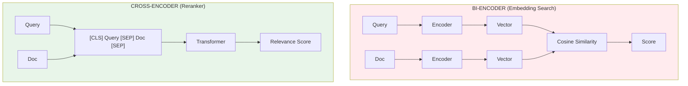
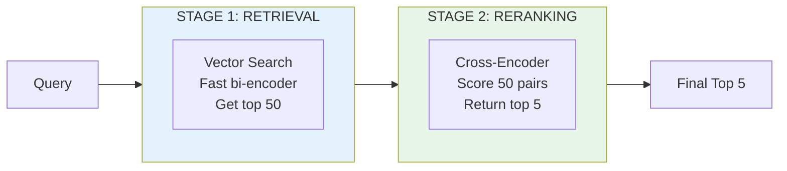

# Lesson 8.29: Semantic Reranking

> **Duration**: 30 min | **Section**: F - Advanced Retrieval

## 🎯 The Problem (3-5 min)

Retrieval gets you candidates, but the order isn't perfect:

```python
# Query: "How to handle Python exceptions?"

# Retrieved (k=5):
# 1. "Python has try/except blocks" (score: 0.85) ← Good!
# 2. "Exception handling in Java" (score: 0.83)  ← Wrong language
# 3. "Python exception types: ValueError, TypeError..." (score: 0.82) ← Great!
# 4. "Error handling best practices" (score: 0.81) ← Generic
# 5. "Python try/except/finally tutorial" (score: 0.80) ← Best answer!
```

The **best** answer (#5) ranked last! Bi-encoder similarity isn't perfect.

**Reranking** with a cross-encoder fixes this.

## 🧪 Try It: Cross-Encoder Reranking

```python
# pip install sentence-transformers

from sentence_transformers import CrossEncoder
from langchain_core.documents import Document

# Create a reranker
reranker = CrossEncoder("cross-encoder/ms-marco-MiniLM-L-6-v2")

# Documents from initial retrieval
documents = [
    Document(page_content="Python has try/except blocks for error handling."),
    Document(page_content="Exception handling in Java uses try-catch."),
    Document(page_content="Python exception types include ValueError and TypeError."),
    Document(page_content="Error handling best practices for web applications."),
    Document(page_content="Complete Python try/except/finally tutorial with examples."),
]

query = "How to handle Python exceptions?"

# Score each document with cross-encoder
pairs = [(query, doc.page_content) for doc in documents]
scores = reranker.predict(pairs)

# Rerank
ranked = sorted(zip(documents, scores), key=lambda x: -x[1])

print("After reranking:")
for i, (doc, score) in enumerate(ranked):
    print(f"{i+1}. (score: {score:.4f}) {doc.page_content[:50]}...")
```

**Output:**
```
After reranking:
1. (score: 8.23) Complete Python try/except/finally tutorial...
2. (score: 7.15) Python has try/except blocks for error...
3. (score: 5.89) Python exception types include ValueError...
4. (score: 1.23) Error handling best practices for web...
5. (score: 0.45) Exception handling in Java uses try-catch...
```

The Python tutorial is now #1! Java dropped to last.

## 🔍 Under the Hood: Bi-Encoder vs Cross-Encoder



| Aspect | Bi-Encoder | Cross-Encoder |
|--------|-----------|---------------|
| **Input** | Encodes separately | Encodes together |
| **Speed** | Fast (precompute vectors) | Slow (per query-doc pair) |
| **Quality** | Good | Better |
| **Use case** | Initial retrieval (thousands) | Reranking (top 10-50) |

## 📦 Two-Stage Pipeline



```python
from sentence_transformers import CrossEncoder
from langchain_openai import OpenAIEmbeddings
from langchain_chroma import Chroma
from langchain_core.documents import Document

# Stage 1: Vector retrieval
embeddings = OpenAIEmbeddings(model="text-embedding-3-small")
vectorstore = Chroma.from_documents(documents, embeddings)

# Get more candidates than we need
initial_results = vectorstore.similarity_search(query, k=20)

# Stage 2: Rerank
reranker = CrossEncoder("cross-encoder/ms-marco-MiniLM-L-6-v2")
pairs = [(query, doc.page_content) for doc in initial_results]
scores = reranker.predict(pairs)

# Get top 5 after reranking
reranked = sorted(zip(initial_results, scores), key=lambda x: -x[1])[:5]
final_results = [doc for doc, _ in reranked]
```

## 🔧 LangChain Contextual Compression

LangChain wraps this pattern:

```python
# pip install langchain-cohere

from langchain.retrievers import ContextualCompressionRetriever
from langchain_cohere import CohereRerank
from langchain_openai import OpenAIEmbeddings
from langchain_chroma import Chroma

# Create base retriever (gets many candidates)
embeddings = OpenAIEmbeddings(model="text-embedding-3-small")
vectorstore = Chroma.from_documents(documents, embeddings)
base_retriever = vectorstore.as_retriever(search_kwargs={"k": 20})

# Create reranker
reranker = CohereRerank(model="rerank-english-v3.0", top_n=5)

# Combine them
compression_retriever = ContextualCompressionRetriever(
    base_compressor=reranker,
    base_retriever=base_retriever,
)

# Use it!
results = compression_retriever.invoke("How to handle Python exceptions?")
for doc in results:
    print(doc.page_content[:60])
```

## 📊 Popular Reranking Models

| Model | Type | Best For |
|-------|------|----------|
| `cross-encoder/ms-marco-MiniLM-L-6-v2` | Cross-encoder | General (fast) |
| `cross-encoder/ms-marco-MiniLM-L-12-v2` | Cross-encoder | General (better quality) |
| `BAAI/bge-reranker-base` | Cross-encoder | Multilingual |
| Cohere Rerank | API | Production, no GPU needed |
| Jina Reranker | API/Local | Fast, good quality |

## 💰 Cost-Benefit Analysis

```python
# Without reranking:
# - Retrieve k=5, send to LLM
# - Risk: best doc might be at position 10

# With reranking:
# - Retrieve k=20
# - Rerank to top 5
# - Send to LLM
# - Cost: ~50-100ms extra latency

# Worth it when:
# - Quality matters more than latency
# - Initial retrieval has noise
# - Complex queries with nuance
```

## 💥 Where Reranking Struggles

```python
# 1. All candidates are bad
# Reranking can't create relevant docs

# 2. Very long documents
# Cross-encoders have token limits (512 typical)

# 3. Latency-critical applications
# Each pair requires model inference

# 4. Simple queries
# "What is Python?" - retrieval alone is fine
```

**Mitigation:**
- Fetch more initial candidates
- Chunk documents appropriately
- Use faster reranking models
- Skip reranking for simple queries

## 🔧 Custom Reranking with Sentence Transformers

```python
from sentence_transformers import CrossEncoder
from langchain_core.documents import Document
from langchain.retrievers.document_compressors import BaseDocumentCompressor
from langchain_core.callbacks import Callbacks
from typing import Sequence, Optional

class CrossEncoderReranker(BaseDocumentCompressor):
    """Custom reranker using sentence-transformers."""
    
    def __init__(self, model_name: str = "cross-encoder/ms-marco-MiniLM-L-6-v2", top_n: int = 5):
        self.model = CrossEncoder(model_name)
        self.top_n = top_n
    
    def compress_documents(
        self,
        documents: Sequence[Document],
        query: str,
        callbacks: Optional[Callbacks] = None,
    ) -> Sequence[Document]:
        if not documents:
            return []
        
        # Score all documents
        pairs = [(query, doc.page_content) for doc in documents]
        scores = self.model.predict(pairs)
        
        # Rank and return top_n
        doc_scores = list(zip(documents, scores))
        doc_scores.sort(key=lambda x: -x[1])
        
        return [doc for doc, _ in doc_scores[:self.top_n]]

# Use it
from langchain.retrievers import ContextualCompressionRetriever

reranker = CrossEncoderReranker(top_n=5)
compression_retriever = ContextualCompressionRetriever(
    base_compressor=reranker,
    base_retriever=base_retriever,
)
```

## 🎯 Practice

Build a reranking pipeline:

```python
from sentence_transformers import CrossEncoder
from langchain_openai import OpenAIEmbeddings
from langchain_chroma import Chroma
from langchain_core.documents import Document

# Create documents with varying relevance
documents = [
    Document(page_content="Python's asyncio module enables asynchronous programming."),
    Document(page_content="JavaScript also supports async/await syntax."),
    Document(page_content="Async programming in Python: complete guide with asyncio examples."),
    Document(page_content="Parallel processing with multiprocessing in Python."),
    Document(page_content="Understanding Python async/await and event loops."),
    Document(page_content="Node.js is built on asynchronous I/O."),
    Document(page_content="Threading vs asyncio in Python: when to use which."),
    Document(page_content="Python concurrency: threads, processes, and async."),
]

# 1. Create vector store
embeddings = OpenAIEmbeddings(model="text-embedding-3-small")
vectorstore = Chroma.from_documents(documents, embeddings)

# 2. Initial retrieval (get many)
query = "How do I use async/await in Python?"
initial_results = vectorstore.similarity_search_with_score(query, k=8)

print("=== Stage 1: Vector Search ===")
for i, (doc, score) in enumerate(initial_results):
    print(f"{i+1}. (score: {score:.4f}) {doc.page_content[:50]}...")

# 3. Rerank with cross-encoder
print("\n=== Stage 2: Cross-Encoder Reranking ===")
reranker = CrossEncoder("cross-encoder/ms-marco-MiniLM-L-6-v2")

docs_only = [doc for doc, _ in initial_results]
pairs = [(query, doc.page_content) for doc in docs_only]
rerank_scores = reranker.predict(pairs)

reranked = sorted(zip(docs_only, rerank_scores), key=lambda x: -x[1])

for i, (doc, score) in enumerate(reranked[:5]):
    print(f"{i+1}. (score: {score:.4f}) {doc.page_content[:50]}...")

# 4. Compare top results
print("\n=== Comparison ===")
print(f"Vector search top: {initial_results[0][0].page_content[:40]}...")
print(f"Reranked top: {reranked[0][0].page_content[:40]}...")

# 5. Test with different queries
print("\n=== Testing Different Queries ===")
test_queries = [
    "Python threading",
    "async programming tutorial",
    "multiprocessing vs asyncio",
]

for q in test_queries:
    print(f"\nQuery: '{q}'")
    
    # Vector search
    results = vectorstore.similarity_search(q, k=5)
    
    # Rerank
    pairs = [(q, doc.page_content) for doc in results]
    scores = reranker.predict(pairs)
    reranked = sorted(zip(results, scores), key=lambda x: -x[1])
    
    print(f"  Before: {results[0].page_content[:40]}...")
    print(f"  After:  {reranked[0][0].page_content[:40]}...")
```

## 🔑 Key Takeaways

- **Reranking = second-stage refinement** after initial retrieval
- **Cross-encoders are more accurate** but slower than bi-encoders
- **Two-stage pipeline**: retrieve many (20-50), rerank to few (5-10)
- **Use APIs (Cohere, Jina)** if you don't have GPU
- **Not always needed** - test if quality improves for your use case

## ❓ Common Questions

| Question | Answer |
|----------|--------|
| How many to rerank? | 20-50 is common, balance quality vs latency |
| GPU required? | Helpful but not required. APIs work on CPU. |
| Which model? | Start with MiniLM for speed, upgrade if needed |
| Chain with hybrid? | Yes! Hybrid → Rerank is a powerful combo |

---

## 📚 Further Reading

- [Cross-Encoders](https://www.sbert.net/examples/applications/cross-encoder/README.html) - SBERT docs
- [Cohere Rerank](https://cohere.com/rerank) - Commercial API
- [Contextual Compression](https://python.langchain.com/docs/how_to/contextual_compression/) - LangChain
