# Lesson 8.30: Contextual Chunking

> **Duration**: 25 min | **Section**: F - Advanced Retrieval

## 🎯 The Problem (3-5 min)

Standard chunking loses context:

```
Original document:
"Chapter 5: Error Handling
Python provides several mechanisms for handling errors.

5.1 Try/Except
The try/except block catches exceptions..."

Chunk 1: "Python provides several mechanisms for handling errors."
Chunk 2: "The try/except block catches exceptions..."
```

When Chunk 2 is retrieved, we've lost that it's about **Python** and **Error Handling**!

## 🧪 Try It: Adding Context to Chunks

```python
from langchain_core.documents import Document
from langchain_text_splitters import RecursiveCharacterTextSplitter

# Original document with structure
full_document = """
Chapter 5: Python Error Handling

This chapter covers error handling in Python applications.

5.1 Try/Except Blocks
The try/except block is the primary mechanism for catching exceptions.
You wrap code that might fail in a try block.

5.2 Raising Exceptions
Use the raise keyword to throw your own exceptions.
Custom exceptions should inherit from Exception.

5.3 Finally Blocks
The finally block always executes, whether an exception occurred or not.
Use it for cleanup operations like closing files.
"""

# Standard chunking
splitter = RecursiveCharacterTextSplitter(chunk_size=150, chunk_overlap=0)
standard_chunks = splitter.split_text(full_document)

print("=== Standard Chunks ===")
for i, chunk in enumerate(standard_chunks[:3]):
    print(f"Chunk {i}: {chunk[:60]}...")
    print()
```

**Problem:** Later chunks lose the "Python Error Handling" context.

## 🔧 Solution 1: Parent Document Retriever

Store full documents but search on chunks:

```python
from langchain.retrievers import ParentDocumentRetriever
from langchain.storage import InMemoryStore
from langchain_openai import OpenAIEmbeddings
from langchain_chroma import Chroma
from langchain_text_splitters import RecursiveCharacterTextSplitter
from langchain_core.documents import Document

# Full documents
documents = [
    Document(
        page_content="""Chapter 5: Python Error Handling

This chapter covers error handling in Python applications.

5.1 Try/Except Blocks
The try/except block is the primary mechanism for catching exceptions.
You wrap code that might fail in a try block.

5.2 Raising Exceptions
Use the raise keyword to throw your own exceptions.""",
        metadata={"source": "python_guide.pdf", "chapter": 5}
    ),
]

# Two splitters: one for search (small), one for context (large or full)
child_splitter = RecursiveCharacterTextSplitter(chunk_size=100)

# Storage for full documents
docstore = InMemoryStore()

# Vector store for chunks
embeddings = OpenAIEmbeddings(model="text-embedding-3-small")
vectorstore = Chroma(embedding_function=embeddings, collection_name="split_docs")

# Create retriever
retriever = ParentDocumentRetriever(
    vectorstore=vectorstore,
    docstore=docstore,
    child_splitter=child_splitter,
    # parent_splitter=None means store full documents
)

# Add documents
retriever.add_documents(documents)

# Search returns FULL parent documents!
results = retriever.invoke("try except block")
print("Retrieved parent document:")
print(results[0].page_content[:200])
```

## 🔍 Under the Hood: Parent Document Retriever


## 🔧 Solution 2: Contextual Headers

Prepend section context to each chunk:

```python
from langchain_text_splitters import RecursiveCharacterTextSplitter
from langchain_core.documents import Document
import re

def add_contextual_headers(text: str, chunk_size: int = 200) -> list[Document]:
    """Add section headers as context to each chunk."""
    
    # Find all section headers
    header_pattern = r'^(Chapter \d+:.*|^\d+\.\d+\s+.*)'
    
    current_context = ""
    chunks = []
    
    lines = text.split('\n')
    current_content = []
    
    for line in lines:
        # Check if this is a header
        if re.match(r'^Chapter \d+:', line):
            current_context = line.strip()
        elif re.match(r'^\d+\.\d+\s+', line):
            # Add subsection to context
            current_context = f"{current_context} > {line.strip()}"
        else:
            current_content.append(line)
    
    # Now split with context prepended
    content = '\n'.join(current_content)
    splitter = RecursiveCharacterTextSplitter(chunk_size=chunk_size, chunk_overlap=20)
    raw_chunks = splitter.split_text(content)
    
    return [
        Document(
            page_content=f"[Context: {current_context}]\n{chunk}",
            metadata={"context": current_context}
        )
        for chunk in raw_chunks
    ]

# Use it
contextual_chunks = add_contextual_headers(full_document, chunk_size=150)

print("=== Contextual Chunks ===")
for chunk in contextual_chunks[:3]:
    print(chunk.page_content[:100])
    print()
```

## 🔧 Solution 3: LLM-Generated Context (Anthropic Approach)

Use an LLM to generate context for each chunk:

```python
from langchain_openai import ChatOpenAI
from langchain_core.prompts import ChatPromptTemplate
from langchain_text_splitters import RecursiveCharacterTextSplitter

def generate_chunk_context(full_doc: str, chunk: str, llm) -> str:
    """Use LLM to generate context for a chunk."""
    
    prompt = ChatPromptTemplate.from_template("""
Given the full document and a specific chunk, write a brief context sentence 
that situates this chunk within the document.

Full document:
{document}

Chunk:
{chunk}

Context sentence (be brief, 1-2 sentences):""")
    
    chain = prompt | llm
    response = chain.invoke({"document": full_doc[:2000], "chunk": chunk})
    return response.content

# Example (expensive - use sparingly!)
llm = ChatOpenAI(model="gpt-4", temperature=0)
splitter = RecursiveCharacterTextSplitter(chunk_size=200)
chunks = splitter.split_text(full_document)

# Generate context for first chunk only (demo)
context = generate_chunk_context(full_document, chunks[0], llm)
print(f"Generated context: {context}")
print(f"Chunk: {chunks[0]}")
```

## 📊 Comparison of Approaches

| Approach | Pros | Cons |
|----------|------|------|
| **Parent Document** | Full context always available | Returns large docs, may not fit context |
| **Contextual Headers** | Cheap, deterministic | Requires structured docs |
| **LLM-Generated** | Works on any content | Expensive, slow at index time |
| **Metadata** | Simple, filterable | Limited context |

## 💡 Practical Contextual Chunking

```python
from langchain_text_splitters import RecursiveCharacterTextSplitter
from langchain_core.documents import Document

class ContextualChunker:
    """Add surrounding context to each chunk."""
    
    def __init__(self, chunk_size: int = 500, overlap: int = 100, context_size: int = 100):
        self.chunk_size = chunk_size
        self.overlap = overlap
        self.context_size = context_size
        self.splitter = RecursiveCharacterTextSplitter(
            chunk_size=chunk_size,
            chunk_overlap=overlap,
        )
    
    def chunk_with_context(self, text: str, metadata: dict = None) -> list[Document]:
        """Create chunks with leading context."""
        
        if metadata is None:
            metadata = {}
        
        chunks = self.splitter.split_text(text)
        documents = []
        
        for i, chunk in enumerate(chunks):
            # Find position in original text
            start_pos = text.find(chunk[:50])  # Find by beginning
            
            # Get context before this chunk
            context_start = max(0, start_pos - self.context_size)
            leading_context = text[context_start:start_pos].strip()
            
            # Create enriched chunk
            if leading_context:
                enriched = f"[...{leading_context}]\n\n{chunk}"
            else:
                enriched = chunk
            
            documents.append(Document(
                page_content=enriched,
                metadata={
                    **metadata,
                    "chunk_index": i,
                    "has_context": bool(leading_context),
                }
            ))
        
        return documents

# Use it
chunker = ContextualChunker(chunk_size=200, context_size=100)
docs = chunker.chunk_with_context(full_document, {"source": "guide.pdf"})

print("=== Chunks with Context ===")
for doc in docs[:2]:
    print(f"Chunk {doc.metadata['chunk_index']}:")
    print(doc.page_content[:200])
    print()
```

## 💥 Where Standard Chunking Fails

```mermaid
flowchart LR
    subgraph Standard["STANDARD CHUNKING"]
        S1["'The try/except block catches exceptions.'"]
        S2["❌ What language?"]
        S3["❌ What chapter?"]
    end
    
    subgraph Contextual["CONTEXTUAL CHUNKING"]
        C1["[Python Error Handling > Try/Except]
        The try/except block catches exceptions."]
        C2["✅ Language: Python"]
        C3["✅ Topic: Error Handling"]
    end
    
    style Standard fill:#FFEBEE
    style Contextual fill:#E8F5E9
```



## 🎯 Practice

Build contextual chunking solutions:

```python
from langchain.retrievers import ParentDocumentRetriever
from langchain.storage import InMemoryStore
from langchain_openai import OpenAIEmbeddings
from langchain_chroma import Chroma
from langchain_text_splitters import RecursiveCharacterTextSplitter
from langchain_core.documents import Document

# Sample document
document = Document(
    page_content="""
Chapter 3: Database Operations in Python

This chapter covers working with databases using Python.

3.1 SQLite Basics
SQLite is a lightweight, file-based database perfect for small applications.
You can use the sqlite3 module that comes with Python.

3.2 Connection Management
Always close your database connections to prevent resource leaks.
Use context managers (with statement) for automatic cleanup.

3.3 Executing Queries
Use parameterized queries to prevent SQL injection attacks.
Never concatenate user input directly into SQL strings.

3.4 ORMs
Object-Relational Mappers like SQLAlchemy abstract database operations.
They let you work with Python objects instead of raw SQL.
""",
    metadata={"source": "python_db_guide.pdf"}
)

# 1. Standard chunking
print("=== Standard Chunking ===")
std_splitter = RecursiveCharacterTextSplitter(chunk_size=150, chunk_overlap=0)
std_chunks = std_splitter.split_text(document.page_content)
for i, chunk in enumerate(std_chunks[:3]):
    print(f"Chunk {i}: {chunk[:60]}...")
print()

# 2. Parent Document Retriever
print("=== Parent Document Retriever ===")
embeddings = OpenAIEmbeddings(model="text-embedding-3-small")
docstore = InMemoryStore()
vectorstore = Chroma(embedding_function=embeddings, collection_name="parent_demo")

child_splitter = RecursiveCharacterTextSplitter(chunk_size=100)
parent_retriever = ParentDocumentRetriever(
    vectorstore=vectorstore,
    docstore=docstore,
    child_splitter=child_splitter,
)
parent_retriever.add_documents([document])

# Search
results = parent_retriever.invoke("parameterized queries")
print(f"Search: 'parameterized queries'")
print(f"Retrieved: {len(results[0].page_content)} chars (full document)")
print(f"Contains context: {'Chapter 3' in results[0].page_content}")
print()

# 3. Manual contextual headers
print("=== Contextual Headers ===")
import re

def chunk_with_headers(text: str, chunk_size: int = 150) -> list[str]:
    """Add headers as context to chunks."""
    current_header = ""
    result_chunks = []
    
    # Split by sections
    sections = re.split(r'\n(?=\d+\.\d+\s+)', text)
    
    for section in sections:
        # Extract section header if present
        header_match = re.match(r'^(\d+\.\d+\s+[^\n]+)', section)
        if header_match:
            current_header = header_match.group(1).strip()
            section = section[len(header_match.group(0)):]
        
        # Check for chapter header
        chapter_match = re.search(r'Chapter \d+:[^\n]+', section)
        if chapter_match:
            chapter = chapter_match.group(0)
            current_header = f"{chapter}"
        
        # Chunk this section
        if section.strip():
            splitter = RecursiveCharacterTextSplitter(chunk_size=chunk_size)
            for chunk in splitter.split_text(section):
                context_chunk = f"[{current_header}] {chunk.strip()}"
                result_chunks.append(context_chunk)
    
    return result_chunks

contextual = chunk_with_headers(document.page_content)
for i, chunk in enumerate(contextual[:4]):
    print(f"Chunk {i}: {chunk[:80]}...")

# 4. Compare retrieval
print("\n=== Comparison ===")
query = "prevent SQL injection"
print(f"Query: '{query}'")

# Without context
from langchain_chroma import Chroma
vs_no_context = Chroma.from_texts(std_chunks, embeddings)
result_no_context = vs_no_context.similarity_search(query, k=1)[0]
print(f"Without context: '{result_no_context.page_content[:60]}...'")

# With context  
vs_with_context = Chroma.from_texts(contextual, embeddings)
result_with_context = vs_with_context.similarity_search(query, k=1)[0]
print(f"With context: '{result_with_context.page_content[:80]}...'")
```

## 🔑 Key Takeaways

- **Standard chunking loses context** - chunks become orphans
- **Parent Document Retriever** - search chunks, return parents
- **Contextual headers** - prepend section/chapter info
- **LLM-generated context** - expensive but works on any content
- **Choose based on your docs** - structured = headers, unstructured = LLM

## ❓ Common Questions

| Question | Answer |
|----------|--------|
| Which approach is best? | Parent Document for most cases |
| LLM context at query time? | No, too slow. Do at index time. |
| Overlap vs context? | Overlap = chunk continuity. Context = section info. |
| Can I combine approaches? | Yes! Headers + Parent Document works well |

---

## 📚 Further Reading

- [Parent Document Retriever](https://python.langchain.com/docs/how_to/parent_document_retriever/) - LangChain
- [Anthropic Contextual Retrieval](https://www.anthropic.com/news/contextual-retrieval) - Original blog post
- [Chunking Strategies](https://www.pinecone.io/learn/chunking-strategies/) - Pinecone guide
