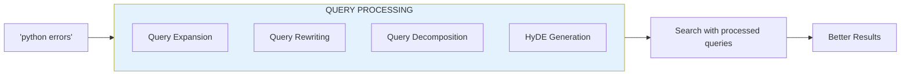
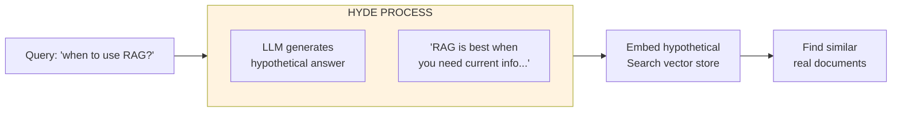

# Lesson 8.31: Query Processing

> **Duration**: 25 min | **Section**: F - Advanced Retrieval

## 🎯 The Problem (3-5 min)

User queries are often:
- **Too short**: "python errors" (missing context)
- **Too vague**: "how does it work?" (missing subject)
- **Multi-part**: "what is RAG and how is it different from fine-tuning?"

Raw queries don't always match well against your documents.

**Query processing** transforms user input for better retrieval.

## 🧪 Try It: Query Expansion

```python
from langchain_openai import ChatOpenAI
from langchain_core.prompts import ChatPromptTemplate

llm = ChatOpenAI(model="gpt-4", temperature=0)

# Query expansion prompt
expansion_prompt = ChatPromptTemplate.from_template("""
Given a user query, generate 3 alternative versions that might match relevant documents.
Keep the same intent but use different words and phrasings.

Original query: {query}

Alternative queries (one per line):""")

chain = expansion_prompt | llm

# Expand a query
original = "python errors"
result = chain.invoke({"query": original})

print(f"Original: {original}")
print(f"Expanded:\n{result.content}")
```

**Output:**
```
Original: python errors
Expanded:
1. Python exception handling and error types
2. Debugging errors in Python programs
3. Common Python mistakes and how to fix them
```

## 🔍 Under the Hood: Query Processing Pipeline



## 📦 Query Rewriting

Fix or clarify the query:

```python
from langchain_openai import ChatOpenAI
from langchain_core.prompts import ChatPromptTemplate

rewrite_prompt = ChatPromptTemplate.from_template("""
Rewrite this user query to be more specific and searchable.
Add context if the query is vague.
Keep the same intent.

User query: {query}
Chat history: {history}

Rewritten query:""")

llm = ChatOpenAI(model="gpt-4", temperature=0)
chain = rewrite_prompt | llm

# Example with context
query = "how does it work?"
history = "User asked about RAG systems"

result = chain.invoke({"query": query, "history": history})
print(f"Original: {query}")
print(f"Rewritten: {result.content}")
# "How does RAG (Retrieval Augmented Generation) work?"
```

## 🔀 Query Decomposition

Break complex queries into sub-queries:

```python
from langchain_openai import ChatOpenAI
from langchain_core.prompts import ChatPromptTemplate
from langchain_core.output_parsers import StrOutputParser

decompose_prompt = ChatPromptTemplate.from_template("""
Break this complex question into simpler sub-questions that can be answered independently.
Return each sub-question on a new line.

Complex question: {query}

Sub-questions:""")

llm = ChatOpenAI(model="gpt-4", temperature=0)
chain = decompose_prompt | llm | StrOutputParser()

# Complex query
query = "What is RAG, how is it different from fine-tuning, and when should I use each?"

sub_queries = chain.invoke({"query": query})
print(f"Original: {query}\n")
print(f"Sub-queries:\n{sub_queries}")
```

**Output:**
```
Original: What is RAG, how is it different from fine-tuning, and when should I use each?

Sub-queries:
1. What is RAG (Retrieval Augmented Generation)?
2. What is fine-tuning in the context of LLMs?
3. What are the differences between RAG and fine-tuning?
4. When should I use RAG vs fine-tuning?
```

## 🔮 HyDE: Hypothetical Document Embeddings

Generate a hypothetical answer, then search for similar content:

```python
from langchain_openai import ChatOpenAI, OpenAIEmbeddings
from langchain_chroma import Chroma
from langchain_core.prompts import ChatPromptTemplate
from langchain_core.documents import Document

# Create a knowledge base
documents = [
    Document(page_content="RAG combines retrieval with generation for accurate, sourced answers."),
    Document(page_content="Fine-tuning modifies model weights on domain-specific data."),
    Document(page_content="Use RAG when you need up-to-date information or citations."),
    Document(page_content="Use fine-tuning when you need consistent style or behavior."),
]

embeddings = OpenAIEmbeddings(model="text-embedding-3-small")
vectorstore = Chroma.from_documents(documents, embeddings)

# HyDE: Generate hypothetical answer
hyde_prompt = ChatPromptTemplate.from_template("""
Write a short paragraph that would answer this question.
This is a hypothetical answer - focus on what a good answer would contain.

Question: {query}

Hypothetical answer:""")

llm = ChatOpenAI(model="gpt-4", temperature=0)
hyde_chain = hyde_prompt | llm

# Generate hypothetical document
query = "when to use RAG?"
hypothetical = hyde_chain.invoke({"query": query})

print(f"Query: {query}")
print(f"Hypothetical: {hypothetical.content[:100]}...")

# Search using hypothetical document instead of query
results = vectorstore.similarity_search(hypothetical.content, k=2)
print("\nResults using HyDE:")
for doc in results:
    print(f"  - {doc.page_content}")
```



## 📊 Query Processing Techniques Summary

| Technique | Best For | Example |
|-----------|----------|---------|
| **Expansion** | Short queries | "python errors" → + "exceptions", "debugging" |
| **Rewriting** | Vague queries | "how does it work?" → "how does RAG work?" |
| **Decomposition** | Multi-part queries | Split into 3 sub-questions |
| **HyDE** | Abstract queries | Generate hypothetical answer first |

## 🔧 Multi-Query Retriever

LangChain's built-in solution:

```python
from langchain.retrievers import MultiQueryRetriever
from langchain_openai import ChatOpenAI, OpenAIEmbeddings
from langchain_chroma import Chroma
from langchain_core.documents import Document

# Create vector store
documents = [
    Document(page_content="Python's asyncio module enables asynchronous programming."),
    Document(page_content="Async/await syntax was introduced in Python 3.5."),
    Document(page_content="Event loops are central to asyncio's operation."),
    Document(page_content="Concurrent execution in Python can use threads or async."),
]

embeddings = OpenAIEmbeddings(model="text-embedding-3-small")
vectorstore = Chroma.from_documents(documents, embeddings)
base_retriever = vectorstore.as_retriever(search_kwargs={"k": 2})

# Create multi-query retriever
llm = ChatOpenAI(model="gpt-4", temperature=0)
multi_retriever = MultiQueryRetriever.from_llm(
    retriever=base_retriever,
    llm=llm,
)

# Use it - automatically generates multiple queries
results = multi_retriever.invoke("python async")

print("Multi-query results:")
for doc in results:
    print(f"  - {doc.page_content}")
```

## 💥 Where Query Processing Helps Most

```python
# Scenario 1: Acronyms
# Query: "ML pipelines"
# Expansion: "machine learning pipelines", "ML workflows", "ML data processing"

# Scenario 2: Pronouns
# History: "We discussed Python yesterday"
# Query: "How do I install it?"
# Rewrite: "How do I install Python?"

# Scenario 3: Complex questions
# Query: "Compare A vs B and explain when to use each"
# Decompose: ["What is A?", "What is B?", "A vs B?", "When use A?", "When use B?"]
```

## 💡 Practical Implementation

```python
from langchain_openai import ChatOpenAI, OpenAIEmbeddings
from langchain_chroma import Chroma
from langchain_core.prompts import ChatPromptTemplate
from langchain_core.output_parsers import StrOutputParser
from langchain_core.runnables import RunnablePassthrough

class QueryProcessor:
    """Process queries before retrieval."""
    
    def __init__(self, llm=None):
        self.llm = llm or ChatOpenAI(model="gpt-4", temperature=0)
    
    def expand(self, query: str) -> list[str]:
        """Generate alternative queries."""
        prompt = ChatPromptTemplate.from_template("""
Generate 3 alternative search queries for: {query}
Return only the queries, one per line.""")
        
        chain = prompt | self.llm | StrOutputParser()
        result = chain.invoke({"query": query})
        
        alternatives = [q.strip() for q in result.strip().split('\n') if q.strip()]
        return [query] + alternatives[:3]
    
    def rewrite_with_context(self, query: str, context: str) -> str:
        """Rewrite query using conversation context."""
        prompt = ChatPromptTemplate.from_template("""
Rewrite this query to be self-contained using the context.
Context: {context}
Query: {query}
Rewritten:""")
        
        chain = prompt | self.llm | StrOutputParser()
        return chain.invoke({"query": query, "context": context}).strip()
    
    def decompose(self, query: str) -> list[str]:
        """Break complex query into sub-queries."""
        prompt = ChatPromptTemplate.from_template("""
If this is a complex multi-part question, break it into simpler questions.
If it's already simple, return it as-is.
Query: {query}
Sub-queries (one per line):""")
        
        chain = prompt | self.llm | StrOutputParser()
        result = chain.invoke({"query": query})
        return [q.strip() for q in result.strip().split('\n') if q.strip()]


# Use it
processor = QueryProcessor()

print("=== Expansion ===")
expanded = processor.expand("python memory management")
for q in expanded:
    print(f"  - {q}")

print("\n=== Context Rewrite ===")
rewritten = processor.rewrite_with_context(
    "how do I fix that?",
    "User was discussing Python import errors"
)
print(f"  {rewritten}")

print("\n=== Decomposition ===")
decomposed = processor.decompose(
    "What is Docker, how is it different from VMs, and should I use it?"
)
for q in decomposed:
    print(f"  - {q}")
```

## 🎯 Practice

Build a query processing pipeline:

```python
from langchain_openai import ChatOpenAI, OpenAIEmbeddings
from langchain_chroma import Chroma
from langchain_core.prompts import ChatPromptTemplate
from langchain_core.output_parsers import StrOutputParser
from langchain_core.documents import Document

# Create knowledge base
documents = [
    Document(page_content="Kubernetes orchestrates container deployments at scale."),
    Document(page_content="Docker containers package applications with dependencies."),
    Document(page_content="Containers are lightweight compared to virtual machines."),
    Document(page_content="VMs include a full OS, while containers share the host kernel."),
    Document(page_content="Use Docker for development, Kubernetes for production orchestration."),
    Document(page_content="Microservices architecture often uses containerization."),
]

embeddings = OpenAIEmbeddings(model="text-embedding-3-small")
vectorstore = Chroma.from_documents(documents, embeddings)
llm = ChatOpenAI(model="gpt-4", temperature=0)

# 1. Basic search
print("=== Basic Search ===")
query = "containers"
results = vectorstore.similarity_search(query, k=2)
print(f"Query: '{query}'")
for doc in results:
    print(f"  - {doc.page_content[:50]}...")

# 2. With query expansion
print("\n=== Expanded Search ===")
expand_prompt = ChatPromptTemplate.from_template("""
Generate 2 alternative queries for: {query}
One per line, no numbering.""")

expansion_chain = expand_prompt | llm | StrOutputParser()
alternatives = expansion_chain.invoke({"query": query})
all_queries = [query] + [q.strip() for q in alternatives.split('\n') if q.strip()]

print(f"Queries: {all_queries}")

# Search all queries, combine results
all_results = []
seen = set()
for q in all_queries:
    for doc in vectorstore.similarity_search(q, k=2):
        if doc.page_content not in seen:
            all_results.append(doc)
            seen.add(doc.page_content)

print("Combined results:")
for doc in all_results[:4]:
    print(f"  - {doc.page_content[:50]}...")

# 3. HyDE approach
print("\n=== HyDE Search ===")
hyde_prompt = ChatPromptTemplate.from_template("""
Write a brief answer to: {query}
Focus on technical content about containers and virtualization.""")

hyde_chain = hyde_prompt | llm | StrOutputParser()
hypothetical = hyde_chain.invoke({"query": "containers vs VMs"})
print(f"Hypothetical: {hypothetical[:80]}...")

hyde_results = vectorstore.similarity_search(hypothetical, k=2)
print("HyDE results:")
for doc in hyde_results:
    print(f"  - {doc.page_content[:50]}...")

# 4. Complex query decomposition
print("\n=== Decomposed Search ===")
complex_query = "What's the difference between Docker and Kubernetes and when should I use each?"

decompose_prompt = ChatPromptTemplate.from_template("""
Break this into 3 simpler questions:
{query}
Questions (one per line):""")

decompose_chain = decompose_prompt | llm | StrOutputParser()
sub_queries = [q.strip() for q in decompose_chain.invoke({"query": complex_query}).split('\n') if q.strip()]

print(f"Original: {complex_query}")
print("Sub-queries:")
for sq in sub_queries:
    print(f"  - {sq}")
    results = vectorstore.similarity_search(sq, k=1)
    if results:
        print(f"    → {results[0].page_content[:40]}...")
```

## 🔑 Key Takeaways

- **Query expansion** - generate alternative phrasings
- **Query rewriting** - add context from conversation
- **Query decomposition** - break complex into simple
- **HyDE** - search with hypothetical answer
- **MultiQueryRetriever** - LangChain's built-in solution

## ❓ Common Questions

| Question | Answer |
|----------|--------|
| Always use query processing? | No, test if it improves results for your data |
| Latency cost? | 1-2 LLM calls added, balance with quality |
| Which technique? | Start with expansion, add others as needed |
| Cache processed queries? | Yes, for repeated/similar queries |

---

## 📚 Further Reading

- [Multi Query Retriever](https://python.langchain.com/docs/how_to/MultiQueryRetriever/) - LangChain
- [HyDE Paper](https://arxiv.org/abs/2212.10496) - Original research
- [Query Understanding](https://queryunderstanding.com/) - Deep dive
