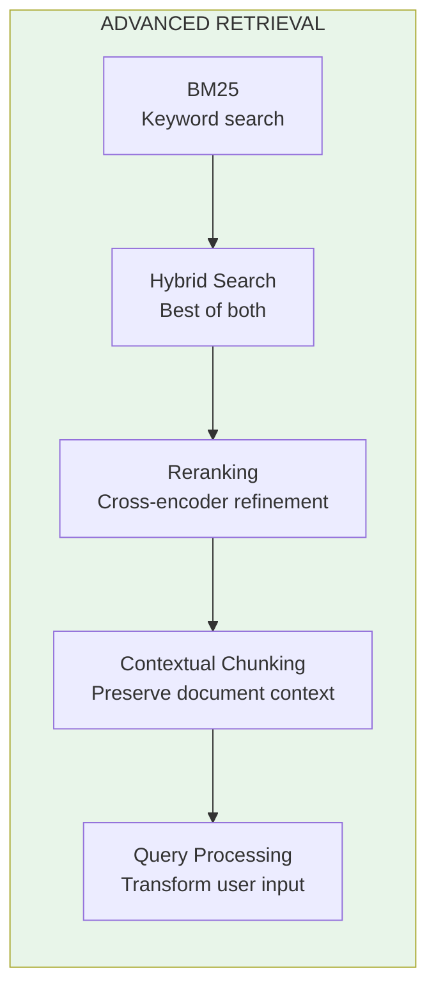
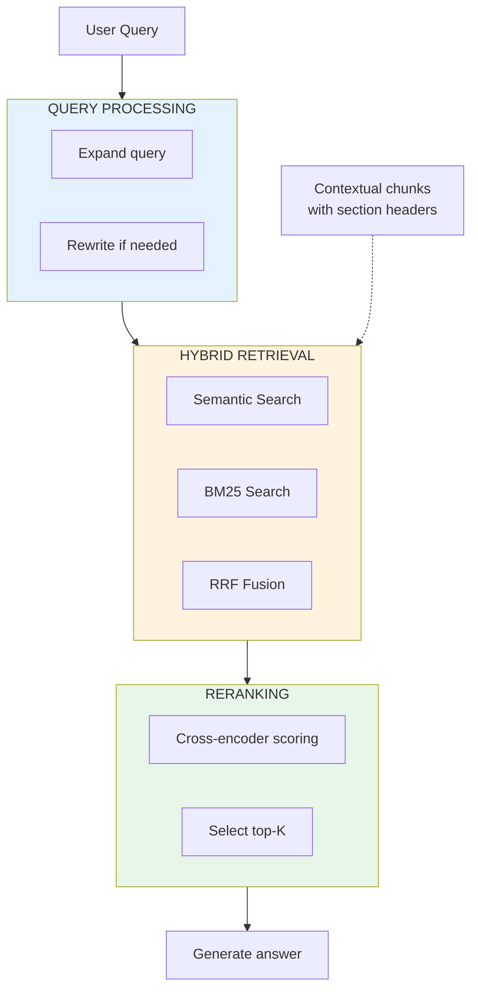
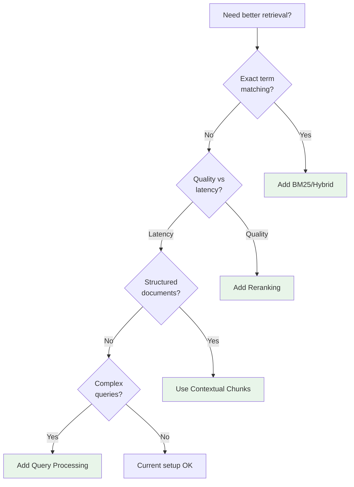

# Lesson 8.32: Advanced Retrieval Q&A

> **Duration**: 20 min | **Section**: F - Advanced Retrieval

## 🎯 Section F Recap

You've learned advanced retrieval techniques:



## 📊 Technique Summary

| Technique | Solves | When to Use |
|-----------|--------|-------------|
| **BM25** | Semantic misses exact terms | Names, IDs, codes |
| **Hybrid** | Single method limitations | Most RAG systems |
| **Reranking** | Poor initial ordering | Quality-critical apps |
| **Contextual Chunks** | Orphan chunks | Structured documents |
| **Query Processing** | Poor query formulation | Vague/complex queries |

## 🔧 Combining Techniques

The ultimate retrieval pipeline:



```python
from langchain.retrievers import EnsembleRetriever, ContextualCompressionRetriever
from langchain_community.retrievers import BM25Retriever
from langchain_openai import ChatOpenAI, OpenAIEmbeddings
from langchain_chroma import Chroma
from langchain_core.documents import Document
from sentence_transformers import CrossEncoder

# 1. Create knowledge base with contextual chunks
documents = [
    Document(
        page_content="[Python > Error Handling] Use try/except blocks to catch exceptions.",
        metadata={"topic": "errors"}
    ),
    Document(
        page_content="[Python > Error Handling] Common exceptions: ValueError, TypeError, KeyError.",
        metadata={"topic": "errors"}
    ),
    Document(
        page_content="[Python > Functions] Define functions with def keyword.",
        metadata={"topic": "functions"}
    ),
]

embeddings = OpenAIEmbeddings(model="text-embedding-3-small")

# 2. Create hybrid retriever
vectorstore = Chroma.from_documents(documents, embeddings)
semantic_retriever = vectorstore.as_retriever(search_kwargs={"k": 5})
bm25_retriever = BM25Retriever.from_documents(documents, k=5)

hybrid_retriever = EnsembleRetriever(
    retrievers=[bm25_retriever, semantic_retriever],
    weights=[0.4, 0.6],
)

# 3. Add reranking
class CrossEncoderReranker:
    def __init__(self, model_name="cross-encoder/ms-marco-MiniLM-L-6-v2", top_n=3):
        self.model = CrossEncoder(model_name)
        self.top_n = top_n
    
    def compress_documents(self, documents, query, **kwargs):
        if not documents:
            return []
        pairs = [(query, doc.page_content) for doc in documents]
        scores = self.model.predict(pairs)
        ranked = sorted(zip(documents, scores), key=lambda x: -x[1])
        return [doc for doc, _ in ranked[:self.top_n]]

# Full pipeline
def advanced_retrieve(query: str):
    # Hybrid retrieval
    candidates = hybrid_retriever.invoke(query)
    
    # Rerank
    reranker = CrossEncoderReranker(top_n=3)
    final = reranker.compress_documents(candidates, query)
    
    return final

# Test
results = advanced_retrieve("Python exception types")
for doc in results:
    print(f"• {doc.page_content}")
```

## 📈 Performance Trade-offs

| Stage | Latency | Quality Impact |
|-------|---------|----------------|
| Basic retrieval | ~50ms | Baseline |
| + BM25 hybrid | +20ms | +10-15% |
| + Query expansion | +500ms | +5-10% |
| + Reranking | +100ms | +15-20% |
| + Contextual chunks | Index time | +5-10% |

## ❓ Self-Assessment Questions

### Knowledge Check

| Question | Answer |
|----------|--------|
| When does BM25 beat semantic? | Exact terms: names, IDs, codes |
| What is RRF? | Reciprocal Rank Fusion - combines rankings |
| Bi-encoder vs cross-encoder? | Bi = fast, separate. Cross = slow, together, better. |
| Why contextual chunks? | Prevent orphan chunks losing context |
| What is HyDE? | Hypothetical Document Embedding |

### Code Check

Can you:
- [ ] Create an EnsembleRetriever?
- [ ] Implement cross-encoder reranking?
- [ ] Add context to chunks?
- [ ] Expand a query with LLM?
- [ ] Build a multi-stage retrieval pipeline?

## 🧩 Decision Framework



## 💡 Best Practices

1. **Start simple, add complexity**
   - Basic semantic first
   - Add hybrid if exact matches fail
   - Add reranking if quality needs boost

2. **Measure before/after**
   - Track retrieval metrics (next section!)
   - A/B test changes

3. **Consider your constraints**
   - Latency budget
   - Cost per query
   - User expectations

4. **Index-time vs query-time**
   - Contextual chunks: index-time
   - Reranking: query-time
   - Query expansion: query-time

## 🔧 Debugging Retrieval

```python
def debug_retrieval(query: str, retriever, vectorstore):
    """Debug retrieval issues."""
    
    print(f"Query: {query}\n")
    
    # 1. Check raw similarity scores
    print("=== Similarity Scores ===")
    results = vectorstore.similarity_search_with_score(query, k=5)
    for doc, score in results:
        print(f"  {score:.4f}: {doc.page_content[:50]}...")
    
    # 2. Check retriever output
    print("\n=== Retriever Output ===")
    docs = retriever.invoke(query)
    for i, doc in enumerate(docs):
        print(f"  {i+1}. {doc.page_content[:50]}...")
    
    # 3. Check if any results
    if not docs:
        print("\n⚠️ No results! Check:")
        print("  - Are documents indexed?")
        print("  - Is the query relevant to content?")
        print("  - Are embeddings compatible?")
```

## 🚀 What's Next?

You have advanced retrieval techniques. But how do you know they're working?

**Section G: Production RAG** covers:
- Adding citations to responses
- Evaluation metrics (Precision@K, NDCG, etc.)
- Optimization strategies
- Module review

## 🎯 Practice: Full Advanced Pipeline

```python
from langchain.retrievers import EnsembleRetriever
from langchain_community.retrievers import BM25Retriever
from langchain_openai import ChatOpenAI, OpenAIEmbeddings
from langchain_chroma import Chroma
from langchain_core.prompts import ChatPromptTemplate
from langchain_core.output_parsers import StrOutputParser
from langchain_core.documents import Document
from sentence_transformers import CrossEncoder

# 1. Create contextual documents
print("=== Building Knowledge Base ===")
raw_docs = [
    ("Chapter 1: Python Basics", "Variables store data in Python using assignment."),
    ("Chapter 1: Python Basics", "Data types include str, int, float, bool, list, dict."),
    ("Chapter 2: Control Flow", "If statements control program branching."),
    ("Chapter 2: Control Flow", "For loops iterate over sequences."),
    ("Chapter 3: Functions", "Functions are defined with the def keyword."),
    ("Chapter 3: Functions", "Return values using the return statement."),
    ("Chapter 4: Error Handling", "Use try/except to handle exceptions."),
    ("Chapter 4: Error Handling", "Common exceptions: ValueError, TypeError, KeyError."),
]

documents = [
    Document(
        page_content=f"[{context}] {content}",
        metadata={"chapter": context.split(":")[0], "topic": context.split(": ")[1]}
    )
    for context, content in raw_docs
]

print(f"Created {len(documents)} contextual chunks")

# 2. Build hybrid retriever
embeddings = OpenAIEmbeddings(model="text-embedding-3-small")
vectorstore = Chroma.from_documents(documents, embeddings)
semantic = vectorstore.as_retriever(search_kwargs={"k": 6})
bm25 = BM25Retriever.from_documents(documents, k=6)

hybrid = EnsembleRetriever(
    retrievers=[bm25, semantic],
    weights=[0.4, 0.6],
)

# 3. Create reranker
reranker = CrossEncoder("cross-encoder/ms-marco-MiniLM-L-6-v2")

def rerank(docs, query, top_n=3):
    if not docs:
        return []
    pairs = [(query, doc.page_content) for doc in docs]
    scores = reranker.predict(pairs)
    ranked = sorted(zip(docs, scores), key=lambda x: -x[1])
    return [doc for doc, _ in ranked[:top_n]]

# 4. Query expansion
llm = ChatOpenAI(model="gpt-4", temperature=0)

expand_prompt = ChatPromptTemplate.from_template("""
Generate 2 alternative search queries for: {query}
One per line:""")

def expand_query(query):
    result = (expand_prompt | llm | StrOutputParser()).invoke({"query": query})
    alternatives = [q.strip() for q in result.split('\n') if q.strip()]
    return [query] + alternatives[:2]

# 5. Full pipeline
def advanced_rag(query: str):
    print(f"\n{'='*50}")
    print(f"Query: {query}")
    
    # Expand
    queries = expand_query(query)
    print(f"Expanded: {queries}")
    
    # Retrieve from all queries
    all_docs = []
    seen = set()
    for q in queries:
        for doc in hybrid.invoke(q):
            if doc.page_content not in seen:
                all_docs.append(doc)
                seen.add(doc.page_content)
    print(f"Retrieved: {len(all_docs)} unique docs")
    
    # Rerank
    final_docs = rerank(all_docs, query, top_n=3)
    print(f"After reranking: {len(final_docs)} docs")
    
    # Return
    return final_docs

# 6. Test
test_queries = [
    "how to define a function",
    "exception handling",
    "TypeError",
    "loop through items",
]

for query in test_queries:
    results = advanced_rag(query)
    print("Top results:")
    for doc in results:
        print(f"  • {doc.page_content[:60]}...")
```

## � Common Pitfalls

| Pitfall | Why It Happens | Fix |
|---------|---------------|-----|
| Adding all techniques at once | More = better mentality | Start simple, add one technique at a time, measure impact |
| Wrong hybrid weights | Copying defaults | Tune weights based on your content (code vs prose vs mixed) |
| Reranking too many docs | "More candidates = better" | Rerank top 10-20; more adds latency without quality gain |
| Query expansion hallucinations | LLM generates unrelated queries | Validate expanded queries; limit to 2-3 alternatives |
| Ignoring latency budget | Focus only on quality | Measure latency per stage; users won't wait 5+ seconds |
| Not A/B testing changes | Assuming improvement | Always measure before/after with real queries |

## �🔑 Key Takeaways

- **Layer techniques** for best results
- **Hybrid search** is almost always better
- **Reranking** provides significant quality boost
- **Query processing** helps with vague queries
- **Measure to validate** improvements

---

**Next: Section G - Production RAG** 🚀
