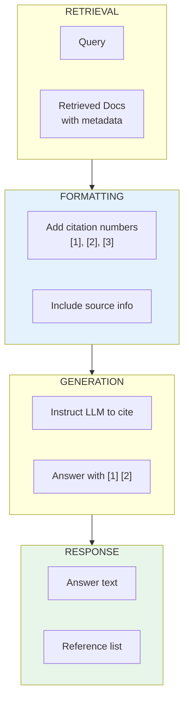

# Lesson 8.33: Citations and Source Attribution

> **Duration**: 25 min | **Section**: G - Production RAG

## 🎯 The Problem (3-5 min)

Your RAG system answers questions, but users ask:

- "Where did you get that information?"
- "Can I trust this answer?"
- "Which document says that?"

Without citations, users can't verify or explore further.

## 🧪 Try It: Basic Citations

```python
from langchain_openai import ChatOpenAI, OpenAIEmbeddings
from langchain_chroma import Chroma
from langchain_core.prompts import ChatPromptTemplate
from langchain_core.runnables import RunnablePassthrough
from langchain_core.output_parsers import StrOutputParser
from langchain_core.documents import Document

# Create documents with clear sources
documents = [
    Document(
        page_content="The company was founded in 2010 by Jane Smith.",
        metadata={"source": "company_history.pdf", "page": 1}
    ),
    Document(
        page_content="Our annual revenue reached $50M in 2023.",
        metadata={"source": "annual_report_2023.pdf", "page": 12}
    ),
    Document(
        page_content="We have offices in New York, London, and Tokyo.",
        metadata={"source": "about_us.html", "page": 1}
    ),
]

embeddings = OpenAIEmbeddings(model="text-embedding-3-small")
vectorstore = Chroma.from_documents(documents, embeddings)
retriever = vectorstore.as_retriever(search_kwargs={"k": 2})

# Format with sources
def format_docs_with_sources(docs):
    formatted = []
    for i, doc in enumerate(docs):
        source = doc.metadata.get("source", "unknown")
        page = doc.metadata.get("page", "")
        formatted.append(f"[{i+1}] (Source: {source}, Page: {page})\n{doc.page_content}")
    return "\n\n".join(formatted)

# Prompt asking for citations
prompt = ChatPromptTemplate.from_template("""Answer based on the context below.
Include citation numbers [1], [2], etc. when referencing information.

Context:
{context}

Question: {question}

Answer with citations:""")

llm = ChatOpenAI(model="gpt-4", temperature=0)

chain = (
    {"context": retriever | format_docs_with_sources, "question": RunnablePassthrough()}
    | prompt
    | llm
    | StrOutputParser()
)

# Test
answer = chain.invoke("When was the company founded and what's the revenue?")
print(answer)
```

**Output:**
```
The company was founded in 2010 by Jane Smith [1]. According to the 2023 annual report, 
the annual revenue reached $50M [2].
```

## 🔍 Under the Hood: Citation Patterns



## 📦 Structured Citation Response

Return both answer and sources:

```python
from langchain_core.runnables import RunnableParallel
from typing import TypedDict

class CitedAnswer(TypedDict):
    answer: str
    sources: list[dict]

def get_sources(docs):
    return [
        {
            "index": i + 1,
            "source": doc.metadata.get("source", "unknown"),
            "page": doc.metadata.get("page", ""),
            "content_preview": doc.page_content[:100] + "..."
        }
        for i, doc in enumerate(docs)
    ]

# Chain that returns structured output
cited_chain = RunnableParallel(
    answer=(
        {"context": retriever | format_docs_with_sources, "question": RunnablePassthrough()}
        | prompt
        | llm
        | StrOutputParser()
    ),
    sources=retriever | get_sources,
)

result = cited_chain.invoke("Tell me about the company")

print("Answer:")
print(result["answer"])
print("\nSources:")
for source in result["sources"]:
    print(f"  [{source['index']}] {source['source']} (page {source['page']})")
```

## 🔧 Inline Citation Extraction

Parse which citations were actually used:

```python
import re

def extract_citations(answer: str) -> list[int]:
    """Extract citation numbers from answer."""
    pattern = r'\[(\d+)\]'
    matches = re.findall(pattern, answer)
    return sorted(set(int(m) for m in matches))

def filter_used_sources(answer: str, all_sources: list[dict]) -> list[dict]:
    """Return only sources that were actually cited."""
    used_indices = extract_citations(answer)
    return [s for s in all_sources if s["index"] in used_indices]

# Example
answer = "The company was founded in 2010 [1] and has offices worldwide [3]."
used = extract_citations(answer)
print(f"Citations used: {used}")  # [1, 3]
```

## 📊 Citation Formats

| Format | Example | Best For |
|--------|---------|----------|
| **Numbered** | [1], [2], [3] | Academic, formal |
| **Named** | (company_history.pdf) | Document references |
| **Inline** | According to the 2023 report... | Narrative |
| **Footnote** | Text¹ ... ¹Source: X | Long-form content |

## 🌐 Clickable Citations (Web UI)

Structure for frontend rendering:

```python
def format_for_ui(answer: str, sources: list[dict]) -> dict:
    """Format for web frontend with clickable citations."""
    
    # Extract citation positions
    citation_pattern = r'\[(\d+)\]'
    
    segments = []
    last_end = 0
    
    for match in re.finditer(citation_pattern, answer):
        # Text before citation
        if match.start() > last_end:
            segments.append({
                "type": "text",
                "content": answer[last_end:match.start()]
            })
        
        # Citation
        cite_num = int(match.group(1))
        source = next((s for s in sources if s["index"] == cite_num), None)
        
        segments.append({
            "type": "citation",
            "number": cite_num,
            "source": source["source"] if source else "unknown",
            "page": source["page"] if source else "",
        })
        
        last_end = match.end()
    
    # Remaining text
    if last_end < len(answer):
        segments.append({
            "type": "text",
            "content": answer[last_end:]
        })
    
    return {
        "segments": segments,
        "sources": sources,
    }

# Example
result = format_for_ui(
    "Founded in 2010 [1] with $50M revenue [2].",
    [
        {"index": 1, "source": "history.pdf", "page": 1},
        {"index": 2, "source": "report.pdf", "page": 12},
    ]
)

print("Segments:")
for seg in result["segments"]:
    print(f"  {seg}")
```

## 💥 Where Citations Break

```python
# Problem 1: LLM doesn't follow instructions
# Solution: Use stronger prompts, few-shot examples

citation_prompt = ChatPromptTemplate.from_template("""Answer the question using ONLY the provided context.
You MUST include citation numbers [1], [2], etc. for EVERY fact you mention.

Example:
Context: [1] Python was created in 1991. [2] It's named after Monty Python.
Question: When was Python created?
Answer: Python was created in 1991 [1].

Now your turn:
Context:
{context}

Question: {question}

Answer with citations:""")

# Problem 2: Made up citations
# Solution: Post-process and validate

def validate_citations(answer: str, num_sources: int) -> str:
    """Remove citations that don't exist."""
    def replace_invalid(match):
        num = int(match.group(1))
        if num > num_sources:
            return ""  # Remove invalid citation
        return match.group(0)
    
    return re.sub(r'\[(\d+)\]', replace_invalid, answer)

# Problem 3: Citation doesn't match content
# Solution: Verify with LLM or embedding similarity
```

## 🔧 Verified Citations

Check if citations actually support claims:

```python
from langchain_openai import ChatOpenAI
from langchain_core.prompts import ChatPromptTemplate

def verify_citation(claim: str, source_content: str, llm) -> bool:
    """Verify a citation supports a claim."""
    
    prompt = ChatPromptTemplate.from_template("""
Does the source content support this claim?

Claim: {claim}
Source: {source}

Answer only YES or NO:""")
    
    chain = prompt | llm
    result = chain.invoke({"claim": claim, "source": source_content})
    return "YES" in result.content.upper()

# Example
llm = ChatOpenAI(model="gpt-4", temperature=0)
claim = "The company was founded in 2010"
source = "The company was founded in 2010 by Jane Smith."

is_valid = verify_citation(claim, source, llm)
print(f"Citation valid: {is_valid}")  # True
```

## 🎯 Practice

Build a complete citation system:

```python
from langchain_openai import ChatOpenAI, OpenAIEmbeddings
from langchain_chroma import Chroma
from langchain_core.prompts import ChatPromptTemplate
from langchain_core.runnables import RunnablePassthrough, RunnableParallel
from langchain_core.output_parsers import StrOutputParser
from langchain_core.documents import Document
import re

# 1. Create knowledge base
documents = [
    Document(
        page_content="Python was released in 1991 by Guido van Rossum.",
        metadata={"source": "python_history.md", "section": "Origins"}
    ),
    Document(
        page_content="Python 3.0 was released in December 2008.",
        metadata={"source": "python_history.md", "section": "Python 3"}
    ),
    Document(
        page_content="The name Python comes from Monty Python's Flying Circus.",
        metadata={"source": "faq.md", "section": "Naming"}
    ),
    Document(
        page_content="Python emphasizes code readability with significant whitespace.",
        metadata={"source": "design_philosophy.md", "section": "Principles"}
    ),
]

embeddings = OpenAIEmbeddings(model="text-embedding-3-small")
vectorstore = Chroma.from_documents(documents, embeddings)
retriever = vectorstore.as_retriever(search_kwargs={"k": 3})

# 2. Format with citations
def format_context(docs):
    return "\n\n".join([
        f"[{i+1}] ({doc.metadata['source']}, {doc.metadata['section']})\n{doc.page_content}"
        for i, doc in enumerate(docs)
    ])

def extract_sources(docs):
    return [
        {
            "num": i + 1,
            "source": doc.metadata["source"],
            "section": doc.metadata["section"],
            "text": doc.page_content,
        }
        for i, doc in enumerate(docs)
    ]

# 3. Create prompt with citation instructions
prompt = ChatPromptTemplate.from_template("""Answer based on the context.
Include citation numbers [1], [2], etc. for every fact.

Context:
{context}

Question: {question}

Answer:""")

llm = ChatOpenAI(model="gpt-4", temperature=0)

# 4. Build chain
cited_chain = RunnableParallel(
    answer=(
        {"context": retriever | format_context, "question": RunnablePassthrough()}
        | prompt
        | llm
        | StrOutputParser()
    ),
    sources=retriever | extract_sources,
)

# 5. Post-process citations
def process_result(result):
    answer = result["answer"]
    sources = result["sources"]
    
    # Extract used citations
    cited_nums = set(int(m) for m in re.findall(r'\[(\d+)\]', answer))
    
    # Filter to used sources
    used_sources = [s for s in sources if s["num"] in cited_nums]
    
    return {
        "answer": answer,
        "sources_used": used_sources,
        "all_sources": sources,
    }

# 6. Test
print("=== Citation Demo ===\n")

questions = [
    "When was Python created and who created it?",
    "Why is Python called Python?",
    "What are Python's design principles?",
]

for q in questions:
    print(f"Q: {q}")
    raw_result = cited_chain.invoke(q)
    result = process_result(raw_result)
    
    print(f"A: {result['answer']}\n")
    print("Sources used:")
    for src in result["sources_used"]:
        print(f"  [{src['num']}] {src['source']} - {src['section']}")
    print()

# 7. Verify a citation
print("=== Citation Verification ===")
claim = "Python was released in 1991"
source = documents[0].page_content

verify_prompt = ChatPromptTemplate.from_template(
    "Does '{source}' support the claim '{claim}'? YES or NO:"
)
verification = (verify_prompt | llm | StrOutputParser()).invoke({
    "claim": claim, "source": source
})
print(f"Claim: {claim}")
print(f"Source: {source}")
print(f"Valid: {verification}")
```

## 🔑 Key Takeaways

- **Include source metadata** in documents for citations
- **Format context with numbers** [1], [2], [3]
- **Prompt LLM to cite** every fact
- **Return structured output** with answer + sources
- **Post-process** to extract and validate citations

## ❓ Common Questions

| Question | Answer |
|----------|--------|
| LLM ignores citation instructions? | Use few-shot examples, stronger prompts |
| Citations don't match? | Add verification step |
| Too many citations? | Prompt for "key sources only" |
| Missing citations? | Lower temperature, add examples |

---

## 📚 Further Reading

- [Citing Sources in RAG](https://python.langchain.com/docs/how_to/qa_citations/) - LangChain
- [Verifiable Generation](https://arxiv.org/abs/2304.09848) - Research
- [Attributed QA](https://arxiv.org/abs/2212.08037) - Attribution methods
