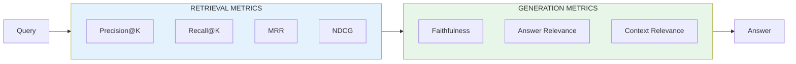
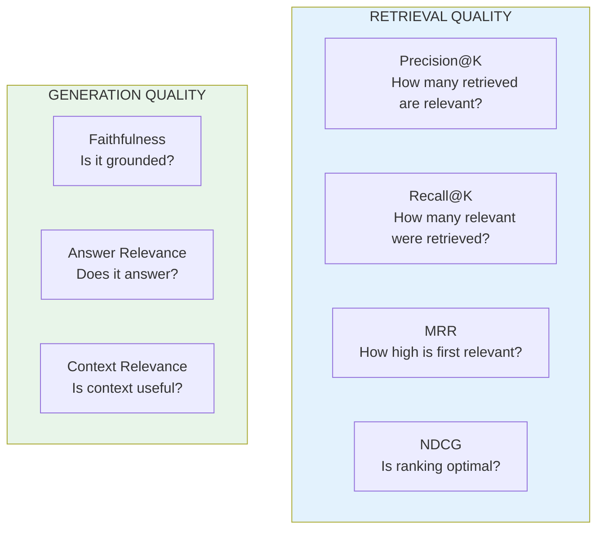

# Lesson 8.34: RAG Evaluation Metrics

> **Duration**: 30 min | **Section**: G - Production RAG

## 🎯 The Problem (3-5 min)

You built a RAG system. How do you know if it's good?

- "The answers seem okay" isn't measurable
- Can't A/B test without metrics
- Can't compare different configurations
- Can't track improvements over time

**RAG Evaluation** provides quantifiable metrics for retrieval and generation.

## 🧪 Understanding RAG Metrics

RAG has two components to evaluate:



## 📊 Retrieval Metrics

### Precision@K

"Of the K documents retrieved, how many are relevant?"

```python
def precision_at_k(retrieved: list[str], relevant: set[str], k: int) -> float:
    """Calculate Precision@K."""
    retrieved_k = retrieved[:k]
    relevant_retrieved = sum(1 for doc in retrieved_k if doc in relevant)
    return relevant_retrieved / k

# Example
retrieved = ["doc1", "doc2", "doc3", "doc4", "doc5"]
relevant = {"doc1", "doc3", "doc7"}  # Ground truth

p_at_3 = precision_at_k(retrieved, relevant, k=3)
print(f"Precision@3: {p_at_3:.2f}")  # 0.67 (2 out of 3)
```

### Recall@K

"Of all relevant documents, how many did we retrieve in top K?"

```python
def recall_at_k(retrieved: list[str], relevant: set[str], k: int) -> float:
    """Calculate Recall@K."""
    retrieved_k = set(retrieved[:k])
    relevant_retrieved = len(retrieved_k & relevant)
    return relevant_retrieved / len(relevant) if relevant else 0

# Example
r_at_3 = recall_at_k(retrieved, relevant, k=3)
print(f"Recall@3: {r_at_3:.2f}")  # 0.67 (2 out of 3 relevant found)
```

### Mean Reciprocal Rank (MRR)

"How high is the first relevant document?"

```python
def reciprocal_rank(retrieved: list[str], relevant: set[str]) -> float:
    """Calculate Reciprocal Rank for a single query."""
    for i, doc in enumerate(retrieved):
        if doc in relevant:
            return 1.0 / (i + 1)
    return 0.0

def mean_reciprocal_rank(queries_results: list[tuple[list[str], set[str]]]) -> float:
    """Calculate MRR across multiple queries."""
    rrs = [reciprocal_rank(ret, rel) for ret, rel in queries_results]
    return sum(rrs) / len(rrs) if rrs else 0

# Example
rr = reciprocal_rank(retrieved, relevant)
print(f"RR: {rr:.2f}")  # 1.0 (first doc is relevant)

# If first relevant at position 3:
retrieved_bad = ["doc2", "doc4", "doc1", "doc3", "doc5"]
rr_bad = reciprocal_rank(retrieved_bad, relevant)
print(f"RR (bad): {rr_bad:.2f}")  # 0.33 (1/3)
```

### NDCG (Normalized Discounted Cumulative Gain)

"Are the most relevant documents ranked highest?"

```python
import math

def dcg_at_k(relevance_scores: list[float], k: int) -> float:
    """Calculate DCG@K."""
    dcg = 0.0
    for i, rel in enumerate(relevance_scores[:k]):
        dcg += rel / math.log2(i + 2)  # +2 because log2(1) = 0
    return dcg

def ndcg_at_k(relevance_scores: list[float], k: int) -> float:
    """Calculate NDCG@K."""
    dcg = dcg_at_k(relevance_scores, k)
    ideal = dcg_at_k(sorted(relevance_scores, reverse=True), k)
    return dcg / ideal if ideal > 0 else 0

# Example: relevance scores (3=highly relevant, 2=relevant, 1=somewhat, 0=not)
scores = [3, 0, 2, 1, 0]  # Actual ranking
ndcg = ndcg_at_k(scores, k=5)
print(f"NDCG@5: {ndcg:.2f}")

# Perfect ranking would be [3, 2, 1, 0, 0]
perfect_scores = [3, 2, 1, 0, 0]
ndcg_perfect = ndcg_at_k(perfect_scores, k=5)
print(f"NDCG@5 (perfect): {ndcg_perfect:.2f}")  # 1.0
```

## 📏 Generation Metrics

### Faithfulness (Groundedness)

"Is the answer supported by the retrieved context?"

```python
from langchain_openai import ChatOpenAI
from langchain_core.prompts import ChatPromptTemplate

def evaluate_faithfulness(answer: str, context: str, llm) -> float:
    """Check if answer is grounded in context."""
    
    prompt = ChatPromptTemplate.from_template("""
Evaluate if the answer is fully supported by the context.
Score from 0 to 1 where:
- 1.0 = Fully supported, no hallucination
- 0.5 = Partially supported
- 0.0 = Not supported, hallucinated

Context: {context}

Answer: {answer}

Score (just the number):""")
    
    chain = prompt | llm
    result = chain.invoke({"context": context, "answer": answer})
    
    try:
        return float(result.content.strip())
    except:
        return 0.0

# Example
llm = ChatOpenAI(model="gpt-4", temperature=0)
context = "Python was created by Guido van Rossum in 1991."
answer = "Python was created in 1991 by Guido van Rossum."
answer_hallucinated = "Python was created in 1985 by Larry Wall."

faith_good = evaluate_faithfulness(answer, context, llm)
faith_bad = evaluate_faithfulness(answer_hallucinated, context, llm)

print(f"Good answer faithfulness: {faith_good}")  # ~1.0
print(f"Hallucinated faithfulness: {faith_bad}")  # ~0.0
```

### Answer Relevance

"Does the answer actually address the question?"

```python
def evaluate_answer_relevance(question: str, answer: str, llm) -> float:
    """Check if answer addresses the question."""
    
    prompt = ChatPromptTemplate.from_template("""
Does the answer address the question?
Score from 0 to 1 where:
- 1.0 = Directly answers the question
- 0.5 = Partially answers
- 0.0 = Does not answer

Question: {question}
Answer: {answer}

Score (just the number):""")
    
    chain = prompt | llm
    result = chain.invoke({"question": question, "answer": answer})
    
    try:
        return float(result.content.strip())
    except:
        return 0.0

# Example
question = "When was Python created?"
good_answer = "Python was created in 1991."
irrelevant_answer = "Python is a popular programming language."

rel_good = evaluate_answer_relevance(question, good_answer, llm)
rel_bad = evaluate_answer_relevance(question, irrelevant_answer, llm)

print(f"Good answer relevance: {rel_good}")  # ~1.0
print(f"Irrelevant answer relevance: {rel_bad}")  # ~0.3
```

### Context Relevance

"Is the retrieved context relevant to the question?"

```python
def evaluate_context_relevance(question: str, context: str, llm) -> float:
    """Check if context is relevant to question."""
    
    prompt = ChatPromptTemplate.from_template("""
Is the context relevant for answering the question?
Score from 0 to 1.

Question: {question}
Context: {context}

Score (just the number):""")
    
    chain = prompt | llm
    result = chain.invoke({"question": question, "context": context})
    
    try:
        return float(result.content.strip())
    except:
        return 0.0
```

## 🔧 Using RAGAS Library

[RAGAS](https://docs.ragas.io/) is a popular framework for RAG evaluation:

```python
# pip install ragas

from ragas import evaluate
from ragas.metrics import (
    faithfulness,
    answer_relevancy,
    context_precision,
    context_recall,
)
from datasets import Dataset

# Prepare evaluation data
eval_data = {
    "question": [
        "When was Python created?",
        "Who created Python?",
    ],
    "answer": [
        "Python was created in 1991.",
        "Python was created by Guido van Rossum.",
    ],
    "contexts": [
        ["Python was released in 1991 by Guido van Rossum."],
        ["Guido van Rossum created Python in the late 1980s."],
    ],
    "ground_truth": [
        "Python was created in 1991.",
        "Guido van Rossum created Python.",
    ],
}

dataset = Dataset.from_dict(eval_data)

# Run evaluation
results = evaluate(
    dataset,
    metrics=[
        faithfulness,
        answer_relevancy,
        context_precision,
        context_recall,
    ],
)

print(results)
```

## 📊 Metric Summary



| Metric | Type | What It Measures | Good Score |
|--------|------|------------------|------------|
| Precision@K | Retrieval | Accuracy of top K | >0.7 |
| Recall@K | Retrieval | Coverage | >0.8 |
| MRR | Retrieval | Ranking quality | >0.5 |
| NDCG | Retrieval | Ranking optimality | >0.7 |
| Faithfulness | Generation | Groundedness | >0.9 |
| Answer Relevance | Generation | Addresses question | >0.8 |
| Context Relevance | Generation | Context quality | >0.7 |

## 🎯 Practice

Build a complete evaluation pipeline:

```python
from langchain_openai import ChatOpenAI, OpenAIEmbeddings
from langchain_chroma import Chroma
from langchain_core.prompts import ChatPromptTemplate
from langchain_core.runnables import RunnablePassthrough
from langchain_core.output_parsers import StrOutputParser
from langchain_core.documents import Document
import math

# 1. Create test knowledge base
documents = [
    Document(page_content="Python was created by Guido van Rossum in 1991.", metadata={"id": "doc1"}),
    Document(page_content="Python 3.0 was released in December 2008.", metadata={"id": "doc2"}),
    Document(page_content="Python is named after Monty Python.", metadata={"id": "doc3"}),
    Document(page_content="Java was created by James Gosling in 1995.", metadata={"id": "doc4"}),
]

embeddings = OpenAIEmbeddings(model="text-embedding-3-small")
vectorstore = Chroma.from_documents(documents, embeddings)
retriever = vectorstore.as_retriever(search_kwargs={"k": 3})

llm = ChatOpenAI(model="gpt-4", temperature=0)

# 2. Build RAG chain
def format_docs(docs):
    return "\n".join(doc.page_content for doc in docs)

prompt = ChatPromptTemplate.from_template("""Answer based on context:
Context: {context}
Question: {question}
Answer:""")

chain = (
    {"context": retriever | format_docs, "question": RunnablePassthrough()}
    | prompt
    | llm
    | StrOutputParser()
)

# 3. Evaluation metrics
def precision_at_k(retrieved_ids: list[str], relevant_ids: set[str], k: int) -> float:
    retrieved_k = retrieved_ids[:k]
    return sum(1 for doc in retrieved_k if doc in relevant_ids) / k

def recall_at_k(retrieved_ids: list[str], relevant_ids: set[str], k: int) -> float:
    retrieved_k = set(retrieved_ids[:k])
    return len(retrieved_k & relevant_ids) / len(relevant_ids) if relevant_ids else 0

def evaluate_faithfulness(answer: str, context: str) -> float:
    prompt = ChatPromptTemplate.from_template(
        "Is this answer supported by the context? Score 0-1.\nContext: {context}\nAnswer: {answer}\nScore:"
    )
    result = (prompt | llm | StrOutputParser()).invoke({"context": context, "answer": answer})
    try:
        return float(result.strip())
    except:
        return 0.0

def evaluate_relevance(question: str, answer: str) -> float:
    prompt = ChatPromptTemplate.from_template(
        "Does this answer the question? Score 0-1.\nQuestion: {question}\nAnswer: {answer}\nScore:"
    )
    result = (prompt | llm | StrOutputParser()).invoke({"question": question, "answer": answer})
    try:
        return float(result.strip())
    except:
        return 0.0

# 4. Test cases
test_cases = [
    {
        "question": "When was Python created?",
        "relevant_ids": {"doc1"},
        "expected_answer": "Python was created in 1991"
    },
    {
        "question": "Who created Python?",
        "relevant_ids": {"doc1"},
        "expected_answer": "Guido van Rossum"
    },
    {
        "question": "Why is Python named Python?",
        "relevant_ids": {"doc3"},
        "expected_answer": "Monty Python"
    },
]

# 5. Run evaluation
print("=== RAG Evaluation ===\n")

metrics = {
    "precision": [],
    "recall": [],
    "faithfulness": [],
    "relevance": [],
}

for tc in test_cases:
    question = tc["question"]
    relevant_ids = tc["relevant_ids"]
    
    # Get retrieval results
    retrieved_docs = retriever.invoke(question)
    retrieved_ids = [doc.metadata["id"] for doc in retrieved_docs]
    context = format_docs(retrieved_docs)
    
    # Get answer
    answer = chain.invoke(question)
    
    # Calculate metrics
    prec = precision_at_k(retrieved_ids, relevant_ids, k=3)
    rec = recall_at_k(retrieved_ids, relevant_ids, k=3)
    faith = evaluate_faithfulness(answer, context)
    rel = evaluate_relevance(question, answer)
    
    metrics["precision"].append(prec)
    metrics["recall"].append(rec)
    metrics["faithfulness"].append(faith)
    metrics["relevance"].append(rel)
    
    print(f"Q: {question}")
    print(f"A: {answer}")
    print(f"Retrieved: {retrieved_ids}")
    print(f"Precision@3: {prec:.2f}, Recall@3: {rec:.2f}")
    print(f"Faithfulness: {faith:.2f}, Relevance: {rel:.2f}")
    print()

# 6. Summary
print("=== Summary ===")
for metric, values in metrics.items():
    avg = sum(values) / len(values)
    print(f"Avg {metric}: {avg:.2f}")
```

## 🔑 Key Takeaways

- **Retrieval metrics** - Precision, Recall, MRR, NDCG
- **Generation metrics** - Faithfulness, Relevance
- **Use LLM-as-judge** for semantic evaluation
- **RAGAS library** for comprehensive evaluation
- **Track metrics over time** to measure improvements

## ❓ Common Questions

| Question | Answer |
|----------|--------|
| Which metric is most important? | Faithfulness for accuracy, Precision for retrieval |
| How often to evaluate? | On every major change, weekly in production |
| Sample size needed? | 50-100 queries for reliable stats |
| LLM evaluator bias? | Use multiple models, validate with humans |

---

## 📚 Further Reading

- [RAGAS Documentation](https://docs.ragas.io/) - Framework for RAG evaluation
- [LLM-as-Judge](https://arxiv.org/abs/2306.05685) - Using LLMs for evaluation
- [Retrieval Metrics](https://en.wikipedia.org/wiki/Evaluation_measures_(information_retrieval)) - IR metrics
