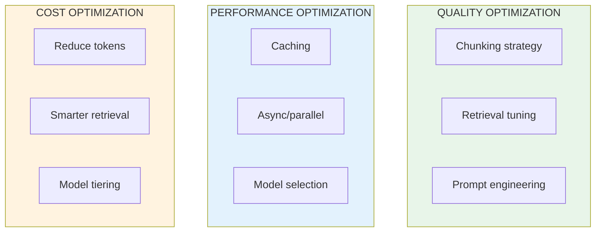
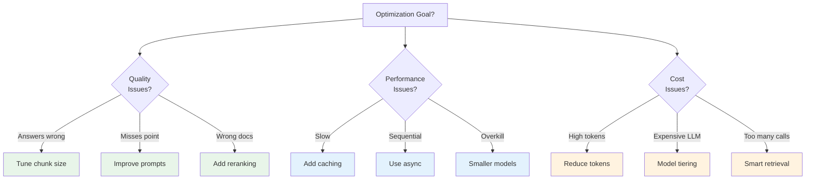

# Lesson 8.35: RAG Optimization

> **Duration**: 30 min | **Section**: G - Production RAG

## 🎯 The Problem (3-5 min)

Your RAG system works, but:
- Answers sometimes miss the point
- Latency is too high
- Costs are adding up
- Quality is inconsistent

**Optimization** addresses these production concerns systematically.

## 🔍 Optimization Areas



## 📦 Quality Optimization

### 1. Chunking Strategy

```python
from langchain_text_splitters import RecursiveCharacterTextSplitter

# ❌ Too small - loses context
small_splitter = RecursiveCharacterTextSplitter(chunk_size=100)

# ❌ Too large - dilutes relevance
large_splitter = RecursiveCharacterTextSplitter(chunk_size=4000)

# ✅ Balanced - test for your content
optimal_splitter = RecursiveCharacterTextSplitter(
    chunk_size=500,      # Good for most content
    chunk_overlap=100,   # 20% overlap
    separators=["\n\n", "\n", ". ", " ", ""],  # Semantic boundaries
)

# 📊 Experiment with different sizes
def test_chunk_sizes(text, sizes=[300, 500, 800, 1200]):
    for size in sizes:
        splitter = RecursiveCharacterTextSplitter(chunk_size=size)
        chunks = splitter.split_text(text)
        avg_len = sum(len(c) for c in chunks) / len(chunks)
        print(f"Size {size}: {len(chunks)} chunks, avg {avg_len:.0f} chars")
```

### 2. Retrieval Tuning

```python
from langchain_openai import OpenAIEmbeddings
from langchain_chroma import Chroma

# ✅ Tune K based on evaluation
# Start with k=4, adjust based on recall metrics

# ✅ Use relevance threshold
def retrieve_with_threshold(vectorstore, query, k=10, threshold=0.7):
    results = vectorstore.similarity_search_with_score(query, k=k)
    # Filter by similarity threshold
    return [doc for doc, score in results if score >= threshold]

# ✅ Use MMR for diversity
retriever = vectorstore.as_retriever(
    search_type="mmr",
    search_kwargs={
        "k": 5,
        "fetch_k": 20,
        "lambda_mult": 0.7,  # Balance relevance/diversity
    }
)
```

### 3. Prompt Engineering

```python
from langchain_core.prompts import ChatPromptTemplate

# ❌ Weak prompt
weak_prompt = ChatPromptTemplate.from_template("""
Answer this: {question}
Context: {context}
""")

# ✅ Strong prompt with clear instructions
strong_prompt = ChatPromptTemplate.from_template("""You are a helpful assistant that answers questions accurately.

INSTRUCTIONS:
1. Use ONLY the provided context to answer
2. If the context doesn't contain the answer, say "I don't have that information"
3. Be concise but complete
4. Include specific details from the context

CONTEXT:
{context}

QUESTION: {question}

ANSWER:""")

# ✅ Few-shot for consistent format
few_shot_prompt = ChatPromptTemplate.from_template("""Answer questions based on context.

Example:
Context: Python 3.0 was released in December 2008.
Question: When was Python 3 released?
Answer: Python 3 was released in December 2008.

Now your turn:
Context: {context}
Question: {question}
Answer:""")
```

## ⚡ Performance Optimization

### 1. Caching

```python
from functools import lru_cache
import hashlib

# Cache embeddings
@lru_cache(maxsize=1000)
def get_cached_embedding(text: str) -> tuple:
    # Convert to tuple for hashability
    embedding = embeddings.embed_query(text)
    return tuple(embedding)

# Cache retrieval results
class CachedRetriever:
    def __init__(self, retriever, cache_size=100):
        self.retriever = retriever
        self.cache = {}
        self.cache_size = cache_size
    
    def invoke(self, query: str):
        cache_key = hashlib.md5(query.encode()).hexdigest()
        
        if cache_key in self.cache:
            return self.cache[cache_key]
        
        results = self.retriever.invoke(query)
        
        # Simple LRU: remove oldest if full
        if len(self.cache) >= self.cache_size:
            oldest = next(iter(self.cache))
            del self.cache[oldest]
        
        self.cache[cache_key] = results
        return results

cached_retriever = CachedRetriever(base_retriever)
```

### 2. Async/Parallel Processing

```python
import asyncio
from langchain_openai import ChatOpenAI

llm = ChatOpenAI(model="gpt-4")

# ✅ Async retrieval and generation
async def async_rag(questions: list[str], retriever, chain):
    tasks = [chain.ainvoke(q) for q in questions]
    return await asyncio.gather(*tasks)

# ✅ Batch embedding
from langchain_openai import OpenAIEmbeddings

embeddings = OpenAIEmbeddings(model="text-embedding-3-small")

# Embed multiple texts at once (API supports batching)
texts = ["text1", "text2", "text3"]
vectors = embeddings.embed_documents(texts)  # Single API call!
```

### 3. Model Selection

```python
from langchain_openai import ChatOpenAI

# ✅ Use smaller models when possible
cheap_llm = ChatOpenAI(model="gpt-3.5-turbo", temperature=0)
quality_llm = ChatOpenAI(model="gpt-4", temperature=0)

# ✅ Route based on query complexity
def select_model(query: str):
    # Simple heuristic: short queries use cheap model
    if len(query) < 50 and "?" in query:
        return cheap_llm
    return quality_llm

# ✅ Use smaller embedding models
efficient_embeddings = OpenAIEmbeddings(
    model="text-embedding-3-small"  # 1536D, cheaper
)
quality_embeddings = OpenAIEmbeddings(
    model="text-embedding-3-large"  # 3072D, better
)
```

## 💰 Cost Optimization

### 1. Reduce Token Usage

```python
# ✅ Compress context before sending to LLM
def compress_context(docs: list, max_chars: int = 3000) -> str:
    """Keep most relevant parts within token budget."""
    context = ""
    for doc in docs:
        if len(context) + len(doc.page_content) > max_chars:
            remaining = max_chars - len(context)
            context += doc.page_content[:remaining] + "..."
            break
        context += doc.page_content + "\n\n"
    return context

# ✅ Summarize long documents before storing
def presummzarize_for_rag(doc: str, llm) -> str:
    """Create concise version for retrieval."""
    prompt = ChatPromptTemplate.from_template(
        "Summarize key facts from this text in bullet points:\n{text}"
    )
    chain = prompt | llm
    return chain.invoke({"text": doc}).content
```

### 2. Smarter Retrieval

```python
# ✅ Don't retrieve if not needed
def needs_retrieval(query: str, llm) -> bool:
    """Check if query needs external knowledge."""
    prompt = ChatPromptTemplate.from_template(
        "Does this question need external documents or can it be answered from general knowledge?\n"
        "Question: {query}\n"
        "Answer SEARCH or GENERAL:"
    )
    result = (prompt | llm).invoke({"query": query})
    return "SEARCH" in result.content.upper()

# ✅ Early termination if confident
def retrieve_until_confident(query: str, vectorstore, max_k=10):
    """Retrieve incrementally until we have enough."""
    for k in [2, 5, 10]:
        results = vectorstore.similarity_search_with_score(query, k=k)
        # If top result is very confident, stop early
        if results and results[0][1] > 0.9:
            return [doc for doc, _ in results]
        if k >= max_k:
            break
    return [doc for doc, _ in results]
```

### 3. Model Tiering

```python
from langchain_openai import ChatOpenAI
from langchain_core.prompts import ChatPromptTemplate

# ✅ Multi-tier approach
fast_llm = ChatOpenAI(model="gpt-3.5-turbo")
smart_llm = ChatOpenAI(model="gpt-4")

def tiered_rag(query: str, context: str):
    # Step 1: Quick check if context is relevant (cheap)
    relevance_prompt = ChatPromptTemplate.from_template(
        "Is this context relevant to the question? YES or NO.\n"
        "Context: {context}\nQuestion: {query}\nAnswer:"
    )
    relevance = (relevance_prompt | fast_llm).invoke({
        "context": context[:500], "query": query
    })
    
    if "NO" in relevance.content:
        return "I don't have information about that."
    
    # Step 2: Generate answer (use quality model)
    answer_prompt = ChatPromptTemplate.from_template(
        "Answer based on context:\n{context}\n\nQuestion: {query}\nAnswer:"
    )
    return (answer_prompt | smart_llm).invoke({
        "context": context, "query": query
    }).content
```

## 📊 Optimization Decision Tree



## 🎯 Practice

Implement optimization techniques:

```python
from langchain_openai import ChatOpenAI, OpenAIEmbeddings
from langchain_chroma import Chroma
from langchain_core.prompts import ChatPromptTemplate
from langchain_core.runnables import RunnablePassthrough
from langchain_core.output_parsers import StrOutputParser
from langchain_core.documents import Document
from functools import lru_cache
import time

# 1. Create test data
documents = [
    Document(page_content="Python was created by Guido van Rossum in 1991."),
    Document(page_content="Python 3.0 was released in December 2008."),
    Document(page_content="Python is named after Monty Python comedy group."),
    Document(page_content="Python uses indentation for code blocks."),
    Document(page_content="Python is dynamically typed language."),
]

embeddings = OpenAIEmbeddings(model="text-embedding-3-small")
vectorstore = Chroma.from_documents(documents, embeddings)

# 2. Baseline RAG
print("=== Baseline RAG ===")
base_retriever = vectorstore.as_retriever(search_kwargs={"k": 3})
base_prompt = ChatPromptTemplate.from_template(
    "Context: {context}\nQuestion: {question}\nAnswer:"
)
llm = ChatOpenAI(model="gpt-3.5-turbo", temperature=0)

def format_docs(docs):
    return "\n".join(doc.page_content for doc in docs)

base_chain = (
    {"context": base_retriever | format_docs, "question": RunnablePassthrough()}
    | base_prompt
    | llm
    | StrOutputParser()
)

start = time.time()
result = base_chain.invoke("When was Python created?")
base_time = time.time() - start
print(f"Result: {result}")
print(f"Time: {base_time:.2f}s")

# 3. Optimized: Better prompt
print("\n=== Optimized Prompt ===")
optimized_prompt = ChatPromptTemplate.from_template("""Answer concisely based ONLY on the context.

Context:
{context}

Question: {question}

Answer (be specific):""")

opt_chain = (
    {"context": base_retriever | format_docs, "question": RunnablePassthrough()}
    | optimized_prompt
    | llm
    | StrOutputParser()
)

result = opt_chain.invoke("When was Python created?")
print(f"Result: {result}")

# 4. Optimized: Caching
print("\n=== With Caching ===")
cache = {}

def cached_retrieve(query: str):
    if query in cache:
        print("  (cache hit)")
        return cache[query]
    result = base_retriever.invoke(query)
    cache[query] = result
    return result

# First call
start = time.time()
docs = cached_retrieve("When was Python created?")
first_time = time.time() - start
print(f"First call: {first_time:.4f}s")

# Second call (cached)
start = time.time()
docs = cached_retrieve("When was Python created?")
cached_time = time.time() - start
print(f"Cached call: {cached_time:.4f}s")
print(f"Speedup: {first_time/cached_time:.1f}x")

# 5. Optimized: Context compression
print("\n=== Context Compression ===")

def compress_docs(docs, max_chars=200):
    text = ""
    for doc in docs:
        remaining = max_chars - len(text)
        if remaining <= 0:
            break
        text += doc.page_content[:remaining] + " "
    return text.strip()

full_context = format_docs(documents)
compressed = compress_docs(documents, max_chars=200)

print(f"Full context: {len(full_context)} chars")
print(f"Compressed: {len(compressed)} chars")
print(f"Token savings: ~{(len(full_context)-len(compressed))/4:.0f} tokens")

# 6. Optimized: Retrieval with threshold
print("\n=== Threshold Retrieval ===")

def retrieve_with_threshold(query, threshold=0.5):
    results = vectorstore.similarity_search_with_score(query, k=5)
    filtered = [(doc, score) for doc, score in results if score <= threshold]  # Lower = better in Chroma
    print(f"  Retrieved {len(results)} → Kept {len(filtered)} (threshold={threshold})")
    return [doc for doc, _ in filtered]

docs = retrieve_with_threshold("When was Python created?", threshold=0.5)

# 7. Summary
print("\n=== Optimization Summary ===")
print("✅ Better prompts: More specific instructions")
print("✅ Caching: Avoid repeated retrieval")
print("✅ Compression: Reduce token usage")
print("✅ Thresholds: Filter low-quality results")
print("✅ Smaller models: Use gpt-3.5-turbo when possible")
```

## 🔑 Key Takeaways

- **Quality**: Chunk size, prompts, retrieval strategy
- **Performance**: Caching, async, smaller models
- **Cost**: Token reduction, model tiering, smart retrieval
- **Measure first**: Use metrics to guide optimization
- **Iterate**: Test one change at a time

## ❓ Common Questions

| Question | Answer |
|----------|--------|
| Where to start? | Measure current metrics, fix biggest issue first |
| Caching duration? | Depends on content freshness, minutes to hours |
| Model switching? | Test quality impact, A/B test in production |
| Chunk size? | Start at 500, tune with retrieval metrics |

---

## 📚 Further Reading

- [RAG Optimization](https://python.langchain.com/docs/how_to/#qa-with-rag) - LangChain
- [Caching Strategies](https://python.langchain.com/docs/how_to/llm_caching/) - LangChain
- [Async LangChain](https://python.langchain.com/docs/concepts/async/) - Async guide
