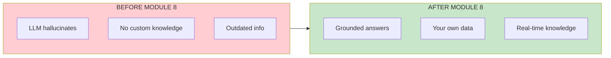

# Lesson 8.36: Module Review - RAG: The Hard Parts

> **Duration**: 20 min | **Section**: G - Production RAG

## 🎯 What You've Learned

This module took you from **"LLMs make things up"** to **"I can build a production RAG system."**



## 📚 Section Recap

### Section A: Why RAG Exists (Lessons 0-4)

**The Problem**: LLMs have frozen knowledge and hallucinate.

**Key Insight**: Give LLM the answer in the prompt, not in training.


**You Can Now**:
- Explain why RAG beats fine-tuning for knowledge
- Describe the retrieve-then-generate pattern
- Identify when RAG is the right solution

---

### Section B: Embeddings (Lessons 5-9)

**The Problem**: Text is strings, but we need to find "similar meaning."

**Key Insight**: Embeddings = GPS coordinates for meaning.

```python
from openai import OpenAI
client = OpenAI()

# Text → 1536-dimensional vector
response = client.embeddings.create(
    model="text-embedding-3-small",
    input="Your text here"
)
vector = response.data[0].embedding  # [0.023, -0.041, ...]
```

**You Can Now**:
- Create embeddings with OpenAI API
- Understand cosine similarity
- Build a simple semantic search

---

### Section C: Build RAG From Scratch (Lessons 10-16)

**The Problem**: How does RAG actually work under the hood?

**Key Insight**: Building from scratch reveals the core mechanics.

```python
# The complete RAG formula
def rag_answer(question, documents):
    # 1. Embed the question
    q_embedding = embed(question)
    
    # 2. Find similar chunks
    chunks = load_and_chunk(documents)
    similarities = [cosine_sim(q_embedding, embed(c)) for c in chunks]
    
    # 3. Get top chunks
    top_chunks = sorted(zip(similarities, chunks), reverse=True)[:3]
    context = "\n".join(c for _, c in top_chunks)
    
    # 4. Generate answer
    return llm(f"Context: {context}\n\nQuestion: {question}")
```

**You Can Now**:
- Load and chunk PDFs
- Calculate similarity with NumPy
- Build complete RAG without frameworks

---

### Section D: LangChain Fundamentals (Lessons 17-20)

**The Problem**: Building RAG from scratch is tedious and error-prone.

**Key Insight**: LangChain provides composable, production-ready components.

```python
from langchain_openai import ChatOpenAI
from langchain_core.prompts import ChatPromptTemplate
from langchain_core.output_parsers import StrOutputParser

# LCEL: Elegant pipe syntax
chain = prompt | llm | StrOutputParser()
result = chain.invoke({"question": "What is RAG?"})
```

**You Can Now**:
- Use ChatOpenAI wrapper
- Create prompt templates with variables
- Build chains with LCEL pipe syntax

---

### Section E: LangChain RAG Pipeline (Lessons 21-26)

**The Problem**: How do I build full RAG with LangChain?

**Key Insight**: LangChain has loaders, splitters, and stores for everything.

```python
from langchain_community.document_loaders import PyPDFLoader
from langchain_text_splitters import RecursiveCharacterTextSplitter
from langchain_chroma import Chroma
from langchain_core.runnables import RunnablePassthrough

# Complete RAG in 10 lines
docs = PyPDFLoader("manual.pdf").load()
chunks = RecursiveCharacterTextSplitter().split_documents(docs)
vectorstore = Chroma.from_documents(chunks, embeddings)
retriever = vectorstore.as_retriever()

chain = (
    {"context": retriever | format_docs, "question": RunnablePassthrough()}
    | prompt
    | llm
    | StrOutputParser()
)
```

**You Can Now**:
- Load documents from any source
- Choose appropriate splitter settings
- Create and persist vector stores
- Build complete RAG chains

---

### Section F: Advanced Retrieval (Lessons 27-32)

**The Problem**: Basic retrieval misses things semantic search can't find.

**Key Insight**: Combine multiple retrieval strategies.

| Strategy | Strength | When to Use |
|----------|----------|-------------|
| **Semantic** | Meaning | Most queries |
| **BM25** | Keywords | Exact terms |
| **Hybrid** | Both | Best overall |
| **Reranking** | Precision | Quality-critical |
| **HyDE** | Recall | Vague queries |

```python
from langchain.retrievers import EnsembleRetriever
from langchain_community.retrievers import BM25Retriever

# Hybrid = Semantic + Keyword
hybrid = EnsembleRetriever(
    retrievers=[semantic_retriever, bm25_retriever],
    weights=[0.5, 0.5]
)
```

**You Can Now**:
- Implement BM25 keyword search
- Combine retrievers with EnsembleRetriever
- Apply reranking for better precision
- Use query expansion and HyDE

---

### Section G: Production RAG (Lessons 33-36)

**The Problem**: RAG in production needs citations, evaluation, and optimization.

**Key Insight**: Production = Trust + Measure + Optimize.

```python
# Citations: Track sources
{"answer": "Python was created in 1991.", "sources": ["doc1.pdf"]}

# Evaluation: Measure quality
precision_at_k(retrieved, relevant, k=5)
recall_at_k(retrieved, relevant, k=5)
evaluate_faithfulness(answer, context)

# Optimization: Improve systematically
- Caching for speed
- Compression for cost
- Model tiering for balance
```

**You Can Now**:
- Add citations and source attribution
- Evaluate with Precision, Recall, MRR, NDCG
- Measure Faithfulness and Answer Relevance
- Optimize for quality, performance, and cost

---

## 🧠 Complete Mental Model


## ✅ Skills Checklist

Rate yourself on each skill:

| # | Skill | Level |
|:-:|-------|:-----:|
| 1 | Explain why RAG solves hallucination | ⬜ |
| 2 | Create embeddings with OpenAI API | ⬜ |
| 3 | Calculate cosine similarity | ⬜ |
| 4 | Load documents with LangChain | ⬜ |
| 5 | Choose chunk size and overlap | ⬜ |
| 6 | Create and query ChromaDB | ⬜ |
| 7 | Build LCEL RAG chain | ⬜ |
| 8 | Implement hybrid retrieval | ⬜ |
| 9 | Add reranking to pipeline | ⬜ |
| 10 | Process and expand queries | ⬜ |
| 11 | Include citations in responses | ⬜ |
| 12 | Evaluate RAG with metrics | ⬜ |
| 13 | Optimize for production | ⬜ |

**Scoring**: 
- 10-13 ✅: Ready for production RAG
- 7-9 ✅: Review weak areas
- <7 ✅: Re-do relevant sections

## 🎓 Independence Test

Answer without looking:

| Level | Question |
|-------|----------|
| **Know** | What are the two pipelines in RAG? |
| **Understand** | Why do we chunk documents instead of embedding whole files? |
| **Apply** | How would you add a new PDF to an existing RAG system? |
| **Analyze** | When would semantic search fail but BM25 succeed? |
| **Create** | Design a RAG system for a company's internal documentation. |

<details>
<summary>Check Your Answers</summary>

1. **Know**: Indexing pipeline (offline) and Query pipeline (runtime)

2. **Understand**: Embedding models have token limits, and smaller chunks improve retrieval precision

3. **Apply**: Load PDF → Split into chunks → Embed → Add to existing vector store

4. **Analyze**: When query contains exact technical terms, product codes, or rare words not in semantic training

5. **Create**: Should include:
   - Document loaders for various formats
   - Chunking with metadata (doc name, section)
   - Persistent vector store
   - Hybrid retrieval (semantic + keyword)
   - Citation tracking
   - Access controls
   - Evaluation pipeline

</details>

## 🚀 What's Next: Module 9 - LangGraph

You've built RAG systems that **answer questions**. But what about systems that **take actions**?


**Coming in Module 9**:
- Agents vs Chains - when LLMs make decisions
- State machines - structured multi-step workflows
- Tool use - LLMs that call functions
- Human-in-the-loop - approval workflows
- Multi-agent systems - agents coordinating

## 📊 Module 8 Quick Reference

| Component | Library | Key Class/Function |
|-----------|---------|-------------------|
| Embeddings | `openai` | `client.embeddings.create()` |
| LangChain Embeddings | `langchain-openai` | `OpenAIEmbeddings` |
| LLM | `langchain-openai` | `ChatOpenAI` |
| Prompts | `langchain-core` | `ChatPromptTemplate` |
| Loaders | `langchain-community` | `PyPDFLoader`, `DirectoryLoader` |
| Splitters | `langchain-text-splitters` | `RecursiveCharacterTextSplitter` |
| Vector Store | `langchain-chroma` | `Chroma` |
| BM25 | `langchain-community` | `BM25Retriever` |
| Hybrid | `langchain` | `EnsembleRetriever` |
| Reranking | `sentence-transformers` | `CrossEncoder` |
| Evaluation | `ragas` | `evaluate()` |

## 🏆 You Made It!

You now understand RAG deeply—not just how to use it, but **why it works** and **how to make it production-ready**.

```
Module 8: RAG - The Hard Parts ✅
└── 37 lessons
└── 7 sections
└── 1 complete understanding
```

**Next**: [Module 9: LangGraph - Agentic Systems](../Module-09-LangGraph/README.md)

> 📊 **Production RAG**: For evaluation metrics, guardrails, and security in production RAG systems, see [Module 11: LLMOps](../Module-11-LLMOps/README.md).
