# Module 8: RAG - The Hard Parts

> **Duration**: 2 Weeks | **Lessons**: 37

## 🎯 Module Overview

You have 100 company PDFs. User asks a question. GPT-4 hasn't read your PDFs. It will hallucinate or say "I don't know." **Retrieval-Augmented Generation (RAG)** solves this by giving the LLM an "open book test" - finding relevant chunks from YOUR documents and injecting them into the prompt.

This module teaches RAG from first principles. You'll build it **by hand** before using LangChain, so you understand exactly what's happening under the hood.

## 🧠 Mental Model

```mermaid
flowchart LR
    subgraph INDEXING["📥 INDEXING (One-time)"]
        D["📄 Documents"] --> L["Load"]
        L --> C["Chunk"]
        C --> E["Embed"]
        E --> V["Vector Store"]
    end
    
    subgraph RETRIEVAL["🔍 RETRIEVAL (Per Query)"]
        Q["❓ Query"] --> QE["Embed Query"]
        QE --> S["Search"]
        V --> S
        S --> R["Top-K Results"]
    end
    
    subgraph GENERATION["✨ GENERATION"]
        R --> P["Inject into Prompt"]
        P --> LLM["LLM"]
        LLM --> A["📝 Answer"]
    end
    
    style INDEXING fill:#E3F2FD,stroke:#1565C0
    style RETRIEVAL fill:#FFF3E0,stroke:#EF6C00
    style GENERATION fill:#E8F5E9,stroke:#2E7D32
```

> **RAG = Retrieval-Augmented Generation**: Retrieval (find docs) + Augmented (add to prompt) + Generation (LLM answers from context)

## 📋 Prerequisites

- Module 3: Python Core (functions, classes, file I/O)
- Module 6: FastAPI & Pydantic (for building RAG APIs)
- Module 7: LLM APIs (OpenAI API, chat completions, function calling)
- Understanding of API keys and environment variables

## 🗂️ Module Structure

| Section | Lessons | Focus |
|---------|:-------:|-------|
| A: Why RAG Exists | 8.0 - 8.4 | The knowledge problem, context limits, hallucination |
| B: Embeddings | 8.5 - 8.9 | Words as vectors, similarity search, the secret sauce |
| C: Build RAG From Scratch | 8.10 - 8.16 | Manual implementation without frameworks |
| D: LangChain Fundamentals | 8.17 - 8.20 | LLM wrappers, prompts, LCEL chains |
| E: LangChain RAG Pipeline | 8.21 - 8.26 | Document loaders, vector stores, retrievers |
| F: Advanced Retrieval | 8.27 - 8.32 | BM25, hybrid search, reranking |
| G: Production RAG | 8.33 - 8.36 | Citations, evaluation, optimization |

---

## 📚 Lessons

### Section A: Why RAG Exists

| # | Lesson | Duration | What We're Solving |
|:-:|--------|:--------:|-------------------|
| 8.0 | [The Knowledge Problem](Lesson-00-The-Knowledge-Problem.md) | 15 min | LLM hasn't read your company docs. How do you make it answer from YOUR documents? |
| 8.1 | [The Context Limit Problem](Lesson-01-The-Context-Limit-Problem.md) | 20 min | 128K tokens sounds big, but 100 PDFs = millions of tokens. It doesn't fit! |
| 8.2 | [The Hallucination Problem](Lesson-02-The-Hallucination-Problem.md) | 20 min | LLM "knows" things from training, but YOUR company policy? It'll make it up. |
| 8.3 | [The RAG Solution](Lesson-03-The-RAG-Solution.md) | 25 min | Give LLM an "open book test" - find relevant chunks, inject into prompt. |
| 8.4 | [RAG Mental Model Q&A](Lesson-04-RAG-Mental-Model-QA.md) | 10 min | "What if nothing relevant found?" "What if too much context?" |

### Section B: Embeddings (The Secret Sauce)

| # | Lesson | Duration | What We're Solving |
|:-:|--------|:--------:|-------------------|
| 8.5 | [The Search Problem](Lesson-05-The-Search-Problem.md) | 5 min | You search 'remote policy' but document says 'work from home'. No word match! |
| 8.6 | [What ARE Embeddings?](Lesson-06-What-ARE-Embeddings.md) | 30 min | Words as coordinates in space. Similar meaning = close together. |
| 8.7 | [Creating Embeddings](Lesson-07-Creating-Embeddings.md) | 25 min | OpenAI's text-embedding-3-small. 1536 dimensions per text. |
| 8.8 | [Similarity Search](Lesson-08-Similarity-Search.md) | 30 min | Cosine similarity. Find closest vectors. Top-k results. |
| 8.9 | [Embeddings Q&A](Lesson-09-Embeddings-QA.md) | 10 min | "Why 1536 dimensions?" "What's cosine similarity really doing?" |

### Section C: Build RAG From Scratch (BEFORE LangChain!)

| # | Lesson | Duration | What We're Solving |
|:-:|--------|:--------:|-------------------|
| 8.10 | [The Manual Way](Lesson-10-The-Manual-Way.md) | 5 min | Building RAG with just Python, OpenAI, and a list. NO FRAMEWORKS. |
| 8.11 | [Document Loading](Lesson-11-Document-Loading.md) | 25 min | Read PDF/text files with Python. Just `open()` and libraries. |
| 8.12 | [Chunking](Lesson-12-Chunking.md) | 25 min | Split documents into pieces. Overlap for context. |
| 8.13 | [Embedding Chunks](Lesson-13-Embedding-Chunks.md) | 25 min | Call OpenAI embeddings API. Store vectors in a Python list! |
| 8.14 | [Similarity Search by Hand](Lesson-14-Similarity-Search-By-Hand.md) | 30 min | Calculate cosine similarity with numpy. Find top-k matches. |
| 8.15 | [RAG Pipeline by Hand](Lesson-15-RAG-Pipeline-By-Hand.md) | 30 min | Combine: Query → Embed → Search → Prompt → Generate |
| 8.16 | [Manual RAG Q&A](Lesson-16-Manual-RAG-QA.md) | 10 min | You just built RAG without frameworks! What was hard? |

### Section D: LangChain Fundamentals

| # | Lesson | Duration | What We're Solving |
|:-:|--------|:--------:|-------------------|
| 8.17 | [What IS LangChain?](Lesson-17-What-IS-LangChain.md) | 20 min | Abstractions for LLM apps. Chains, prompts, memory. |
| 8.18 | [ChatOpenAI Wrapper](Lesson-18-ChatOpenAI-Wrapper.md) | 25 min | LangChain's LLM interface. `invoke()`, messages. |
| 8.19 | [Prompt Templates](Lesson-19-Prompt-Templates.md) | 30 min | `ChatPromptTemplate`. Variables. Why templates matter. |
| 8.20 | [LCEL Chains](Lesson-20-LCEL-Chains.md) | 35 min | Pipe operator `\|`. Composing chains. `RunnablePassthrough`. |

### Section E: LangChain RAG Pipeline

| # | Lesson | Duration | What We're Solving |
|:-:|--------|:--------:|-------------------|
| 8.21 | [Document Loaders](Lesson-21-Document-Loaders.md) | 25 min | `PyPDFLoader`, `TextLoader`. LangChain handles file parsing. |
| 8.22 | [Text Splitters](Lesson-22-Text-Splitters.md) | 30 min | `RecursiveCharacterTextSplitter`. Chunk size, overlap. |
| 8.23 | [Vector Stores](Lesson-23-Vector-Stores.md) | 35 min | ChromaDB. Store embeddings. Persist to disk. |
| 8.24 | [Retrieval](Lesson-24-Retrieval-Chain.md) | 35 min | `.as_retriever()`. Search vectors. Metadata filtering. |
| 8.25 | [Full RAG Chain](Lesson-25-Full-RAG-Chain.md) | 40 min | Combine: Retriever \| Prompt \| LLM. The complete pipeline. |
| 8.26 | [LangChain RAG Q&A](Lesson-26-LangChain-RAG-QA.md) | 10 min | "When to use ChromaDB vs pgvector?" "Metadata filtering?" |

### Section F: Advanced Retrieval (2026)

| # | Lesson | Duration | What We're Solving |
|:-:|--------|:--------:|-------------------|
| 8.27 | [BM25 Keyword Search](Lesson-27-BM25-Keyword-Search.md) | 30 min | Keyword-based ranking. TF-IDF on steroids. When keywords matter. |
| 8.28 | [Hybrid Search](Lesson-28-Hybrid-Search.md) | 35 min | Combine Vector + BM25. Reciprocal Rank Fusion (RRF). |
| 8.29 | [Semantic Reranking](Lesson-29-Semantic-Reranking.md) | 35 min | Cross-encoder rerankers. Cohere Rerank. Two-stage retrieval. |
| 8.30 | [Contextual Chunking](Lesson-30-Contextual-Chunking.md) | 30 min | Parent-child chunks. Section headers. Hierarchical retrieval. |
| 8.31 | [Query Processing](Lesson-31-Query-Processing.md) | 30 min | Query rewriting, decomposition, and retrieval-time enhancements. |
| 8.32 | [Advanced Retrieval Q&A](Lesson-32-Advanced-Retrieval-QA.md) | 10 min | "When to rerank?" "Chunk size vs recall tradeoff?" |

### Section G: Production RAG

| # | Lesson | Duration | What We're Solving |
|:-:|--------|:--------:|-------------------|
| 8.33 | [Citations & Sources](Lesson-33-Citations-Source-Attribution.md) | 25 min | Return source documents. Page numbers. "Based on doc X..." |
| 8.34 | [Evaluation Metrics](Lesson-34-RAG-Evaluation-Metrics.md) | 35 min | Precision@k, Recall@k, NDCG. How do you know retrieval is working? |
| 8.35 | [Optimization](Lesson-35-RAG-Optimization.md) | 35 min | Chunk size tuning. Embedding model selection. A/B testing retrieval. |
| 8.36 | [Module 8 Review](Lesson-36-Module-Review.md) | 15 min | RAG mental model: Load → Chunk → Embed → Store → Search → Rerank → Generate |

---

## 🎯 Module Project

**Build a complete "Chat with PDF" application** with:
- Hybrid search (vector + BM25)
- Semantic reranking
- Source citations with page numbers
- Streaming responses

---

## ✅ Independence Check

After this module, you should be able to:

| Level | Question |
|-------|----------|
| **Know** | What is RAG? What's the difference between indexing and retrieval? |
| **Understand** | Why do we chunk documents? Why embeddings instead of keyword search? |
| **Apply** | Can you build a basic RAG pipeline from scratch WITHOUT LangChain? |
| **Analyze** | When does vector search fail? When should you add reranking? |
| **Create** | Can you build a production RAG system with hybrid search and citations? |

---

## 🔗 References

- [OpenAI Embeddings Guide](https://platform.openai.com/docs/guides/embeddings) - Official embeddings documentation
- [LangChain RAG Tutorial](https://python.langchain.com/docs/tutorials/rag/) - Official LangChain RAG guide
- [ChromaDB Documentation](https://docs.trychroma.com/) - Vector database documentation
- [Cohere Rerank](https://docs.cohere.com/docs/reranking) - Semantic reranking documentation
- [Pinecone RAG Guide](https://www.pinecone.io/learn/retrieval-augmented-generation/) - Production RAG patterns
- [BM25 Algorithm](https://en.wikipedia.org/wiki/Okapi_BM25) - Understanding keyword search ranking

---

## 🔗 Next Module

→ [Module 9: LangGraph - Agentic Systems](../Module-09-LangGraph/README.md)
