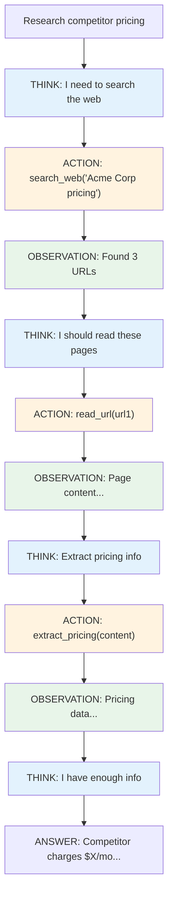

# Lesson 9.0: The Multi-Step Problem

> **Duration**: 15 min | **Section**: A - What IS an Agent?

## 🎯 The Problem (3-5 min)

Your user asks:

> "Research competitor X and summarize their pricing."

Think about what this actually requires:

1. **Search** the web for competitor information
2. **Read** multiple pages
3. **Extract** pricing details
4. **Compare** to your own pricing
5. **Summarize** the findings

Can one LLM call do this? **No.**

The LLM can't browse the web. Can't read live pages. Can't access your internal pricing. Each step depends on the previous step's results.

## 🧪 Try It: One LLM Call

```python
from openai import OpenAI

client = OpenAI()

response = client.chat.completions.create(
    model="gpt-4",
    messages=[{
        "role": "user",
        "content": "Research competitor Acme Corp and summarize their pricing."
    }]
)

print(response.choices[0].message.content)
```

**Output**:
```
I don't have access to real-time information about Acme Corp's 
current pricing. My knowledge was last updated in April 2024.

To get accurate pricing information, I recommend:
1. Visiting their official website
2. Contacting their sales team
3. Checking recent press releases
```

The LLM **can't do the task**. It has no tools.

## 🔍 What We Actually Need



This is an **Agent**: an LLM that loops through Think → Act → Observe until done.

## 💥 Why Chains Don't Work

A **chain** is a fixed sequence:

```python
# Chain = predetermined steps
chain = prompt | llm | parser | next_step | final_step
```

But complex tasks have:

| Challenge | Chain | Agent |
|-----------|-------|-------|
| Unknown number of steps | ❌ Fixed | ✅ Dynamic |
| Conditional branching | ❌ Linear | ✅ Decides at runtime |
| Loops and retries | ❌ No | ✅ Yes |
| Tool selection | ❌ Hardcoded | ✅ LLM chooses |

## ✅ The Agent Pattern

```python
# Pseudocode: Agent loop
def agent(user_query, tools):
    state = {"messages": [user_query]}
    
    while True:
        # LLM decides what to do
        response = llm(state["messages"], tools=tools)
        
        if response.done:
            return response.final_answer
        
        if response.tool_call:
            # Execute the tool
            result = execute_tool(response.tool_call)
            state["messages"].append(result)
            # Loop back for next decision
```

The key insight: **The LLM decides what to do next, not your code.**

## 🎯 When You Need an Agent

| Scenario | Chain or Agent? |
|----------|-----------------|
| Answer from context | Chain |
| Fixed 3-step workflow | Chain |
| "Research and summarize X" | **Agent** |
| Multi-tool interaction | **Agent** |
| Unknown number of steps | **Agent** |
| Self-correction needed | **Agent** |

## 🔑 Key Takeaways

- **One LLM call** can't do multi-step real-world tasks
- **Chains** are fixed sequences - can't loop or branch
- **Agents** let the LLM decide: Think → Act → Observe → Repeat
- **Tools** give agents the ability to interact with the world
- **State** persists between steps

## ❓ Common Questions

| Question | Answer |
|----------|--------|
| Can't I just chain multiple calls? | You can, but you're hardcoding the logic. Agents let the LLM adapt. |
| What if the agent loops forever? | You set max iterations and handle stuck states. |
| Are agents always better? | No! For simple tasks, chains are faster and cheaper. |
| What tools can agents use? | Any function: web search, databases, APIs, file operations... |

---

## 📚 Further Reading

- [ReAct: Synergizing Reasoning and Acting](https://arxiv.org/abs/2210.03629) - The foundational paper
- [LangGraph Introduction](https://langchain-ai.github.io/langgraph/) - Why graphs for agents
- [Building Agents with LangChain](https://python.langchain.com/docs/concepts/agents/) - Agent concepts
