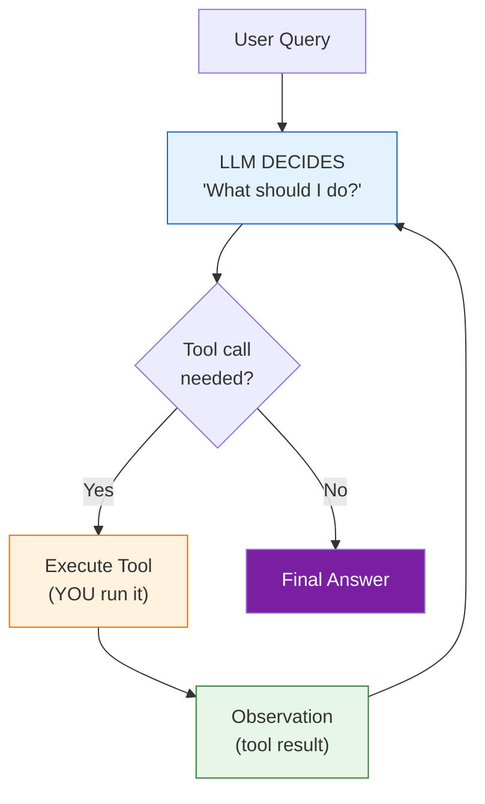

# Lesson 9.1: Agents = LLM + Tools + Loop

> **Duration**: 25 min | **Section**: A - What IS an Agent?

## 🎯 The Problem (3-5 min)

You have an LLM that can reason. You have tools that can act. But how do you connect them?

> **Scenario**: User asks "What's the weather in Paris? Should I bring an umbrella?"
> 
> The LLM knows how to answer weather questions. But it can't check actual weather. You have a weather API. How do they work together?

## 🧪 Try It: Manual Integration

```python
from openai import OpenAI
import json

client = OpenAI()

def get_weather(city: str) -> dict:
    """Simulated weather API"""
    return {"city": city, "temp": 15, "conditions": "rain likely"}

# Step 1: Ask LLM what to do
response = client.chat.completions.create(
    model="gpt-4",
    messages=[{"role": "user", "content": "What's the weather in Paris?"}],
    tools=[{
        "type": "function",
        "function": {
            "name": "get_weather",
            "description": "Get current weather for a city",
            "parameters": {
                "type": "object",
                "properties": {
                    "city": {"type": "string"}
                },
                "required": ["city"]
            }
        }
    }]
)

# Step 2: Execute tool if called
message = response.choices[0].message
if message.tool_calls:
    tool_call = message.tool_calls[0]
    args = json.loads(tool_call.function.arguments)
    result = get_weather(args["city"])
    print(f"Tool result: {result}")
    
    # Step 3: Send result back to LLM
    followup = client.chat.completions.create(
        model="gpt-4",
        messages=[
            {"role": "user", "content": "What's the weather in Paris?"},
            message,
            {
                "role": "tool",
                "tool_call_id": tool_call.id,
                "content": json.dumps(result)
            }
        ]
    )
    print(followup.choices[0].message.content)
```

This works, but it's **manual**. You had to:
- Call the LLM
- Check if it wants a tool
- Execute the tool
- Call the LLM again with results

What if the LLM needs 5 tools in sequence? What if it needs to loop?

## 🔍 The Agent Formula

An agent automates this loop:



**The Three Components**:

| Component | Role | Who Does It |
|-----------|------|-------------|
| **LLM** | Decides what to do | Model |
| **Tools** | Actually do things | Your code |
| **Loop** | Connects LLM ↔ Tools | Agent framework |

## 💥 Where Manual Approach Breaks

```python
# Manual approach for multi-step task
response1 = llm.chat(user_query, tools)
if response1.tool_calls:
    result1 = execute_tool(response1.tool_calls[0])
    response2 = llm.chat([..., result1], tools)
    if response2.tool_calls:
        result2 = execute_tool(response2.tool_calls[0])
        response3 = llm.chat([..., result2], tools)
        # How many levels deep?
        # What if it needs to retry?
        # What if tool fails?
```

This becomes unmaintainable. You need a **loop**.

## ✅ The Agent Loop

```python
from openai import OpenAI
import json

client = OpenAI()

def get_weather(city: str) -> dict:
    return {"city": city, "temp": 15, "conditions": "rain likely"}

def search_web(query: str) -> str:
    return f"Search results for: {query}"

# Tool registry
TOOLS = {
    "get_weather": get_weather,
    "search_web": search_web,
}

TOOL_DEFINITIONS = [
    {
        "type": "function",
        "function": {
            "name": "get_weather",
            "description": "Get current weather for a city",
            "parameters": {
                "type": "object",
                "properties": {"city": {"type": "string"}},
                "required": ["city"]
            }
        }
    },
    {
        "type": "function", 
        "function": {
            "name": "search_web",
            "description": "Search the web",
            "parameters": {
                "type": "object",
                "properties": {"query": {"type": "string"}},
                "required": ["query"]
            }
        }
    }
]

def agent(user_query: str, max_iterations: int = 5) -> str:
    """Simple agent loop."""
    messages = [{"role": "user", "content": user_query}]
    
    for i in range(max_iterations):
        print(f"\n--- Iteration {i+1} ---")
        
        # LLM decides
        response = client.chat.completions.create(
            model="gpt-4",
            messages=messages,
            tools=TOOL_DEFINITIONS
        )
        
        message = response.choices[0].message
        messages.append(message)
        
        # Check if done
        if not message.tool_calls:
            print("Agent finished!")
            return message.content
        
        # Execute tools
        for tool_call in message.tool_calls:
            name = tool_call.function.name
            args = json.loads(tool_call.function.arguments)
            
            print(f"Calling: {name}({args})")
            result = TOOLS[name](**args)
            print(f"Result: {result}")
            
            messages.append({
                "role": "tool",
                "tool_call_id": tool_call.id,
                "content": json.dumps(result) if isinstance(result, dict) else result
            })
    
    return "Max iterations reached"

# Test it
answer = agent("What's the weather in Paris? Should I bring an umbrella?")
print(f"\nFinal answer: {answer}")
```

**Output**:
```
--- Iteration 1 ---
Calling: get_weather({'city': 'Paris'})
Result: {'city': 'Paris', 'temp': 15, 'conditions': 'rain likely'}

--- Iteration 2 ---
Agent finished!

Final answer: The weather in Paris is 15°C with rain likely. 
Yes, you should bring an umbrella!
```

## 🎯 Practice

Extend the agent with a new tool:

```python
from openai import OpenAI
import json

client = OpenAI()

# 1. Add a calculator tool
def calculate(expression: str) -> float:
    """Safely evaluate math expression."""
    # Only allow basic math
    allowed = set("0123456789+-*/.(). ")
    if not all(c in allowed for c in expression):
        return "Invalid expression"
    return eval(expression)

# 2. Add tool definition
TOOLS = {
    "calculate": calculate,
}

TOOL_DEFINITIONS = [
    {
        "type": "function",
        "function": {
            "name": "calculate",
            "description": "Calculate a math expression",
            "parameters": {
                "type": "object",
                "properties": {
                    "expression": {"type": "string", "description": "Math expression like '2 + 2'"}
                },
                "required": ["expression"]
            }
        }
    }
]

def agent(user_query: str, max_iterations: int = 5) -> str:
    messages = [{"role": "user", "content": user_query}]
    
    for i in range(max_iterations):
        response = client.chat.completions.create(
            model="gpt-4",
            messages=messages,
            tools=TOOL_DEFINITIONS
        )
        
        message = response.choices[0].message
        messages.append(message)
        
        if not message.tool_calls:
            return message.content
        
        for tool_call in message.tool_calls:
            name = tool_call.function.name
            args = json.loads(tool_call.function.arguments)
            result = TOOLS[name](**args)
            
            messages.append({
                "role": "tool",
                "tool_call_id": tool_call.id,
                "content": str(result)
            })
    
    return "Max iterations reached"

# 3. Test with math question
answer = agent("What is 15% of 340?")
print(f"Answer: {answer}")

# 4. Try multi-step
answer = agent("If I have 3 items at $24.99 each, what's my total with 8% tax?")
print(f"Answer: {answer}")
```

## 🔑 Key Takeaways

- **Agent = LLM + Tools + Loop**
- **LLM decides** what tool to call (or if it's done)
- **You execute** the tool and return results
- **Loop continues** until LLM says "I'm done"
- **max_iterations** prevents infinite loops
- This is the foundation of all agent frameworks

## ❓ Common Questions

| Question | Answer |
|----------|--------|
| What if a tool fails? | Catch exceptions and return error message to LLM |
| Can LLM call multiple tools? | Yes! It can call tools in parallel |
| How does LLM know what tools exist? | You provide tool definitions with descriptions |
| What's the difference from function calling? | Function calling is one-shot. Agents loop. |

---

## 📚 Further Reading

- [OpenAI Function Calling](https://platform.openai.com/docs/guides/function-calling) - Tool use basics
- [LangChain Agents](https://python.langchain.com/docs/concepts/agents/) - Agent abstractions
- [Building Effective Agents](https://www.anthropic.com/research/building-effective-agents) - Anthropic's guide
