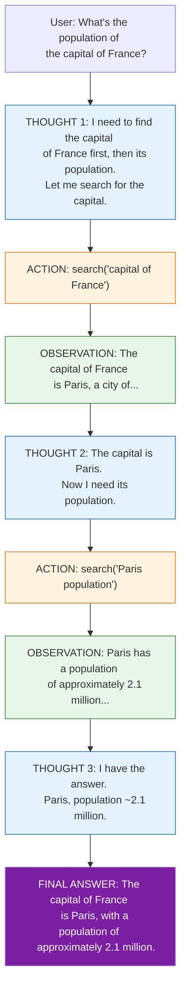
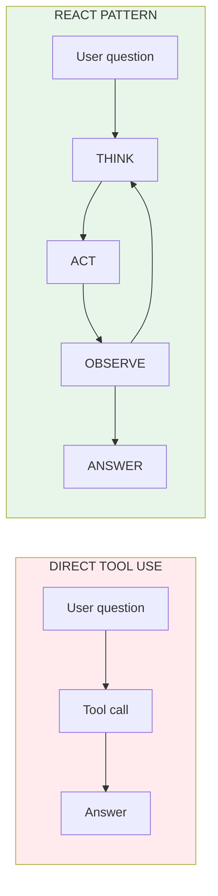

# Lesson 9.2: The ReAct Pattern

> **Duration**: 30 min | **Section**: A - What IS an Agent?

## 🎯 The Problem (3-5 min)

Your agent can use tools. But how does it **think** about what to do?

> **Scenario**: User asks: "What's the population of the capital of France?"
> 
> The agent could:
> 1. Search "population capital France" (confusing query)
> 2. Search "capital of France" → Paris → Search "population Paris"
> 
> Option 2 is better. But how do you get an LLM to reason step-by-step?

## 🧪 Try It: Direct Action

```python
from openai import OpenAI
import json

client = OpenAI()

# Simple tool-calling without explicit reasoning
response = client.chat.completions.create(
    model="gpt-4",
    messages=[{
        "role": "user", 
        "content": "What's the population of the capital of France?"
    }],
    tools=[{
        "type": "function",
        "function": {
            "name": "search",
            "description": "Search for information",
            "parameters": {
                "type": "object",
                "properties": {"query": {"type": "string"}},
                "required": ["query"]
            }
        }
    }]
)

# The LLM might search poorly without thinking first
if response.choices[0].message.tool_calls:
    query = json.loads(response.choices[0].message.tool_calls[0].function.arguments)
    print(f"Search query: {query}")
    # Might get: "population of capital of France" - suboptimal
```

The LLM jumped straight to action without **reasoning** first.

## 🔍 The ReAct Pattern

**ReAct** = **Re**asoning + **Act**ing

The pattern forces the LLM to:
1. **Think** about what it knows and needs
2. **Act** by calling a tool
3. **Observe** the result
4. **Think** again about what to do next



## 💥 Why This Matters

| Without ReAct | With ReAct |
|---------------|------------|
| "Search: population capital France" | "Think: I need capital first" |
| Confusing combined query | Decomposed into steps |
| Might miss context | Builds understanding |
| No self-correction | Can adjust strategy |

## ✅ Implementing ReAct

```python
from openai import OpenAI
import json

client = OpenAI()

def search(query: str) -> str:
    """Simulated search."""
    data = {
        "capital of France": "The capital of France is Paris.",
        "Paris population": "Paris has a population of approximately 2.16 million.",
        "weather Paris": "Paris: 15°C, partly cloudy.",
    }
    for key, value in data.items():
        if key.lower() in query.lower():
            return value
    return f"No results for: {query}"

REACT_PROMPT = """You are an agent that answers questions by reasoning step-by-step.

For each step, use this exact format:

THOUGHT: [Your reasoning about what you know and what you need]
ACTION: search("[your search query]")
OBSERVATION: [You'll see the search result here]

Repeat THOUGHT/ACTION/OBSERVATION until you have the answer.
When ready, respond with:

THOUGHT: I have enough information to answer.
FINAL ANSWER: [Your complete answer]

Available tools:
- search(query): Search for information

Begin!"""

def react_agent(question: str, max_steps: int = 5) -> str:
    """ReAct-style agent with explicit reasoning."""
    
    messages = [
        {"role": "system", "content": REACT_PROMPT},
        {"role": "user", "content": f"Question: {question}"}
    ]
    
    for step in range(max_steps):
        print(f"\n=== Step {step + 1} ===")
        
        response = client.chat.completions.create(
            model="gpt-4",
            messages=messages,
            temperature=0
        )
        
        content = response.choices[0].message.content
        print(content)
        
        # Check for final answer
        if "FINAL ANSWER:" in content:
            # Extract final answer
            final = content.split("FINAL ANSWER:")[-1].strip()
            return final
        
        # Check for action
        if "ACTION:" in content:
            # Extract search query
            action_line = [l for l in content.split("\n") if "ACTION:" in l][0]
            # Parse: ACTION: search("query")
            import re
            match = re.search(r'search\(["\'](.+?)["\']\)', action_line)
            if match:
                query = match.group(1)
                result = search(query)
                
                # Add assistant message and observation
                messages.append({"role": "assistant", "content": content})
                messages.append({"role": "user", "content": f"OBSERVATION: {result}"})
            else:
                messages.append({"role": "assistant", "content": content})
                messages.append({"role": "user", "content": "OBSERVATION: Could not parse action. Try again."})
        else:
            # No action, no final answer - prompt to continue
            messages.append({"role": "assistant", "content": content})
            messages.append({"role": "user", "content": "Continue reasoning. Use THOUGHT/ACTION or give FINAL ANSWER."})
    
    return "Max steps reached without answer"

# Test it
answer = react_agent("What's the population of the capital of France?")
print(f"\n🎯 Final: {answer}")
```

**Output**:
```
=== Step 1 ===
THOUGHT: I need to find the capital of France first, then look up its population.
ACTION: search("capital of France")

=== Step 2 ===
THOUGHT: The capital of France is Paris. Now I need to find Paris's population.
ACTION: search("Paris population")

=== Step 3 ===
THOUGHT: I have enough information to answer.
FINAL ANSWER: The capital of France is Paris, with a population of approximately 2.16 million.

🎯 Final: The capital of France is Paris, with a population of approximately 2.16 million.
```

## 🔍 ReAct vs Direct Tool Use



| Aspect | Direct | ReAct |
|--------|--------|-------|
| Speed | Faster | Slower (more calls) |
| Accuracy | Lower for complex | Higher for complex |
| Debuggability | Hard | Easy (see thoughts) |
| Self-correction | None | Built-in |

## 🎯 Practice

Implement a ReAct agent with multiple tools:

```python
from openai import OpenAI
import json
import re

client = OpenAI()

# Multiple tools
def search(query: str) -> str:
    data = {
        "eiffel tower height": "The Eiffel Tower is 330 meters tall.",
        "meters to feet": "1 meter = 3.281 feet",
        "tallest building": "The Burj Khalifa is the tallest at 828 meters.",
    }
    for key, value in data.items():
        if key.lower() in query.lower():
            return value
    return f"No specific result for: {query}"

def calculate(expression: str) -> str:
    try:
        # Safe eval for basic math
        allowed = set("0123456789+-*/.() ")
        if all(c in allowed for c in expression):
            return str(eval(expression))
        return "Invalid expression"
    except:
        return "Calculation error"

TOOLS = {"search": search, "calculate": calculate}

REACT_PROMPT = """You solve problems by reasoning step-by-step.

Format:
THOUGHT: [What you know, what you need]
ACTION: search("query") OR calculate("expression")
OBSERVATION: [Result appears here]

When done:
THOUGHT: I have the answer.
FINAL ANSWER: [Complete answer]

Tools available:
- search(query): Look up facts
- calculate(expression): Do math like "330 * 3.281"

Begin!"""

def react_agent(question: str, max_steps: int = 6) -> str:
    messages = [
        {"role": "system", "content": REACT_PROMPT},
        {"role": "user", "content": f"Question: {question}"}
    ]
    
    for step in range(max_steps):
        response = client.chat.completions.create(
            model="gpt-4",
            messages=messages,
            temperature=0
        )
        content = response.choices[0].message.content
        print(f"\n--- Step {step + 1} ---\n{content}")
        
        if "FINAL ANSWER:" in content:
            return content.split("FINAL ANSWER:")[-1].strip()
        
        if "ACTION:" in content:
            action_line = [l for l in content.split("\n") if "ACTION:" in l][0]
            
            # Parse action
            for tool_name, tool_func in TOOLS.items():
                match = re.search(rf'{tool_name}\(["\'](.+?)["\']\)', action_line)
                if match:
                    arg = match.group(1)
                    result = tool_func(arg)
                    messages.append({"role": "assistant", "content": content})
                    messages.append({"role": "user", "content": f"OBSERVATION: {result}"})
                    break
            else:
                messages.append({"role": "assistant", "content": content})
                messages.append({"role": "user", "content": "OBSERVATION: Unknown tool. Use search() or calculate()."})
        else:
            messages.append({"role": "assistant", "content": content})
            messages.append({"role": "user", "content": "Use THOUGHT/ACTION format or give FINAL ANSWER."})
    
    return "Max steps reached"

# Test: Multi-step with calculation
answer = react_agent("How tall is the Eiffel Tower in feet?")
print(f"\n🎯 Answer: {answer}")
```

## 🔑 Key Takeaways

- **ReAct** = Reasoning + Acting in an interleaved loop
- Forces LLM to **think before acting**
- Creates **observable reasoning** for debugging
- Enables **multi-step decomposition** of complex tasks
- Self-corrects when observations don't match expectations

## ❓ Common Questions

| Question | Answer |
|----------|--------|
| Is ReAct always better? | For complex tasks yes. For simple lookups, overkill. |
| Why explicit THOUGHT? | Forces reasoning, makes debugging possible |
| Can LLM skip thoughts? | With proper prompting, it follows the format |
| Does OpenAI support ReAct natively? | No, but function calling + prompting achieves it |

---

## 📚 Further Reading

- [ReAct Paper](https://arxiv.org/abs/2210.03629) - Original research
- [LangChain ReAct](https://python.langchain.com/docs/concepts/agents/) - ReAct implementation
- [Chain of Thought Prompting](https://arxiv.org/abs/2201.11903) - Related technique
