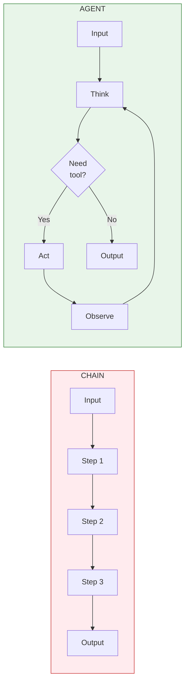
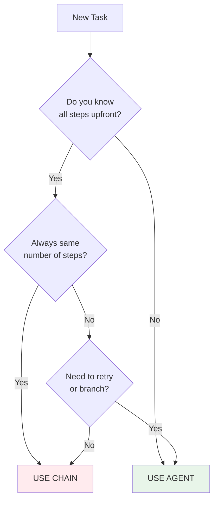

# Lesson 9.3: Agent vs Chain

> **Duration**: 20 min | **Section**: A - What IS an Agent?

## 🎯 The Problem (3-5 min)

You've learned about both chains (Module 8) and agents. When do you use which?

> **Scenario A**: "Summarize this document"  
> **Scenario B**: "Research competitor pricing and recommend a strategy"
> 
> One needs a chain. One needs an agent. How do you decide?

## 🧪 Try It: Same Task, Different Approaches

### Chain Approach

```python
from langchain_openai import ChatOpenAI
from langchain_core.prompts import ChatPromptTemplate
from langchain_core.output_parsers import StrOutputParser

llm = ChatOpenAI(model="gpt-4")

# Fixed sequence: retrieve → format → generate
chain = (
    ChatPromptTemplate.from_template("Summarize this: {document}")
    | llm
    | StrOutputParser()
)

result = chain.invoke({"document": "Long document text here..."})
```

### Agent Approach

```python
# Agent: decides what to do at each step
def agent(task):
    while not done:
        thought = llm.think(state)
        if thought.needs_tool:
            result = execute(thought.tool)
            state.add(result)
        else:
            return thought.answer
```

**The difference**: Chain is a fixed pipe. Agent is a dynamic loop.

## 🔍 Key Differences



| Feature | Chain | Agent |
|---------|-------|-------|
| **Flow** | Fixed sequence | Dynamic decisions |
| **Steps** | Known at design time | Unknown until runtime |
| **Looping** | ❌ No | ✅ Yes |
| **Branching** | ❌ No | ✅ Yes |
| **Tool selection** | Pre-determined | LLM chooses |
| **Cost** | Lower (predictable) | Higher (variable) |
| **Speed** | Faster | Slower |
| **Debuggability** | Easier | Harder |

## 💥 When Chains Break

```python
# Chain: Fixed steps
def research_chain(topic):
    search_results = search_tool(topic)           # Always step 1
    summary = summarize(search_results)           # Always step 2
    return format_report(summary)                 # Always step 3

# What if:
# - Search returns nothing? Still goes to summarize.
# - Summary is wrong? No retry.
# - Need different search query? Can't adapt.
```

Chains fail when:
- Number of steps is unknown
- Need to retry or correct
- Different paths based on results
- Tool selection depends on context

## ✅ When to Use Each

### Use Chains When:

```python
# ✅ Fixed transformation
chain = prompt | llm | parser

# ✅ Known workflow
rag_chain = retriever | prompt | llm | parser

# ✅ Batch processing
for doc in documents:
    result = summarize_chain.invoke(doc)
```

**Chain scenarios**:
- Summarize a document
- Answer question from context (RAG)
- Translate text
- Format data
- Any **fixed sequence**

### Use Agents When:

```python
# ✅ Unknown steps
agent.run("Research and recommend...")

# ✅ Multi-tool orchestration
agent.run("Check weather, then book if sunny")

# ✅ Self-correction needed
agent.run("Keep trying until you find the answer")
```

**Agent scenarios**:
- Research tasks
- Multi-step reasoning
- Tool orchestration
- When path depends on results
- Self-correction required

## 🎯 Decision Framework



### Quick Checklist

| Question | If Yes → |
|----------|----------|
| Fixed number of steps? | Chain |
| Always same tools in same order? | Chain |
| Need loops or retries? | Agent |
| LLM should choose tools? | Agent |
| Path depends on intermediate results? | Agent |
| Need human approval mid-flow? | Agent |

## 🎯 Practice

Classify these tasks:

```python
tasks = [
    "Translate this English text to French",
    "Find the best restaurant near me and book a table",
    "Summarize these 5 documents",
    "Debug this code until it works",
    "Answer this question from the provided context",
    "Research company X and write a competitive analysis",
    "Convert this JSON to CSV",
    "Plan a trip including flights, hotels, and activities",
]

# Your classification:
for task in tasks:
    # Think: Fixed steps? Unknown iterations? Tool selection?
    classification = "CHAIN" if is_fixed(task) else "AGENT"
    print(f"{task[:40]}... → {classification}")
```

**Answers**:
```
Translate this English text to French          → CHAIN (one step)
Find the best restaurant near me and book...   → AGENT (search, evaluate, book)
Summarize these 5 documents                    → CHAIN (repeat same step)
Debug this code until it works                 → AGENT (loop until success)
Answer this question from the provided...      → CHAIN (RAG pipeline)
Research company X and write a competitive...  → AGENT (unknown research steps)
Convert this JSON to CSV                       → CHAIN (transformation)
Plan a trip including flights, hotels...       → AGENT (multi-tool, decisions)
```

## 🔑 Key Takeaways

- **Chains**: Fixed sequence, predictable, faster, cheaper
- **Agents**: Dynamic decisions, loops, tool selection
- **Default to chains** when possible (simpler, debuggable)
- **Use agents** when steps are unknown or need adaptation
- Many real apps use **both**: chain for simple, agent for complex

## ❓ Common Questions

| Question | Answer |
|----------|--------|
| Can I mix both? | Yes! Agents can call chains as tools |
| Are agents always better? | No, chains are simpler and more predictable |
| Cost difference? | Agents use more tokens (multiple LLM calls) |
| What about errors? | Chains fail fast. Agents can self-correct. |

---

## 📚 Further Reading

- [LangChain Chains](https://python.langchain.com/docs/concepts/lcel/) - Chain concepts
- [LangChain Agents](https://python.langchain.com/docs/concepts/agents/) - Agent concepts
- [When to Use Agents](https://python.langchain.com/docs/concepts/agents/#when-not-to-use-agents) - Decision guide
