# Lesson 9.4: Agent Fundamentals Q&A

> **Duration**: 10 min | **Section**: A - What IS an Agent?

## 🎯 Section Review

You've learned the core agent concepts. Let's reinforce them.

## 📊 Concept Map

```mermaid
flowchart TD
    subgraph Core["AGENT FUNDAMENTALS"]
        DEF["Agent = LLM + Tools + Loop"]
        REACT["ReAct Pattern<br>Think → Act → Observe"]
        DIFF["Agent vs Chain<br>Dynamic vs Fixed"]
    end
    
    DEF --> COMP["Components"]
    COMP --> LLM["LLM<br>Decides actions"]
    COMP --> TOOLS["Tools<br>Execute actions"]
    COMP --> LOOP["Loop<br>Until done"]
    
    REACT --> THINK["THOUGHT<br>Reasoning"]
    REACT --> ACT["ACTION<br>Tool call"]
    REACT --> OBS["OBSERVATION<br>Result"]
    
    DIFF --> CHAIN["Chain: A→B→C"]
    DIFF --> AGENT["Agent: Loop until done"]
    
    style Core fill:#E8F5E9
```



## ❓ Common Questions

### Q: What if my agent loops forever?

**A**: Set `max_iterations`:

```python
def agent(query, max_iterations=10):
    for i in range(max_iterations):
        response = llm(state)
        if response.done:
            return response.answer
        # ... execute tool
    
    # Fallback if stuck
    return "I couldn't complete the task in the allowed steps."
```

Also:
- Track visited states to detect loops
- Add "give up" instruction to system prompt
- Use timeout in production

---

### Q: How many steps should I allow?

**A**: Depends on task complexity:

| Task Type | Typical Steps | max_iterations |
|-----------|:-------------:|:--------------:|
| Simple lookup | 1-2 | 5 |
| Multi-step research | 3-5 | 10 |
| Complex reasoning | 5-10 | 15 |
| Open-ended exploration | 10+ | 20+ |

Start conservative, increase if agents regularly hit limits.

---

### Q: Why not just use multiple chained LLM calls?

**A**: Chains are fine when you know the path:

```python
# Chain: You decide the steps
result1 = search(topic)
result2 = analyze(result1)
result3 = format(result2)

# Agent: LLM decides the steps
while not done:
    action = llm.decide(state)
    result = execute(action)
```

Agents shine when:
- Path is unknown
- Need conditional branching
- Must retry on failure
- Different tools for different situations

---

### Q: What happens if a tool fails?

**A**: Return the error to the LLM:

```python
def execute_tool(tool_call):
    try:
        return tools[tool_call.name](**tool_call.args)
    except Exception as e:
        return f"Error: {str(e)}"  # LLM sees this and adapts

# LLM might:
# - Try different arguments
# - Use a different tool
# - Give up and explain
```

---

### Q: Can agents call multiple tools at once?

**A**: Yes! Parallel tool calls:

```python
# LLM returns multiple tool calls
tool_calls = [
    {"name": "search", "args": {"query": "Paris weather"}},
    {"name": "search", "args": {"query": "London weather"}},
]

# Execute in parallel
import asyncio
results = await asyncio.gather(*[execute(tc) for tc in tool_calls])

# Return all results to LLM
```

---

### Q: How do I debug agents?

**A**: Log everything:

```python
def agent(query):
    for step in range(max_steps):
        print(f"\n=== Step {step + 1} ===")
        print(f"State: {state}")
        
        response = llm(state)
        print(f"LLM says: {response}")
        
        if response.tool_call:
            print(f"Calling: {response.tool_call}")
            result = execute(response.tool_call)
            print(f"Result: {result}")
```

Tools:
- LangSmith for tracing
- Logging at each step
- ReAct format makes reasoning visible

---

### Q: When should I NOT use agents?

**A**: Avoid agents when:

| Situation | Why Not Agent |
|-----------|---------------|
| Fixed pipeline (RAG) | Chain is simpler |
| Batch processing | Agents are per-item expensive |
| Latency-critical | Multiple LLM calls add delay |
| Simple transformations | Overkill |
| No tools needed | Agent without tools is just chat |

---

## 🧠 Self-Check

Can you answer these?

| # | Question | Check |
|:-:|----------|:-----:|
| 1 | What are the three components of an agent? | ⬜ |
| 2 | What does ReAct stand for? | ⬜ |
| 3 | When should you use a chain vs agent? | ⬜ |
| 4 | How do you prevent infinite loops? | ⬜ |
| 5 | What happens when a tool fails? | ⬜ |

<details>
<summary>Answers</summary>

1. **LLM** (decides), **Tools** (execute), **Loop** (repeat until done)
2. **Re**asoning + **Act**ing
3. Chain = fixed steps, known path. Agent = dynamic, unknown steps.
4. Set `max_iterations`, track states, add timeout
5. Return error message to LLM - it can adapt or try alternatives

</details>

## � Common Pitfalls

| Pitfall | Problem | Solution |
|---------|---------|----------|
| Infinite loops | Agent never terminates, burns tokens | Set `max_iterations`, add recursion limit |
| Too many tools | Agent confused with 20+ tools | Limit to 5-10 well-designed tools |
| Vague tool descriptions | LLM picks wrong tool | Write clear, specific descriptions |
| No error handling | One tool failure crashes agent | Return errors as observations, let LLM adapt |
| Over-engineering | Using agents for simple tasks | Chains for fixed workflows, agents for dynamic |

## �🔑 Key Takeaways from Section A

| Concept | Key Insight |
|---------|-------------|
| Agent | LLM that loops: Think → Act → Observe → Repeat |
| ReAct | Explicit reasoning before action |
| vs Chain | Chain = fixed path, Agent = dynamic decisions |
| Control | max_iterations, error handling, logging |

## 🚀 What's Next

Section B: **Why Graphs?** - You'll learn why we need graph-based orchestration instead of simple loops, and how LangGraph solves complex agent workflows.

---

## 📚 Further Reading

- [LangGraph Quickstart](https://langchain-ai.github.io/langgraph/tutorials/introduction/) - Getting started
- [Agent Architectures](https://blog.langchain.dev/what-is-an-agent/) - LangChain blog
- [Building Effective Agents](https://www.anthropic.com/research/building-effective-agents) - Anthropic research
