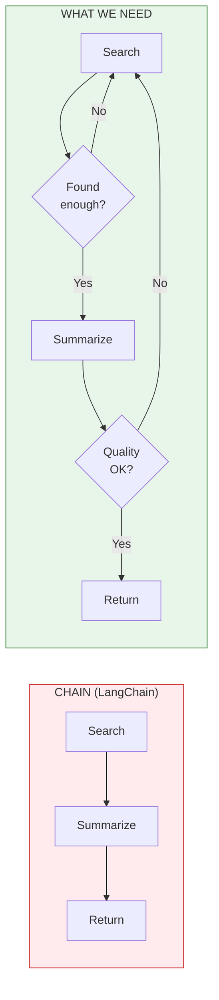

# Lesson 9.5: The Branching Problem

> **Duration**: 5 min | **Section**: B - Why Graphs?

## 🎯 The Problem (3-5 min)

Your agent needs to handle this workflow:

```
1. Get user query
2. Search for information
3. If found enough → Summarize
   If not found enough → Try different search
4. Review summary
5. If quality OK → Return
   If quality bad → Go back to step 2
```

**The problem**: Chains go `A → B → C → D`. But this workflow needs:
- **Branching**: Different paths based on results
- **Looping**: Go back to earlier steps
- **Decisions**: Runtime choices



Chains are linear pipes. Real agent workflows are **graphs**.

## 💥 Why Chains Can't Do This

```python
from langchain_core.runnables import RunnablePassthrough

# Chain = fixed sequence
chain = (
    search 
    | check_results      # What if we need to retry?
    | summarize          # Always runs, even if search failed
    | check_quality      # What if we need to loop back?
    | format_output
)

# Can't say: "if check fails, go back to search"
# Can't say: "loop until quality is good"
# Can't say: "branch to different path based on result"
```

## ✅ The Solution: Graphs

Instead of a linear chain, we need:

| Concept | What It Is |
|---------|------------|
| **Nodes** | Steps/functions in your workflow |
| **Edges** | Connections between nodes |
| **Conditional edges** | "If X, go to A. If Y, go to B." |
| **State** | Data that flows through the graph |

```python
# Graph = flexible flow
graph = StateGraph(State)
graph.add_node("search", search_node)
graph.add_node("summarize", summarize_node)

# Conditional: branch based on result
graph.add_conditional_edges(
    "search",
    decide_next,  # Function that returns "summarize" or "search"
    {"summarize": "summarize", "retry": "search"}
)
```

## 🔑 Key Takeaways

- Chains = linear pipes (`A → B → C`)
- Real workflows need **branches** and **loops**
- **Graphs** model complex flows with nodes and edges
- LangGraph provides the graph abstraction for agents

## ❓ Why This Matters

| Feature | Chain | Graph |
|---------|-------|-------|
| Linear flow | ✅ | ✅ |
| Branching | ❌ | ✅ |
| Looping | ❌ | ✅ |
| Conditional paths | ❌ | ✅ |
| Human-in-the-loop | ❌ | ✅ |
| State management | Limited | Full |

---

**Next**: We'll build graphs from scratch and see how they work under the hood.
