# Lesson 9.6: Graphs Under the Hood

> **Duration**: 30 min | **Section**: B - Why Graphs?

## 🎯 The Problem (3-5 min)

You understand that chains can't branch or loop. But what IS a graph, exactly?

> **Scenario**: You need to build a customer support agent that:
> 1. Classifies the query (billing, technical, general)
> 2. Routes to specialized handler
> 3. Loops back if clarification needed

How do you model this as code?

## 🧪 Try It: The Mental Model

Forget code for a moment. Think of a graph as a **flowchart**:


This flowchart IS a graph:
- **Nodes** = boxes (classify, billing, tech, respond, etc.)
- **Edges** = arrows between boxes
- **Conditional edges** = arrows with labels ("billing", "technical", etc.)

## 🔍 Graph Anatomy

```mermaid
flowchart LR
    subgraph Nodes["NODES (functions)"]
        N1["node_a()"]
        N2["node_b()"]
        N3["node_c()"]
    end
    
    subgraph Edges["EDGES (connections)"]
        E1["a → b (always)"]
        E2["b → c OR b → a<br>(conditional)"]
    end
    
    subgraph State["STATE (shared data)"]
        S1["{'messages': [...]}"]
        S2["Flows through graph"]
    end
```



| Component | What It Is | Example |
|-----------|-----------|---------|
| **Node** | A function that processes state | `def classify(state) → state` |
| **Edge** | Connection from one node to another | `classify → billing` |
| **Conditional Edge** | Edge chosen at runtime | `if billing_issue: "billing" else: "technical"` |
| **State** | Data passed between nodes | `{"messages": [...], "category": "billing"}` |

## ✅ Building a Graph Step-by-Step

### Step 1: Define State

```python
from typing import TypedDict, Literal

class State(TypedDict):
    query: str
    category: str
    response: str
    needs_clarification: bool
```

State is a **TypedDict** - a dictionary with specific keys. This is what flows through the graph.

### Step 2: Define Nodes

```python
def classify_node(state: State) -> State:
    """Classify the user's query."""
    query = state["query"].lower()
    
    if "bill" in query or "payment" in query:
        category = "billing"
    elif "error" in query or "bug" in query:
        category = "technical"
    else:
        category = "general"
    
    return {"category": category}

def billing_node(state: State) -> State:
    """Handle billing queries."""
    return {"response": "For billing issues, please check your invoice or contact billing@company.com"}

def technical_node(state: State) -> State:
    """Handle technical queries."""
    return {"response": "For technical issues, try restarting the app. If that doesn't work, send logs."}

def general_node(state: State) -> State:
    """Handle general queries."""
    return {"response": "Thanks for reaching out! How can we help you today?"}
```

**Key insight**: Each node receives state and returns **updates** to state.

### Step 3: Define Routing

```python
def route_by_category(state: State) -> Literal["billing", "technical", "general"]:
    """Decide which handler node to use."""
    return state["category"]
```

This function looks at state and returns the **name** of the next node.

### Step 4: Build the Graph

```python
from langgraph.graph import StateGraph, END

# Create graph with state schema
graph = StateGraph(State)

# Add nodes
graph.add_node("classify", classify_node)
graph.add_node("billing", billing_node)
graph.add_node("technical", technical_node)
graph.add_node("general", general_node)

# Set entry point
graph.set_entry_point("classify")

# Add conditional edges from classify
graph.add_conditional_edges(
    "classify",           # From this node
    route_by_category,    # Use this function to decide
    {                     # Map return values to node names
        "billing": "billing",
        "technical": "technical",
        "general": "general",
    }
)

# All handlers go to END
graph.add_edge("billing", END)
graph.add_edge("technical", END)
graph.add_edge("general", END)

# Compile to runnable
app = graph.compile()
```

### Step 5: Run It

```python
# Test with different queries
result = app.invoke({"query": "I have a billing question about my invoice"})
print(result)
# {'query': '...', 'category': 'billing', 'response': 'For billing issues...'}

result = app.invoke({"query": "I'm getting an error when I log in"})
print(result)
# {'query': '...', 'category': 'technical', 'response': 'For technical issues...'}
```

## 🎯 Complete Example

```python
from typing import TypedDict, Literal
from langgraph.graph import StateGraph, END

# 1. State
class State(TypedDict):
    query: str
    category: str
    response: str

# 2. Nodes
def classify(state: State) -> State:
    query = state["query"].lower()
    if "bill" in query or "payment" in query:
        return {"category": "billing"}
    elif "error" in query or "bug" in query:
        return {"category": "technical"}
    return {"category": "general"}

def billing(state: State) -> State:
    return {"response": "Billing: Check your invoice at billing.example.com"}

def technical(state: State) -> State:
    return {"response": "Technical: Try clearing cache and restarting"}

def general(state: State) -> State:
    return {"response": "General: How can we assist you today?"}

# 3. Router
def route(state: State) -> Literal["billing", "technical", "general"]:
    return state["category"]

# 4. Build graph
graph = StateGraph(State)
graph.add_node("classify", classify)
graph.add_node("billing", billing)
graph.add_node("technical", technical)
graph.add_node("general", general)

graph.set_entry_point("classify")
graph.add_conditional_edges("classify", route, {
    "billing": "billing",
    "technical": "technical", 
    "general": "general"
})
graph.add_edge("billing", END)
graph.add_edge("technical", END)
graph.add_edge("general", END)

app = graph.compile()

# 5. Test
print(app.invoke({"query": "Why was I charged twice?"}))
print(app.invoke({"query": "App crashes on startup"}))
print(app.invoke({"query": "What are your hours?"}))
```

## 🔍 Visualization


## 🔑 Key Takeaways

- **Graph** = Nodes + Edges + State
- **Nodes** are functions: `(state) → state_updates`
- **Edges** connect nodes: always or conditionally
- **State** is a TypedDict that flows through the graph
- **Compile** turns the graph definition into a runnable

## ❓ Common Questions

| Question | Answer |
|----------|--------|
| What if a node doesn't return anything? | Graph stops. Always return state or updates. |
| Can I have multiple entry points? | No, one entry point. But you can route immediately. |
| What's `END`? | Special node that ends the graph. |
| How does state update? | Node returns dict, merged with existing state. |

---

## 📚 Further Reading

- [LangGraph State](https://langchain-ai.github.io/langgraph/concepts/low_level/#state) - State concepts
- [LangGraph Nodes](https://langchain-ai.github.io/langgraph/concepts/low_level/#nodes) - Node concepts
- [StateGraph API](https://langchain-ai.github.io/langgraph/reference/graphs/) - API reference
