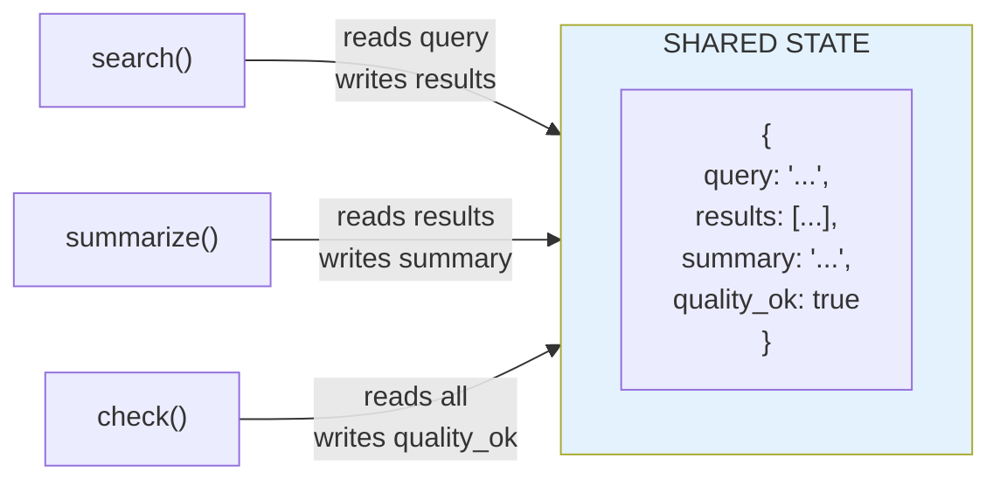
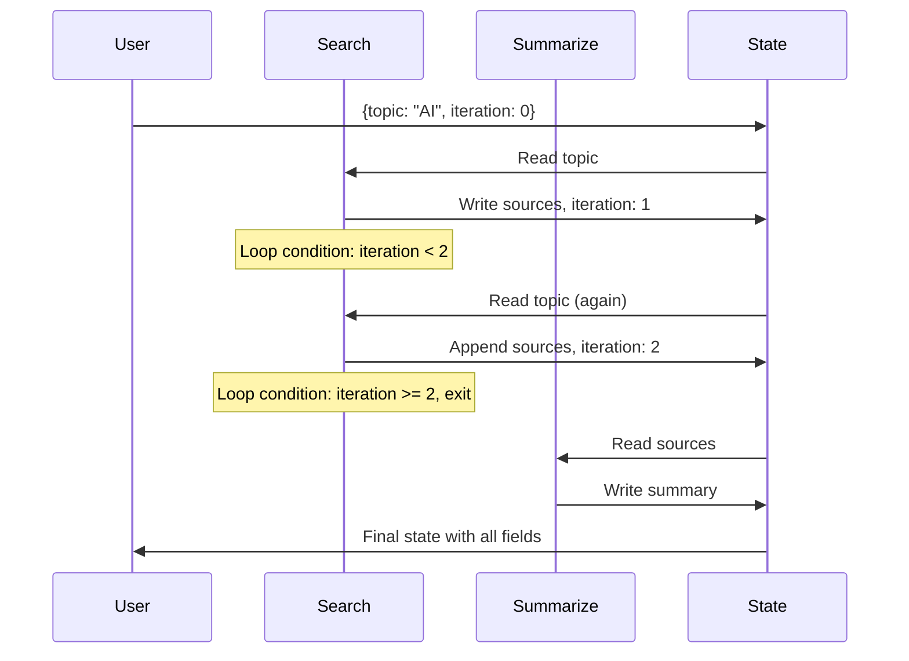

# Lesson 9.7: State & TypedDict

> **Duration**: 25 min | **Section**: B - Why Graphs?

## 🎯 The Problem (3-5 min)

In a chain, data flows linearly. In a graph with branches and loops, how do nodes share information?

> **Scenario**: Your agent searches, then summarizes, then checks quality. The quality check needs to know:
> - Original query (from start)
> - Search results (from search node)
> - Summary (from summarize node)
> 
> How does this data flow through the graph?

## 🧪 Try It: The Naive Approach

```python
# ❌ Bad: Passing data through function arguments
def search(query):
    results = do_search(query)
    return results

def summarize(results, query):
    summary = do_summarize(results, query)
    return summary

def check_quality(summary, results, query):  # Keeps growing!
    # ...
```

This gets messy. Each function needs all previous data.

## 🔍 The State Solution

**State** is a shared dictionary that all nodes can read and write:



| Node | Reads | Writes |
|------|-------|--------|
| search | query | results |
| summarize | query, results | summary |
| check | summary | quality_ok |

## ✅ TypedDict: Typed State

```python
from typing import TypedDict

class AgentState(TypedDict):
    query: str              # User's question
    results: list[str]      # Search results
    summary: str            # Generated summary
    quality_ok: bool        # Quality check passed
```

**TypedDict** gives you:
- Type hints for IDE autocomplete
- Clear documentation of state shape
- Runtime validation (with tools)

## 🔍 How Nodes Update State

Nodes receive state and return **updates**:

```python
def search_node(state: AgentState) -> AgentState:
    # Read from state
    query = state["query"]
    
    # Do work
    results = search_api(query)
    
    # Return ONLY what changes
    return {"results": results}

def summarize_node(state: AgentState) -> AgentState:
    # Can read everything
    query = state["query"]
    results = state["results"]
    
    # Generate summary
    summary = llm.invoke(f"Summarize these results for '{query}': {results}")
    
    # Return update
    return {"summary": summary.content}
```

**Key insight**: Return only the keys you're updating. LangGraph merges them with existing state.

## 💥 Common Mistakes

### Mistake 1: Returning full state

```python
# ❌ Bad: Returning everything
def my_node(state: AgentState) -> AgentState:
    result = do_something()
    return {
        "query": state["query"],      # Unnecessary
        "results": state["results"],  # Unnecessary
        "summary": result,            # Only this needed
    }

# ✅ Good: Return only updates
def my_node(state: AgentState) -> AgentState:
    result = do_something()
    return {"summary": result}
```

### Mistake 2: Mutating state

```python
# ❌ Bad: Mutating in place
def my_node(state: AgentState) -> AgentState:
    state["summary"] = "new value"  # Don't do this!
    return state

# ✅ Good: Return new dict
def my_node(state: AgentState) -> AgentState:
    return {"summary": "new value"}
```

### Mistake 3: Forgetting required keys

```python
class AgentState(TypedDict):
    query: str
    messages: list  # Required but might be empty

# ✅ Initialize properly when invoking
app.invoke({
    "query": "What is LangGraph?",
    "messages": []  # Provide empty list
})
```

## 🎯 Complete Example

```python
from typing import TypedDict
from langgraph.graph import StateGraph, END

# Define state
class ResearchState(TypedDict):
    topic: str
    sources: list[str]
    summary: str
    iteration: int

# Define nodes
def search_node(state: ResearchState) -> ResearchState:
    topic = state["topic"]
    iteration = state.get("iteration", 0)
    
    # Simulate search
    sources = [f"Source {i+1} about {topic}" for i in range(3)]
    
    return {
        "sources": sources,
        "iteration": iteration + 1
    }

def summarize_node(state: ResearchState) -> ResearchState:
    sources = state["sources"]
    topic = state["topic"]
    
    summary = f"Summary of {len(sources)} sources about {topic}"
    
    return {"summary": summary}

def should_continue(state: ResearchState) -> str:
    """Check if we need more research."""
    if state.get("iteration", 0) < 2 and len(state.get("sources", [])) < 5:
        return "search"  # Loop back
    return "summarize"

# Build graph
graph = StateGraph(ResearchState)

graph.add_node("search", search_node)
graph.add_node("summarize", summarize_node)

graph.set_entry_point("search")

graph.add_conditional_edges(
    "search",
    should_continue,
    {"search": "search", "summarize": "summarize"}
)

graph.add_edge("summarize", END)

app = graph.compile()

# Run with initial state
result = app.invoke({
    "topic": "LangGraph",
    "sources": [],
    "summary": "",
    "iteration": 0
})

print(f"Final state: {result}")
print(f"Iterations: {result['iteration']}")
print(f"Sources: {len(result['sources'])}")
```

## 🔍 State Flow Visualization



## 🔑 Key Takeaways

- **State** is a shared dictionary flowing through the graph
- **TypedDict** defines the state schema with types
- Nodes **return updates**, not full state
- LangGraph **merges** updates with existing state
- **Don't mutate** state directly—return new values

## ❓ Common Questions

| Question | Answer |
|----------|--------|
| Can state have nested objects? | Yes, but updates replace whole keys, not deep merge |
| How to append to a list? | Use reducers (next lesson) or return full list |
| What if I need optional keys? | Use `typing.Optional` or `total=False` |
| Can different nodes have different state? | No, all nodes share one state schema |

---

## 📚 Further Reading

- [LangGraph State](https://langchain-ai.github.io/langgraph/concepts/low_level/#state) - State concepts
- [Python TypedDict](https://docs.python.org/3/library/typing.html#typing.TypedDict) - TypedDict docs
- [State Reducers](https://langchain-ai.github.io/langgraph/concepts/low_level/#reducers) - Advanced state
