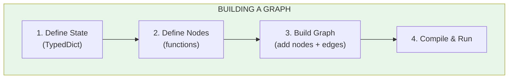
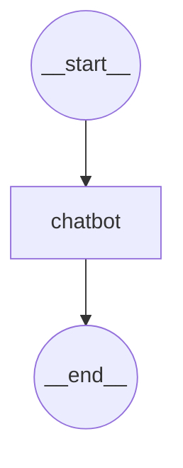
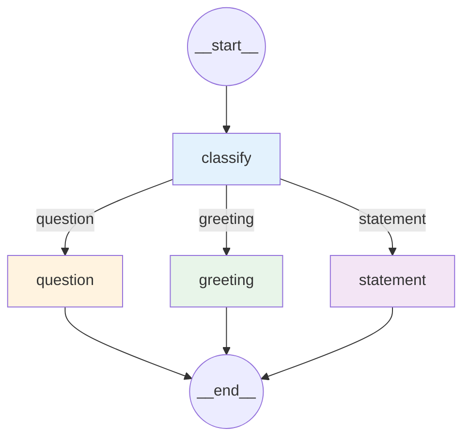

# Lesson 9.8: Building Your First Graph

> **Duration**: 30 min | **Section**: B - Why Graphs?

## 🎯 The Problem (3-5 min)

You understand the concepts. Now let's build a real graph from scratch.

> **Scenario**: Build a simple chatbot that:
> 1. Takes user input
> 2. Generates a response
> 3. Checks if the user wants to continue
> 4. Loops or exits

## 🧪 Setup

```bash
pip install langgraph langchain-openai
```

```python
import os
os.environ["OPENAI_API_KEY"] = "your-key-here"
```

## 🔍 The Four Steps



## ✅ Step 1: Define State

```python
from typing import TypedDict, Annotated
from langgraph.graph.message import add_messages

class State(TypedDict):
    messages: Annotated[list, add_messages]
```

**What's happening**:
- `messages` holds the conversation history
- `Annotated[list, add_messages]` is a **reducer**
- `add_messages` automatically appends new messages instead of replacing

## ✅ Step 2: Define Nodes

```python
from langchain_openai import ChatOpenAI

llm = ChatOpenAI(model="gpt-4")

def chatbot(state: State) -> State:
    """Generate a response to the user."""
    response = llm.invoke(state["messages"])
    return {"messages": [response]}
```

**What's happening**:
- Node receives current state
- Invokes LLM with message history
- Returns new message (reducer appends it)

## ✅ Step 3: Build Graph

```python
from langgraph.graph import StateGraph, START, END

# Create graph with state type
graph_builder = StateGraph(State)

# Add our node
graph_builder.add_node("chatbot", chatbot)

# Define flow: START → chatbot → END
graph_builder.add_edge(START, "chatbot")
graph_builder.add_edge("chatbot", END)

# Compile to runnable
graph = graph_builder.compile()
```

**What's happening**:
- `StateGraph(State)` creates graph with our state schema
- `add_node("name", function)` registers a node
- `add_edge(from, to)` connects nodes
- `START` and `END` are special nodes

## ✅ Step 4: Run It

```python
# Single turn
result = graph.invoke({
    "messages": [{"role": "user", "content": "Hello!"}]
})

print(result["messages"][-1].content)
# "Hello! How can I help you today?"
```

## 🎯 Complete Example: Simple Chatbot

```python
from typing import TypedDict, Annotated
from langgraph.graph import StateGraph, START, END
from langgraph.graph.message import add_messages
from langchain_openai import ChatOpenAI

# 1. State
class State(TypedDict):
    messages: Annotated[list, add_messages]

# 2. Node
llm = ChatOpenAI(model="gpt-4")

def chatbot(state: State) -> State:
    response = llm.invoke(state["messages"])
    return {"messages": [response]}

# 3. Build
graph_builder = StateGraph(State)
graph_builder.add_node("chatbot", chatbot)
graph_builder.add_edge(START, "chatbot")
graph_builder.add_edge("chatbot", END)
graph = graph_builder.compile()

# 4. Run
def chat():
    state = {"messages": []}
    
    while True:
        user_input = input("You: ")
        if user_input.lower() in ["quit", "exit", "q"]:
            break
        
        state["messages"].append({"role": "user", "content": user_input})
        result = graph.invoke(state)
        state = result
        
        print(f"Bot: {result['messages'][-1].content}")

# chat()  # Uncomment to run interactive chat
```

## 🔍 Visualizing Your Graph

```python
# Print the graph structure
print(graph.get_graph().draw_mermaid())
```

Output:


## 🎯 Practice: Add a Router

Extend the chatbot to route different types of queries:

```python
from typing import TypedDict, Annotated, Literal
from langgraph.graph import StateGraph, START, END
from langgraph.graph.message import add_messages
from langchain_openai import ChatOpenAI

# 1. Extended State
class State(TypedDict):
    messages: Annotated[list, add_messages]
    query_type: str

# 2. Nodes
llm = ChatOpenAI(model="gpt-4")

def classify(state: State) -> State:
    """Classify the user's query."""
    last_message = state["messages"][-1]
    content = last_message.content if hasattr(last_message, 'content') else last_message["content"]
    
    if "?" in content:
        return {"query_type": "question"}
    elif any(word in content.lower() for word in ["hi", "hello", "hey"]):
        return {"query_type": "greeting"}
    else:
        return {"query_type": "statement"}

def respond_question(state: State) -> State:
    """Handle questions."""
    response = llm.invoke([
        {"role": "system", "content": "You answer questions helpfully and concisely."},
        *state["messages"]
    ])
    return {"messages": [response]}

def respond_greeting(state: State) -> State:
    """Handle greetings."""
    response = llm.invoke([
        {"role": "system", "content": "You're friendly and warm. Keep greetings brief."},
        *state["messages"]
    ])
    return {"messages": [response]}

def respond_statement(state: State) -> State:
    """Handle statements."""
    response = llm.invoke([
        {"role": "system", "content": "Acknowledge what the user said and ask how you can help."},
        *state["messages"]
    ])
    return {"messages": [response]}

# 3. Router
def route_query(state: State) -> Literal["question", "greeting", "statement"]:
    return state["query_type"]

# 4. Build Graph
graph_builder = StateGraph(State)

# Add nodes
graph_builder.add_node("classify", classify)
graph_builder.add_node("question", respond_question)
graph_builder.add_node("greeting", respond_greeting)
graph_builder.add_node("statement", respond_statement)

# Add edges
graph_builder.add_edge(START, "classify")
graph_builder.add_conditional_edges(
    "classify",
    route_query,
    {
        "question": "question",
        "greeting": "greeting",
        "statement": "statement",
    }
)
graph_builder.add_edge("question", END)
graph_builder.add_edge("greeting", END)
graph_builder.add_edge("statement", END)

graph = graph_builder.compile()

# 5. Test
test_inputs = [
    "Hello there!",
    "What is the capital of France?",
    "I just finished a great book.",
]

for user_input in test_inputs:
    result = graph.invoke({
        "messages": [{"role": "user", "content": user_input}],
        "query_type": ""
    })
    print(f"User: {user_input}")
    print(f"Type: {result['query_type']}")
    print(f"Bot: {result['messages'][-1].content}\n")
```

## 🔍 Graph Visualization



## 🔑 Key Takeaways

- **StateGraph(State)**: Create graph with state schema
- **add_node("name", fn)**: Register a node
- **add_edge(from, to)**: Connect nodes
- **add_conditional_edges**: Branch based on function result
- **compile()**: Turn definition into runnable
- **invoke(state)**: Run the graph

## ❓ Common Questions

| Question | Answer |
|----------|--------|
| What's START and END? | Special nodes marking entry and exit |
| Can I have multiple ENDs? | Yes, multiple nodes can connect to END |
| How to see the graph? | `graph.get_graph().draw_mermaid()` |
| What if compile fails? | Usually missing edges or unreachable nodes |

---

## 📚 Further Reading

- [LangGraph Quickstart](https://langchain-ai.github.io/langgraph/tutorials/introduction/) - Official tutorial
- [StateGraph API](https://langchain-ai.github.io/langgraph/reference/graphs/) - API reference
- [Graph Visualization](https://langchain-ai.github.io/langgraph/how-tos/visualization/) - Visualization guide
