# Lesson 9.9: Graph Q&A

> **Duration**: 10 min | **Section**: B - Why Graphs?

## 🎯 Section Review

You've learned why graphs beat chains and how to build them. Let's reinforce.

## 📊 Concept Map

```mermaid
flowchart TD
    subgraph Core["GRAPH FUNDAMENTALS"]
        WHY["Why Graphs?<br>Branches + Loops"]
        WHAT["What's in a Graph?<br>Nodes + Edges + State"]
        HOW["How to Build?<br>StateGraph API"]
    end
    
    WHY --> CHAIN["Chains: A→B→C"]
    WHY --> GRAPH["Graphs: Flexible flow"]
    
    WHAT --> NODES["Nodes<br>Functions"]
    WHAT --> EDGES["Edges<br>Connections"]
    WHAT --> STATE["State<br>Shared data"]
    
    HOW --> CREATE["StateGraph(State)"]
    HOW --> ADD["add_node, add_edge"]
    HOW --> COMPILE["compile()"]
    
    style Core fill:#E8F5E9
```



## ❓ Common Questions

### Q: What's actually in state at each step?

**A**: State accumulates as it flows through nodes:

```python
# Initial state
{"messages": [user_msg], "query_type": ""}

# After classify node
{"messages": [user_msg], "query_type": "question"}

# After respond node  
{"messages": [user_msg, bot_response], "query_type": "question"}
```

Debug with:
```python
def my_node(state):
    print(f"State at my_node: {state}")
    # ...
```

---

### Q: How do nodes communicate?

**A**: Through state only. Nodes can't call each other directly:

```python
# ❌ Wrong: Calling another node
def node_a(state):
    result = node_b(state)  # Don't do this!
    return {"data": result}

# ✅ Right: Write to state, let graph handle flow
def node_a(state):
    return {"data_for_b": "something"}

def node_b(state):
    data = state["data_for_b"]  # Read from state
    return {"result": process(data)}
```

---

### Q: Can I have cycles (loops)?

**A**: Yes! That's the power of graphs:

```python
graph.add_conditional_edges(
    "check",
    should_continue,
    {
        "continue": "process",  # Loop back
        "done": END             # Exit
    }
)
graph.add_edge("process", "check")  # Creates the loop
```


---

### Q: What if I forget an edge?

**A**: Graph compilation fails or node is unreachable:

```python
graph.add_node("orphan", some_function)
# No edge to "orphan" - it will never run!

# Compile might warn, or the node just won't execute
```

Always verify with `graph.get_graph().draw_mermaid()`.

---

### Q: Can state have complex types?

**A**: Yes, but be careful with updates:

```python
from typing import TypedDict

class ComplexState(TypedDict):
    user: dict              # Nested dict
    items: list[dict]       # List of dicts
    metadata: dict          # Another nested

def my_node(state):
    # Updates REPLACE entire keys, not deep merge
    return {
        "items": state["items"] + [new_item]  # Append to list
    }
```

For lists, use reducers:
```python
from typing import Annotated
from langgraph.graph.message import add_messages

class State(TypedDict):
    messages: Annotated[list, add_messages]  # Auto-append
```

---

### Q: What's the difference between add_edge and add_conditional_edges?

**A**: 

| Method | When to Use |
|--------|-------------|
| `add_edge("a", "b")` | Always go from A to B |
| `add_conditional_edges("a", router, {...})` | Decide at runtime where to go |

```python
# Always: generate → format → end
graph.add_edge("generate", "format")
graph.add_edge("format", END)

# Conditionally: classify → one of [billing, tech, general]
graph.add_conditional_edges("classify", route_fn, {
    "billing": "billing",
    "tech": "tech",
    "general": "general"
})
```

---

### Q: How do I debug a graph?

**A**: Multiple approaches:

```python
# 1. Print state in nodes
def my_node(state):
    print(f"DEBUG: {state}")
    return {...}

# 2. Visualize structure
print(graph.get_graph().draw_mermaid())

# 3. Stream execution to see each step
for event in graph.stream(input_state):
    print(event)

# 4. Use LangSmith for full tracing
# Set LANGCHAIN_TRACING_V2=true
```

---

## 🧠 Self-Check

Can you answer these?

| # | Question | Check |
|:-:|----------|:-----:|
| 1 | Why can't chains loop? | ⬜ |
| 2 | What are the three parts of a graph? | ⬜ |
| 3 | What does `add_conditional_edges` do? | ⬜ |
| 4 | How do nodes share data? | ⬜ |
| 5 | What does `compile()` do? | ⬜ |

<details>
<summary>Answers</summary>

1. Chains are linear pipes (A→B→C). No mechanism to go backward or branch.
2. **Nodes** (functions), **Edges** (connections), **State** (shared data)
3. Creates edges that are chosen at runtime based on a router function
4. Through state - each node reads/writes to shared state
5. Turns the graph definition into a runnable object

</details>

## � Common Pitfalls

| Pitfall | Problem | Solution |
|---------|---------|----------|
| State mutation | Modifying state directly instead of returning | Always return new dict, never mutate input |
| Missing edges | Graph disconnected, nodes never run | Verify all nodes have incoming/outgoing edges |
| Forgetting `compile()` | Graph definition isn't runnable | Always call `graph.compile()` before use |
| Wrong state keys | KeyError at runtime | Use TypedDict for type safety |
| Circular without exit | Graph loops forever | Conditional edge to END based on condition |

## �🔑 Key Takeaways from Section B

| Concept | Key Insight |
|---------|-------------|
| Graphs vs Chains | Graphs can branch, loop, make decisions |
| Nodes | Functions that receive and return state |
| Edges | Connections - fixed or conditional |
| State | TypedDict shared by all nodes |
| Building | StateGraph → add_node → add_edge → compile |

## 🚀 What's Next

Section C: **Building Agents with LangGraph** - You'll learn conditional edges for dynamic routing, how to integrate tools, and build a complete ReAct agent.

---

## 📚 Further Reading

- [LangGraph Concepts](https://langchain-ai.github.io/langgraph/concepts/) - Core concepts
- [LangGraph How-To Guides](https://langchain-ai.github.io/langgraph/how-tos/) - Practical guides
- [StateGraph API](https://langchain-ai.github.io/langgraph/reference/graphs/) - API reference
