# Lesson 9.10: Conditional Edges

> **Duration**: 35 min | **Section**: C - Building Agents with LangGraph

## 🎯 The Problem (3-5 min)

Your agent needs to make decisions at runtime:

> **Scenario**: After the LLM responds, you need to check:
> - Did it call a tool? → Go to tool execution node
> - Did it give a final answer? → Go to END

This is **conditional routing** - the path depends on what's in state.

## 🧪 Try It: Without Conditional Edges

```python
# ❌ Static edges can't adapt
graph.add_edge("llm", "tool")  # Always goes to tool
graph.add_edge("tool", "llm")  # Always loops

# What if LLM didn't call a tool?
# What if LLM is done?
```

You need edges that **decide at runtime**.

## 🔍 Conditional Edges Under the Hood


The router function:
1. Receives current state
2. Examines the state
3. Returns the **name** of the next node

## ✅ Basic Conditional Edge

```python
from typing import Literal
from langgraph.graph import StateGraph, END

def router(state) -> Literal["continue", "end"]:
    """Decide next step based on state."""
    last_message = state["messages"][-1]
    
    # Check if LLM called a tool
    if hasattr(last_message, "tool_calls") and last_message.tool_calls:
        return "continue"  # Go to tool node
    
    return "end"  # Go to END

# Add conditional edges
graph.add_conditional_edges(
    "llm",           # From this node
    router,          # Use this function
    {                # Map return values to nodes
        "continue": "tools",
        "end": END
    }
)
```

## 🎯 Complete Example: Tool-Calling Agent

```python
from typing import TypedDict, Annotated, Literal
from langgraph.graph import StateGraph, START, END
from langgraph.graph.message import add_messages
from langchain_openai import ChatOpenAI
from langchain_core.messages import ToolMessage
import json

# 1. State
class State(TypedDict):
    messages: Annotated[list, add_messages]

# 2. Tools
def get_weather(city: str) -> str:
    """Get weather for a city."""
    return f"Weather in {city}: 22°C, sunny"

def search(query: str) -> str:
    """Search for information."""
    return f"Search results for '{query}': Found 3 relevant articles."

TOOLS = {"get_weather": get_weather, "search": search}

# 3. LLM with tools
llm = ChatOpenAI(model="gpt-4").bind_tools([
    {
        "type": "function",
        "function": {
            "name": "get_weather",
            "description": "Get weather for a city",
            "parameters": {
                "type": "object",
                "properties": {"city": {"type": "string"}},
                "required": ["city"]
            }
        }
    },
    {
        "type": "function",
        "function": {
            "name": "search",
            "description": "Search for information",
            "parameters": {
                "type": "object",
                "properties": {"query": {"type": "string"}},
                "required": ["query"]
            }
        }
    }
])

# 4. Nodes
def call_llm(state: State) -> State:
    """Call the LLM."""
    response = llm.invoke(state["messages"])
    return {"messages": [response]}

def call_tools(state: State) -> State:
    """Execute tool calls from the LLM."""
    last_message = state["messages"][-1]
    tool_messages = []
    
    for tool_call in last_message.tool_calls:
        name = tool_call["name"]
        args = tool_call["args"]
        
        # Execute tool
        result = TOOLS[name](**args)
        
        # Create tool message
        tool_messages.append(
            ToolMessage(content=result, tool_call_id=tool_call["id"])
        )
    
    return {"messages": tool_messages}

# 5. Router
def should_continue(state: State) -> Literal["tools", "end"]:
    """Decide if we should call tools or end."""
    last_message = state["messages"][-1]
    
    if hasattr(last_message, "tool_calls") and last_message.tool_calls:
        return "tools"
    return "end"

# 6. Build Graph
graph = StateGraph(State)

graph.add_node("llm", call_llm)
graph.add_node("tools", call_tools)

graph.add_edge(START, "llm")
graph.add_conditional_edges("llm", should_continue, {
    "tools": "tools",
    "end": END
})
graph.add_edge("tools", "llm")  # After tools, back to LLM

agent = graph.compile()

# 7. Test
result = agent.invoke({
    "messages": [{"role": "user", "content": "What's the weather in Tokyo?"}]
})

for msg in result["messages"]:
    print(f"{msg.type}: {msg.content[:100] if msg.content else msg.tool_calls}")
```

## 🔍 Execution Flow

```mermaid
sequenceDiagram
    participant User
    participant LLM
    participant Router
    participant Tools
    
    User->>LLM: "What's the weather in Tokyo?"
    LLM->>Router: Response with tool_call
    Router->>Tools: "tools" (has tool calls)
    Tools->>LLM: Tool result: "22°C, sunny"
    LLM->>Router: Response with content
    Router->>User: "end" (no tool calls)
```



## 💥 Common Mistakes

### Mistake 1: Router returns wrong type

```python
# ❌ Wrong: Returns something not in mapping
def router(state) -> str:
    return "invalid_node"  # Not in conditional edges!

# ✅ Right: Use Literal type hint
def router(state) -> Literal["tools", "end"]:
    return "tools"  # Must be in the mapping
```

### Mistake 2: Forgetting the mapping

```python
# ❌ Wrong: No mapping provided
graph.add_conditional_edges("llm", router)

# ✅ Right: Always provide the mapping
graph.add_conditional_edges("llm", router, {
    "tools": "tools",
    "end": END
})
```

### Mistake 3: Infinite loops

```python
# ❌ Dangerous: No exit condition
def router(state):
    return "continue"  # Always loops!

# ✅ Safe: Always have exit path
def router(state):
    if done_condition(state):
        return "end"
    if state.get("iterations", 0) > 10:
        return "end"  # Safety exit
    return "continue"
```

## 🎯 Practice: Multi-Path Router

Build a router with three paths:

```python
from typing import TypedDict, Annotated, Literal
from langgraph.graph import StateGraph, START, END
from langgraph.graph.message import add_messages
from langchain_openai import ChatOpenAI

# State
class State(TypedDict):
    messages: Annotated[list, add_messages]
    sentiment: str
    response_type: str

# Nodes
llm = ChatOpenAI(model="gpt-4")

def analyze_sentiment(state: State) -> State:
    """Analyze the sentiment of the user's message."""
    last_msg = state["messages"][-1]
    content = last_msg.content if hasattr(last_msg, 'content') else last_msg["content"]
    
    # Simple sentiment analysis
    if any(word in content.lower() for word in ["angry", "frustrated", "terrible", "awful"]):
        return {"sentiment": "negative"}
    elif any(word in content.lower() for word in ["great", "awesome", "love", "excellent"]):
        return {"sentiment": "positive"}
    return {"sentiment": "neutral"}

def respond_negative(state: State) -> State:
    """Handle negative sentiment."""
    response = llm.invoke([
        {"role": "system", "content": "Be empathetic and apologetic. Offer to help resolve their issue."},
        *state["messages"]
    ])
    return {"messages": [response], "response_type": "empathetic"}

def respond_positive(state: State) -> State:
    """Handle positive sentiment."""
    response = llm.invoke([
        {"role": "system", "content": "Be enthusiastic and grateful. Match their positive energy."},
        *state["messages"]
    ])
    return {"messages": [response], "response_type": "enthusiastic"}

def respond_neutral(state: State) -> State:
    """Handle neutral sentiment."""
    response = llm.invoke([
        {"role": "system", "content": "Be helpful and professional."},
        *state["messages"]
    ])
    return {"messages": [response], "response_type": "professional"}

# Router
def route_sentiment(state: State) -> Literal["negative", "positive", "neutral"]:
    return state["sentiment"]

# Build Graph
graph = StateGraph(State)

graph.add_node("analyze", analyze_sentiment)
graph.add_node("negative", respond_negative)
graph.add_node("positive", respond_positive)
graph.add_node("neutral", respond_neutral)

graph.add_edge(START, "analyze")
graph.add_conditional_edges("analyze", route_sentiment, {
    "negative": "negative",
    "positive": "positive",
    "neutral": "neutral"
})
graph.add_edge("negative", END)
graph.add_edge("positive", END)
graph.add_edge("neutral", END)

app = graph.compile()

# Test
test_messages = [
    "I'm so frustrated with this product!",
    "Your service is absolutely amazing!",
    "I have a question about my order.",
]

for msg in test_messages:
    result = app.invoke({
        "messages": [{"role": "user", "content": msg}],
        "sentiment": "",
        "response_type": ""
    })
    print(f"Input: {msg}")
    print(f"Sentiment: {result['sentiment']}")
    print(f"Response type: {result['response_type']}")
    print(f"Response: {result['messages'][-1].content[:100]}...\n")
```

## 🔑 Key Takeaways

- **Conditional edges** choose paths at runtime
- Router function examines state and returns next node name
- **Always provide mapping** from return values to node names
- Use **Literal type hints** to enforce valid return values
- **Include exit conditions** to prevent infinite loops

## ❓ Common Questions

| Question | Answer |
|----------|--------|
| Can router return multiple nodes? | No, one node at a time. For parallel, use separate graphs. |
| What if router raises exception? | Graph execution fails. Handle errors in router. |
| Can I use async routers? | Yes, define as `async def router(state)` |
| How to debug routing? | Print state in router, check last_message contents |

---

## 📚 Further Reading

- [Conditional Edges](https://langchain-ai.github.io/langgraph/concepts/low_level/#conditional-edges) - LangGraph docs
- [Routing Patterns](https://langchain-ai.github.io/langgraph/how-tos/branching/) - How-to guide
- [Agent Loop](https://langchain-ai.github.io/langgraph/tutorials/introduction/#part-2-enhancing-the-chatbot-with-tools) - Tool-calling tutorial
