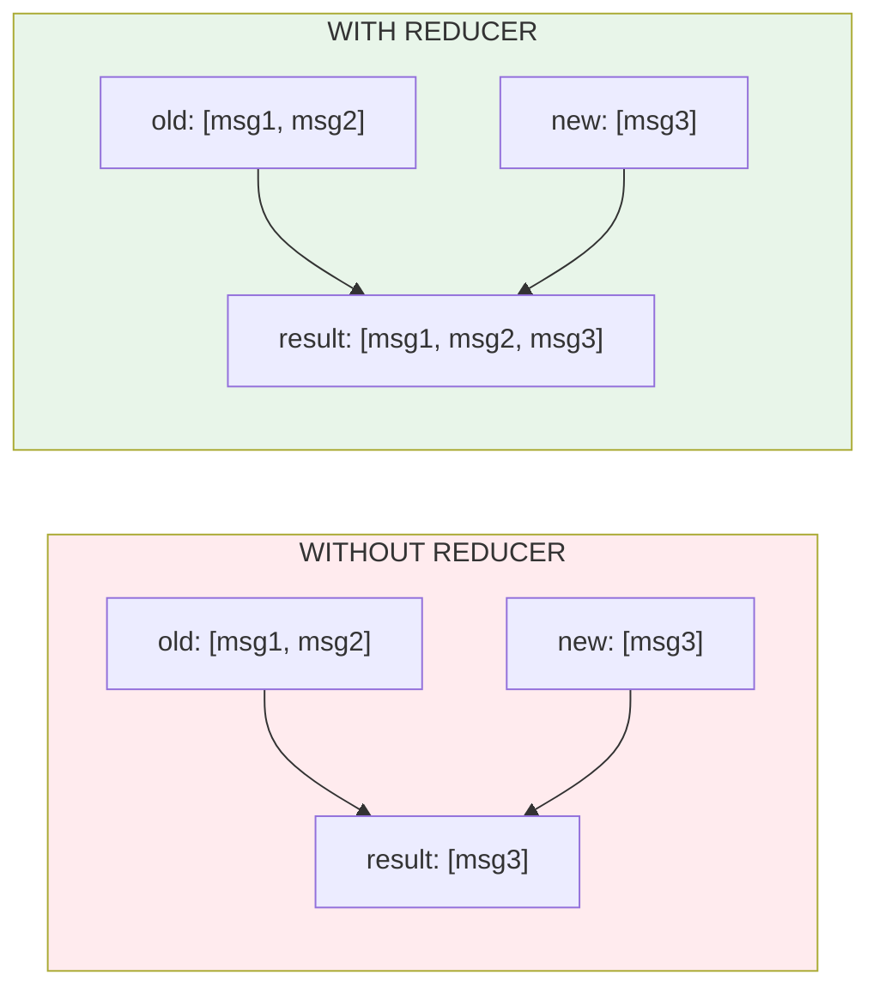

# Lesson 9.11: Messages State

> **Duration**: 30 min | **Section**: C - Building Agents with LangGraph

## 🎯 The Problem (3-5 min)

Chat agents need to track conversation history. But there's a challenge:

> **Scenario**: Each LLM call returns a new message. Each tool call returns a result. How do you **accumulate** these without overwriting?

```python
# ❌ Problem: Updates replace, not append
def node_a(state):
    return {"messages": [new_message]}  # This REPLACES messages!

def node_b(state):
    return {"messages": [another_message]}  # Overwrites node_a's message!
```

## 🧪 Try It: Without Reducers

```python
from typing import TypedDict

class State(TypedDict):
    messages: list  # Plain list

def llm_node(state):
    response = llm.invoke(state["messages"])
    # This replaces the entire messages list!
    return {"messages": [response]}

def tool_node(state):
    tool_result = execute_tool(...)
    # This also replaces - we lost the LLM message!
    return {"messages": [tool_result]}
```

After `tool_node`, we've lost the conversation history!

## 🔍 The Solution: Reducers

A **reducer** tells LangGraph HOW to combine old and new values:



## ✅ Using add_messages Reducer

```python
from typing import TypedDict, Annotated
from langgraph.graph.message import add_messages

class State(TypedDict):
    messages: Annotated[list, add_messages]  # ✅ Auto-append!
```

**What `Annotated[list, add_messages]` does**:
- New messages are **appended** to existing list
- Handles message deduplication by ID
- Works with all LangChain message types

## 🎯 Complete Example

```python
from typing import TypedDict, Annotated
from langgraph.graph import StateGraph, START, END
from langgraph.graph.message import add_messages
from langchain_openai import ChatOpenAI
from langchain_core.messages import HumanMessage, AIMessage, ToolMessage

# 1. State with reducer
class State(TypedDict):
    messages: Annotated[list, add_messages]

# 2. LLM setup
llm = ChatOpenAI(model="gpt-4").bind_tools([
    {
        "type": "function",
        "function": {
            "name": "get_time",
            "description": "Get current time",
            "parameters": {"type": "object", "properties": {}}
        }
    }
])

# 3. Nodes
def call_llm(state: State) -> State:
    """Call LLM and return response."""
    response = llm.invoke(state["messages"])
    # Return list - reducer will APPEND, not replace
    return {"messages": [response]}

def call_tool(state: State) -> State:
    """Execute tool and return result."""
    last_message = state["messages"][-1]
    
    tool_messages = []
    for tool_call in last_message.tool_calls:
        # Simulate tool execution
        result = "The current time is 3:42 PM"
        tool_messages.append(
            ToolMessage(content=result, tool_call_id=tool_call["id"])
        )
    
    # Return list - reducer will APPEND
    return {"messages": tool_messages}

# 4. Router
def should_continue(state):
    last_message = state["messages"][-1]
    if hasattr(last_message, "tool_calls") and last_message.tool_calls:
        return "tools"
    return "end"

# 5. Build Graph
graph = StateGraph(State)
graph.add_node("llm", call_llm)
graph.add_node("tools", call_tool)

graph.add_edge(START, "llm")
graph.add_conditional_edges("llm", should_continue, {"tools": "tools", "end": END})
graph.add_edge("tools", "llm")

agent = graph.compile()

# 6. Test - watch messages accumulate
result = agent.invoke({
    "messages": [HumanMessage(content="What time is it?")]
})

print("=== Message History ===")
for i, msg in enumerate(result["messages"]):
    msg_type = type(msg).__name__
    content = msg.content[:50] if msg.content else f"tool_calls: {len(msg.tool_calls)}"
    print(f"{i+1}. {msg_type}: {content}")
```

**Output**:
```
=== Message History ===
1. HumanMessage: What time is it?
2. AIMessage: tool_calls: 1
3. ToolMessage: The current time is 3:42 PM
4. AIMessage: The current time is 3:42 PM.
```

All messages preserved! The reducer appended each one.

## 🔍 How add_messages Works

```python
from langgraph.graph.message import add_messages

# Simulating what the reducer does:
old_messages = [HumanMessage(content="Hi")]
new_messages = [AIMessage(content="Hello!")]

result = add_messages(old_messages, new_messages)
# result = [HumanMessage("Hi"), AIMessage("Hello!")]

# It also handles updates by ID:
old = [AIMessage(content="Draft", id="msg1")]
new = [AIMessage(content="Final", id="msg1")]  # Same ID
result = add_messages(old, new)
# result = [AIMessage("Final", id="msg1")]  # Updated, not duplicated
```

## 💥 Common Mistakes

### Mistake 1: Returning dict instead of list

```python
# ❌ Wrong: Single message as dict
def my_node(state):
    return {"messages": {"role": "assistant", "content": "Hi"}}

# ✅ Right: Always return list of messages
def my_node(state):
    return {"messages": [AIMessage(content="Hi")]}
```

### Mistake 2: Forgetting the Annotated wrapper

```python
# ❌ Wrong: No reducer
class State(TypedDict):
    messages: list

# ✅ Right: With reducer
class State(TypedDict):
    messages: Annotated[list, add_messages]
```

### Mistake 3: Manually concatenating

```python
# ❌ Wrong: Manual concatenation (defeats the purpose)
def my_node(state):
    new_msg = AIMessage(content="Hi")
    return {"messages": state["messages"] + [new_msg]}

# ✅ Right: Let reducer handle it
def my_node(state):
    return {"messages": [AIMessage(content="Hi")]}
```

## 🎯 Practice: Multi-Turn Conversation

```python
from typing import TypedDict, Annotated
from langgraph.graph import StateGraph, START, END
from langgraph.graph.message import add_messages
from langchain_openai import ChatOpenAI
from langchain_core.messages import HumanMessage

# State
class State(TypedDict):
    messages: Annotated[list, add_messages]

# LLM
llm = ChatOpenAI(model="gpt-4")

def chatbot(state: State) -> State:
    response = llm.invoke(state["messages"])
    return {"messages": [response]}

# Build
graph = StateGraph(State)
graph.add_node("chatbot", chatbot)
graph.add_edge(START, "chatbot")
graph.add_edge("chatbot", END)
app = graph.compile()

# Multi-turn conversation
conversation = {"messages": []}

turns = [
    "My name is Alice.",
    "What's my name?",
    "What did I just tell you?",
]

for user_input in turns:
    # Add user message
    conversation["messages"].append(HumanMessage(content=user_input))
    
    # Get response
    result = app.invoke(conversation)
    conversation = result
    
    print(f"User: {user_input}")
    print(f"Bot: {result['messages'][-1].content}\n")

print(f"\n=== Total messages: {len(conversation['messages'])} ===")
```

**Output**:
```
User: My name is Alice.
Bot: Nice to meet you, Alice! How can I help you today?

User: What's my name?
Bot: Your name is Alice.

User: What did I just tell you?
Bot: You just asked me what your name is.

=== Total messages: 6 ===
```

The agent remembers! All messages are preserved in state.

## 🔑 Key Takeaways

- **Reducers** define how state updates combine with existing state
- **add_messages** appends new messages to the list
- Always return **list of messages**, not single message
- Use **Annotated[list, add_messages]** in state definition
- Messages with same ID get **updated**, not duplicated

## ❓ Common Questions

| Question | Answer |
|----------|--------|
| Can I use custom reducers? | Yes, any function `(old, new) -> combined` works |
| What about non-message state? | Regular keys still replace by default |
| Does it handle all message types? | Yes: Human, AI, System, Tool, Function |
| What about context length? | You'll need to manage/truncate history separately |

---

## 📚 Further Reading

- [Message State](https://langchain-ai.github.io/langgraph/concepts/low_level/#messagesstate) - LangGraph docs
- [Reducers](https://langchain-ai.github.io/langgraph/concepts/low_level/#reducers) - Reducer concepts
- [add_messages API](https://langchain-ai.github.io/langgraph/reference/graphs/#langgraph.graph.message.add_messages) - API reference
