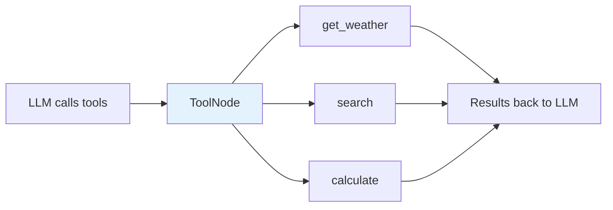
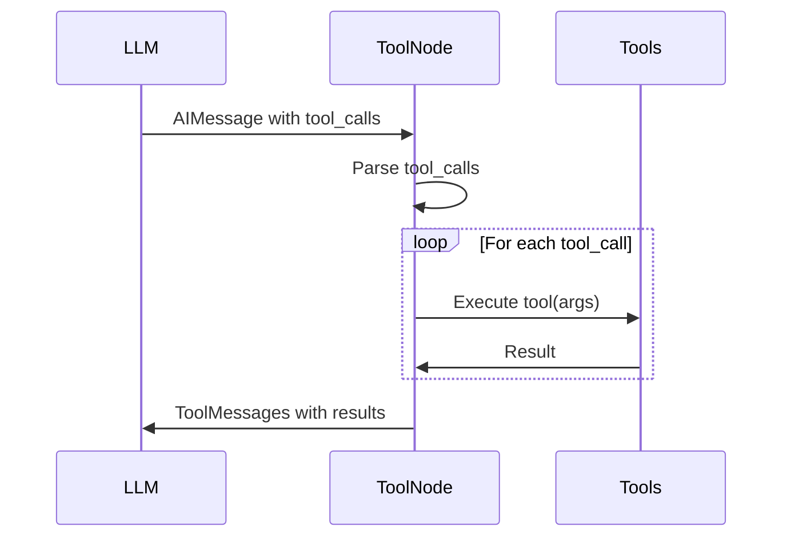

# Lesson 9.12: Tool Integration

> **Duration**: 40 min | **Section**: C - Building Agents with LangGraph

## 🎯 The Problem (3-5 min)

Your agent needs to use tools - search the web, query databases, call APIs. You've seen manual tool execution. Now let's do it properly.

> **Scenario**: Build an agent with three tools:
> - `get_weather(city)` - Get weather
> - `search(query)` - Search information
> - `calculate(expression)` - Do math
> 
> The agent should decide which tools to use based on the query.

## 🧪 Manual Approach Review

```python
# Manual tool execution (what we did before)
def call_tools(state):
    last_message = state["messages"][-1]
    
    for tool_call in last_message.tool_calls:
        name = tool_call["name"]
        args = tool_call["args"]
        
        # Manual dispatch
        if name == "get_weather":
            result = get_weather(**args)
        elif name == "search":
            result = search(**args)
        elif name == "calculate":
            result = calculate(**args)
        # ... more elif for each tool
```

This works but doesn't scale. LangGraph has a better way.

## 🔍 The ToolNode

LangGraph provides `ToolNode` - a pre-built node that handles tool execution:



## ✅ Using the @tool Decorator

```python
from langchain_core.tools import tool

@tool
def get_weather(city: str) -> str:
    """Get the current weather for a city.
    
    Args:
        city: The city name to get weather for
    """
    # Simulated weather data
    weather_data = {
        "tokyo": "22°C, sunny",
        "london": "15°C, cloudy",
        "new york": "18°C, partly cloudy",
    }
    return weather_data.get(city.lower(), f"Weather for {city}: 20°C, clear")

@tool
def search(query: str) -> str:
    """Search for information on the web.
    
    Args:
        query: The search query
    """
    return f"Search results for '{query}': Found 5 relevant articles about this topic."

@tool
def calculate(expression: str) -> str:
    """Calculate a mathematical expression.
    
    Args:
        expression: A math expression like '2 + 2' or '15 * 3.14'
    """
    try:
        # Safe eval for basic math
        allowed = set("0123456789+-*/.() ")
        if all(c in allowed for c in expression):
            return str(eval(expression))
        return "Invalid expression"
    except Exception as e:
        return f"Error: {e}"
```

**The @tool decorator**:
- Converts function to LangChain tool
- Uses docstring for description
- Extracts parameters from type hints

## ✅ Complete Agent with ToolNode

```python
from typing import TypedDict, Annotated, Literal
from langgraph.graph import StateGraph, START, END
from langgraph.graph.message import add_messages
from langgraph.prebuilt import ToolNode
from langchain_openai import ChatOpenAI
from langchain_core.tools import tool

# 1. Define Tools
@tool
def get_weather(city: str) -> str:
    """Get the current weather for a city."""
    weather_data = {
        "tokyo": "22°C, sunny",
        "london": "15°C, cloudy", 
        "paris": "18°C, partly cloudy",
    }
    return weather_data.get(city.lower(), f"Weather for {city}: 20°C, clear")

@tool
def search(query: str) -> str:
    """Search for information on the web."""
    return f"Search results for '{query}': Found relevant information."

@tool
def calculate(expression: str) -> str:
    """Calculate a mathematical expression like '2 + 2'."""
    try:
        allowed = set("0123456789+-*/.() ")
        if all(c in allowed for c in expression):
            return str(eval(expression))
        return "Invalid expression"
    except Exception as e:
        return f"Error: {e}"

# Collect tools
tools = [get_weather, search, calculate]

# 2. State
class State(TypedDict):
    messages: Annotated[list, add_messages]

# 3. LLM with tools bound
llm = ChatOpenAI(model="gpt-4").bind_tools(tools)

# 4. Nodes
def call_llm(state: State) -> State:
    """Call the LLM."""
    response = llm.invoke(state["messages"])
    return {"messages": [response]}

# ToolNode automatically handles execution!
tool_node = ToolNode(tools)

# 5. Router
def should_continue(state: State) -> Literal["tools", "end"]:
    last_message = state["messages"][-1]
    if hasattr(last_message, "tool_calls") and last_message.tool_calls:
        return "tools"
    return "end"

# 6. Build Graph
graph = StateGraph(State)

graph.add_node("llm", call_llm)
graph.add_node("tools", tool_node)  # Use the ToolNode!

graph.add_edge(START, "llm")
graph.add_conditional_edges("llm", should_continue, {
    "tools": "tools",
    "end": END
})
graph.add_edge("tools", "llm")

agent = graph.compile()

# 7. Test
queries = [
    "What's the weather in Tokyo?",
    "What is 15% of 340?",
    "Search for information about LangGraph",
    "What's the weather in Paris and what's 25 * 4?",  # Multiple tools!
]

for query in queries:
    print(f"\n{'='*50}")
    print(f"Query: {query}")
    result = agent.invoke({"messages": [{"role": "user", "content": query}]})
    print(f"Answer: {result['messages'][-1].content}")
```

## 🔍 How ToolNode Works



ToolNode does:
1. Reads tool_calls from last AI message
2. Looks up each tool by name
3. Executes with provided arguments
4. Returns ToolMessage for each result

## 💥 Common Mistakes

### Mistake 1: Not binding tools to LLM

```python
# ❌ Wrong: LLM doesn't know about tools
llm = ChatOpenAI(model="gpt-4")
response = llm.invoke(messages)  # Won't call tools!

# ✅ Right: Bind tools to LLM
llm = ChatOpenAI(model="gpt-4").bind_tools(tools)
response = llm.invoke(messages)  # Can now call tools
```

### Mistake 2: Mismatched tools

```python
# ❌ Wrong: Different tools bound vs in ToolNode
llm = ChatOpenAI(model="gpt-4").bind_tools([tool_a, tool_b])
tool_node = ToolNode([tool_a])  # Missing tool_b!

# ✅ Right: Same tools everywhere
tools = [tool_a, tool_b]
llm = ChatOpenAI(model="gpt-4").bind_tools(tools)
tool_node = ToolNode(tools)
```

### Mistake 3: Poor docstrings

```python
# ❌ Wrong: No description
@tool
def get_weather(city: str) -> str:
    return weather_data.get(city)

# ✅ Right: Clear docstring
@tool
def get_weather(city: str) -> str:
    """Get the current weather for a city.
    
    Args:
        city: The city name (e.g., 'Tokyo', 'London')
    
    Returns:
        Weather conditions including temperature
    """
    return weather_data.get(city)
```

## 🎯 Practice: Build a Research Agent

```python
from typing import TypedDict, Annotated, Literal
from langgraph.graph import StateGraph, START, END
from langgraph.graph.message import add_messages
from langgraph.prebuilt import ToolNode
from langchain_openai import ChatOpenAI
from langchain_core.tools import tool
import json

# 1. Research Tools
@tool
def search_web(query: str) -> str:
    """Search the web for information.
    
    Args:
        query: The search query
    """
    # Simulated search results
    results = {
        "langgraph": "LangGraph is a library for building stateful, multi-actor applications with LLMs.",
        "python": "Python is a high-level programming language known for its simplicity.",
        "ai agents": "AI agents are autonomous systems that can perceive, reason, and act.",
    }
    for key, value in results.items():
        if key in query.lower():
            return value
    return f"No specific results for '{query}'"

@tool
def read_document(doc_id: str) -> str:
    """Read a document by ID.
    
    Args:
        doc_id: The document identifier (e.g., 'doc1', 'doc2')
    """
    docs = {
        "doc1": "This document discusses the architecture of modern AI systems.",
        "doc2": "Research paper on multi-agent coordination strategies.",
        "doc3": "Technical specification for graph-based workflow engines.",
    }
    return docs.get(doc_id, f"Document {doc_id} not found")

@tool
def save_note(title: str, content: str) -> str:
    """Save a research note.
    
    Args:
        title: Note title
        content: Note content
    """
    return f"Saved note: '{title}' ({len(content)} chars)"

tools = [search_web, read_document, save_note]

# 2. State
class State(TypedDict):
    messages: Annotated[list, add_messages]

# 3. Agent
llm = ChatOpenAI(model="gpt-4").bind_tools(tools)

def researcher(state: State) -> State:
    response = llm.invoke([
        {"role": "system", "content": "You are a research assistant. Use tools to gather information and save notes about your findings."},
        *state["messages"]
    ])
    return {"messages": [response]}

tool_node = ToolNode(tools)

def should_continue(state: State) -> Literal["tools", "end"]:
    last_message = state["messages"][-1]
    if hasattr(last_message, "tool_calls") and last_message.tool_calls:
        return "tools"
    return "end"

# 4. Build
graph = StateGraph(State)
graph.add_node("researcher", researcher)
graph.add_node("tools", tool_node)

graph.add_edge(START, "researcher")
graph.add_conditional_edges("researcher", should_continue, {
    "tools": "tools",
    "end": END
})
graph.add_edge("tools", "researcher")

agent = graph.compile()

# 5. Test
result = agent.invoke({
    "messages": [{"role": "user", "content": "Research what LangGraph is and save a note summarizing it."}]
})

print("=== Research Complete ===")
for msg in result["messages"]:
    if hasattr(msg, "tool_calls") and msg.tool_calls:
        for tc in msg.tool_calls:
            print(f"Tool: {tc['name']}({tc['args']})")
    elif msg.content:
        print(f"{type(msg).__name__}: {msg.content[:200]}...")
```

## 🔑 Key Takeaways

- **@tool decorator** converts functions to LangChain tools
- **Docstrings are critical** - LLM uses them to understand tools
- **bind_tools(tools)** tells LLM what tools are available
- **ToolNode(tools)** automatically executes tool calls
- Same tools list for both LLM binding and ToolNode

## ❓ Common Questions

| Question | Answer |
|----------|--------|
| Can tools return complex objects? | Yes, but convert to string for the LLM |
| What if a tool raises an exception? | ToolNode catches and returns error message |
| Can I use async tools? | Yes, define as `async def` with @tool |
| How many tools can I have? | As many as fit in context, but ~10-20 is practical |

---

## 📚 Further Reading

- [LangChain Tools](https://python.langchain.com/docs/concepts/tools/) - Tool concepts
- [ToolNode](https://langchain-ai.github.io/langgraph/reference/prebuilt/#langgraph.prebuilt.ToolNode) - API reference
- [Tool Calling](https://python.langchain.com/docs/how_to/tool_calling/) - How-to guide
