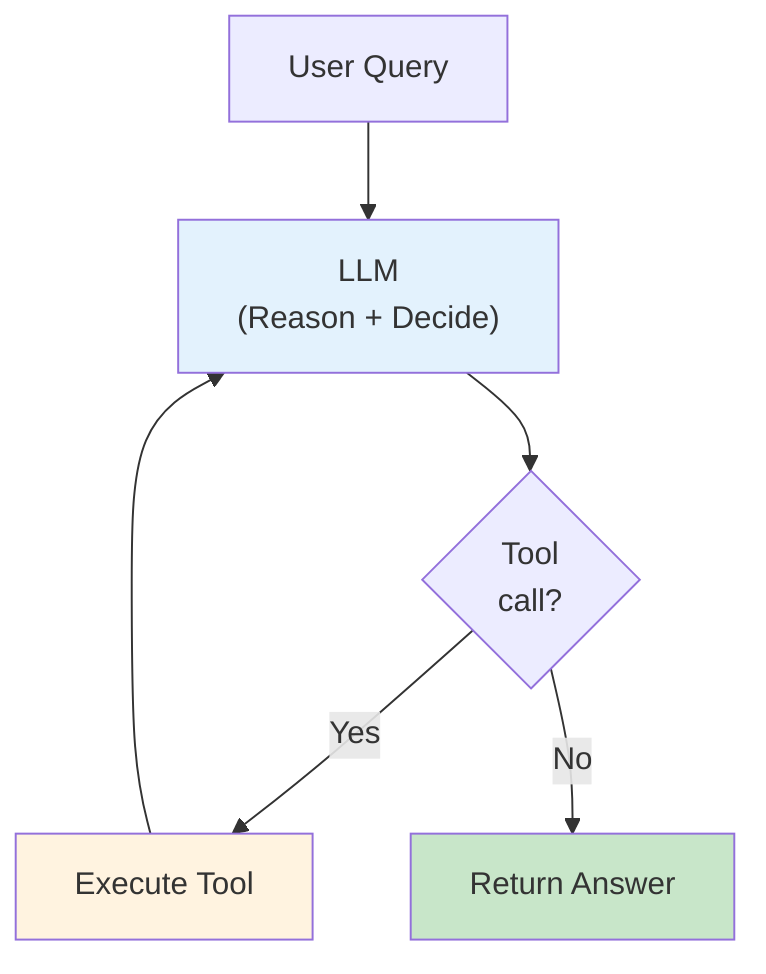

# Lesson 9.13: The ReAct Agent

> **Duration**: 35 min | **Section**: C - Building Agents with LangGraph

## 🎯 The Problem (3-5 min)

You've built agents piece by piece. Now let's put it all together into the classic **ReAct Agent** pattern.

> **Scenario**: Build a complete agent that can:
> - Reason about what to do
> - Call any available tool
> - Loop until the task is done
> - Handle multi-step tasks

This is the pattern used by ChatGPT, Claude, and most production agents.

## 🧪 The ReAct Pattern Revisited



The loop:
1. **LLM reasons** about the query and current state
2. If LLM calls a tool → **execute it** → return to LLM
3. If LLM gives final answer → **exit**

## ✅ Building ReAct from Scratch

```python
from typing import TypedDict, Annotated, Literal
from langgraph.graph import StateGraph, START, END
from langgraph.graph.message import add_messages
from langgraph.prebuilt import ToolNode
from langchain_openai import ChatOpenAI
from langchain_core.tools import tool
from langchain_core.messages import SystemMessage

# 1. Tools
@tool
def search(query: str) -> str:
    """Search for information on the web."""
    return f"Results for '{query}': Key facts and information..."

@tool
def calculate(expression: str) -> str:
    """Calculate a math expression."""
    try:
        return str(eval(expression))
    except:
        return "Error in calculation"

@tool
def get_date() -> str:
    """Get today's date."""
    from datetime import date
    return str(date.today())

tools = [search, calculate, get_date]

# 2. State
class State(TypedDict):
    messages: Annotated[list, add_messages]

# 3. LLM with tools
llm = ChatOpenAI(model="gpt-4", temperature=0).bind_tools(tools)

# 4. Agent Node
def agent(state: State) -> State:
    """The reasoning node - calls LLM to decide what to do."""
    messages = [
        SystemMessage(content="""You are a helpful assistant that can use tools to answer questions.

Think step by step:
1. Understand what the user is asking
2. Decide if you need to use a tool
3. If yes, call the appropriate tool
4. Once you have enough information, provide a final answer

Be concise and accurate."""),
        *state["messages"]
    ]
    response = llm.invoke(messages)
    return {"messages": [response]}

# 5. Tools Node
tool_node = ToolNode(tools)

# 6. Router
def should_continue(state: State) -> Literal["tools", "end"]:
    """Decide whether to continue or end."""
    last_message = state["messages"][-1]
    
    if hasattr(last_message, "tool_calls") and last_message.tool_calls:
        return "tools"
    return "end"

# 7. Build Graph
graph = StateGraph(State)

graph.add_node("agent", agent)
graph.add_node("tools", tool_node)

graph.add_edge(START, "agent")
graph.add_conditional_edges("agent", should_continue, {
    "tools": "tools",
    "end": END
})
graph.add_edge("tools", "agent")

react_agent = graph.compile()
```

## 🎯 Using create_react_agent

LangGraph provides a shortcut:

```python
from langgraph.prebuilt import create_react_agent
from langchain_openai import ChatOpenAI
from langchain_core.tools import tool

# Define tools
@tool
def search(query: str) -> str:
    """Search for information."""
    return f"Results for '{query}'"

@tool
def calculate(expression: str) -> str:
    """Calculate a math expression."""
    return str(eval(expression))

tools = [search, calculate]

# Create agent in one line!
llm = ChatOpenAI(model="gpt-4")
agent = create_react_agent(llm, tools)

# Use it
result = agent.invoke({
    "messages": [{"role": "user", "content": "What is 15 * 23?"}]
})
print(result["messages"][-1].content)
```

**create_react_agent** builds the same graph we built manually!

## 🔍 Under the Hood: create_react_agent

```python
# What create_react_agent does internally:

def create_react_agent(model, tools):
    # Bind tools to model
    model_with_tools = model.bind_tools(tools)
    
    # Create state
    class State(TypedDict):
        messages: Annotated[list, add_messages]
    
    # Create nodes
    def agent(state):
        return {"messages": [model_with_tools.invoke(state["messages"])]}
    
    tool_node = ToolNode(tools)
    
    # Router
    def should_continue(state):
        if state["messages"][-1].tool_calls:
            return "tools"
        return "end"
    
    # Build graph
    graph = StateGraph(State)
    graph.add_node("agent", agent)
    graph.add_node("tools", tool_node)
    graph.add_edge(START, "agent")
    graph.add_conditional_edges("agent", should_continue, {...})
    graph.add_edge("tools", "agent")
    
    return graph.compile()
```

## 🎯 Complete Example with Streaming

```python
from langgraph.prebuilt import create_react_agent
from langchain_openai import ChatOpenAI
from langchain_core.tools import tool

# Tools
@tool
def get_weather(city: str) -> str:
    """Get weather for a city."""
    weather = {"tokyo": "22°C sunny", "london": "15°C cloudy", "paris": "18°C rainy"}
    return weather.get(city.lower(), f"{city}: 20°C clear")

@tool
def search(query: str) -> str:
    """Search for information."""
    return f"Found information about: {query}"

@tool
def calculate(expression: str) -> str:
    """Calculate math expression."""
    try:
        return str(eval(expression))
    except:
        return "Error"

tools = [get_weather, search, calculate]

# Create agent
llm = ChatOpenAI(model="gpt-4", temperature=0)
agent = create_react_agent(llm, tools)

# Test with multi-step query
print("=== Multi-Step Query ===")
result = agent.invoke({
    "messages": [{
        "role": "user",
        "content": "What's the weather in Tokyo and Paris? Which one is warmer and by how much?"
    }]
})

# Show execution trace
for msg in result["messages"]:
    if hasattr(msg, "tool_calls") and msg.tool_calls:
        for tc in msg.tool_calls:
            print(f"🔧 Tool: {tc['name']}({tc['args']})")
    elif hasattr(msg, "content") and msg.content:
        role = "🤖 AI" if msg.type == "ai" else "👤 User"
        print(f"{role}: {msg.content}")

print("\n=== Streaming Mode ===")
# Stream to see each step
for event in agent.stream({
    "messages": [{"role": "user", "content": "What is 15% of 340?"}]
}):
    for node_name, output in event.items():
        print(f"\n[{node_name}]")
        if "messages" in output:
            for msg in output["messages"]:
                if hasattr(msg, "tool_calls") and msg.tool_calls:
                    print(f"  Tool calls: {[tc['name'] for tc in msg.tool_calls]}")
                elif msg.content:
                    print(f"  Content: {msg.content[:100]}")
```

## 🔍 Adding System Prompt

```python
from langchain_core.messages import SystemMessage

# Method 1: Include in messages
result = agent.invoke({
    "messages": [
        {"role": "system", "content": "You are a helpful weather assistant."},
        {"role": "user", "content": "Is it warm in Tokyo?"}
    ]
})

# Method 2: Use state_modifier in create_react_agent
def add_system_prompt(state):
    """Prepend system message to all calls."""
    return [
        SystemMessage(content="You are a helpful assistant. Be concise."),
        *state["messages"]
    ]

agent = create_react_agent(
    llm,
    tools,
    state_modifier=add_system_prompt
)
```

## 💥 Common Mistakes

### Mistake 1: Not handling errors

```python
@tool
def risky_tool(input: str) -> str:
    """Tool that might fail."""
    # ❌ No error handling
    return external_api.call(input)  # Might raise!

# ✅ Handle errors gracefully
@tool
def safe_tool(input: str) -> str:
    """Tool with error handling."""
    try:
        return external_api.call(input)
    except Exception as e:
        return f"Error: {str(e)}"  # Return error to LLM
```

### Mistake 2: Infinite loops

```python
# The agent might loop if tools always fail or return unhelpful results

# Add max iterations
def should_continue(state):
    last_msg = state["messages"][-1]
    
    # Count tool calls
    tool_call_count = sum(
        1 for m in state["messages"] 
        if hasattr(m, "tool_calls") and m.tool_calls
    )
    
    if tool_call_count > 10:  # Safety limit
        return "end"
    
    if hasattr(last_msg, "tool_calls") and last_msg.tool_calls:
        return "tools"
    return "end"
```

## 🎯 Practice: Build a Research Agent

```python
from langgraph.prebuilt import create_react_agent
from langchain_openai import ChatOpenAI
from langchain_core.tools import tool
from langchain_core.messages import SystemMessage

# Research tools
@tool
def search_papers(topic: str) -> str:
    """Search for academic papers on a topic."""
    papers = {
        "transformers": "Found: 'Attention Is All You Need' (2017), 'BERT' (2018), 'GPT-3' (2020)",
        "rag": "Found: 'RAG: Retrieval-Augmented Generation' (2020), 'Dense Passage Retrieval' (2020)",
        "agents": "Found: 'ReAct' (2022), 'Toolformer' (2023), 'AutoGPT' (2023)",
    }
    for key, value in papers.items():
        if key in topic.lower():
            return value
    return f"No papers found for '{topic}'"

@tool
def get_paper_summary(paper_title: str) -> str:
    """Get a summary of a specific paper."""
    summaries = {
        "attention": "Attention Is All You Need introduced the Transformer architecture using self-attention.",
        "bert": "BERT is a bidirectional transformer for NLP pre-training.",
        "react": "ReAct combines reasoning and acting in LLM agents.",
    }
    for key, value in summaries.items():
        if key in paper_title.lower():
            return value
    return f"No summary available for '{paper_title}'"

@tool
def save_notes(content: str) -> str:
    """Save research notes."""
    return f"Notes saved: '{content[:50]}...'"

tools = [search_papers, get_paper_summary, save_notes]

# Create research agent
llm = ChatOpenAI(model="gpt-4", temperature=0)

def research_prompt(state):
    return [
        SystemMessage(content="""You are a research assistant. Your job is to:
1. Search for relevant papers on the given topic
2. Get summaries of the most important papers
3. Save notes summarizing your findings

Be thorough but efficient. Don't search for the same thing twice."""),
        *state["messages"]
    ]

research_agent = create_react_agent(
    llm,
    tools,
    state_modifier=research_prompt
)

# Test
result = research_agent.invoke({
    "messages": [{
        "role": "user",
        "content": "Research the ReAct pattern for LLM agents and summarize the key findings."
    }]
})

print("=== Research Results ===")
print(result["messages"][-1].content)
```

## 🔑 Key Takeaways

- **ReAct** = Reasoning + Acting in a loop
- **create_react_agent** builds the standard agent pattern
- Components: LLM (with tools) + ToolNode + conditional router
- **Always handle errors** in tools
- Use **state_modifier** for system prompts
- **Stream** to see execution in real-time

## ❓ Common Questions

| Question | Answer |
|----------|--------|
| Can I customize the agent loop? | Yes, build it manually for full control |
| How to limit iterations? | Add counter to state, check in router |
| Can I use different models? | Yes, any LangChain chat model with tool support |
| What about memory? | Add persistence (next section) |

---

## 📚 Further Reading

- [create_react_agent](https://langchain-ai.github.io/langgraph/reference/prebuilt/#create_react_agent) - API reference
- [ReAct Tutorial](https://langchain-ai.github.io/langgraph/tutorials/introduction/) - Step-by-step guide
- [Agent Architectures](https://langchain-ai.github.io/langgraph/concepts/agentic_concepts/) - Design patterns
