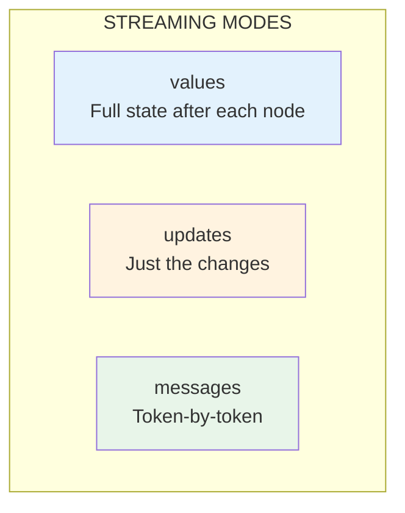

# Lesson 9.14: Streaming Graph Output

> **Duration**: 30 min | **Section**: D - Production Agent Patterns

## 🎯 The Problem (3-5 min)

Agents can take a long time - multiple tool calls, reasoning steps, API calls. Users stare at a blank screen wondering if anything is happening.

> **Scenario**: Your agent needs 10 seconds to research and answer a question. Without streaming, the user sees nothing for 10 seconds, then suddenly gets the full response.

Streaming shows progress in real-time.

## 🧪 Try It: Without Streaming

```python
# ❌ User waits for everything to complete
result = agent.invoke({"messages": [query]})
print(result["messages"][-1].content)  # All at once after long wait
```

## 🔍 Streaming Options

LangGraph offers multiple streaming modes:



| Mode | What It Streams | Use Case |
|------|-----------------|----------|
| `values` | Complete state after each node | Debug, logs |
| `updates` | Only changes from each node | Efficiency |
| `messages` | Token-by-token from LLM | Chat UX |

## ✅ Streaming with .stream()

```python
from langgraph.prebuilt import create_react_agent
from langchain_openai import ChatOpenAI
from langchain_core.tools import tool

# Setup
@tool
def search(query: str) -> str:
    """Search for information."""
    import time
    time.sleep(1)  # Simulate slow operation
    return f"Results for '{query}': Found relevant information."

tools = [search]
llm = ChatOpenAI(model="gpt-4")
agent = create_react_agent(llm, tools)

# Stream mode: "values" - full state after each step
print("=== Streaming with 'values' ===")
for event in agent.stream(
    {"messages": [{"role": "user", "content": "Search for LangGraph info"}]},
    stream_mode="values"
):
    # event is the full state
    last_msg = event["messages"][-1]
    print(f"Messages count: {len(event['messages'])}, Last: {type(last_msg).__name__}")
```

## ✅ Streaming Updates Only

```python
# Stream mode: "updates" - just what changed
print("\n=== Streaming with 'updates' ===")
for event in agent.stream(
    {"messages": [{"role": "user", "content": "What is 2 + 2?"}]},
    stream_mode="updates"
):
    # event is {node_name: {state_updates}}
    for node_name, updates in event.items():
        print(f"\n[Node: {node_name}]")
        if "messages" in updates:
            for msg in updates["messages"]:
                msg_type = type(msg).__name__
                content = msg.content[:50] if msg.content else "tool_calls"
                print(f"  {msg_type}: {content}")
```

## ✅ Token-by-Token Streaming

```python
# Stream mode: "messages" - token by token
print("\n=== Streaming with 'messages' ===")
for msg, metadata in agent.stream(
    {"messages": [{"role": "user", "content": "Tell me a short joke"}]},
    stream_mode="messages"
):
    # msg is a message chunk
    if hasattr(msg, "content") and msg.content:
        print(msg.content, end="", flush=True)

print()  # Newline at end
```

## 🎯 Complete Streaming Example

```python
from langgraph.prebuilt import create_react_agent
from langchain_openai import ChatOpenAI
from langchain_core.tools import tool
import time

# Tools
@tool
def get_weather(city: str) -> str:
    """Get weather for a city."""
    time.sleep(0.5)  # Simulate API call
    return f"{city}: 22°C, sunny"

@tool
def search(query: str) -> str:
    """Search for information."""
    time.sleep(0.5)
    return f"Found info about: {query}"

tools = [get_weather, search]
llm = ChatOpenAI(model="gpt-4", streaming=True)  # Enable LLM streaming
agent = create_react_agent(llm, tools)

# Real-time streaming UI
def stream_agent(query: str):
    print(f"User: {query}")
    print("Assistant: ", end="", flush=True)
    
    full_response = ""
    
    for event in agent.stream(
        {"messages": [{"role": "user", "content": query}]},
        stream_mode="updates"
    ):
        for node_name, updates in event.items():
            if node_name == "agent" and "messages" in updates:
                msg = updates["messages"][-1]
                
                # Tool call
                if hasattr(msg, "tool_calls") and msg.tool_calls:
                    tools_called = [tc["name"] for tc in msg.tool_calls]
                    print(f"\n  [Calling: {', '.join(tools_called)}]", end="")
                
                # Final content
                elif msg.content:
                    print(f"\n{msg.content}")
                    full_response = msg.content
            
            elif node_name == "tools" and "messages" in updates:
                for msg in updates["messages"]:
                    print(f"\n  [Result: {msg.content[:50]}...]", end="")
    
    return full_response

# Test
stream_agent("What's the weather in Tokyo and Paris?")
```

## 🔍 Streaming with async

```python
import asyncio
from langgraph.prebuilt import create_react_agent
from langchain_openai import ChatOpenAI
from langchain_core.tools import tool

@tool
async def async_search(query: str) -> str:
    """Async search."""
    await asyncio.sleep(0.5)
    return f"Results for: {query}"

tools = [async_search]
llm = ChatOpenAI(model="gpt-4")
agent = create_react_agent(llm, tools)

async def stream_async():
    async for event in agent.astream(
        {"messages": [{"role": "user", "content": "Search for Python"}]},
        stream_mode="updates"
    ):
        for node, updates in event.items():
            print(f"[{node}]: {list(updates.keys())}")

# asyncio.run(stream_async())
```

## 🎯 Practice: Build Streaming Chat UI

```python
from langgraph.prebuilt import create_react_agent
from langchain_openai import ChatOpenAI
from langchain_core.tools import tool
from datetime import datetime

# Tools
@tool
def get_time() -> str:
    """Get current time."""
    return datetime.now().strftime("%H:%M:%S")

@tool
def calculate(expression: str) -> str:
    """Calculate math expression."""
    try:
        return str(eval(expression))
    except:
        return "Error"

tools = [get_time, calculate]
llm = ChatOpenAI(model="gpt-4", streaming=True)
agent = create_react_agent(llm, tools)

def chat_ui():
    """Simple streaming chat interface."""
    print("Chat with the agent (type 'quit' to exit)")
    print("-" * 50)
    
    while True:
        user_input = input("\nYou: ").strip()
        if user_input.lower() in ["quit", "exit", "q"]:
            break
        
        if not user_input:
            continue
        
        print("Bot: ", end="", flush=True)
        
        # Stream response
        tokens_printed = False
        for event in agent.stream(
            {"messages": [{"role": "user", "content": user_input}]},
            stream_mode="updates"
        ):
            for node_name, updates in event.items():
                if "messages" not in updates:
                    continue
                    
                for msg in updates["messages"]:
                    # Show tool calls
                    if hasattr(msg, "tool_calls") and msg.tool_calls:
                        if tokens_printed:
                            print()  # Newline before tool
                        for tc in msg.tool_calls:
                            print(f"[{tc['name']}({tc['args']})]", end=" ")
                    
                    # Show tool results
                    elif msg.type == "tool":
                        print(f"→ {msg.content[:30]}...", end=" ")
                    
                    # Show final response
                    elif msg.content and msg.type == "ai":
                        if tokens_printed or any(
                            hasattr(m, "tool_calls") and m.tool_calls 
                            for m in updates["messages"]
                        ):
                            print()  # Newline
                        print(msg.content, end="")
                        tokens_printed = True
        
        print()  # Final newline

# chat_ui()  # Uncomment to run
```

## 🔑 Key Takeaways

- **stream()** provides real-time output instead of waiting
- **stream_mode="values"**: Full state after each node
- **stream_mode="updates"**: Only what changed
- **stream_mode="messages"**: Token-by-token
- Use **streaming=True** on LLM for token streaming
- **astream()** for async applications

## ❓ Common Questions

| Question | Answer |
|----------|--------|
| Which mode for chat UX? | `messages` for tokens, `updates` for tool visibility |
| Performance impact? | Minimal, just changes how output is delivered |
| Works with all models? | Token streaming needs model support |
| Can I use both invoke and stream? | Yes, same agent supports both |

---

## 📚 Further Reading

- [Streaming](https://langchain-ai.github.io/langgraph/how-tos/streaming/) - LangGraph streaming guide
- [Stream Modes](https://langchain-ai.github.io/langgraph/concepts/streaming/) - Concepts
- [Async Streaming](https://langchain-ai.github.io/langgraph/how-tos/async/) - Async patterns
