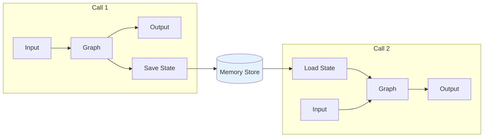
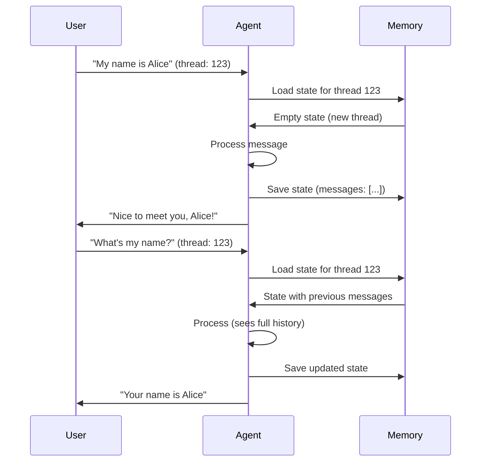

# Lesson 9.15: Persistence & Memory

> **Duration**: 30 min | **Section**: D - Production Agent Patterns

## 🎯 The Problem (3-5 min)

By default, each agent invocation is stateless. The agent forgets everything.

> **Scenario**:
> - User: "My name is Alice"
> - Agent: "Nice to meet you, Alice!"
> - User: "What's my name?"
> - Agent: "I don't know your name."  ❌

For real conversations, agents need **memory**.

## 🧪 Try It: Without Persistence

```python
from langgraph.prebuilt import create_react_agent
from langchain_openai import ChatOpenAI

llm = ChatOpenAI(model="gpt-4")
agent = create_react_agent(llm, [])

# First call
result1 = agent.invoke({
    "messages": [{"role": "user", "content": "My name is Alice"}]
})
print(result1["messages"][-1].content)

# Second call - agent forgets!
result2 = agent.invoke({
    "messages": [{"role": "user", "content": "What's my name?"}]
})
print(result2["messages"][-1].content)  # "I don't know your name"
```

Each `invoke()` is a fresh start.

## 🔍 The Solution: Checkpointing

LangGraph can **save and restore state** between calls:



## ✅ Using MemorySaver

```python
from langgraph.prebuilt import create_react_agent
from langgraph.checkpoint.memory import MemorySaver
from langchain_openai import ChatOpenAI

# Create checkpointer
memory = MemorySaver()

# Create agent with checkpointer
llm = ChatOpenAI(model="gpt-4")
agent = create_react_agent(llm, [], checkpointer=memory)

# Use thread_id to identify the conversation
config = {"configurable": {"thread_id": "user-123"}}

# First message
result1 = agent.invoke(
    {"messages": [{"role": "user", "content": "My name is Alice"}]},
    config=config
)
print(f"Bot: {result1['messages'][-1].content}")

# Second message - same thread, agent remembers!
result2 = agent.invoke(
    {"messages": [{"role": "user", "content": "What's my name?"}]},
    config=config
)
print(f"Bot: {result2['messages'][-1].content}")  # "Your name is Alice"
```

**Key concept**: `thread_id` groups messages into a conversation.

## 🔍 How It Works



## ✅ Complete Example with Tools

```python
from langgraph.prebuilt import create_react_agent
from langgraph.checkpoint.memory import MemorySaver
from langchain_openai import ChatOpenAI
from langchain_core.tools import tool

# Tools
@tool
def remember(key: str, value: str) -> str:
    """Store a piece of information for later."""
    return f"Remembered: {key} = {value}"

@tool
def recall(key: str) -> str:
    """Try to recall stored information."""
    return f"Looking up: {key}"

tools = [remember, recall]

# Agent with memory
memory = MemorySaver()
llm = ChatOpenAI(model="gpt-4")
agent = create_react_agent(llm, tools, checkpointer=memory)

# Conversation
config = {"configurable": {"thread_id": "session-abc"}}

messages = [
    "Hi! My favorite color is blue.",
    "I also love Italian food.",
    "What do you remember about me?",
    "What's my favorite color?",
]

for msg in messages:
    print(f"\nUser: {msg}")
    result = agent.invoke(
        {"messages": [{"role": "user", "content": msg}]},
        config=config
    )
    print(f"Bot: {result['messages'][-1].content}")
```

## ✅ Multiple Conversations

```python
from langgraph.checkpoint.memory import MemorySaver
from langgraph.prebuilt import create_react_agent
from langchain_openai import ChatOpenAI

memory = MemorySaver()
llm = ChatOpenAI(model="gpt-4")
agent = create_react_agent(llm, [], checkpointer=memory)

# User Alice's conversation
alice_config = {"configurable": {"thread_id": "alice-thread"}}
agent.invoke(
    {"messages": [{"role": "user", "content": "I'm Alice, I love cats"}]},
    config=alice_config
)

# User Bob's conversation
bob_config = {"configurable": {"thread_id": "bob-thread"}}
agent.invoke(
    {"messages": [{"role": "user", "content": "I'm Bob, I love dogs"}]},
    config=bob_config
)

# Each thread is independent
result_alice = agent.invoke(
    {"messages": [{"role": "user", "content": "What pet do I like?"}]},
    config=alice_config
)
print(f"Alice: {result_alice['messages'][-1].content}")  # "cats"

result_bob = agent.invoke(
    {"messages": [{"role": "user", "content": "What pet do I like?"}]},
    config=bob_config
)
print(f"Bob: {result_bob['messages'][-1].content}")  # "dogs"
```

## 🔍 Accessing State History

```python
# Get all checkpoints for a thread
checkpoints = list(memory.list(config))
print(f"Checkpoints: {len(checkpoints)}")

# Get current state
state = agent.get_state(config)
print(f"Messages: {len(state.values['messages'])}")

# Get state at specific checkpoint
for checkpoint in checkpoints:
    print(f"Checkpoint: {checkpoint.checkpoint_id}")
```

## 💥 Common Mistakes

### Mistake 1: Forgetting thread_id

```python
# ❌ Wrong: No thread_id
result = agent.invoke({"messages": [...]})  # Error or no persistence

# ✅ Right: Always provide thread_id
config = {"configurable": {"thread_id": "unique-id"}}
result = agent.invoke({"messages": [...]}, config=config)
```

### Mistake 2: Using same thread for different users

```python
# ❌ Wrong: Shared thread
config = {"configurable": {"thread_id": "shared"}}

# User A and User B see each other's messages!

# ✅ Right: Thread per user
config_a = {"configurable": {"thread_id": f"user-{user_a.id}"}}
config_b = {"configurable": {"thread_id": f"user-{user_b.id}"}}
```

### Mistake 3: MemorySaver in production

```python
# ❌ MemorySaver is in-memory only - data lost on restart

# ✅ Use persistent storage in production
from langgraph.checkpoint.sqlite import SqliteSaver

# SQLite for persistence
db_path = "./checkpoints.db"
memory = SqliteSaver.from_conn_string(f"sqlite:///{db_path}")
```

## 🎯 Practice: Persistent Todo Agent

```python
from langgraph.prebuilt import create_react_agent
from langgraph.checkpoint.memory import MemorySaver
from langchain_openai import ChatOpenAI
from langchain_core.tools import tool
from langchain_core.messages import SystemMessage

# In-memory todo storage (would be DB in production)
todos = {}

@tool
def add_todo(task: str) -> str:
    """Add a task to the todo list."""
    if "items" not in todos:
        todos["items"] = []
    todos["items"].append({"task": task, "done": False})
    return f"Added: {task}"

@tool
def list_todos() -> str:
    """List all todos."""
    items = todos.get("items", [])
    if not items:
        return "No todos yet!"
    result = []
    for i, item in enumerate(items):
        status = "✓" if item["done"] else "○"
        result.append(f"{i+1}. {status} {item['task']}")
    return "\n".join(result)

@tool
def complete_todo(task_number: int) -> str:
    """Mark a todo as complete by its number."""
    items = todos.get("items", [])
    if 0 < task_number <= len(items):
        items[task_number - 1]["done"] = True
        return f"Completed: {items[task_number - 1]['task']}"
    return f"Invalid task number: {task_number}"

tools = [add_todo, list_todos, complete_todo]

# Agent with memory
memory = MemorySaver()
llm = ChatOpenAI(model="gpt-4")

def system_prompt(state):
    return [
        SystemMessage(content="You are a helpful todo list assistant. Help users manage their tasks."),
        *state["messages"]
    ]

agent = create_react_agent(llm, tools, checkpointer=memory, state_modifier=system_prompt)

# Interactive session
def todo_session(user_id: str):
    config = {"configurable": {"thread_id": f"todos-{user_id}"}}
    
    print(f"Todo Assistant for {user_id}")
    print("Commands: add, list, complete, or natural language")
    print("-" * 40)
    
    while True:
        user_input = input("\nYou: ").strip()
        if user_input.lower() in ["quit", "exit", "q"]:
            break
        
        result = agent.invoke(
            {"messages": [{"role": "user", "content": user_input}]},
            config=config
        )
        print(f"Bot: {result['messages'][-1].content}")

# todo_session("alice")  # Uncomment to run
```

## 🔑 Key Takeaways

- **MemorySaver** provides in-memory checkpointing
- **thread_id** identifies unique conversations
- State persists across `invoke()` calls for same thread
- **SqliteSaver** for persistent storage
- Each thread maintains separate message history

## ❓ Common Questions

| Question | Answer |
|----------|--------|
| What's stored in checkpoints? | Full graph state including messages |
| Can I clear a thread? | Delete checkpoints or start new thread |
| Memory limits? | Manage message history to control context length |
| Production storage? | PostgreSQL, Redis, or SQLite |

---

## 📚 Further Reading

- [Persistence](https://langchain-ai.github.io/langgraph/concepts/persistence/) - Concepts
- [Memory Guide](https://langchain-ai.github.io/langgraph/how-tos/persistence/) - How-to
- [Checkpointers](https://langchain-ai.github.io/langgraph/reference/checkpoints/) - API reference
