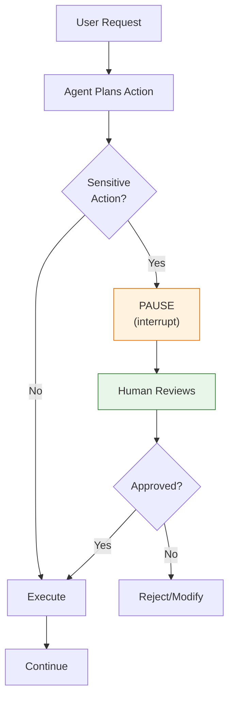

# Lesson 9.16: Human-in-the-Loop

> **Duration**: 35 min | **Section**: D - Production Agent Patterns

## 🎯 The Problem (3-5 min)

Agents can take actions with real consequences. Sometimes you need human approval.

> **Scenario**:
> - Agent: "I'll delete all files in the folder to clean up"
> - Human: "Wait! Let me review that first!"

Without checkpoints, the agent just runs. With **human-in-the-loop**, you can pause, review, approve.

## 🧪 The Pattern



## 🔍 LangGraph interrupt()

```python
from langgraph.types import interrupt

def sensitive_action(state):
    """Node that pauses for human approval."""
    
    # Pause execution and wait for human
    approval = interrupt({
        "action": "delete_files",
        "files": ["file1.txt", "file2.txt"],
        "message": "About to delete these files. Approve?"
    })
    
    if approval.get("approved"):
        # Proceed with action
        return {"result": "Files deleted"}
    else:
        return {"result": "Action cancelled by user"}
```

When `interrupt()` is called:
1. Graph execution **pauses**
2. State is **saved** (checkpoint)
3. Control returns to the caller
4. Caller can **resume** with a response

## ✅ Complete Example: Approval Workflow

```python
from typing import TypedDict, Annotated, Literal
from langgraph.graph import StateGraph, START, END
from langgraph.graph.message import add_messages
from langgraph.checkpoint.memory import MemorySaver
from langgraph.types import interrupt, Command
from langchain_openai import ChatOpenAI

# State
class State(TypedDict):
    messages: Annotated[list, add_messages]
    pending_action: dict
    action_approved: bool

# LLM
llm = ChatOpenAI(model="gpt-4")

# Nodes
def plan_action(state: State) -> State:
    """Agent plans what to do."""
    last_message = state["messages"][-1]
    content = last_message.content if hasattr(last_message, "content") else last_message["content"]
    
    # Simulate planning
    if "delete" in content.lower():
        action = {
            "type": "delete",
            "target": "important_files",
            "risk": "high"
        }
    elif "send" in content.lower():
        action = {
            "type": "send_email",
            "to": "all@company.com",
            "risk": "medium"
        }
    else:
        action = {
            "type": "read",
            "target": "data",
            "risk": "low"
        }
    
    return {"pending_action": action}

def check_risk(state: State) -> Literal["needs_approval", "auto_approve"]:
    """Route based on risk level."""
    risk = state["pending_action"].get("risk", "low")
    if risk in ["high", "medium"]:
        return "needs_approval"
    return "auto_approve"

def request_approval(state: State) -> State:
    """Pause for human approval."""
    action = state["pending_action"]
    
    # This interrupts execution!
    response = interrupt({
        "message": f"Action requires approval",
        "action": action,
        "options": ["approve", "reject", "modify"]
    })
    
    approved = response.get("decision") == "approve"
    return {"action_approved": approved}

def execute_action(state: State) -> State:
    """Execute the approved action."""
    action = state["pending_action"]
    
    if not state.get("action_approved", True):
        result = f"Action '{action['type']}' was rejected"
    else:
        result = f"Executed: {action['type']} on {action.get('target', 'N/A')}"
    
    response = llm.invoke([
        {"role": "system", "content": "Report the result concisely."},
        {"role": "user", "content": result}
    ])
    
    return {"messages": [response]}

# Build graph
graph = StateGraph(State)

graph.add_node("plan", plan_action)
graph.add_node("approve", request_approval)
graph.add_node("execute", execute_action)

graph.add_edge(START, "plan")
graph.add_conditional_edges("plan", check_risk, {
    "needs_approval": "approve",
    "auto_approve": "execute"
})
graph.add_edge("approve", "execute")
graph.add_edge("execute", END)

# Compile with checkpointer (required for interrupt)
memory = MemorySaver()
app = graph.compile(checkpointer=memory)
```

## ✅ Using the Human-in-the-Loop Graph

```python
from langgraph.types import Command

config = {"configurable": {"thread_id": "approval-demo"}}

# Start with a risky request
print("=== Starting risky request ===")
result = app.invoke(
    {
        "messages": [{"role": "user", "content": "Delete all old files"}],
        "pending_action": {},
        "action_approved": False
    },
    config=config
)

# Check if we're interrupted
state = app.get_state(config)
print(f"State: {state.next}")  # Shows what's next

if state.next:  # If there's a next step, we're paused
    # Show what approval is requested
    for task in state.tasks:
        if hasattr(task, 'interrupts') and task.interrupts:
            print(f"Approval requested: {task.interrupts[0].value}")
    
    # Human decides
    print("\n=== Human reviewing ===")
    human_decision = input("Approve? (yes/no): ")
    
    # Resume with decision
    result = app.invoke(
        Command(resume={"decision": "approve" if human_decision == "yes" else "reject"}),
        config=config
    )
    
    print(f"\nFinal: {result['messages'][-1].content}")
```

## 🔍 Interrupt Points

You can interrupt at different points:

```python
from langgraph.types import interrupt

# Before tool execution
def before_tool(state):
    tool_call = state["pending_tool"]
    
    approval = interrupt({
        "stage": "before",
        "tool": tool_call["name"],
        "args": tool_call["args"],
        "question": "Execute this tool?"
    })
    
    return {"tool_approved": approval.get("approved", False)}

# After getting result, before returning
def review_result(state):
    result = state["tool_result"]
    
    approval = interrupt({
        "stage": "review",
        "result": result,
        "question": "Accept this result?"
    })
    
    if not approval.get("approved"):
        return {"messages": [{"role": "assistant", "content": "Result rejected, trying again..."}]}
    return state
```

## 🎯 Practice: Email Approval Agent

```python
from typing import TypedDict, Annotated
from langgraph.graph import StateGraph, START, END
from langgraph.graph.message import add_messages
from langgraph.checkpoint.memory import MemorySaver
from langgraph.types import interrupt, Command
from langchain_openai import ChatOpenAI
from langchain_core.tools import tool

# State
class State(TypedDict):
    messages: Annotated[list, add_messages]
    draft_email: dict
    email_approved: bool
    email_sent: bool

# Tools
@tool
def draft_email(to: str, subject: str, body: str) -> dict:
    """Draft an email."""
    return {"to": to, "subject": subject, "body": body}

# Nodes
llm = ChatOpenAI(model="gpt-4")

def compose_email(state: State) -> State:
    """Agent composes email based on request."""
    response = llm.invoke([
        {"role": "system", "content": "You help compose emails. Extract to, subject, and body from the request."},
        *state["messages"]
    ])
    
    # Simulate extracting email details
    draft = {
        "to": "team@company.com",
        "subject": "Update from AI Assistant",
        "body": response.content
    }
    
    return {"draft_email": draft}

def request_email_approval(state: State) -> State:
    """Pause for email approval."""
    draft = state["draft_email"]
    
    approval = interrupt({
        "type": "email_approval",
        "draft": draft,
        "message": "Please review this email before sending"
    })
    
    return {"email_approved": approval.get("approved", False)}

def send_email(state: State) -> State:
    """Send or cancel based on approval."""
    if state.get("email_approved"):
        # Would actually send email here
        result = f"Email sent to {state['draft_email']['to']}"
    else:
        result = "Email cancelled - not sent"
    
    response = llm.invoke([
        {"role": "system", "content": "Confirm the email status briefly."},
        {"role": "user", "content": result}
    ])
    
    return {
        "messages": [response],
        "email_sent": state.get("email_approved", False)
    }

# Build graph
graph = StateGraph(State)
graph.add_node("compose", compose_email)
graph.add_node("approve", request_email_approval)
graph.add_node("send", send_email)

graph.add_edge(START, "compose")
graph.add_edge("compose", "approve")
graph.add_edge("approve", "send")
graph.add_edge("send", END)

memory = MemorySaver()
email_agent = graph.compile(checkpointer=memory)

# Demo
def email_demo():
    config = {"configurable": {"thread_id": "email-1"}}
    
    # User requests email
    print("User: Send an email to the team about the project update")
    result = email_agent.invoke(
        {
            "messages": [{"role": "user", "content": "Send an email to the team about our project milestone completion"}],
            "draft_email": {},
            "email_approved": False,
            "email_sent": False
        },
        config=config
    )
    
    # Check for interrupt
    state = email_agent.get_state(config)
    if state.next:
        # Show draft
        for task in state.tasks:
            if hasattr(task, 'interrupts') and task.interrupts:
                draft = task.interrupts[0].value.get("draft", {})
                print(f"\n=== Draft Email ===")
                print(f"To: {draft.get('to')}")
                print(f"Subject: {draft.get('subject')}")
                print(f"Body: {draft.get('body', '')[:100]}...")
        
        # Get approval
        decision = input("\nApprove and send? (yes/no): ")
        
        # Resume
        result = email_agent.invoke(
            Command(resume={"approved": decision.lower() == "yes"}),
            config=config
        )
        
        print(f"\nResult: {result['messages'][-1].content}")
        print(f"Email sent: {result['email_sent']}")

# email_demo()  # Uncomment to run
```

## 🔑 Key Takeaways

- **interrupt()** pauses graph execution
- Requires **checkpointer** to save state
- Resume with **Command(resume={...})**
- Use for approvals, reviews, confirmations
- Great for high-risk actions (delete, send, pay)

## ❓ Common Questions

| Question | Answer |
|----------|--------|
| What if user never resumes? | State stays in checkpoint until resumed or timeout |
| Can I have multiple interrupts? | Yes, chain them in sequence |
| Web app integration? | Save thread_id, poll for interrupt, resume via API |
| Timeout handling? | Implement in application layer |

---

## 📚 Further Reading

- [Human-in-the-Loop](https://langchain-ai.github.io/langgraph/concepts/human_in_the_loop/) - Concepts
- [Interrupt Guide](https://langchain-ai.github.io/langgraph/how-tos/human_in_the_loop/wait-user-input/) - How-to
- [Breakpoints](https://langchain-ai.github.io/langgraph/how-tos/human_in_the_loop/breakpoints/) - Alternative approach
